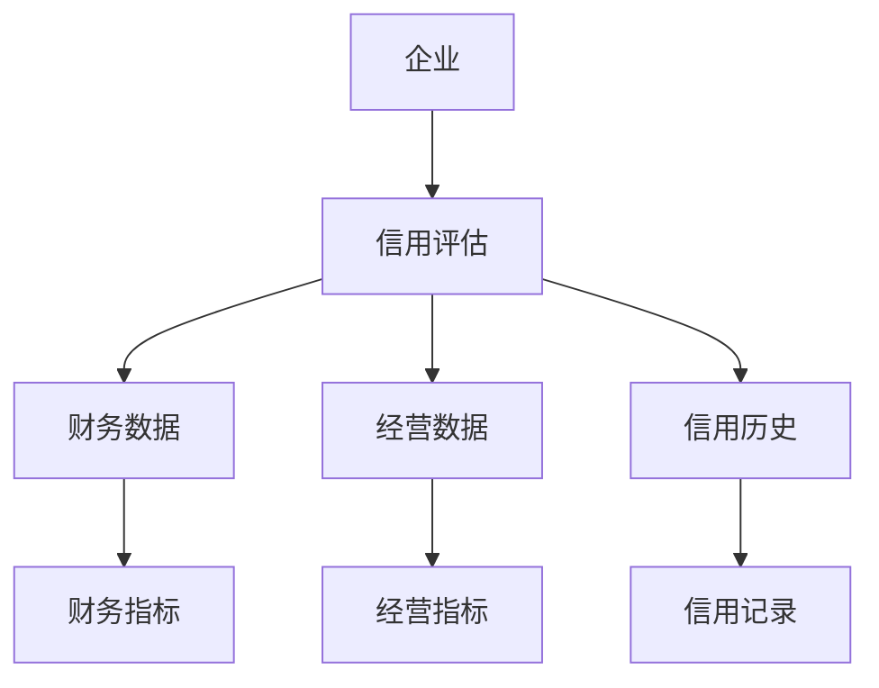
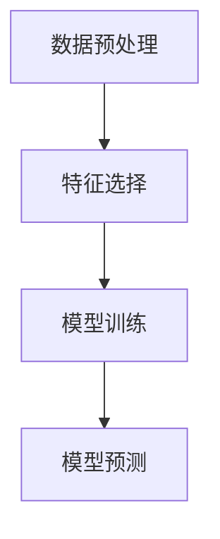
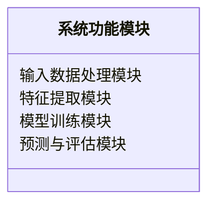
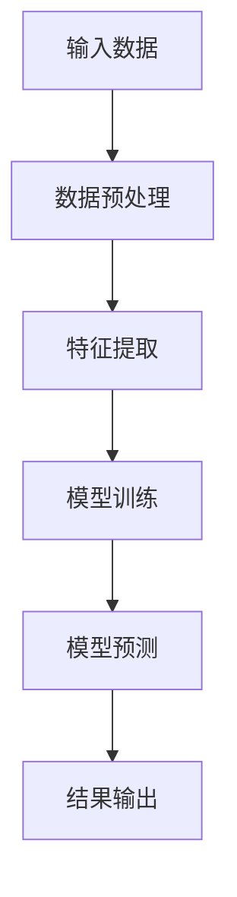
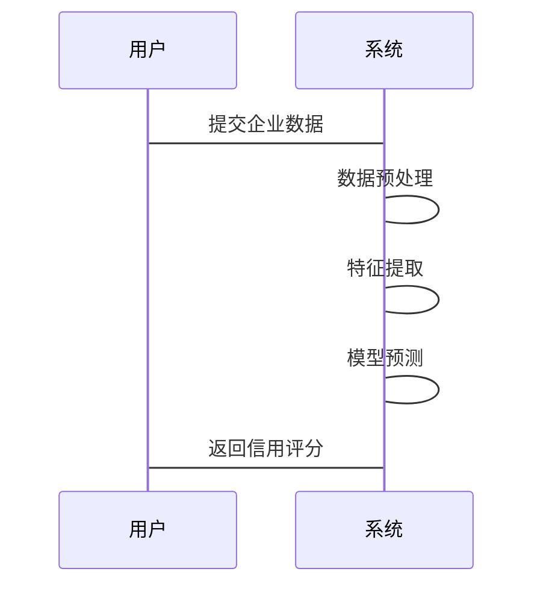

                 


# 开发智能化的企业信用风险评估模型

---

## 关键词
- 企业信用风险
- 智能化模型
- AI技术
- 大数据
- 机器学习
- 风险评估

---

## 摘要
企业信用风险评估是企业在经营过程中面临的核心挑战之一。随着人工智能和大数据技术的快速发展，传统的信用风险评估方法逐渐暴露出效率低下、准确性不足等问题。本文旨在探讨如何利用智能化技术开发高效的信用风险评估模型，从背景、核心概念、算法原理、系统架构到项目实战，全面解析智能化信用风险评估模型的构建过程。通过结合实际案例和详细的技术实现，本文将为企业信用风险管理提供新的思路和解决方案。

---

# 目录大纲

## 第一部分: 企业信用风险评估模型概述

### 第1章: 信用风险评估模型的背景与意义

#### 1.1 信用风险的基本概念
- 1.1.1 信用风险的定义
- 1.1.2 信用风险的分类
- 1.1.3 信用风险对企业的影响

#### 1.2 企业信用风险评估的重要性
- 1.2.1 企业信用风险管理的核心目标
- 1.2.2 信用风险评估在企业经营中的作用
- 1.2.3 信用风险评估的法律与合规要求

#### 1.3 智能化信用风险评估模型的发展趋势
- 1.3.1 传统信用风险评估方法的局限性
- 1.3.2 AI与大数据技术在信用评估中的应用
- 1.3.3 智能化信用风险评估模型的优势

#### 1.4 本章小结

---

## 第二部分: 信用风险评估模型的核心概念与构建

### 第2章: 信用风险评估模型的核心要素

#### 2.1 企业信用风险的构成要素
- 2.1.1 企业财务状况分析
- 2.1.2 企业经营状况评估
- 2.1.3 企业信用历史记录

#### 2.2 信用风险评估的关键指标
- 2.2.1 财务比率分析
- 2.2.2 信用评分模型
- 2.2.3 风险敞口评估

#### 2.3 信用风险评估模型的构建要素
- 2.3.1 数据来源与处理
- 2.3.2 模型选择与优化
- 2.3.3 模型验证与评估

#### 2.4 核心概念对比分析
- 2.4.1 传统信用评估方法与现代AI模型的对比
- 2.4.2 不同信用评分模型的优缺点分析
- 2.4.3 模型性能指标对比表格

#### 2.5 ER实体关系图


---

## 第三部分: 信用风险评估模型的算法原理

### 第3章: 常见的信用风险评估算法

#### 3.1 逻辑回归算法
- 3.1.1 算法原理
- 3.1.2 算法流程图

- 3.1.3 逻辑回归的数学模型
$$ P(y=1|x) = \frac{1}{1 + e^{- (w^T x + b)}} $$
- 3.1.4 代码实现
```python
from sklearn.linear_model import LogisticRegression
model = LogisticRegression()
model.fit(X_train, y_train)
```

#### 3.2 随机森林算法
- 3.2.1 算法原理
- 3.2.2 算法流程图

- 3.2.3 随机森林的数学模型
$$ y = \sum_{i=1}^{n} w_i x_i + b $$
- 3.2.4 代码实现
```python
from sklearn.ensemble import RandomForestClassifier
model = RandomForestClassifier()
model.fit(X_train, y_train)
```

#### 3.3 神经网络算法
- 3.3.1 算法原理
- 3.3.2 算法流程图

- 3.3.3 神经网络的数学模型
$$ y = \sigma(w^T x + b) $$
其中，$\sigma$ 是激活函数。
- 3.3.4 代码实现
```python
import tensorflow as tf
model = tf.keras.Sequential([
    tf.keras.layers.Dense(64, activation='relu'),
    tf.keras.layers.Dense(1, activation='sigmoid')
])
model.compile(optimizer='adam', loss='binary_crossentropy', metrics=['accuracy'])
model.fit(X_train, y_train, epochs=10)
```

---

## 第四部分: 信用风险评估系统的架构设计

### 第4章: 系统架构与实现

#### 4.1 系统功能设计
- 4.1.1 系统功能模块


#### 4.2 系统架构设计
- 4.2.1 系统架构图


#### 4.3 系统接口设计
- 4.3.1 输入接口
- 4.3.2 输出接口

#### 4.4 系统交互流程


---

## 第五部分: 项目实战与优化

### 第5章: 信用风险评估模型的实战开发

#### 5.1 环境安装与配置
- 5.1.1 安装Python环境
- 5.1.2 安装必要的库
```bash
pip install numpy pandas scikit-learn tensorflow
```

#### 5.2 数据预处理与特征提取
- 5.2.1 数据清洗
- 5.2.2 特征选择
```python
import pandas as pd
from sklearn.preprocessing import StandardScaler

data = pd.read_csv('credit_data.csv')
X = data.drop('label', axis=1)
y = data['label']

scaler = StandardScaler()
X_scaled = scaler.fit_transform(X)
```

#### 5.3 模型训练与优化
- 5.3.1 选择模型
- 5.3.2 模型训练
```python
from sklearn.model_selection import train_test_split
from sklearn.metrics import accuracy_score

X_train, X_test, y_train, y_test = train_test_split(X_scaled, y, test_size=0.2)

model = LogisticRegression()
model.fit(X_train, y_train)
y_pred = model.predict(X_test)
print("Accuracy:", accuracy_score(y_test, y_pred))
```

#### 5.4 模型部署与监控
- 5.4.1 模型部署
- 5.4.2 模型监控
- 5.4.3 模型优化

#### 5.5 案例分析与结果解读
- 5.5.1 实际案例分析
- 5.5.2 结果解读

#### 5.6 项目总结
- 5.6.1 项目成果
- 5.6.2 经验与教训
- 5.6.3 未来改进方向

---

## 第六部分: 总结与展望

### 第6章: 总结与展望

#### 6.1 本章总结
- 6.1.1 本文的主要内容
- 6.1.2 智能化信用风险评估模型的优势
- 6.1.3 本文的创新点

#### 6.2 未来展望
- 6.2.1 智能化信用风险评估模型的未来发展方向
- 6.2.2 更多AI技术在信用评估中的应用潜力
- 6.2.3 多学科交叉研究的可能性

---

## 参考文献
（此处列出相关技术文献、书籍和在线资源）

---

## 附录
（可选，包含代码、数据集链接等）

---

### 思考与总结
通过本文的详细解析，我们从理论到实践，全面探讨了智能化企业信用风险评估模型的开发过程。通过结合实际案例和技术创新，本文为企业信用风险管理提供了新的思路和解决方案。未来，随着AI技术的不断发展，智能化信用风险评估模型将更加精准和高效，为企业经营保驾护航。

