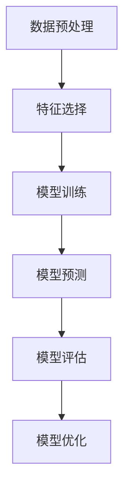
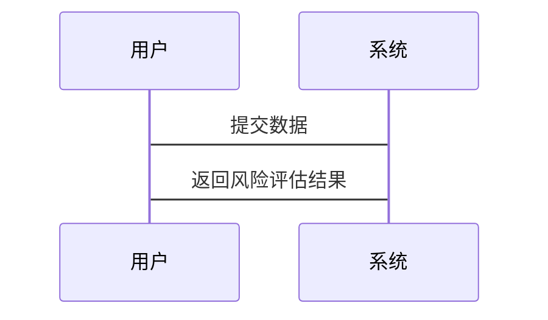

                 


# 开发智能化的企业并购风险评估模型

> 关键词：企业并购、风险评估、人工智能、大数据分析、机器学习、系统架构

> 摘要：本文探讨了如何利用人工智能和大数据技术开发智能化的企业并购风险评估模型。通过分析企业并购的背景、核心概念、算法原理、系统架构设计、项目实战以及最佳实践，提出了一种基于机器学习和深度学习的智能化评估方法，以帮助企业在并购过程中降低风险，提高决策的准确性和效率。

---

## 第1章：企业并购风险评估的背景与问题分析

### 1.1 企业并购的基本概念
- 1.1.1 企业并购的定义与分类
- 1.1.2 企业并购的动机与目标
- 1.1.3 企业并购的历史发展与现状

### 1.2 并购风险的基本概念
- 1.2.1 并购风险的定义
- 1.2.2 并购风险的主要类型
- 1.2.3 并购风险的影响因素

### 1.3 传统企业并购风险评估方法的局限性
- 1.3.1 传统方法概述
- 1.3.2 传统方法的主要问题
- 1.3.3 传统方法的改进方向

### 1.4 智能化企业并购风险评估的必要性
- 1.4.1 人工智能与大数据的应用前景
- 1.4.2 智能化评估的优势与价值
- 1.4.3 智能化评估的实现路径

### 1.5 本章小结

---

## 第2章：企业并购风险评估模型的核心概念与联系

### 2.1 企业并购风险评估模型的定义与特点
- 2.1.1 模型的定义
- 2.1.2 模型的核心特点
- 2.1.3 模型的适用范围

### 2.2 模型的核心要素与关系
- 2.2.1 核心要素分析
- 2.2.2 要素之间的关系
- 2.2.3 要素的权重分配

### 2.3 模型的输入与输出
- 2.3.1 输入数据的类型与来源
- 2.3.2 输出结果的格式与解释
- 2.3.3 输入输出的关系

### 2.4 本章小结

---

## 第3章：企业并购风险评估模型的算法原理

### 3.1 机器学习与深度学习在风险评估中的应用
- 3.1.1 机器学习的概述
- 3.1.2 深度学习的概述
- 3.1.3 机器学习与深度学习的对比

### 3.2 基于机器学习的风险评估算法
- 3.2.1 线性回归模型
- 3.2.2 支持向量机（SVM）
- 3.2.3 随机森林（Random Forest）
- 3.2.4 神经网络（Neural Networks）

### 3.3 算法实现步骤
- 3.3.1 数据预处理
- 3.3.2 特征选择
- 3.3.3 模型训练
- 3.3.4 模型评估
- 3.3.5 模型优化

### 3.4 算法实现的Python代码示例
```python
import pandas as pd
from sklearn.model_selection import train_test_split
from sklearn.ensemble import RandomForestClassifier
from sklearn.metrics import accuracy_score

# 数据加载与预处理
data = pd.read_csv('merger_data.csv')
X = data.drop('risk_level', axis=1)
y = data['risk_level']

# 数据分割
X_train, X_test, y_train, y_test = train_test_split(X, y, test_size=0.2, random_state=42)

# 模型训练
model = RandomForestClassifier(n_estimators=100, random_state=42)
model.fit(X_train, y_train)

# 模型预测
y_pred = model.predict(X_test)

# 模型评估
print("Accuracy:", accuracy_score(y_test, y_pred))
```

### 3.5 算法流程图（使用Mermaid）


### 3.6 本章小结

---

## 第4章：企业并购风险评估模型的数学模型与公式

### 4.1 风险评估的基本公式
- 4.1.1 风险概率公式
$$ P(risk) = \frac{\text{历史风险事件数}}{\text{总样本数}} $$
- 4.1.2 风险影响程度公式
$$ I(risk) = \sum_{i=1}^{n} w_i \times f_i $$
其中，$w_i$ 是第 $i$ 个因素的权重，$f_i$ 是第 $i$ 个因素的值。

### 4.2 机器学习模型的数学基础
- 4.2.1 线性回归模型
$$ y = \beta_0 + \beta_1 x + \epsilon $$
- 4.2.2 随机森林模型
$$ y = \sum_{i=1}^{n} \text{Tree}_i(x) $$

### 4.3 深度学习模型的数学基础
- 4.3.1 神经网络的前向传播
$$ a^{(l)} = \sigma(w^{(l)} a^{(l-1)} + b^{(l)}) $$
- 4.3.2 损失函数
$$ L = \frac{1}{N} \sum_{i=1}^{N} (y_i - \hat{y}_i)^2 $$

### 4.4 本章小结

---

## 第5章：企业并购风险评估系统的系统分析与架构设计

### 5.1 系统功能设计
- 5.1.1 数据采集模块
- 5.1.2 数据处理模块
- 5.1.3 模型训练模块
- 5.1.4 结果展示模块

### 5.2 系统架构设计


### 5.3 系统接口设计
- 5.3.1 数据接口
- 5.3.2 模型接口
- 5.3.3 结果接口

### 5.4 系统交互设计


### 5.5 本章小结

---

## 第6章：企业并购风险评估模型的项目实战

### 6.1 项目背景与目标
- 6.1.1 项目背景
- 6.1.2 项目目标
- 6.1.3 项目范围

### 6.2 项目实施步骤
- 6.2.1 数据收集
- 6.2.2 数据清洗
- 6.2.3 模型训练
- 6.2.4 模型测试
- 6.2.5 模型部署

### 6.3 核心代码实现
```python
import numpy as np
import pandas as pd
from sklearn import metrics
from sklearn.ensemble import RandomForestClassifier

# 数据加载
data = pd.read_csv('merger_risk.csv')

# 特征选择
features = data.drop('risk_level', axis=1)
target = data['risk_level']

# 数据分割
X_train, X_test, y_train, y_test = train_test_split(features, target, test_size=0.2, random_state=42)

# 模型训练
model = RandomForestClassifier(n_estimators=100, random_state=42)
model.fit(X_train, y_train)

# 预测与评估
y_pred = model.predict(X_test)
print("准确率:", metrics.accuracy_score(y_test, y_pred))
print("召回率:", metrics.recall_score(y_test, y_pred))
print("F1分数:", metrics.f1_score(y_test, y_pred))
```

### 6.4 项目案例分析
- 6.4.1 案例背景
- 6.4.2 数据分析
- 6.4.3 模型应用
- 6.4.4 结果解读

### 6.5 本章小结

---

## 第7章：企业并购风险评估模型的结果分析与优化

### 7.1 模型评估与优化
- 7.1.1 模型评估指标
- 7.1.2 模型优化策略
- 7.1.3 参数调优

### 7.2 模型优化的实战
- 7.2.1 超参数调优
- 7.2.2 模型集成
- 7.2.3 模型部署

### 7.3 模型结果分析
- 7.3.1 正确与错误案例分析
- 7.3.2 模型鲁棒性分析
- 7.3.3 模型可解释性分析

### 7.4 本章小结

---

## 第8章：企业并购风险评估模型的最佳实践与注意事项

### 8.1 最佳实践
- 8.1.1 数据质量管理
- 8.1.2 模型选择策略
- 8.1.3 结果解释与沟通

### 8.2 注意事项
- 8.2.1 数据偏差问题
- 8.2.2 模型过拟合问题
- 8.2.3 模型更新与维护

### 8.3 拓展阅读
- 8.3.1 相关书籍推荐
- 8.3.2 专业期刊论文
- 8.3.3 在线课程与资源

### 8.4 本章小结

---

## 第9章：未来展望与总结

### 9.1 未来研究方向
- 9.1.1 新算法的应用
- 9.1.2 数据源的扩展
- 9.1.3 模型的实时性提升

### 9.2 本文总结
- 9.2.1 核心成果
- 9.2.2 实践意义
- 9.2.3 展望与建议

### 9.3 结语

---

## 参考文献
- 列出相关书籍、期刊论文、在线资源等。

---

## 附录
- 附录A：代码与数据
- 附录B：模型参数配置
- 附录C：额外的图表与分析

--- 

以上是一个详细的目录大纲，涵盖从背景分析到系统实现的各个方面，结合理论与实践，适合专业读者阅读和研究。

