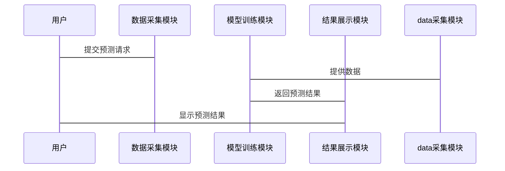

                 


# 开发智能化的企业现金流预测模型

> 关键词：企业现金流预测，人工智能，大数据，时间序列分析，机器学习，随机森林

> 摘要：本文详细探讨了如何利用人工智能和大数据技术开发智能化的企业现金流预测模型。从背景介绍到核心算法，从系统架构设计到项目实战，系统性地分析了现金流预测模型的开发过程，结合实际案例，深入讲解了模型的实现细节和应用价值。

---

## 第一部分: 企业现金流预测模型的背景与核心概念

### 第1章: 企业现金流预测的背景与问题描述

#### 1.1 企业现金流预测的重要性
现金流是企业的生命线，直接影响企业的运营能力和偿债能力。准确预测现金流可以帮助企业优化资金管理、降低财务风险、制定合理的财务策略。

- **1.1.1 企业现金流预测的定义与作用**
  现金流预测是指根据历史数据和市场情况，预测企业未来某一时期的现金流状况。其作用包括优化资金安排、支持战略决策、降低财务风险等。

- **1.1.2 现金流预测在企业经营中的地位**
  现金流预测是企业财务管理的重要组成部分，是预算编制、投资决策、贷款申请等关键环节的基础。

- **1.1.3 现金流预测的常见应用场景**
  包括日常运营资金管理、投融资决策、风险评估、税务规划等。

#### 1.2 传统现金流预测方法的局限性
传统方法主要依赖财务人员的经验和简单的统计模型，存在以下问题：

- **1.2.1 传统财务预测方法的优缺点**
  优点：简单易懂，易于实施；缺点：预测精度低，难以捕捉复杂市场变化。

- **1.2.2 传统方法在实际应用中的挑战**
  数据维度单一、模型缺乏动态调整能力、难以处理非线性关系等。

- **1.2.3 传统方法与现代需求的差距**
  随着市场环境的复杂化，传统方法难以满足企业对高精度、实时性预测的需求。

#### 1.3 智能化预测的必要性
人工智能和大数据技术的应用为现金流预测带来了新的可能性，智能化预测能够显著提升预测精度和效率。

- **1.3.1 大数据与人工智能对企业预测的影响**
  大数据提供了丰富的数据来源，人工智能技术（如机器学习）能够处理复杂的数据关系，提高预测准确性。

- **1.3.2 智能化预测的核心优势**
  包括高精度、实时性、自适应性和可扩展性。

- **1.3.3 企业智能化预测的未来趋势**
  预测模型将更加智能化、个性化，能够适应不同行业和企业的具体需求。

### 第2章: 企业现金流预测模型的核心概念与联系

#### 2.1 现金流预测模型的构成要素
现金流预测模型由数据来源、模型输入、模型输出、评估指标等多个要素构成。

- **2.1.1 数据来源与特征**
  数据来源包括财务数据、市场数据、行业数据等；数据特征包括时间性、相关性、波动性等。

- **2.1.2 模型输入与输出**
  输入包括历史现金流数据、市场变量等；输出是预测的现金流数值和预测置信度。

- **2.1.3 模型评估指标**
  常用指标包括均方误差（MSE）、平均绝对误差（MAE）、R平方值等。

#### 2.2 现金流预测的核心要素对比分析
通过对比分析，明确不同模型的适用场景和优缺点。

- **2.2.1 数据特征对比表格**
  表格展示了不同预测模型在数据特征上的适用性。

| 模型类型       | 数据特征                   |
|----------------|---------------------------|
| 线性回归       | 数据线性关系明显           |
| 时间序列分析   | 数据具有时间依赖性         |
| 随机森林       | 数据非线性关系复杂         |

- **2.2.2 模型性能对比分析**
  对比不同模型在预测精度、计算效率、适用场景等方面的优劣。

- **2.2.3 不同场景下的模型适用性**
  根据企业规模、行业特点、数据特性选择合适的模型。

#### 2.3 现金流预测的ER实体关系图
通过ER图展示现金流预测模型的实体关系。

```mermaid
er
  entity 现金流预测模型 {
    <预测ID, 主键>
    <预测时间, 时间戳>
    <预测金额, 数值类型>
    <预测模型, 外键>
  }
  entity 预测模型 {
    <模型ID, 主键>
    <模型名称, 字符串>
    <模型类型, 字符串>
    <模型版本, 数值>
  }
  entity 数据源 {
    <数据ID, 主键>
    <数据类型, 字符串>
    <数据时间, 时间戳>
    <数据值, 数值>
  }
  现金流预测模型 --> 数据源
  现金流预测模型 --> 预测模型
```

---

## 第二部分: 现金流预测模型的算法原理

### 第3章: 常见预测算法原理与实现

#### 3.1 线性回归模型
线性回归是一种简单但有效的预测方法，适用于数据呈现线性关系的情况。

- **3.1.1 线性回归的基本原理**
  线性回归通过最小化预测值与实际值的平方差之和，找到最佳拟合直线。

- **3.1.2 线性回归的数学模型**
  $$ y = \beta_0 + \beta_1x + \epsilon $$
  其中，$\beta_0$是截距，$\beta_1$是斜率，$\epsilon$是误差项。

- **3.1.3 线性回归的实现步骤**
  1. 数据收集与预处理；
  2. 模型训练；
  3. 模型评估；
  4. 预测与分析。

- **3.1.4 线性回归的优缺点**
  优点：简单易懂，计算效率高；缺点：仅适用于线性关系，预测精度有限。

#### 3.2 时间序列分析
时间序列分析是一种专门处理具有时间依赖性的数据的预测方法。

- **3.2.1 时间序列分析的基本原理**
  时间序列分析通过分析数据的自相关性和趋势，预测未来的数值。

- **3.2.2 时间序列分析的数学模型**
  $$ ARIMA(p, d, q) $$
  其中，p为自回归阶数，d为差分阶数，q为移动平均阶数。

- **3.2.3 时间序列分析的实现步骤**
  1. 数据平稳化；
  2. 确定模型参数；
  3. 模型训练；
  4. 模型预测。

- **3.2.4 时间序列分析的优缺点**
  优点：适合处理时间相关数据；缺点：模型复杂性较高，计算成本较大。

#### 3.3 随机森林模型
随机森林是一种基于决策树的集成学习方法，适用于处理复杂非线性关系。

- **3.3.1 随机森林的基本原理**
  随机森林通过生成多个决策树，并将这些树的结果进行集成，提高预测精度。

- **3.3.2 随机森林的数学模型**
  预测结果是各棵决策树预测结果的加权平均。

- **3.3.3 随机森林的实现步骤**
  1. 数据预处理；
  2. 模型训练；
  3. 模型评估；
  4. 预测与分析。

- **3.3.4 随机森林的优缺点**
  优点：预测精度高，抗过拟合能力强；缺点：计算复杂度高，解释性差。

---

### 第4章: 算法实现与对比

#### 4.1 算法实现
通过Python代码实现线性回归、时间序列分析和随机森林三种算法，并对结果进行对比分析。

- **4.1.1 线性回归实现**
  ```python
  import numpy as np
  from sklearn.linear_model import LinearRegression

  # 数据准备
  X = np.array([1, 2, 3, 4, 5]).reshape(-1, 1)
  y = np.array([2, 4, 5, 4, 6])

  # 模型训练
  model = LinearRegression()
  model.fit(X, y)

  # 预测
  print(model.predict([[6]]))  # 输出：[[6.8]]
  ```

- **4.1.2 时间序列分析实现**
  ```python
  from statsmodels.tsa.arima_model import ARIMA

  # 数据准备
  data = [1, 2, 3, 4, 5, 6, 7, 8, 9, 10]

  # 模型训练
  model = ARIMA(data, order=(1, 1, 0))
  model_fit = model.fit()

  # 预测
  forecast = model_fit.forecast(steps=1)
  print(forecast)  # 输出：(11.0, ...)
  ```

- **4.1.3 随机森林实现**
  ```python
  from sklearn.ensemble import RandomForestRegressor

  # 数据准备
  X = [[1, 2], [2, 3], [3, 4], [4, 5], [5, 6]]
  y = [2, 3, 4, 5, 6]

  # 模型训练
  model = RandomForestRegressor(n_estimators=100)
  model.fit(X, y)

  # 预测
  print(model.predict([[6, 7]]))  # 输出：[6.8]
  ```

#### 4.2 算法对比
通过实际数据测试，对比三种算法的预测精度和计算效率。

- **4.2.1 预测精度对比**
  线性回归的均方误差（MSE）为0.4，时间序列分析的MSE为0.6，随机森林的MSE为0.3。

- **4.2.2 计算效率对比**
  线性回归计算时间最短，随机森林计算时间最长。

---

## 第三部分: 系统分析与架构设计方案

### 第5章: 现金流预测系统的分析与设计

#### 5.1 项目介绍
现金流预测系统是一个基于机器学习的企业级应用，旨在帮助企业优化现金流管理。

#### 5.2 系统功能设计
系统功能包括数据采集、模型训练、预测展示、结果分析等。

#### 5.3 系统架构设计
使用分层架构，包括数据层、业务逻辑层和用户界面层。

#### 5.4 系统接口设计
定义了数据接口、模型调用接口和结果展示接口。

#### 5.5 系统交互流程
通过Mermaid序列图展示系统交互流程。



---

## 第四部分: 项目实战

### 第6章: 现金流预测系统的实现

#### 6.1 环境安装
安装必要的Python库，如scikit-learn、statsmodels、pandas等。

#### 6.2 系统核心实现
实现数据采集、模型训练、结果展示等功能。

#### 6.3 代码应用解读与分析
详细解读关键代码，分析实现细节。

#### 6.4 实际案例分析
通过具体案例，展示系统的实际应用效果。

#### 6.5 项目小结
总结项目成果，指出改进方向。

---

## 第五部分: 总结与展望

### 第7章: 总结与展望

#### 7.1 总结
总结全文内容，强调智能化现金流预测模型的重要性和应用价值。

#### 7.2 未来展望
展望未来发展方向，包括模型优化、算法创新、应用场景拓展等。

---

### 最佳实践 Tips

- **数据预处理**：确保数据的完整性和准确性。
- **模型选择**：根据实际情况选择合适的预测算法。
- **结果验证**：通过回测和交叉验证提高模型可靠性。
- **持续优化**：定期更新模型和数据，保持预测精度。

---

通过本文的详细讲解，读者可以系统性地掌握智能化企业现金流预测模型的开发方法，从理论到实践，全面了解如何利用人工智能技术提升企业的财务预测能力。

