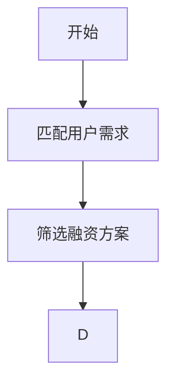
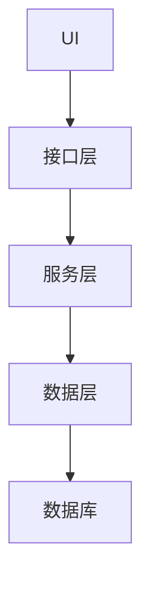
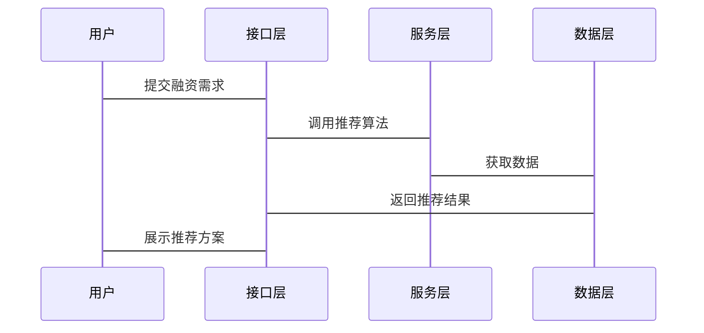

                 


# 开发智能化的企业融资方案推荐系统

## 关键词：企业融资、智能推荐系统、机器学习、算法实现、系统架构

## 摘要：本文详细探讨了如何开发一个智能化的企业融资方案推荐系统，从背景分析、核心概念、算法原理到系统架构和项目实战，逐步展开讲解，旨在为企业融资推荐系统的设计与实现提供全面的技术指导。

---

## 第一部分: 背景介绍与核心概念

### 第1章: 企业融资方案推荐系统概述

#### 1.1 问题背景与描述
企业融资是企业发展过程中至关重要的一环，传统融资方式存在信息不对称、效率低下、成本高等问题。智能化推荐系统通过大数据和人工智能技术，能够高效匹配企业需求与融资方案，显著提升融资效率。

#### 1.2 问题解决与边界
智能化推荐系统的核心目标是根据企业的信用状况、财务数据、市场环境等因素，提供个性化的融资方案推荐。系统边界包括企业用户、金融机构、数据源等，组成模块包括用户画像、融资需求分析、推荐算法等。

### 第2章: 核心概念与联系

#### 2.1 核心概念原理
智能推荐系统基于数据驱动，结合机器学习算法，构建用户画像和融资需求模型，实现精准推荐。

#### 2.2 核心要素对比表
| 核心要素 | 描述 | 特性 |
|----------|------|------|
| 数据源   | 包括企业财务数据、市场数据等 | 多样性、实时性 |
| 推荐算法 | 包括协同过滤、聚类等 | 可解释性、准确性 |
| 用户画像 | 包括企业信用评分、行业分类 | 细粒度、动态更新 |

#### 2.3 ER实体关系图
```mermaid
erDiagram
    actor 用户
    actor 融资机构
    actor 系统管理员
    database 融资方案数据库
    database 用户行为数据库
    database 市场数据数据库
    用户 --> 融资方案数据库 : 查询融资方案
    用户 --> 用户行为数据库 : 记录行为数据
    融资机构 --> 融资方案数据库 : 提供融资方案
    系统管理员 --> 所有数据库 : 管理数据
```

---

## 第二部分: 算法原理与数学模型

### 第3章: 推荐算法原理

#### 3.1 基于规则的推荐算法
规则推荐系统通过预定义的规则匹配用户需求，适合场景简单的情况。

#### 3.2 基于数据的推荐算法
协同过滤算法通过分析用户行为数据，找到相似用户的偏好，进行推荐。

#### 3.3 算法流程图


#### 3.4 数学模型
推荐系统的评分预测模型：
$$ r_{u,i} = \bar{y} + a_u + b_i + \sum_{k=1}^{K} \alpha_k f_k(u,i) $$

优化目标函数：
$$ \min \sum (r_{u,i} - \hat{r}_{u,i})^2 + \lambda (\beta_u^2 + \gamma_i^2) $$

---

## 第三部分: 系统分析与架构设计

### 第4章: 系统分析与架构设计

#### 4.1 问题场景介绍
系统需要处理企业融资需求与金融机构融资方案的匹配问题，支持多维度数据输入和实时推荐。

#### 4.2 系统架构设计


#### 4.3 系统交互流程图


---

## 第四部分: 项目实战

### 第5章: 项目实战

#### 5.1 环境安装
安装Python和相关库：
```bash
pip install numpy pandas scikit-learn
```

#### 5.2 核心代码实现
数据预处理：
```python
import pandas as pd
data = pd.read_csv('融资数据.csv')
```

模型训练：
```python
from sklearn.cluster import KMeans
model = KMeans(n_clusters=5)
model.fit(data)
```

结果分析：
```python
print(model.labels_)
```

#### 5.3 案例分析
以一家制造企业为例，通过系统分析其财务数据，推荐最佳融资方案，并展示结果。

---

## 第五部分: 最佳实践

### 第6章: 最佳实践

#### 6.1 小结
系统开发的关键在于数据处理、算法选择和架构设计。

#### 6.2 注意事项
数据隐私保护、模型调优和系统扩展性设计。

#### 6.3 拓展阅读
推荐相关书籍和论文，进一步深入学习。

---

通过以上步骤，我们详细讲解了开发智能化企业融资方案推荐系统的各个方面，从理论到实践，帮助读者全面掌握系统开发的关键点。

