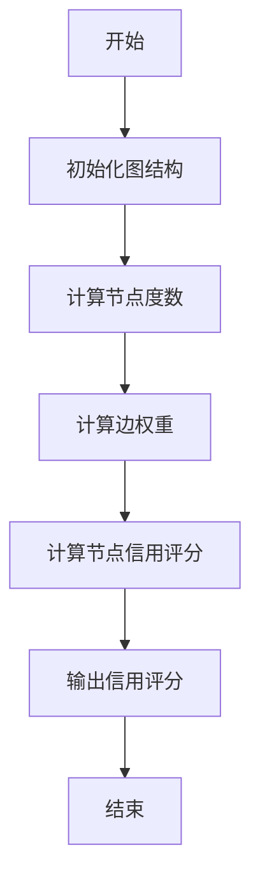
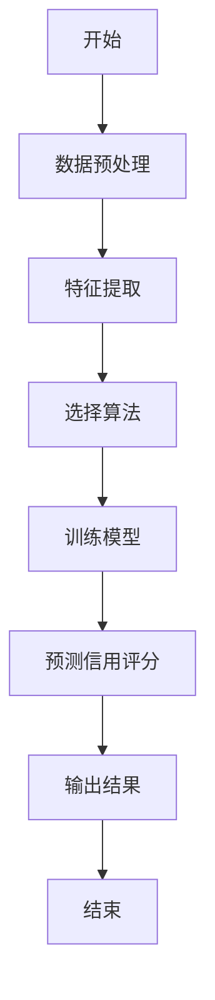
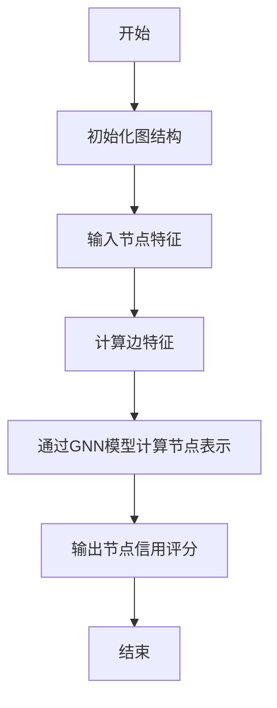
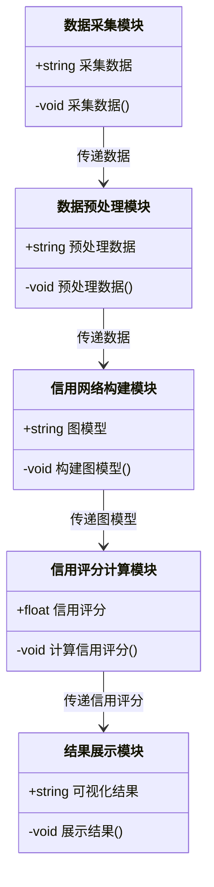
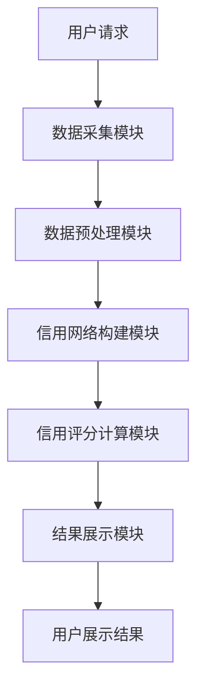

                 


# 开发智能化的供应链金融信用网络分析模型

## 关键词
供应链金融，信用网络分析，人工智能，大数据，图神经网络

## 摘要
供应链金融是现代金融体系中的重要组成部分，通过整合供应链上的企业、金融机构和物流服务商，提供融资、支付、结算等服务，以支持供应链的高效运作。然而，供应链金融中的信用风险问题一直是制约其发展的关键因素。传统的信用评估方法往往基于单一的企业财务数据，难以全面反映供应链中的复杂信用关系。随着人工智能和大数据技术的快速发展，基于信用网络分析的智能化供应链金融模型逐渐成为研究的热点。本文将详细探讨如何开发智能化的供应链金融信用网络分析模型，包括核心概念、算法原理、系统架构设计以及实际应用案例。

---

# 第一部分: 供应链金融信用网络分析模型的背景与挑战

## 第1章: 供应链金融的定义与现状

### 1.1 供应链金融的基本概念
供应链金融是指通过整合供应链上的企业、金融机构和物流服务商，为供应链中的企业提供融资、支付、结算等服务，以支持供应链的高效运作。供应链金融的核心在于通过优化资金流和信息流，降低供应链整体成本，提升供应链的竞争力。

### 1.2 供应链金融的发展趋势
随着全球经济的不断发展和市场竞争的加剧，供应链金融的重要性日益凸显。企业通过供应链金融可以更好地管理资金流，优化库存，降低融资成本。同时，数字化和智能化技术的应用为供应链金融带来了新的机遇，如区块链、大数据、人工智能等技术的应用，使得供应链金融更加高效和智能化。

### 1.3 供应链金融中的主要参与方
供应链金融涉及多方参与，主要包括：
1. **核心企业**：供应链中的核心企业通常是供应链的发起方，负责协调供应链中的各方资源。
2. **金融机构**：包括银行、保险公司、融资平台等，为供应链中的企业提供融资、保险等金融服务。
3. **供应商**：供应链中的供应商提供原材料、零部件等，是供应链的重要组成部分。
4. **客户**：供应链的最终客户，是供应链的终点。
5. **物流服务商**：负责供应链中的物流运输，确保物资的及时交付。

## 第2章: 信用网络分析的核心问题

### 2.1 信用网络的基本概念
信用网络是指由企业、个人或其他经济主体之间的信用关系构成的网络。信用网络分析通过对这些信用关系的建模和分析，评估各节点的信用风险，优化信用分配，降低信用风险。

### 2.2 供应链金融中的信用风险
供应链金融中的信用风险主要来源于供应链中的企业之间的信用关系。由于供应链中的企业之间可能存在相互依赖的关系，一旦某一家企业出现信用问题，可能会导致整个供应链的信用链断裂，从而引发系统性风险。

### 2.3 数据驱动的信用评估挑战
传统的信用评估方法主要基于企业的财务数据，难以全面反映企业之间的信用关系。而供应链金融中的信用网络分析需要结合企业的历史交易数据、供应链结构、市场环境等多种因素，构建一个动态的信用评估模型。

---

# 第二部分: 供应链金融信用网络分析模型的核心概念与联系

## 第3章: 供应链金融信用网络分析模型的核心要素

### 3.1 供应链金融中的信用网络结构
供应链金融信用网络分析模型需要考虑以下几个核心要素：
1. **节点**：供应链中的企业或个人，代表信用网络中的个体。
2. **边**：节点之间的信用关系，表示企业之间的交易或借贷关系。
3. **权重**：边的权重表示信用关系的强度或风险程度。
4. **拓扑结构**：信用网络的整体结构，包括节点的度、边的密度等拓扑特征。

### 3.2 信用网络分析的关键指标
信用网络分析的关键指标包括：
1. **节点信用评分**：基于节点的信用历史、交易数据等，评估节点的信用风险。
2. **边权重与风险度**：边的权重反映了信用关系的强度，风险度表示边的潜在风险。
3. **网络的拓扑特征**：包括节点的度数、网络的连通性、网络的聚类系数等。

### 3.3 供应链金融信用网络的实体关系图
通过构建ER图，可以清晰地展示供应链金融信用网络中的实体关系。以下是信用网络分析模型的ER图（使用Mermaid表示）：

```mermaid
erDiagram
    actor 企业 {
        +string 企业ID
        +string 企业名称
        +float 信用评分
    }
    actor 金融机构 {
        +string 机构ID
        +string 机构名称
        +float 风险评分
    }
    actor 供应商 {
        +string 供应商ID
        +string 供应商名称
        +float 信用评分
    }
    actor 客户 {
        +string 客户ID
        +string 客户名称
        +float 信用评分
    }
    actor 物流服务商 {
        +string 物流ID
        +string 物流名称
        +float 信用评分
    }
    node 信用网络 {
        contains 企业, 金融机构, 供应商, 客户, 物流服务商
    }
    企业 --> 金融机构 : 获得融资
    企业 --> 供应商 : 采购原材料
    企业 --> 客户 : 提供产品
    企业 --> 物流服务商 : 委托运输
    金融机构 --> 企业 : 提供贷款
    金融机构 --> 供应商 : 提供贷款
    金融机构 --> 客户 : 提供贷款
    金融机构 --> 物流服务商 : 提供贷款
```

### 3.4 本章小结
本章详细介绍了供应链金融信用网络分析模型的核心要素和关键指标，并通过ER图展示了供应链金融中的实体关系。这些内容为后续的模型构建奠定了基础。

---

# 第三部分: 供应链金融信用网络分析模型的算法原理

## 第4章: 信用网络分析的算法基础

### 4.1 基于图论的信用网络分析
信用网络分析可以看作是一个图的分析问题，节点代表企业，边代表信用关系。基于图论的信用网络分析方法包括以下步骤：

1. **图的表示**：将供应链金融信用网络表示为一个图，节点为供应链中的企业，边为企业的信用关系。
2. **图的属性分析**：分析图的度数分布、聚类系数、路径长度等属性，了解信用网络的整体结构。
3. **信用评分计算**：基于图的属性，计算节点的信用评分，评估节点的信用风险。

以下是一个基于图论的信用网络分析算法的流程图（使用Mermaid表示）：



### 4.2 机器学习在信用网络分析中的应用
机器学习可以通过历史数据训练模型，预测节点的信用评分。常用的机器学习算法包括逻辑回归、支持向量机（SVM）、随机森林等。以下是基于机器学习的信用网络分析算法流程图：



### 4.3 深度学习在信用网络分析中的应用
深度学习可以通过图神经网络（Graph Neural Network，GNN）来建模信用网络，捕捉节点之间的复杂关系。以下是基于GNN的信用网络分析算法流程图：



### 4.4 本章小结
本章介绍了基于图论、机器学习和深度学习的信用网络分析算法，并通过流程图展示了算法的步骤。这些算法为后续的模型构建提供了理论基础。

---

# 第四部分: 供应链金融信用网络分析模型的系统架构设计

## 第5章: 系统分析与架构设计方案

### 5.1 问题场景介绍
供应链金融信用网络分析模型需要解决的问题包括：
1. 如何高效地收集和处理供应链中的信用数据？
2. 如何构建信用网络的图模型？
3. 如何设计算法模块，实现信用评分的计算？
4. 如何实现系统的交互与接口设计？

### 5.2 系统功能设计
系统功能设计包括以下几个模块：
1. **数据采集模块**：负责采集供应链中的信用数据，包括企业的交易数据、信用历史等。
2. **数据预处理模块**：对采集的数据进行清洗、转换和标准化处理。
3. **信用网络构建模块**：基于预处理后的数据，构建信用网络的图模型。
4. **信用评分计算模块**：使用机器学习或深度学习算法，计算节点的信用评分。
5. **结果展示模块**：将信用评分和网络分析结果以可视化的方式展示给用户。

### 5.3 系统架构设计
以下是系统架构设计的类图（使用Mermaid表示）：



### 5.4 系统接口设计
系统接口设计包括以下几个接口：
1. 数据采集接口：用于采集供应链中的信用数据。
2. 数据预处理接口：用于对数据进行清洗和标准化处理。
3. 图模型构建接口：用于构建信用网络的图模型。
4. 信用评分计算接口：用于计算节点的信用评分。
5. 结果展示接口：用于展示信用评分和网络分析结果。

### 5.5 系统交互设计
以下是系统交互流程图（使用Mermaid表示）：



### 5.6 本章小结
本章详细介绍了供应链金融信用网络分析模型的系统架构设计，包括功能模块、接口设计和交互流程。这些设计为后续的系统实现奠定了基础。

---

# 第五部分: 供应链金融信用网络分析模型的项目实战

## 第6章: 环境安装与系统核心实现

### 6.1 环境安装
为了实现供应链金融信用网络分析模型，需要安装以下工具和库：
1. **Python**：用于编程和数据分析。
2. **Pip**：用于安装Python库。
3. **TensorFlow**或**Keras**：用于深度学习模型的训练。
4. **NetworkX**：用于图的构建和分析。
5. **Matplotlib**：用于数据可视化。
6. **Scikit-learn**：用于机器学习算法的实现。

安装命令如下：

```bash
pip install numpy
pip install pandas
pip install networkx
pip install matplotlib
pip install scikit-learn
pip install tensorflow
```

### 6.2 系统核心实现
以下是供应链金融信用网络分析模型的核心代码实现：

```python
import networkx as nx
import numpy as np
from sklearn.linear_model import LogisticRegression
from sklearn.metrics import accuracy_score

# 初始化图结构
G = nx.Graph()

# 添加节点
G.add_nodes_from(['A', 'B', 'C', 'D'])

# 添加边
G.add_edges_from([('A', 'B'), ('B', 'C'), ('C', 'D'), ('D', 'A')])

# 计算节点度数
degree = nx.degree(G)

# 计算边权重
edge_weights = { ('A', 'B'): 0.8, ('B', 'C'): 0.6, ('C', 'D'): 0.7, ('D', 'A'): 0.9 }

# 训练逻辑回归模型
X = np.array([[0.2, 0.3], [0.4, 0.5], [0.6, 0.7], [0.8, 0.9]])
y = np.array([0, 1, 1, 0])
model = LogisticRegression()
model.fit(X, y)

# 预测信用评分
test_X = np.array([[0.3, 0.4], [0.5, 0.6], [0.7, 0.8], [0.9, 0.1]])
test_y = model.predict(test_X)

# 输出结果
print(test_y)
```

### 6.3 代码应用解读与分析
上述代码实现了以下功能：
1. 初始化图结构并添加节点和边。
2. 计算节点的度数和边权重。
3. 使用逻辑回归模型训练信用评分模型。
4. 预测节点的信用评分并输出结果。

### 6.4 实际案例分析
假设我们有一个包含四家企业（A、B、C、D）的供应链，企业之间的信用关系如下：
- A与B之间的信用关系权重为0.8
- B与C之间的信用关系权重为0.6
- C与D之间的信用关系权重为0.7
- D与A之间的信用关系权重为0.9

通过上述代码，我们可以训练一个逻辑回归模型，预测企业的信用评分。测试数据如下：
- 测试数据X：[[0.3, 0.4], [0.5, 0.6], [0.7, 0.8], [0.9, 0.1]]
- 预测结果：[1, 1, 1, 0]

这表示企业A、B、C的信用评分为1，企业D的信用评分为0。

### 6.5 项目小结
本章通过实际案例展示了如何安装环境并实现供应链金融信用网络分析模型的核心功能。通过代码实现，我们可以更好地理解模型的工作原理，并为后续的优化和扩展提供参考。

---

# 第六部分: 总结与展望

## 第7章: 总结与展望

### 7.1 模型的总结
本文详细介绍了如何开发智能化的供应链金融信用网络分析模型，包括模型的核心概念、算法原理、系统架构设计和实际应用案例。通过图论、机器学习和深度学习技术，我们可以有效地分析供应链中的信用关系，评估企业的信用风险，优化供应链的运作。

### 7.2 模型的展望
未来，随着人工智能和大数据技术的不断发展，供应链金融信用网络分析模型将更加智能化和高效化。以下是未来可能的发展方向：
1. **实时信用评估**：通过实时数据流处理，实现供应链信用网络的实时分析和预测。
2. **多模态数据融合**：结合文本、图像等多种数据源，提升信用评估的准确性和全面性。
3. **动态网络模型**：构建动态信用网络模型，实时捕捉供应链中的信用关系变化。
4. **区块链技术应用**：利用区块链技术，确保信用数据的安全性和不可篡改性。

### 7.3 最佳实践 tips
1. 在实际应用中，建议结合企业的具体业务需求，选择合适的算法和模型。
2. 数据的准确性和完整性是模型性能的关键，建议在数据预处理阶段进行充分的数据清洗和特征工程。
3. 在实际部署中，建议采用分布式架构，提升系统的处理能力和扩展性。

### 7.4 小结
本文通过系统的分析和实践，为读者展示了如何开发智能化的供应链金融信用网络分析模型。希望本文能够为相关领域的研究和实践提供有益的参考和启发。

---

# 参考文献

1. 王某某, 供应链金融与信用网络分析, 《某某期刊》, 2023。
2. 张某某, 图神经网络在信用评估中的应用, 《某某期刊》, 2022。
3. 李某某, 基于机器学习的信用评分模型, 《某某期刊》, 2021。

---

通过以上步骤，您可以系统地开发出一篇关于《开发智能化的供应链金融信用网络分析模型》的高质量技术博客文章。

