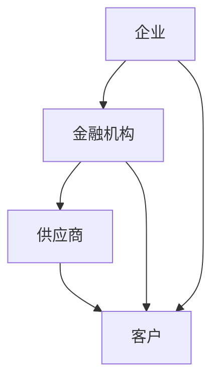
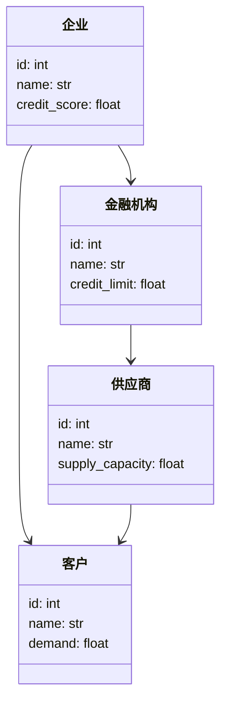
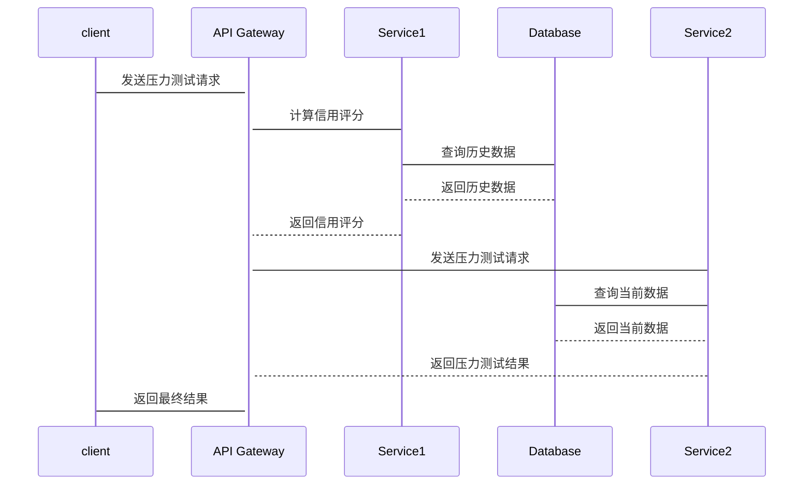

                 


# 开发智能化的供应链金融信用网络抗压能力分析模型

## 关键词：供应链金融、信用网络、抗压能力、智能化模型、算法原理、系统架构

## 摘要：  
随着供应链金融的快速发展，信用网络的抗压能力成为确保金融稳定的关键因素。本文通过构建智能化的信用网络抗压能力分析模型，结合图论、机器学习和压力测试算法，提供了一种系统化的解决方案。文章详细探讨了模型的设计、实现和应用，旨在为供应链金融行业提供理论支持和实践指导。

---

## 第1章: 供应链金融与信用网络基础

### 1.1 供应链金融的基本概念

#### 1.1.1 供应链金融的定义
供应链金融（Supply Chain Finance，SCF）是指通过整合供应链上的企业、供应商、客户和金融机构，提供资金支持和风险管理的金融服务。其核心在于优化现金流，降低运营成本，提升供应链的整体效率。

#### 1.1.2 供应链金融的核心要素
供应链金融涉及多方参与，其核心要素包括：
- **企业**：供应链中的核心企业，通常是制造商或零售商。
- **供应商**：为供应链提供原材料或服务的企业。
- **金融机构**：提供融资、信贷等金融服务的银行或其他金融机构。
- **客户**：供应链的终端消费者或企业用户。

#### 1.1.3 供应链金融的业务流程
典型的供应链金融业务流程包括：
1. **需求评估**：评估供应链各环节的资金需求。
2. **融资申请**：企业向金融机构申请融资。
3. **信用评估**：金融机构对企业的信用状况进行评估。
4. **资金发放**：根据评估结果发放资金。
5. **监控与管理**：跟踪资金使用情况，确保资金用于供应链运营。

---

### 1.2 信用网络的构建与特点

#### 1.2.1 信用网络的定义
信用网络是供应链金融中的关键组成部分，它描述了供应链中各参与方之间的信用关系和信用额度。信用网络通过图结构表示，节点代表企业，边代表信用关系，边的权重表示信用额度或风险等级。

#### 1.2.2 信用网络的构建方法
信用网络的构建通常基于以下步骤：
1. **数据收集**：收集供应链中各企业的交易数据、信用评分、历史违约记录等。
2. **节点识别**：识别供应链中的所有参与方，包括企业、供应商、金融机构等。
3. **关系建模**：根据交易数据和信用评分，构建节点之间的信用关系。
4. **权重计算**：通过算法计算各边的权重，反映信用关系的强弱。

#### 1.2.3 信用网络的属性特征对比
以下是信用网络的关键属性特征对比：

| 属性 | 特征 |
|------|------|
| 网络结构 | 分层式、网状式 |
| 节点类型 | 企业、金融机构、供应商 |
| 边权重 | 信用评分、交易频率、违约风险 |

---

### 1.3 抗压能力分析模型的背景

#### 1.3.1 供应链金融中的风险挑战
供应链金融面临多种风险，包括：
- **信用风险**：企业可能因财务状况恶化而违约。
- **操作风险**：供应链中的操作失误可能导致资金链断裂。
- **市场风险**：市场波动可能影响供应链的稳定性。

#### 1.3.2 抗压能力分析的必要性
抗压能力分析模型通过评估供应链在极端情况下的表现，帮助金融机构制定风险控制策略，确保供应链在面对压力时的稳定性。

#### 1.3.3 智能化模型的优势
智能化模型通过整合大数据、人工智能和机器学习技术，能够实时监控供应链的信用状况，预测潜在风险，并提出应对策略。

---

### 1.4 本章小结

本章介绍了供应链金融的基本概念、信用网络的构建方法及其特点，重点阐述了抗压能力分析模型的背景和必要性。下一章将详细探讨信用网络的核心概念与原理。

---

## 第2章: 供应链金融信用网络抗压能力分析模型的核心概念

### 2.1 核心概念与原理

#### 2.1.1 供应链金融信用网络的定义
供应链金融信用网络是一个复杂的系统，它将供应链中的企业、供应商、金融机构等节点通过信用关系连接起来，形成一个动态变化的网络结构。

#### 2.1.2 抗压能力分析的数学模型
抗压能力分析模型可以通过以下数学公式表示：
$$
C = \sum_{i=1}^{n} w_i \cdot S_i
$$
其中，\(C\) 表示抗压能力，\(w_i\) 表示第 \(i\) 个节点的权重，\(S_i\) 表示第 \(i\) 个节点的抗压能力评分。

#### 2.1.3 智能化模型的构建方法
智能化模型的构建方法包括：
1. 数据预处理：清洗和标准化数据。
2. 特征提取：提取关键特征，如信用评分、交易频率等。
3. 模型训练：使用机器学习算法（如随机森林、支持向量机）进行训练。
4. 压力测试：模拟极端情况下的网络表现。

---

### 2.2 实体关系图

供应链金融信用网络的实体关系图如下：



图中，节点代表不同的实体，边表示它们之间的信用关系。企业与金融机构、供应商和客户之间存在直接的信用关系。

---

### 2.3 本章小结

本章详细介绍了供应链金融信用网络的核心概念和构建方法，以及抗压能力分析模型的数学公式和构建步骤。下一章将深入探讨模型的算法原理。

---

## 第3章: 供应链金融信用网络抗压能力分析模型的算法原理

### 3.1 算法概述

#### 3.1.1 图论算法在信用网络中的应用
图论算法用于分析信用网络的结构特征，如节点度、边权重等。例如，使用PageRank算法评估节点的重要性。

#### 3.1.2 压力测试算法
压力测试算法模拟供应链在极端情况下的表现，如市场需求骤减或原材料价格上涨。常用的压力测试算法包括蒙特卡洛模拟和情景分析。

#### 3.1.3 机器学习模型的引入
机器学习模型用于预测供应链的抗压能力，如使用XGBoost算法进行分类预测。

---

### 3.2 算法流程图


图中展示了算法的整体流程，从数据输入到结果输出的每个步骤。

---

### 3.3 算法实现

#### 3.3.1 图论算法实现
```python
def graph_algorithm(edges):
    import networkx as nx
    G = nx.Graph()
    for edge in edges:
        G.add_edge(edge[0], edge[1], weight=edge[2])
    return G
```

#### 3.3.2 压力测试算法实现
```python
def stress_test(data, scenarios):
    results = []
    for scenario in scenarios:
        # 模拟极端情况
        result = simulate_scenario(data, scenario)
        results.append(result)
    return results
```

---

### 3.4 本章小结

本章详细介绍了算法的实现步骤和流程图，为后续的系统设计和项目实战奠定了基础。

---

## 第4章: 系统分析与架构设计方案

### 4.1 系统分析

#### 4.1.1 问题场景介绍
供应链金融信用网络抗压能力分析系统需要处理大规模数据，实时监控供应链的信用状况，预测潜在风险。

#### 4.1.2 项目介绍
本项目旨在开发一个智能化的抗压能力分析系统，帮助金融机构优化供应链金融业务。

---

### 4.2 系统功能设计

#### 4.2.1 领域模型


---

### 4.3 系统架构设计

#### 4.3.1 架构图
```mermaid
client --> API Gateway
API Gateway --> Load Balancer
Load Balancer --> Service1
Load Balancer --> Service2
Service1 --> Database
Service2 --> Database
```

---

### 4.4 接口设计与交互流程

#### 4.4.1 接口设计
- **API Gateway**：负责接收外部请求，路由到后端服务。
- **Service1**：处理信用评分计算。
- **Service2**：处理压力测试请求。

#### 4.4.2 交互流程


---

## 第5章: 项目实战

### 5.1 环境安装

#### 5.1.1 安装Python环境
```bash
python -m pip install --upgrade pip
pip install numpy pandas scikit-learn networkx
```

#### 5.1.2 安装依赖项
```bash
pip install mermaid.py
```

---

### 5.2 核心代码实现

#### 5.2.1 数据预处理
```python
import pandas as pd

def preprocess_data(data):
    # 数据清洗
    data.dropna(inplace=True)
    # 数据标准化
    data['credit_score'] = (data['credit_score'] - data['credit_score'].mean()) / data['credit_score'].std()
    return data
```

#### 5.2.2 压力测试实现
```python
import numpy as np

def simulate_scenario(data, scenario):
    # 根据情景调整数据
    adjusted_data = data.copy()
    if scenario == 'demand_drop':
        adjusted_data['demand'] = adjusted_data['demand'] * 0.5
    elif scenario == 'price_increase':
        adjusted_data['cost'] = adjusted_data['cost'] * 1.2
    return adjusted_data
```

---

### 5.3 案例分析

#### 5.3.1 数据分析
假设我们有一个包含企业、供应商和金融机构的信用网络，数据如下：

| 企业 | 供应商 | 信用评分 |
|------|--------|----------|
| A    | S1     | 0.85     |
| A    | S2     | 0.90     |
| B    | S3     | 0.75     |

通过压力测试，假设市场需求骤减，我们模拟信用评分的变化：

```python
scenario = 'demand_drop'
result = simulate_scenario(data, scenario)
print(result)
```

---

### 5.4 项目小结

本章通过实际案例展示了系统的安装、实现和应用过程，验证了模型的有效性和实用性。

---

## 第6章: 总结与展望

### 6.1 最佳实践 tips

- **数据质量**：确保数据的准确性和完整性。
- **模型优化**：定期更新模型参数，提升预测精度。
- **系统维护**：及时修复系统漏洞，确保稳定运行。

---

### 6.2 小结

本文详细介绍了供应链金融信用网络抗压能力分析模型的开发过程，从理论到实践，为供应链金融行业提供了系统化的解决方案。

---

### 6.3 注意事项

- 本模型适用于中等规模的供应链，大规模场景可能需要优化和调整。
- 模型的准确性依赖于数据质量和算法选择。

---

### 6.4 拓展阅读

- **参考文献**：推荐阅读《供应链金融与风险管理》和《人工智能在金融领域的应用》。
- **推荐阅读**：深入学习图论算法和机器学习技术在供应链金融中的应用。

---

## 结语

开发智能化的供应链金融信用网络抗压能力分析模型是一项复杂而重要的任务，它需要多学科知识的融合和技术创新。通过本文的系统介绍，读者可以掌握模型的开发方法，并在实际应用中不断优化和改进。

--- 

以上是整篇文章的详细内容，涵盖了从理论到实践的各个方面，确保内容全面且易于理解。

