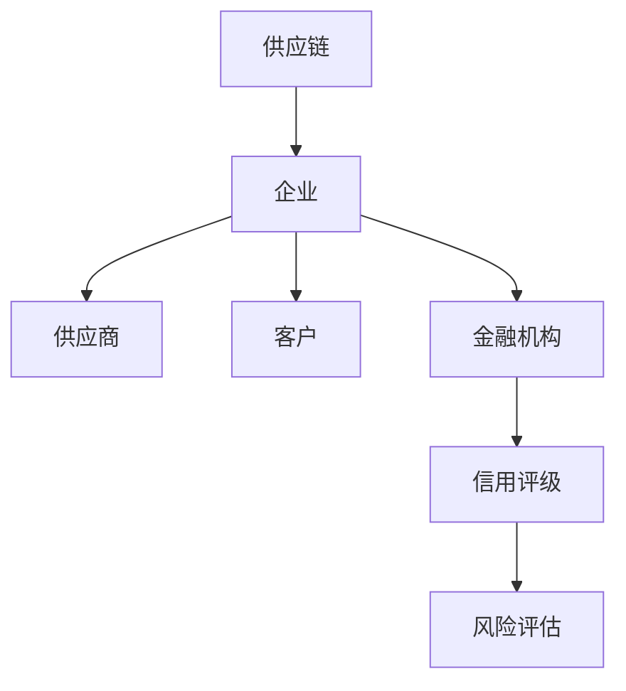
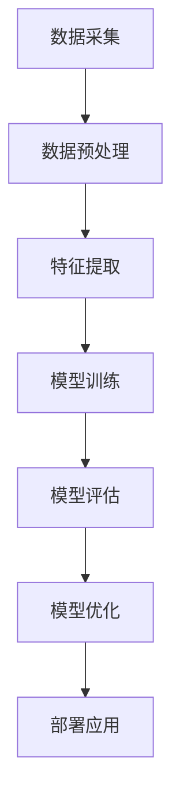
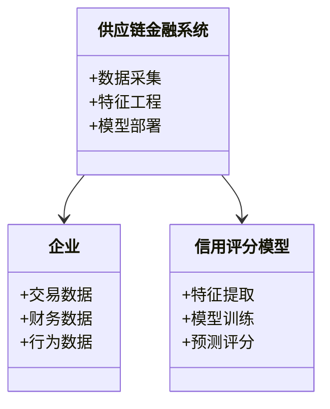
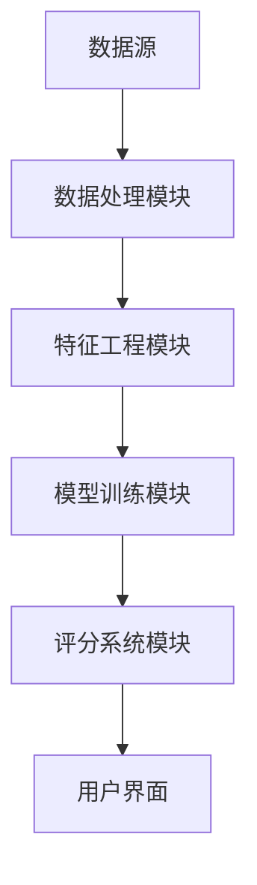
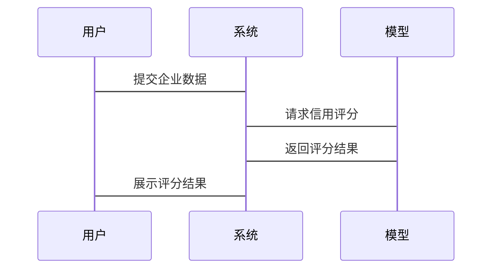

                 


# 开发智能化的供应链金融信用评级模型

## 关键词：供应链金融，信用评级，机器学习，智能化模型，风险评估

## 摘要：  
供应链金融是现代商业体系中的重要组成部分，而信用评级是供应链金融中的核心环节。随着数据科学和人工智能技术的快速发展，传统的信用评级方法逐渐被数据驱动的智能化模型所取代。本文将从供应链金融的背景出发，详细分析信用评级的核心问题，探讨基于机器学习的智能化信用评级模型的构建方法，并结合实际案例进行系统设计与实现。通过本文的讲解，读者将能够掌握开发智能化供应链金融信用评级模型的核心技术和实践方法。

---

# 第1章: 背景介绍

## 1.1 问题背景

### 1.1.1 供应链金融的定义与特点
供应链金融是指通过整合供应链上下游企业的资源与信息，为核心企业提供融资服务的一种金融模式。其特点包括：
- **数据驱动**：依赖企业的交易数据、财务数据和行为数据。
- **多主体协作**：涉及供应商、制造商、分销商和金融机构等多方参与。
- **动态风险评估**：企业信用状况会随着市场环境和经营状况的变化而波动。

### 1.1.2 供应链金融中的信用评级问题
在供应链金融中，信用评级是决定企业能否获得融资以及融资额度的关键因素。传统信用评级方法依赖于财务报表分析和人工审核，存在以下问题：
- 数据维度有限，难以全面反映企业信用状况。
- 人工审核效率低，难以应对海量数据。
- 风险评估不够精准，容易导致融资决策失误。

### 1.1.3 智能化信用评级的必要性
随着大数据和人工智能技术的发展，智能化信用评级能够通过以下方式提升供应链金融的效率和准确性：
- 利用机器学习算法挖掘数据中的潜在规律。
- 实时监控企业经营状况，动态调整信用评分。
- 降低人工审核的主观性和人为错误。

## 1.2 问题描述

### 1.2.1 供应链金融信用评级的核心问题
- 如何从多源数据中提取有效的信用评估特征？
- 如何选择合适的机器学习算法来构建信用评分模型？
- 如何确保模型的可解释性和稳定性？

### 1.2.2 当前信用评级的主要挑战
- 数据碎片化：供应链涉及多方数据，整合难度大。
- 模型泛化能力不足：传统模型难以适应不同行业和场景。
- 风险控制难度高：需要平衡模型的准确性和稳定性。

### 1.2.3 智能化信用评级的目标与意义
目标：
- 构建一个基于机器学习的智能化信用评级模型，实现对供应链上下游企业的精准信用评估。
- 提供动态、实时的信用评分，帮助金融机构做出更明智的融资决策。

意义：
- 提高供应链金融的效率和透明度。
- 降低企业的融资成本，促进供应链整体优化。
- 推动金融行业的数字化转型。

## 1.3 问题解决

### 1.3.1 数据驱动的信用评级方法
数据驱动的信用评级方法基于企业的多源数据，包括：
- **交易数据**：供应链上下游的交易记录、订单量、交货时间等。
- **财务数据**：收入、利润、资产负债表等财务指标。
- **行为数据**：企业经营行为、市场表现等。

### 1.3.2 机器学习在信用评级中的应用
机器学习算法能够从数据中自动提取特征，并建立信用评分模型。常用算法包括：
- **逻辑回归**：用于分类问题，适合二分类信用评分。
- **随机森林**：能够处理高维数据，适合特征重要性分析。
- **支持向量机（SVM）**：适合小样本数据，适合高维特征空间。

### 1.3.3 智能化信用评级模型的构建思路
1. 数据采集与预处理：整合供应链上下游数据，清洗和标准化。
2. 特征工程：提取关键特征，如交易稳定性、财务健康度等。
3. 模型训练：选择合适的机器学习算法，训练信用评分模型。
4. 模型评估：通过验证集评估模型性能，调整参数优化模型。
5. 部署与应用：将模型部署到实际业务系统中，实时提供信用评分。

## 1.4 模型边界与外延

### 1.4.1 模型的输入与输出
- **输入**：企业的多源数据，包括交易数据、财务数据和行为数据。
- **输出**：企业的信用评分（如AAA、AA、A等）和风险提示。

### 1.4.2 模型的适用范围与限制
- **适用范围**：适用于供应链上下游企业，尤其是中小企业。
- **限制**：模型依赖高质量的数据，数据不足可能导致模型性能下降。

### 1.4.3 模型的扩展与优化方向
- **模型优化**：引入深度学习算法（如神经网络）提升模型性能。
- **实时性优化**：优化数据处理流程，提升模型的实时性。
- **可解释性优化**：通过可解释性模型（如XGBoost）提升模型的可解释性。

## 1.5 概念结构与核心要素

### 1.5.1 供应链金融的核心要素
- **供应商**：提供原材料的企业。
- **制造商**：生产产品的核心企业。
- **分销商**：销售产品的渠道企业。
- **金融机构**：提供融资服务的银行或其他金融机构。

### 1.5.2 信用评级模型的构成要素
- **数据源**：交易数据、财务数据、行为数据。
- **特征提取**：关键特征的提取与筛选。
- **模型选择**：选择合适的机器学习算法。
- **模型评估**：模型性能的验证与优化。

### 1.5.3 模型的逻辑关系与流程
1. 数据采集：整合供应链上下游企业的多源数据。
2. 特征工程：提取关键特征，构建特征向量。
3. 模型训练：选择合适的算法，训练信用评分模型。
4. 模型部署：将模型部署到业务系统，实时提供信用评分。

---

# 第2章: 核心概念与联系

## 2.1 核心概念原理

### 2.1.1 供应链金融的运作机制
供应链金融通过整合供应链上下游企业的资源，为核心企业提供融资服务。其运作机制包括：
1. 数据整合：整合供应链上下游企业的交易数据、财务数据和行为数据。
2. 风险评估：基于多源数据对企业信用状况进行评估。
3. 融资服务：根据信用评分为企业提供融资支持。

### 2.1.2 信用评级的基本原理
信用评级是通过对企业的多维数据进行分析，评估企业的信用风险。其基本原理包括：
1. 数据采集：采集企业的交易数据、财务数据和行为数据。
2. 特征提取：提取关键特征，如交易稳定性、财务健康度等。
3. 模型训练：选择合适的算法，训练信用评分模型。
4. 风险评估：基于模型输出信用评分，评估企业的信用风险。

### 2.1.3 智能化信用评级的实现原理
智能化信用评级通过机器学习算法，从多源数据中自动提取特征，构建信用评分模型。其实现原理包括：
1. 数据驱动：基于企业的多源数据，构建特征向量。
2. 算法选择：选择合适的机器学习算法，训练信用评分模型。
3. 模型优化：通过验证集优化模型性能，提升预测准确率。

## 2.2 核心概念属性特征对比

### 2.2.1 供应链金融与传统信用评级的对比
| 特性              | 供应链金融信用评级       | 传统信用评级         |
|-------------------|-------------------------|----------------------|
| 数据来源          | 多源数据（交易、财务、行为） | 财务数据为主          |
| 模型复杂度        | 高维数据、复杂算法       | 低维数据、简单模型    |
| 决策效率          | 高效、实时               | 低效、依赖人工        |
| 适用场景          | 供应链上下游企业         | 企业整体信用评估      |

### 2.2.2 数据驱动与规则驱动的对比
| 特性              | 数据驱动               | 规则驱动             |
|-------------------|-----------------------|----------------------|
| 数据依赖          | 高                     | 低                   |
| 模型复杂度        | 高                     | 低                   |
| 可解释性          | 低                     | 高                   |
| 灵活性            | 高                     | 低                   |

### 2.2.3 机器学习与传统统计方法的对比
| 特性              | 机器学习               | 传统统计方法         |
|-------------------|-----------------------|----------------------|
| 数据需求          | 高维数据               | 低维数据             |
| 模型复杂度        | 高                     | 低                   |
| 可解释性          | 低                     | 高                   |
| 灵活性            | 高                     | 低                   |

## 2.3 ER实体关系图


---

# 第3章: 算法原理讲解

## 3.1 算法选择与原理

### 3.1.1 机器学习算法的选择
选择机器学习算法时需要考虑以下因素：
- 数据类型：分类问题。
- 数据规模：中小规模数据。
- 模型复杂度：需要较高的预测准确性。

常用算法：
- **逻辑回归**：适合二分类问题。
- **随机森林**：适合高维数据，适合特征重要性分析。
- **支持向量机（SVM）**：适合小样本数据，适合高维特征空间。

### 3.1.2 支持向量机（SVM）原理
支持向量机是一种监督学习算法，用于分类和回归问题。其核心思想是通过找到一个超平面，将数据点分成两类。数学公式如下：

$$
y = \text{sign}(\omega \cdot x + b)
$$

其中，$\omega$ 是权重向量，$x$ 是输入向量，$b$ 是偏置项。

### 3.1.3 随机森林原理
随机森林是一种基于决策树的集成学习算法。其核心思想是通过随机采样和特征随机选择，构建多个决策树，并通过投票或平均的方式进行预测。数学公式如下：

$$
\text{预测值} = \frac{1}{N} \sum_{i=1}^{N} y_i
$$

其中，$N$ 是决策树的数量，$y_i$ 是第$i$棵决策树的预测值。

## 3.2 算法流程图


## 3.3 核心算法代码实现

### 3.3.1 数据预处理代码
```python
import pandas as pd
from sklearn.preprocessing import StandardScaler

# 读取数据
data = pd.read_csv('credit_data.csv')

# 数据清洗
data.dropna(inplace=True)

# 标准化处理
scaler = StandardScaler()
data_scaled = scaler.fit_transform(data)
```

### 3.3.2 特征提取代码
```python
from sklearn.feature_selection import SelectKBest
from sklearn.feature_selection import chi2

# 特征提取
selector = SelectKBest(score_func=chi2, k=5)
selected_features = selector.fit_transform(data_scaled, target)
```

### 3.3.3 模型训练代码
```python
from sklearn.svm import SVC
from sklearn.metrics import accuracy_score

# 模型训练
model = SVC()
model.fit(selected_features, target)

# 模型预测
y_pred = model.predict(selected_features)
print('Accuracy:', accuracy_score(target, y_pred))
```

---

# 第4章: 系统分析与架构设计

## 4.1 问题场景介绍

### 4.1.1 供应链金融信用评级系统
供应链金融信用评级系统是一个基于机器学习的智能化系统，旨在为核心企业提供精准的信用评分。

## 4.2 系统功能设计

### 4.2.1 功能模块
- **数据采集模块**：负责采集供应链上下游企业的多源数据。
- **特征工程模块**：对数据进行清洗、标准化和特征提取。
- **模型训练模块**：选择合适的算法，训练信用评分模型。
- **评分系统模块**：根据模型输出信用评分，提供融资建议。

### 4.2.2 领域模型


## 4.3 系统架构设计

### 4.3.1 系统架构图


### 4.3.2 接口设计
- **数据接口**：负责与数据源对接，获取企业数据。
- **模型接口**：负责与机器学习模型对接，提供预测评分。
- **用户接口**：提供用户界面，展示信用评分结果。

### 4.3.3 交互流程图


---

# 第5章: 项目实战

## 5.1 环境安装

### 5.1.1 安装Python和相关库
```bash
pip install numpy
pip install pandas
pip install scikit-learn
pip install mermaid
```

## 5.2 核心代码实现

### 5.2.1 数据预处理代码
```python
import pandas as pd
from sklearn.preprocessing import StandardScaler

# 读取数据
data = pd.read_csv('credit_data.csv')

# 数据清洗
data.dropna(inplace=True)

# 标准化处理
scaler = StandardScaler()
data_scaled = scaler.fit_transform(data)
```

### 5.2.2 特征提取代码
```python
from sklearn.feature_selection import SelectKBest
from sklearn.feature_selection import chi2

# 特征提取
selector = SelectKBest(score_func=chi2, k=5)
selected_features = selector.fit_transform(data_scaled, target)
```

### 5.2.3 模型训练代码
```python
from sklearn.svm import SVC
from sklearn.metrics import accuracy_score

# 模型训练
model = SVC()
model.fit(selected_features, target)

# 模型预测
y_pred = model.predict(selected_features)
print('Accuracy:', accuracy_score(target, y_pred))
```

## 5.3 项目小结

### 5.3.1 核心知识点总结
- 数据预处理：数据清洗、标准化。
- 特征工程：特征提取、特征选择。
- 模型训练：选择算法、训练模型、评估性能。

### 5.3.2 最佳实践
- 数据预处理是关键，确保数据质量。
- 特征工程是核心，选择合适的特征提取方法。
- 模型选择要考虑数据规模和模型复杂度。

### 5.3.3 注意事项
- 数据隐私和安全问题需要重视。
- 模型部署要考虑实时性和可扩展性。
- 模型优化要考虑可解释性和稳定性。

### 5.3.4 拓展阅读
- 《机器学习实战》
- 《深入理解机器学习》
- 《供应链金融：理论与实践》

---

# 第6章: 总结

## 6.1 最佳实践 tips
- 数据预处理是关键，确保数据质量。
- 特征工程是核心，选择合适的特征提取方法。
- 模型选择要考虑数据规模和模型复杂度。

## 6.2 小结
本文详细介绍了开发智能化供应链金融信用评级模型的核心技术和实践方法，包括背景介绍、核心概念、算法原理、系统分析和项目实战等内容。通过本文的学习，读者将能够掌握开发智能化信用评级模型的全过程。

## 6.3 注意事项
- 数据隐私和安全问题需要重视。
- 模型部署要考虑实时性和可扩展性。
- 模型优化要考虑可解释性和稳定性。

## 6.4 拓展阅读
- 《机器学习实战》
- 《深入理解机器学习》
- 《供应链金融：理论与实践》

---

通过本文的讲解，读者将能够掌握开发智能化供应链金融信用评级模型的核心技术和实践方法，为供应链金融的智能化转型提供有力支持。

