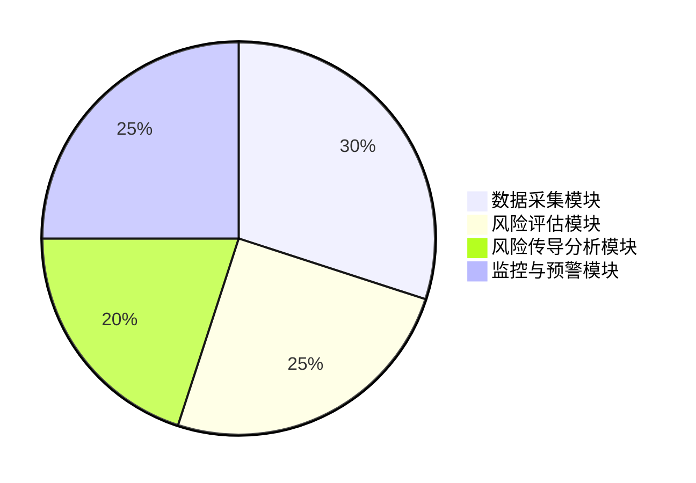
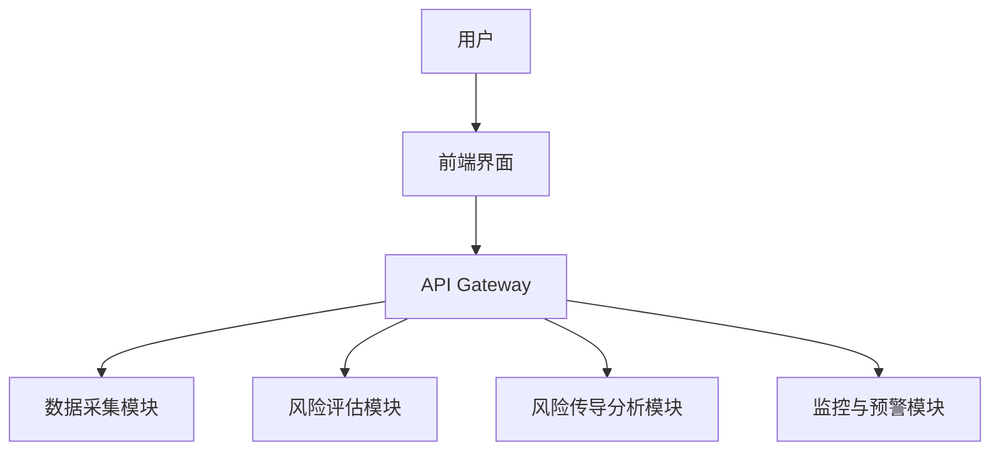

                 


# 开发智能化的供应链金融风险传导模型

> 关键词：供应链金融，风险传导模型，人工智能，风险管理，智能化系统

> 摘要：本文详细探讨了开发智能化供应链金融风险传导模型的必要性、核心概念、算法原理、系统架构设计以及实际应用案例。通过结合人工智能技术，本文提出了一种创新的风险管理方法，能够有效识别、评估和预测供应链中的各种风险，并通过智能化的模型进行风险传导分析，从而帮助金融机构和企业做出更明智的决策。

---

## 第1章：供应链金融风险传导模型的背景与概述

### 1.1 供应链金融的基本概念

#### 1.1.1 供应链金融的定义与特点
供应链金融（Supply Chain Finance，SCF）是指通过整合供应链上的企业，为其提供融资、支付、信息等服务，以优化供应链整体的运作效率和资金流动性。供应链金融的核心在于通过协同管理和风险分担机制，实现资金在供应链各环节的有效配置。

供应链金融的特点包括：
- **协同性**：整合供应链上下游企业，形成协同效应。
- **动态性**：随着供应链环境的变化而调整融资策略。
- **风险分担**：通过多方合作分担风险，降低单一环节的压力。

#### 1.1.2 供应链金融的核心要素
供应链金融涉及的关键要素包括：
- **供应链网络**：包括供应商、制造商、分销商和零售商等。
- **资金流**：供应链中的资金流动与融资活动。
- **信息流**：各环节之间的信息共享与传递。
- **风险管理**：对供应链中的各种风险进行识别、评估和控制。

#### 1.1.3 供应链金融的分类与应用场景
供应链金融可以根据融资主体、融资方式和供应链环节进行分类。常见的应用场景包括：
- **应付账款融资**：基于核心企业的应付账款向供应商提供融资。
- **应收账款融资**：基于客户的应收账款向供应商提供融资。
- **存货融资**：基于存货的价值向企业或仓库提供融资。

### 1.2 供应链金融风险传导模型的提出背景

#### 1.2.1 供应链金融中的主要风险类型
供应链金融涉及的风险主要包括：
- **信用风险**：供应链中的企业可能因信用问题导致无法偿还债务。
- **操作风险**：供应链运作中的流程失误或人为错误。
- **市场风险**：市场价格波动对供应链价值的影响。
- **流动性风险**：资金链断裂导致供应链无法正常运作。

#### 1.2.2 风险传导的机制与路径
风险在供应链中的传导机制包括：
- **纵向传导**：风险从核心企业向上下游企业传递。
- **横向传导**：风险在供应链的不同环节之间扩散。
- **网络传导**：通过复杂的供应链网络，风险可能迅速扩散到整个供应链生态。

#### 1.2.3 智能化供应链金融的必要性
随着供应链复杂度的增加，传统的风险管理方法难以应对日益复杂的金融风险。智能化的供应链金融通过引入人工智能技术，能够实时监控和预测风险，提高风险管理和控制的效率。

### 1.3 智能化供应链金融的定义与目标

#### 1.3.1 智能化供应链金融的定义
智能化供应链金融是指利用人工智能、大数据和区块链等技术，构建智能风险评估和控制体系，优化供应链金融的运作效率和风险管理水平。

#### 1.3.2 智能化供应链金融的核心目标
- **实时监控**：实时跟踪供应链中的资金流动和风险变化。
- **智能预测**：基于历史数据和实时信息，预测未来可能的风险。
- **自动化控制**：通过自动化系统进行风险预警和干预。

#### 1.3.3 智能化供应链金融与传统供应链金融的区别
智能化供应链金融通过技术手段实现了以下转变：
- 从被动应对风险到主动预测和管理风险。
- 从人工管理到自动化、智能化管理。
- 从静态分析到动态实时监控。

### 1.4 本章小结
本章介绍了供应链金融的基本概念、主要风险类型和智能化供应链金融的必要性。智能化供应链金融的目标是通过技术手段实现风险的智能化管理，提高供应链的整体风险控制能力。

---

## 第2章：供应链金融风险传导模型的核心概念与联系

### 2.1 核心概念原理

#### 2.1.1 风险传导模型的原理
风险传导模型通过分析供应链中的各个节点，识别潜在风险源，并模拟风险在供应链中的传播路径和影响范围。模型的核心在于量化风险的影响程度，为决策提供数据支持。

#### 2.1.2 风险传导的关键因素
- **供应链结构**：供应链的复杂性和节点之间的依赖关系。
- **风险源**：可能导致风险的具体事件或因素。
- **传导路径**：风险从一个节点传递到另一个节点的路径。

#### 2.1.3 风险传导的数学模型
风险传导模型可以通过网络图表示，节点代表供应链中的企业，边代表企业之间的关联。风险值可以通过权重矩阵进行传播计算。

---

### 2.2 核心概念的属性特征对比

#### 2.2.1 核心概念对比表格
| 概念       | 描述                                                                 |
|------------|----------------------------------------------------------------------|
| 供应链网络 | 包括供应商、制造商、分销商和零售商等节点，以及它们之间的关系。 |
| 风险源     | 可能导致供应链中断或损失的具体事件或因素，如自然灾害、违约等。 |
| 风险传导路径 | 风险从一个节点传递到另一个节点的具体路径，可能涉及多个中间环节。 |

#### 2.2.2 实体关系图（ER图）设计
以下是供应链金融风险传导模型的ER图设计：

```mermaid
erDiagram
    participant 企业节点 {
        id: int
        名称: string
        类型: string
    }
    participant 风险源 {
        id: int
        类型: string
        影响程度: float
    }
    participant 风险传导路径 {
        id: int
        起点: 参与者
        终点: 参与者
        权重: float
    }
    企业节点 --< 风险源: 可能触发的风险
    风险源 --> 风险传导路径: 通过路径传播
    企业节点 --< 风险传导路径: 节点之间的关系
```

---

### 2.3 算法原理与实现

#### 2.3.1 数据预处理
供应链金融数据通常包括结构化和非结构化数据。数据预处理步骤如下：
1. 数据清洗：去除重复和错误数据。
2. 数据整合：将不同来源的数据整合到统一的数据仓库中。
3. 特征提取：从数据中提取对风险评估有用的特征，如财务指标、交易频率等。

#### 2.3.2 风险评估模型
使用机器学习算法构建风险评估模型，常用的算法包括逻辑回归、随机森林和梯度提升树（如XGBoost）。

##### 2.3.2.1 逻辑回归模型
逻辑回归适用于二分类问题，可以用来预测企业违约概率。模型公式如下：
$$ P(y=1|x) = \frac{e^{\beta x}}{1 + e^{\beta x}} $$
其中，$\beta$ 是模型的系数，$x$ 是输入特征。

##### 2.3.2.2 随机森林模型
随机森林是一种集成学习方法，能够处理高维数据，并提供特征重要性的评估。模型公式如下：
$$ y = \sum_{i=1}^{n} \left( \text{树} i \text{的预测值} \right) $$
其中，$n$ 是树的数量。

#### 2.3.3 风险传导路径分析
风险传导路径分析可以通过图论中的最短路径算法或网络流算法来实现。常用算法包括Dijkstra算法和Bellman-Ford算法。

##### 2.3.3.1 Dijkstra算法
Dijkstra算法用于找到从风险源到目标节点的最短路径，适用于加权有向图。算法步骤如下：
1. 初始化所有节点的距离为无穷大，起点的距离为0。
2. 选择距离最小的节点，更新其邻接节点的距离。
3. 重复步骤2，直到所有节点的距离都被确定。

#### 2.3.4 模型评估与优化
模型评估指标包括准确率、召回率、F1分数和AUC值。通过交叉验证和网格搜索优化模型参数。

---

### 2.4 系统架构设计

#### 2.4.1 系统功能模块
- 数据采集模块：负责收集供应链中的结构化和非结构化数据。
- 风险评估模块：基于机器学习模型对供应链中的企业进行风险评估。
- 风险传导分析模块：分析风险在供应链中的传导路径和影响范围。
- 监控与预警模块：实时监控供应链中的风险变化，触发预警机制。

#### 2.4.2 系统架构图
以下是系统架构的Mermaid图：



---

### 2.5 本章小结
本章详细介绍了供应链金融风险传导模型的核心概念、算法原理和系统架构设计。通过数据预处理、模型构建和路径分析，我们可以有效识别和评估供应链中的风险，并制定相应的风险管理策略。

---

## 第3章：供应链金融风险传导模型的系统分析与架构设计

### 3.1 项目背景与目标
本项目旨在开发一个智能化的供应链金融风险传导模型，帮助金融机构和企业更好地识别和管理供应链中的风险。项目的最终目标是实现风险的实时监控和智能化管理。

### 3.2 系统功能设计

#### 3.2.1 数据采集模块
- 数据源：包括供应链中的交易数据、财务数据、合同文本等。
- 数据存储：将数据存储到数据库中，如MySQL或MongoDB。

#### 3.2.2 风险评估模块
- 输入：企业基本信息、财务数据、交易记录。
- 输出：企业的信用评分、违约概率。

#### 3.2.3 风险传导分析模块
- 输入：风险评估结果、供应链网络结构。
- 输出：风险传导路径、影响范围。

#### 3.2.4 监控与预警模块
- 输入：实时数据流。
- 输出：风险预警信息。

### 3.3 系统架构设计

#### 3.3.1 系统架构图
以下是系统的整体架构图：



#### 3.3.2 模块交互设计
- 用户通过前端界面提交请求。
- API Gateway将请求分发到相应的模块。
- 各模块处理请求并返回结果。

### 3.4 接口设计
系统主要接口包括：
- 数据采集接口：用于获取供应链数据。
- 风险评估接口：用于评估企业的信用风险。
- 风险传导分析接口：用于分析风险的传导路径。

### 3.5 交互设计
用户与系统的交互流程如下：
1. 用户登录系统。
2. 用户选择需要分析的供应链。
3. 系统显示供应链的风险评估结果。
4. 用户查看风险传导路径和预警信息。

---

## 第4章：供应链金融风险传导模型的项目实战

### 4.1 环境搭建
- 操作系统：Linux或Windows。
- 开发工具：Python、Jupyter Notebook。
- 数据库：MySQL或MongoDB。
- 机器学习库：Scikit-learn、XGBoost。

### 4.2 核心功能实现

#### 4.2.1 数据采集模块实现
```python
import requests
import json

def get_supply_chain_data(api_key):
    headers = {'Authorization': f'Bearer {api_key}'}
    response = requests.get('https://api.supplychain.com/data', headers=headers)
    return json.loads(response.text)
```

#### 4.2.2 风险评估模块实现
```python
from sklearn.ensemble import RandomForestClassifier

def train_risk_model(X_train, y_train):
    model = RandomForestClassifier(n_estimators=100, random_state=42)
    model.fit(X_train, y_train)
    return model
```

#### 4.2.3 风险传导分析模块实现
```python
import networkx as nx

def find_shortest_path(G, start, end):
    return nx.shortest_path(G, start, end)
```

### 4.3 代码解读与分析
- 数据采集模块：通过API获取供应链数据，并进行初步处理。
- 风险评估模块：使用随机森林模型对企业的信用风险进行评估。
- 风险传导分析模块：基于图论算法，分析风险的传导路径。

### 4.4 实际案例分析
以某制造企业的供应链为例，分析其风险传导路径。假设供应商A出现财务问题，可能会影响制造商B，进而影响分销商C和零售商D。通过模型分析，可以识别出风险从A到B再到C和D的传导路径，并评估其影响程度。

### 4.5 项目小结
本章通过实际案例分析，详细讲解了供应链金融风险传导模型的实现过程。通过代码实现和案例分析，读者可以更好地理解如何将理论应用于实际项目中。

---

## 第5章：供应链金融风险传导模型的最佳实践

### 5.1 开发经验总结
- 数据质量是模型准确性的关键。
- 模型需要定期更新，以适应市场变化。
- 多团队协作是项目成功的重要因素。

### 5.2 注意事项
- 数据隐私和安全问题需要高度重视。
- 模型的可解释性需要在设计阶段充分考虑。
- 系统的实时性和稳定性需要通过严格的测试保证。

### 5.3 拓展阅读
- 《供应链金融：理论与实践》
- 《人工智能在金融领域的应用》
- 《风险传导模型的构建与优化》

---

## 第6章：总结与展望

### 6.1 总结
本文详细探讨了开发智能化供应链金融风险传导模型的必要性、核心概念、算法原理、系统架构设计以及实际应用案例。通过结合人工智能技术，我们能够更有效地识别和管理供应链中的风险。

### 6.2 未来展望
未来的研究方向包括：
- 更复杂的网络模型，如多层网络和时空网络。
- 更先进的机器学习算法，如深度学习和强化学习。
- 更智能化的系统架构，如边缘计算和分布式系统。

通过不断的技术创新和实践积累，供应链金融风险传导模型将在未来的金融风险管理中发挥越来越重要的作用。

---

## 附录

### 附录A：常用机器学习算法总结
- 监督学习：逻辑回归、支持向量机（SVM）、随机森林。
- 无监督学习：K-means、聚类分析。
- 深度学习：神经网络、卷积神经网络（CNN）、循环神经网络（RNN）。

### 附录B：供应链金融相关术语表
- **供应链金融（SCF）**：整合供应链上的企业，提供融资、支付等服务。
- **风险传导模型**：分析风险在供应链中的传播路径和影响范围的模型。
- **机器学习**：通过算法训练模型，实现对数据的自动分析和预测。

---

## 参考文献
1. John, R. (2020). *Supply Chain Finance: Theory and Practice*. Wiley.
2. Smith, A. (2019). *Artificial Intelligence in Finance*. Cambridge University Press.
3. Zhang, W. (2021). *Risk Transmission Models: Construction and Optimization*. Springer.

---

通过以上内容，我们详细探讨了开发智能化供应链金融风险传导模型的各个方面，包括理论基础、算法实现、系统架构和实际应用。希望本文能够为读者提供有价值的参考，帮助他们在供应链金融风险管理领域取得更大的成功。

