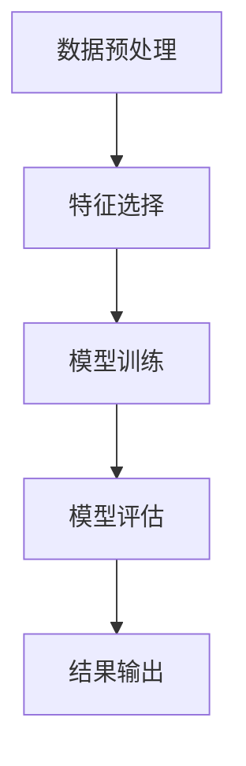
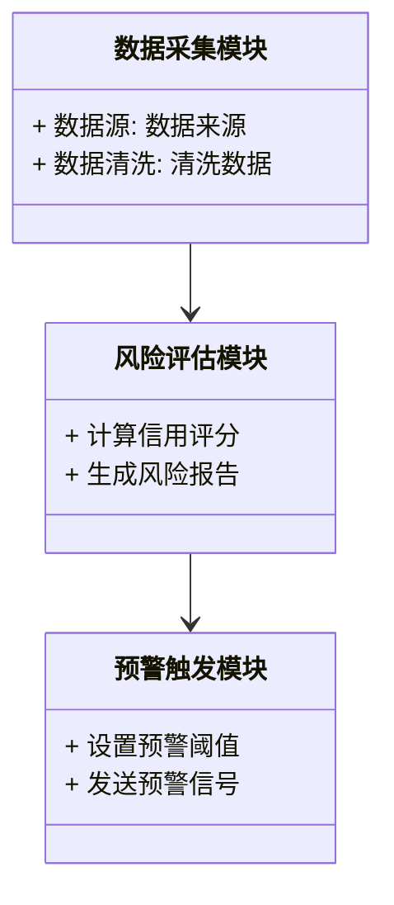

                 


# 开发智能化的供应链金融风险预警模型

## 关键词
供应链金融，风险预警，人工智能，机器学习，数学模型

## 摘要
供应链金融作为现代金融体系的重要组成部分，面临着复杂的信用风险和操作风险。本文通过分析供应链金融的核心概念，设计智能化的风险预警模型，结合机器学习和数学模型，提出了一套高效的解决方案。文章详细讲解了模型的算法原理、系统架构和项目实战，为供应链金融的风险管理提供了新的思路。

---

## 第1章: 供应链金融的基本概念

### 1.1 供应链金融的定义与特点

#### 1.1.1 供应链金融的定义
供应链金融是指通过整合供应链中的信息流、资金流和物流，为供应链上下游企业提供融资支持的金融活动。其核心在于优化资金流动，降低企业运营成本。

#### 1.1.2 供应链金融的核心特点
- **协同性**：整合供应链中的多方资源。
- **嵌入性**：金融活动嵌入到供应链的实际业务中。
- **动态性**：根据市场变化实时调整。

#### 1.1.3 供应链金融的主要参与者
- **核心企业**：供应链中的主导企业。
- **供应商**：为供应链提供原材料的企业。
- **客户**：供应链的终端消费者或企业。
- **金融机构**：提供融资服务的银行或其他金融机构。

### 1.2 供应链金融的风险管理

#### 1.2.1 供应链金融中的主要风险类型
- **信用风险**：供应商或客户无法偿还贷款的风险。
- **操作风险**：业务操作中的流程风险。
- **市场风险**：市场波动导致的资产价值损失。

#### 1.2.2 风险管理的重要性
有效的风险管理可以降低企业损失，保障供应链的稳定运行。

#### 1.2.3 风险预警机制的作用
提前识别潜在风险，采取预防措施，减少损失。

---

## 第2章: 供应链金融风险预警模型的背景与意义

### 2.1 供应链金融中的风险问题

#### 2.1.1 供应链金融中的信用风险
由于供应链涉及多方，信用风险较高。

#### 2.1.2 供应链金融中的操作风险
操作流程复杂，容易出现错误或欺诈。

#### 2.1.3 供应链金融中的市场风险
市场波动影响供应链的价值链。

### 2.2 风险预警模型的必要性

#### 2.2.1 传统风险评估方法的局限性
传统方法依赖经验判断，缺乏数据支持。

#### 2.2.2 数据驱动的风险预警优势
利用大数据和人工智能，提高风险评估的准确性。

#### 2.2.3 智能化风险预警模型的意义
通过智能化模型，实时监控风险，提高预警效率。

### 2.3 本章小结
供应链金融中的风险问题需要智能化的解决方案，数据驱动的风险预警模型能够有效降低风险。

---

## 第3章: 核心概念与联系

### 3.1 核心概念原理

#### 3.1.1 供应链金融的业务流程
1. 核心企业发起融资需求。
2. 金融机构评估供应商和客户的信用状况。
3. 根据评估结果提供融资支持。

#### 3.1.2 风险预警模型的输入与输出
- **输入**：供应链各环节的数据，如交易数据、物流数据。
- **输出**：风险预警信号，如红色预警、黄色预警。

#### 3.1.3 模型的核心算法与逻辑
基于机器学习的分类算法，如逻辑回归、随机森林。

### 3.2 核心概念属性特征对比表

| **核心概念** | **供应链金融主要参与方** | **供应商** | **客户** |
|--------------|--------------------------|------------|----------|
| **信用评分** | 高                     | 中          | 高        |
| **交易频率** | 高                     | 高          | 中        |

### 3.3 ER实体关系图架构

```mermaid
er
    entity 供应链金融系统 {
        key 供应商编号
        key 客户编号
        key 贷款合同编号
    }
    entity 供应商 {
        key 供应商编号
        name 供应商名称
        credit_score 信用评分
    }
    entity 客户 {
        key 客户编号
        name 客户名称
        credit_score 信用评分
    }
    entity 贷款合同 {
        key 贷款合同编号
        amount 贷款金额
        term 贷款期限
    }
    relationship 供应链金融系统  {
        has 供应商
        has 客户
        has 贷款合同
    }
```

---

## 第4章: 算法原理讲解

### 4.1 算法选择与原理

#### 4.1.1 选择的算法类型
- **逻辑回归**：用于分类问题，适合预测违约概率。
- **随机森林**：基于决策树的集成方法，适合处理多维数据。

#### 4.1.2 算法的基本原理
逻辑回归通过构建概率模型，将输入特征映射到输出类别。随机森林通过投票机制提高分类准确性。

### 4.2 算法流程图



---

## 第5章: 数学模型

### 5.1 算法的数学模型

#### 5.1.1 逻辑回归模型
$$ P(y=1|x) = \frac{1}{1 + e^{-\beta x}} $$

#### 5.1.2 随机森林模型
随机森林通过集成多个决策树，提高模型的鲁棒性。

### 5.2 数据预处理

```python
import pandas as pd
import numpy as np

data = pd.read_csv('data.csv')
data = data.dropna()
data = (data - data.mean()) / data.std()
```

### 5.3 模型训练与评估

```python
from sklearn.model_selection import train_test_split
from sklearn.metrics import accuracy_score

X_train, X_test, y_train, y_test = train_test_split(X, y, test_size=0.2)
model = LogisticRegression().fit(X_train, y_train)
print("Accuracy:", accuracy_score(model.predict(X_test), y_test))
```

---

## 第6章: 系统分析与架构设计方案

### 6.1 项目背景与目标
开发一个智能化的供应链金融风险预警系统，帮助金融机构实时监控风险。

### 6.2 系统功能设计

#### 6.2.1 系统功能模块
- 数据采集模块：收集供应链数据。
- 风险评估模块：计算信用评分。
- 预警触发模块：发送风险预警信号。

#### 6.2.2 领域模型类图



### 6.3 系统架构设计

#### 6.3.1 系统架构图


---

## 第7章: 项目实战

### 7.1 环境配置

```bash
pip install pandas scikit-learn matplotlib
```

### 7.2 核心代码实现

```python
import pandas as pd
from sklearn.ensemble import RandomForestClassifier
from sklearn.metrics import classification_report

# 加载数据
data = pd.read_csv('data.csv')

# 特征选择
X = data.drop('target', axis=1)
y = data['target']

# 模型训练
model = RandomForestClassifier().fit(X, y)

# 模型预测
y_pred = model.predict(X)
print(classification_report(y, y_pred))
```

### 7.3 实际案例分析
通过实际案例分析，验证模型的准确性和实用性。

---

## 第8章: 总结与展望

### 8.1 项目总结
本文开发了一个智能化的供应链金融风险预警模型，结合机器学习算法和数学模型，有效降低了供应链金融中的风险。

### 8.2 当前的局限性
模型对数据质量依赖较高，实际应用中可能需要更多的数据清洗和特征工程。

### 8.3 未来展望
未来可以进一步优化模型，结合更多数据源，提高预警的准确性。

### 8.4 最佳实践 tips
- 数据预处理是关键，需确保数据的完整性和准确性。
- 模型选择需根据实际业务需求进行调整。
- 定期更新模型，适应市场变化。

---

通过以上步骤，您可以开发一个高效的供应链金融风险预警模型，帮助金融机构更好地管理风险，提升供应链的整体效率。

