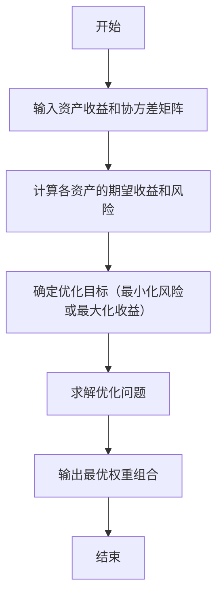
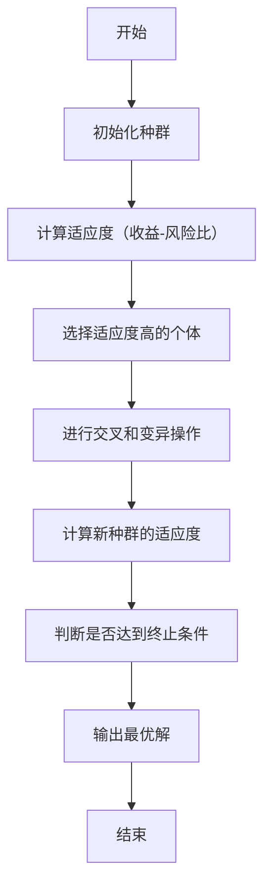
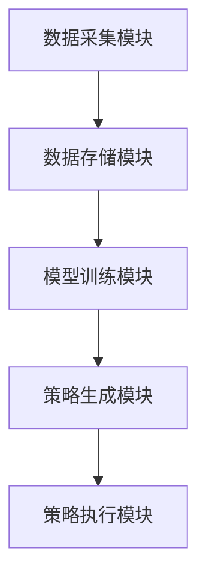

                 


# 《开发智能化的资产配置优化模型》

## 关键词：资产配置优化、投资组合管理、风险管理、智能化模型、数学建模

## 摘要：  
资产配置优化是投资组合管理中的核心问题，其目标是在给定的约束条件下，通过优化算法最大化投资收益或最小化投资风险。本文从资产配置优化模型的背景与核心概念出发，详细分析了其算法原理、系统架构设计、项目实战案例以及最佳实践。通过理论与实践相结合的方式，帮助读者理解如何开发智能化的资产配置优化模型，并掌握其实现方法。

---

## 第一部分: 资产配置优化模型的背景与核心概念

### 第1章: 资产配置优化模型的背景与问题描述

#### 1.1 什么是资产配置优化
资产配置优化是指在投资组合中合理分配资金到不同资产类别（如股票、债券、基金等）的过程，以实现投资目标（如收益最大化、风险最小化）。  
资产配置优化的核心目标包括：  
- **收益最大化**：在风险可控的前提下，实现投资收益的最大化。  
- **风险最小化**：通过分散投资降低组合的整体风险。  
- **目标导向**：根据投资者的财务目标（如 retirement planning、财富增值等）进行动态调整。  

#### 1.2 资产配置优化的必要性
传统资产配置方法依赖于人工经验，存在以下问题：  
1. **主观性过强**：依赖投资经理的个人经验和判断，可能导致决策偏差。  
2. **计算复杂性**：随着资产种类的增加，手动计算最优配置的复杂性指数级上升。  
3. **动态调整困难**：市场环境变化快，人工调整效率低下。  

智能化资产配置优化通过引入数学建模和算法优化，能够解决上述问题，实现快速、准确的配置决策。

#### 1.3 资产配置优化的边界与外延
资产配置优化的边界包括：  
- **优化范围**：仅考虑资产分配问题，不涉及资产本身的交易策略。  
- **约束条件**：如资金总量、风险承受能力、流动性要求等。  
- **时间范围**：通常为中长期规划。  

外延包括：  
- **风险管理**：通过优化配置降低组合风险。  
- **动态调整**：根据市场变化自动优化配置比例。  
- **组合监控**：实时跟踪配置效果并进行调整。

---

## 第二部分: 资产配置优化模型的核心概念与联系

### 第2章: 资产配置优化模型的核心概念

#### 2.1 资产配置优化模型的原理
资产配置优化模型基于以下原理：  
1. **数学建模**：通过数学公式描述资产收益、风险和配置比例之间的关系。  
2. **优化算法**：利用优化算法（如线性规划、遗传算法等）求解最优配置方案。  
3. **数据驱动**：依赖历史数据和市场预测数据进行计算。

#### 2.2 资产配置优化模型的类型
常见的资产配置优化模型包括：  
1. **均值-方差模型**：由 Harry Markowitz 提出，以均值（收益）和方差（风险）为核心，求解最优组合。  
2. **风险中性模型**：在中性风险条件下，最大化收益或最小化成本。  
3. **约束优化模型**：根据特定约束（如流动性、税收等）进行优化。

#### 2.3 资产配置优化模型的数学基础
- **投资组合收益**：$$\text{收益} = \sum_{i=1}^{n} w_i \times r_i$$  
  其中，\(w_i\) 是第 \(i\) 种资产的权重，\(r_i\) 是其收益。  
- **投资组合风险**：$$\text{风险} = \sqrt{\sum_{i=1}^{n} \sum_{j=1}^{n} w_i w_j \sigma_{i,j}}$$  
  其中，\(\sigma_{i,j}\) 是资产 \(i\) 和 \(j\) 的协方差。  
- **优化目标**：最大化收益或最小化风险。  
  $$\max \text{收益}, \quad \text{或} \quad \min \text{风险}$$  

#### 2.4 资产配置优化模型的实体关系图
以下是资产配置优化模型的 ER 图：

```
+----------------+      +----------------+      +----------------+
|                |      |                |      |                |
|    资产         |------|    风险         |------|    收益         |
|                |      |                |      |                |
+----------------+      +----------------+      +----------------+
```

---

## 第三部分: 资产配置优化模型的算法原理

### 第3章: 资产配置优化模型的算法原理

#### 3.1 均值-方差模型的算法实现
均值-方差模型的核心步骤如下：  
1. 计算各资产的期望收益和协方差矩阵。  
2. 利用优化算法求解最优权重组合，使得风险最小化或收益最大化。  

以下是均值-方差模型的优化流程图：



#### 3.2 遗传算法的实现
遗传算法是一种模拟生物进化过程的优化算法，适用于复杂非线性问题。以下是遗传算法的优化流程图：



以下是遗传算法的 Python 实现代码示例：

```python
import numpy as np

def fitness_func(weights, returns, risks):
    portfolio_return = np.sum(weights * returns)
    portfolio_risk = np.sqrt(np.dot(weights, np.dot(returns.cov(), weights.T)))
    return -portfolio_risk  # 最小化风险

def genetic_algorithm(asset_returns, asset_risks, population_size=100, generations=100):
    import random
    # 初始化种群
    population = [np.random.dirichlet([1]*len(asset_returns)) for _ in range(population_size)]
    
    for _ in range(generations):
        # 计算适应度
        fitness = [fitness_func(weights, asset_returns, asset_risks) for weights in population]
        
        # 选择适应度高的个体
        selected = [pop for pop, fit in zip(population, fitness) if fit < 0]
        
        # 交叉和变异
        new_population = []
        for _ in range(len(selected)):
            parent1 = random.choice(selected)
            parent2 = random.choice(selected)
            child = []
            for i in range(len(parent1)):
                if random.random() < 0.5:
                    child.append(parent1[i])
                else:
                    child.append(parent2[i])
            new_population.append(child)
        
        population = new_population
    
    # 输出最优解
    best_weights = max(population, key=lambda x: fitness_func(x, asset_returns, asset_risks))
    return best_weights
```

---

## 第四部分: 资产配置优化模型的系统架构设计

### 第4章: 资产配置优化系统的架构设计

#### 4.1 系统功能设计
- **数据采集**：从数据源获取资产的历史收益和风险数据。  
- **模型训练**：基于数据训练资产配置优化模型。  
- **策略生成**：根据模型输出生成投资策略。  
- **策略执行**：将策略应用于实际投资组合。  

#### 4.2 系统架构设计
以下是资产配置优化系统的架构图：



---

## 第五部分: 资产配置优化模型的项目实战

### 第5章: 资产配置优化模型的实战案例

#### 5.1 环境安装
- 安装 Python 和相关库（如 NumPy、Pandas、Scipy）。  
  ```bash
  pip install numpy pandas scipy
  ```

#### 5.2 核心代码实现
以下是均值-方差模型的 Python 实现：

```python
import numpy as np
from scipy.optimize import minimize

def portfoliooptimize(returns, cov_matrix, method='minvar'):
    n = len(returns)
    if n == 0:
        return None
    
    # 定义目标函数
    def objective(weights):
        return np.dot(weights.T, np.dot(cov_matrix, weights))
    
    # 约束条件
    constraints = [{'type': 'eq', 'fun': lambda w: np.sum(w) - 1}]
    
    # 初始权重
    init_weights = np.array([1.0/n]*n)
    
    # 优化
    result = minimize(objective, init_weights, constraints=constraints)
    
    return result.x

# 示例数据
returns = np.array([0.1, 0.05, 0.08])
cov_matrix = np.array([
    [0.04, 0.005, 0.01],
    [0.005, 0.02, 0.004],
    [0.01, 0.004, 0.03]
])

optimal_weights = portfoliooptimize(returns, cov_matrix)
print("最优权重:", optimal_weights)
```

---

## 第六部分: 资产配置优化模型的最佳实践

### 第6章: 最佳实践与小结

#### 6.1 最佳实践
1. **数据质量**：确保数据的完整性和准确性。  
2. **模型调优**：根据实际需求调整优化目标和约束条件。  
3. **风险控制**：在优化过程中始终关注风险控制。  

#### 6.2 小结
通过本文的详细讲解，读者可以掌握资产配置优化模型的核心概念、算法原理和系统架构设计。结合实际项目案例，进一步加深对模型的理解和应用能力。  

---

## 参考资料
1. Markowitz, H. (1952). Portfolio Selection. Journal of Finance.  
2. 国内外相关学术论文和开源项目。  

--- 

以上是《开发智能化的资产配置优化模型》的完整目录和内容概要，希望对您有所帮助！

