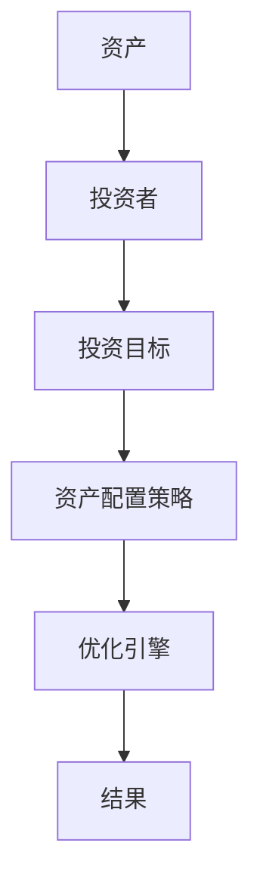
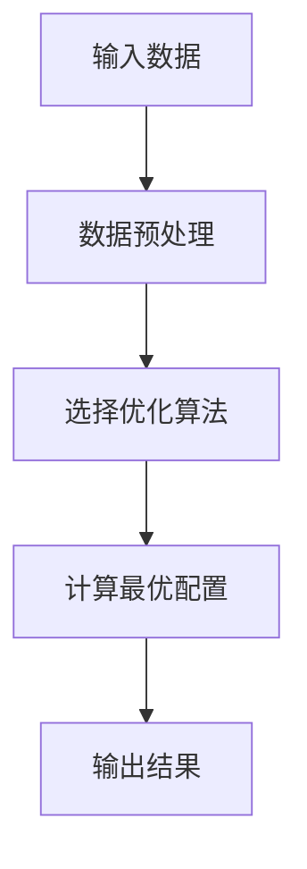
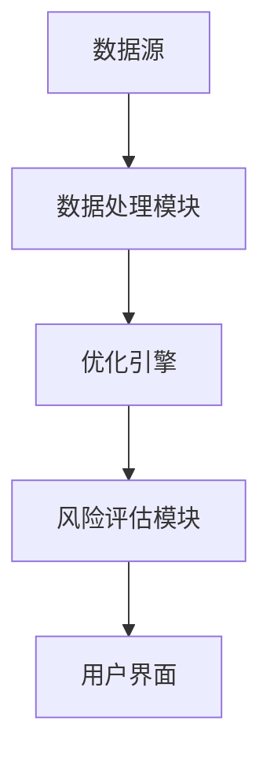
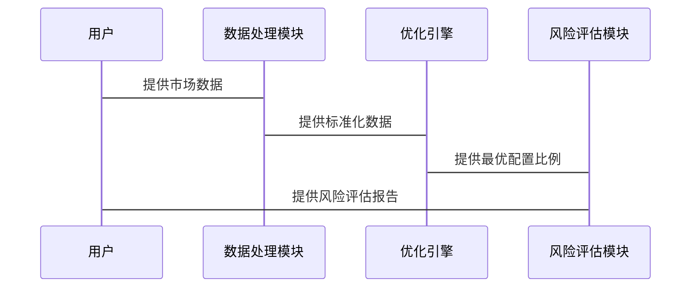

                 


# 开发智能化的资产配置策略优化引擎

> 关键词：资产配置，策略优化，投资组合，风险管理，人工智能，量化交易

> 摘要：本文详细探讨了如何开发智能化的资产配置策略优化引擎。通过结合现代投资组合理论与人工智能技术，提出了一个高效、灵活的优化框架，帮助投资者实现风险可控、收益最大化的资产配置。文章从背景介绍、核心概念、算法原理、系统架构、项目实战到最佳实践，全面解析了开发智能化资产配置策略优化引擎的各个环节。

---

# 第一部分: 资产配置策略优化引擎的背景与核心概念

## 第1章: 资产配置策略优化引擎的背景介绍

### 1.1 问题背景与问题描述

#### 1.1.1 资产配置的定义与重要性
资产配置是指将资金分配到不同资产类别（如股票、债券、房地产等）中，以实现投资目标的过程。合理的资产配置可以帮助投资者在不同市场环境下分散风险，平衡收益与风险。

#### 1.1.2 传统资产配置方法的局限性
传统资产配置方法通常基于固定的比例或简单的规则，难以适应市场的动态变化。例如，基于历史平均回报率的静态配置方法在市场波动剧烈时可能失效。

#### 1.1.3 智能化资产配置的需求与趋势
随着市场环境的复杂化，投资者对动态、智能化的资产配置需求日益增长。通过引入人工智能和大数据技术，可以实时优化资产配置，提高投资效率。

### 1.2 资产配置策略优化引擎的目标与意义

#### 1.2.1 引擎的目标功能
- 实时优化资产配置比例，适应市场变化。
- 提供多种风险-收益优化模型，满足不同投资者需求。
- 自动生成最优的投资组合，并动态调整。

#### 1.2.2 引擎在投资管理中的价值
- 提高投资效率，降低人为错误。
- 实现个性化投资策略，满足不同客户的需求。
- 通过数据驱动的方法，提高决策的科学性。

#### 1.2.3 引擎对金融机构的潜在影响
- 提升投资组合的绩效，增强客户满意度。
- 降低投资成本，提高运营效率。
- 通过智能化的配置策略，增强市场竞争力。

### 1.3 资产配置策略优化引擎的边界与外延

#### 1.3.1 引擎的功能边界
- 输入：市场数据、投资者风险偏好、投资目标。
- 输出：最优资产配置比例、风险评估报告。
- 边界：不涉及具体的交易执行，仅提供配置建议。

#### 1.3.2 引擎的外延功能
- 数据收集与预处理。
- 风险管理与预警。
- 用户界面设计与交互。

#### 1.3.3 引擎与其他系统的交互关系
- 与数据源（如金融市场数据）的交互。
- 与投资管理系统（如订单管理系统）的集成。

### 1.4 资产配置策略优化引擎的核心要素组成

#### 1.4.1 数据输入与处理模块
- 数据来源：历史价格、市场指标、宏观经济数据。
- 数据预处理：清洗、标准化、特征提取。

#### 1.4.2 策略生成与优化模块
- 优化模型：基于MPT的数学模型。
- 策略生成：根据优化结果生成资产配置建议。

#### 1.4.3 风险评估与控制模块
- 风险评估：计算投资组合的VaR、CVaR等风险指标。
- 风险控制：动态调整配置比例，确保风险可控。

## 第2章: 资产配置策略优化引擎的核心概念与联系

### 2.1 核心概念原理

#### 2.1.1 现代投资组合理论（MPT）
MPT由Harry Markowitz提出，旨在通过优化投资组合的收益-风险比率来最大化收益。

#### 2.1.2 风险-收益优化模型
通过数学模型，找到最优的资产配置比例，使投资组合在给定风险下收益最大化，或在给定收益下风险最小化。

#### 2.1.3 动态资产配置策略
根据市场变化实时调整资产配置比例，以适应不同的市场环境。

### 2.2 核心概念属性特征对比表格

| 概念 | 属性 | 特征 |
|------|------|------|
| 现代投资组合理论 | 输入 | 资产回报率、协方差矩阵 |
| 风险-收益优化模型 | 输出 | 最优资产配置比例 |
| 动态资产配置策略 | 实现方式 | 基于市场变化的实时调整 |

### 2.3 ER实体关系图架构（Mermaid流程图）



---

# 第二部分: 资产配置策略优化引擎的算法原理

## 第3章: 资产配置策略优化引擎的算法原理

### 3.1 算法原理概述

#### 3.1.1 基于MPT的优化算法
MPT通过优化数学模型，找到最优的资产配置比例。数学模型如下：

$$ \text{目标函数：} \quad \min \sum_{i=1}^{n} \sum_{j=1}^{n} w_i w_j \sigma_{ij} $$
$$ \text{约束条件：} \quad \sum_{i=1}^{n} w_i = 1, \quad w_i \geq 0 $$

其中，\( w_i \) 是资产 \( i \) 的权重，\( \sigma_{ij} \) 是资产 \( i \) 和 \( j \) 的协方差。

#### 3.1.2 基于遗传算法的优化策略
遗传算法通过模拟自然选择的过程，逐步优化资产配置比例。算法步骤如下：

1. 初始化：生成随机的权重组合。
2. 适应度评估：计算每个组合的收益-风险比率。
3. 选择：保留高适应度的组合。
4. 交叉：生成新的组合。
5. 变异：随机调整部分权重。
6. 重复：直到找到最优解。

#### 3.1.3 基于机器学习的预测模型
利用机器学习模型预测市场走势，动态调整资产配置比例。例如，使用LSTM网络预测股票价格。

### 3.2 算法流程图（Mermaid流程图）



### 3.3 算法实现的数学模型和公式

#### 3.3.1 均值-方差模型
目标是最小化投资组合的方差，同时满足收益目标。数学表达式如下：

$$ \min \sum_{i=1}^{n} \sum_{j=1}^{n} w_i w_j \sigma_{ij} $$
$$ \text{subject to} \quad \sum_{i=1}^{n} w_i r_i = T \quad \text{和} \quad \sum_{i=1}^{n} w_i = 1 $$

其中，\( r_i \) 是资产 \( i \) 的预期收益，\( T \) 是目标收益。

#### 3.3.2 遗传算法步骤
1. 初始化种群：随机生成一组权重组合。
2. 计算适应度：计算每个组合的收益-风险比率。
3. 选择：保留适应度高的组合。
4. 交叉：生成新的组合。
5. 变异：随机调整部分权重。
6. 重复：直到收敛到最优解。

### 3.4 算法实现的代码示例

```python
import numpy as np
from scipy.optimize import minimize

# 示例数据：资产收益和协方差矩阵
returns = np.array([0.1, 0.05, 0.08])
cov_matrix = np.array([[0.02, 0.01, 0.015],
                        [0.01, 0.03, 0.02],
                        [0.015, 0.02, 0.03]])

# 定义优化目标函数
def objective(w):
    return np.dot(np.dot(w, cov_matrix), w.T)

# 约束条件
constraints = [{'type': 'eq', 'fun': lambda w: sum(w) - 1},
              {'type': 'eq', 'fun': lambda w: np.dot(w, returns) - target_return}]

# 初始猜测
initial_guess = np.array([1/3, 1/3, 1/3])

# 调用优化器
result = minimize(objective, initial_guess, constraints=constraints)

# 最优解
optimal_weights = result.x
```

### 3.5 算法的优缺点分析

#### 3.5.1 优点
- 精确性：数学优化模型能够找到理论最优解。
- 灵活性：支持多种目标函数和约束条件。

#### 3.5.2 缺点
- 计算复杂性：大规模数据和资产时计算成本高。
- 市场假设的局限性：假设资产收益和协方差是稳定的。

---

# 第三部分: 资产配置策略优化引擎的系统架构

## 第4章: 资产配置策略优化引擎的系统架构设计

### 4.1 系统功能模块设计

#### 4.1.1 数据输入与处理模块
- 功能：接收市场数据、投资者信息，进行数据清洗和特征提取。
- 输入：金融市场数据、投资者风险偏好。
- 输出：标准化数据集。

#### 4.1.2 策略生成与优化模块
- 功能：根据输入数据，生成和优化资产配置策略。
- 输入：标准化数据集、优化目标。
- 输出：最优资产配置比例。

#### 4.1.3 风险评估与控制模块
- 功能：评估投资组合的风险，动态调整配置比例。
- 输入：最优配置比例、市场变化数据。
- 输出：风险评估报告、调整后的配置建议。

### 4.2 系统架构设计

#### 4.2.1 系统架构图（Mermaid架构图）



#### 4.2.2 系统接口设计
- 数据接口：与数据源对接，获取实时市场数据。
- 优化接口：接收优化目标，返回最优配置比例。
- 风险接口：接收市场变化，返回风险评估结果。

#### 4.2.3 系统交互流程图（Mermaid序列图）



### 4.3 系统实现的代码框架

```python
class AssetAllocationEngine:
    def __init__(self, data_source, risk_manager):
        self.data_source = data_source
        self.risk_manager = risk_manager

    def optimize_portfolio(self, target_return):
        # 获取数据
        data = self.data_source.get_data()
        # 数据处理
        processed_data = self._preprocess(data)
        # 优化算法
        optimal_weights = self._optimize(processed_data, target_return)
        return optimal_weights

    def _preprocess(self, data):
        # 数据清洗和特征提取
        pass

    def _optimize(self, data, target_return):
        # 使用优化算法生成最优权重
        pass

    def assess_risk(self, weights):
        # 风险评估
        return self.risk_manager.evaluate(weights)
```

---

# 第四部分: 资产配置策略优化引擎的项目实战

## 第5章: 资产配置策略优化引擎的项目实战

### 5.1 环境安装与配置

#### 5.1.1 安装依赖
- Python 3.8+
- numpy、pandas、scipy、scikit-learn
- matplotlib、seaborn

#### 5.1.2 安装命令
```bash
pip install numpy pandas scipy scikit-learn matplotlib seaborn
```

### 5.2 核心代码实现

#### 5.2.1 数据处理模块

```python
import pandas as pd
import numpy as np

class DataSource:
    def get_data(self):
        # 示例数据
        return pd.DataFrame({
            '资产1': [0.1, 0.05, 0.08],
            '资产2': [0.05, 0.06, 0.07],
            '资产3': [0.08, 0.07, 0.09]
        })

class DataPreprocessor:
    def preprocess(self, data):
        # 示例预处理：计算协方差矩阵
        return data.cov()
```

#### 5.2.2 优化引擎实现

```python
from scipy.optimize import minimize

class OptimizationEngine:
    def __init__(self):
        pass

    def optimize(self, cov_matrix, target_return):
        n = len(cov_matrix)
        initial_guess = np.array([1/n]*n)
        result = minimize(
            lambda w: np.dot(w, np.dot(cov_matrix, w)),
            initial_guess,
            constraints=[
                {'type': 'eq', 'fun': lambda w: sum(w) - 1},
                {'type': 'eq', 'fun': lambda w: np.dot(w, target_return) - target_return}
            ]
        )
        return result.x
```

#### 5.2.3 风险评估模块

```python
import numpy as np

class RiskManager:
    def evaluate(self, weights, returns):
        # 示例风险评估：计算VaR
        portfolio_variance = np.dot(weights, np.dot(weights, returns.cov()))
        return np.sqrt(portfolio_variance)
```

### 5.3 案例分析与实现

#### 5.3.1 数据准备

```python
data_source = DataSource()
data = data_source.get_data()
preprocessor = DataPreprocessor()
cov_matrix = preprocessor.preprocess(data)
```

#### 5.3.2 优化过程

```python
engine = OptimizationEngine()
target_return = np.array([0.1, 0.05, 0.08])  # 示例目标收益
weights = engine.optimize(cov_matrix, target_return)
```

#### 5.3.3 风险评估

```python
risk_manager = RiskManager()
risk = risk_manager.evaluate(weights, data)
print(f"投资组合的风险值为：{risk}")
```

### 5.4 优化结果展示与分析

#### 5.4.1 结果展示
- 最优资产配置比例：示例中计算得到的权重。
- 投资组合的风险值：通过风险评估模块计算得到。

#### 5.4.2 结果分析
- 验证优化结果是否满足目标收益和风险约束。
- 比较不同优化算法的性能和效果。

### 5.5 项目总结

#### 5.5.1 实战小结
- 通过代码实现，验证了优化算法的有效性。
- 学习了系统架构设计和模块化编程的重要性。

#### 5.5.2 经验总结
- 数据预处理是优化过程的关键。
- 选择合适的优化算法能显著提高效率。
- 风险管理模块是确保系统稳健运行的核心。

---

# 第五部分: 资产配置策略优化引擎的最佳实践与总结

## 第6章: 资产配置策略优化引擎的最佳实践

### 6.1 最佳实践 tips

#### 6.1.1 数据处理
- 确保数据的准确性和完整性。
- 采用滑动窗口方法处理实时数据。

#### 6.1.2 算法选择
- 根据具体情况选择合适的优化算法。
- 结合机器学习模型提高预测准确性。

#### 6.1.3 系统架构
- 采用微服务架构提高系统的可扩展性。
- 使用容器化技术方便部署和管理。

### 6.2 注意事项

#### 6.2.1 数据质量
- 数据偏差可能会影响优化结果。
- 需要定期更新和校正数据。

#### 6.2.2 算法局限性
- 市场模型的假设可能不成立。
- 需要结合实际情况进行调整。

#### 6.2.3 系统维护
- 定期更新模型参数。
- 监控系统性能和运行状态。

### 6.3 拓展阅读

#### 6.3.1 推荐书籍
- 《投资学》（原书第11版）—— 作者：埃里克·J.·巴蒂亚
- 《机器学习实战》—— 作者：Aurélien Géron

#### 6.3.2 推荐技术博客
- Towards Data Science
- QuantInst International
- Python官方文档

## 第7章: 总结

### 7.1 本文总结
本文详细探讨了开发智能化资产配置策略优化引擎的各个方面，从背景介绍到系统架构设计，再到项目实战和最佳实践，为读者提供了全面的指导。

### 7.2 未来展望
随着人工智能和大数据技术的不断发展，资产配置策略优化引擎将更加智能化和个性化，为投资者提供更高效、更精准的服务。

### 7.3 致谢
感谢读者的耐心阅读，感谢同行们的宝贵建议。

---

# 结语

通过本文的详细讲解，相信读者能够全面理解资产配置策略优化引擎的开发过程，并能够实际操作和应用。希望本文对您的投资管理和技术开发有所帮助，祝您在智能化资产配置领域取得成功！

