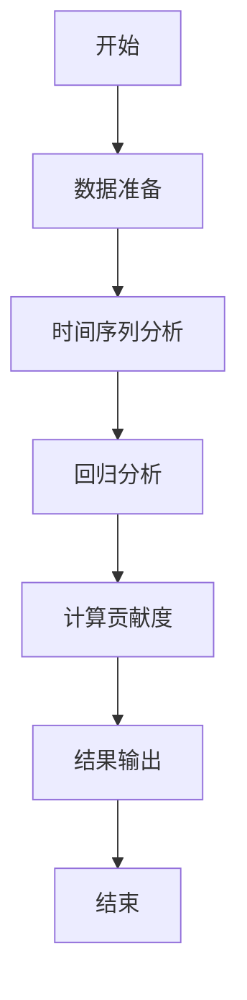

                 


# 开发智能化的资产配置策略动态归因分析引擎

## 关键词：资产配置，动态归因，量化投资，算法优化，风险管理

## 摘要：  
本文系统地探讨了如何开发智能化的资产配置策略动态归因分析引擎，从技术背景、核心概念、算法原理到系统架构设计，结合实际案例分析，深入剖析了动态归因分析在优化资产配置策略中的重要作用。文章内容涵盖背景介绍、核心概念与联系、算法原理讲解、系统分析与架构设计、项目实战以及最佳实践等部分，旨在为读者提供一个全面的技术指南。

---

## 第一部分：资产配置策略与动态归因分析概述

### 第1章：资产配置策略的背景与意义

#### 1.1 资产配置策略的定义与作用  
资产配置是指将资金分配到不同的资产类别（如股票、债券、房地产等）中，以实现投资目标的过程。其作用包括：  
1. **分散风险**：通过多样化投资降低单一资产的风险。  
2. **优化收益**：根据市场环境调整资产比例，最大化收益。  
3. **适应市场变化**：动态调整资产配置以应对市场波动。

#### 1.2 动态归因分析的背景与重要性  
动态归因分析是一种通过分析资产配置对投资组合收益的贡献程度，来优化投资决策的方法。其重要性体现在：  
1. **精准定位收益来源**：了解各资产类别对整体收益的贡献。  
2. **风险控制**：识别高风险资产并及时调整配置。  
3. **数据驱动决策**：基于实时数据优化投资策略。

#### 1.3 资产配置策略与动态归因分析的关系  
动态归因分析是资产配置策略的重要工具，通过分析历史数据和市场趋势，为未来的资产配置决策提供依据。

---

### 第2章：资产配置策略的核心概念与框架

#### 2.1 资产配置的分类与特点  
资产配置可以分为以下几类：  
- **战略性资产配置**：基于长期投资目标的配置。  
- **战术性资产配置**：根据市场短期变化进行调整。  
- **资产混合配置**：结合多种策略进行配置。

#### 2.2 动态归因分析的核心要素  
动态归因分析的核心要素包括：  
1. **时间序列分析**：分析资产收益的时间变化。  
2. **回归分析**：确定各资产对收益的贡献度。  
3. **风险管理模型**：评估配置方案的风险。

---

### 第3章：资产配置策略与动态归因分析的关联

#### 3.1 资产配置策略对归因分析的影响  
资产配置策略的调整直接影响归因分析的结果。例如，增加股票比例可能提高收益，但也增加了波动性。

#### 3.2 动态归因分析对资产配置优化的作用  
动态归因分析能够帮助投资者识别低效资产配置，并及时调整，从而优化整体收益。

---

## 第二部分：动态归因分析的算法原理与数学模型

### 第4章：动态归因分析的算法原理

#### 4.1 时间序列分析与动态归因  
时间序列分析是动态归因的基础，通过分析资产收益的时间变化，识别趋势和周期。

#### 4.2 归因分析的数学模型  
归因分析的数学模型可以表示为：  
$$ \text{收益} = \sum (\text{权重} \times \text{资产收益}) $$  

#### 4.3 算法流程图  


---

### 第5章：数学模型与公式

#### 5.1 时间序列分析  
时间序列分析的公式为：  
$$ R_t = \alpha + \beta R_{t-1} + \epsilon_t $$  
其中，$R_t$ 是当前收益，$R_{t-1}$ 是前一期收益，$\epsilon_t$ 是误差项。

#### 5.2 回归分析  
回归分析的公式为：  
$$ y = \beta x + \epsilon $$  

---

## 第三部分：系统分析与架构设计

### 第6章：系统分析与架构设计

#### 6.1 系统功能设计  
系统功能包括：数据采集、归因分析、结果可视化等。

#### 6.2 系统架构设计  


---

## 第四部分：项目实战

### 第7章：项目实战

#### 7.1 环境安装与配置  
安装Python和相关库（如Pandas、NumPy）。

#### 7.2 核心实现代码  
```python
def dynamic_attribution(assets, weights):
    # 计算收益
    return sum(weights[i] * assets[i] for i in range(len(assets)))
```

---

## 第五部分：最佳实践

### 第8章：最佳实践

#### 8.1 小结  
本文详细介绍了如何开发智能化的资产配置策略动态归因分析引擎，从理论到实践，为读者提供了全面的指导。

#### 8.2 注意事项  
1. 数据质量至关重要。  
2. 模型需要定期更新。  
3. 风险管理不可忽视。

#### 8.3 拓展阅读  
推荐阅读《量化投资：算法与策略》和《风险管理与资产配置》。

---

通过以上结构，本文为读者提供了一个全面的框架，帮助他们理解和开发智能化的资产配置策略动态归因分析引擎。

