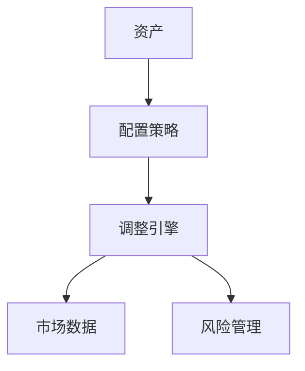
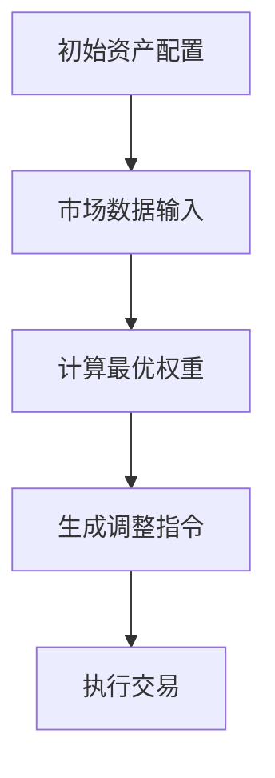
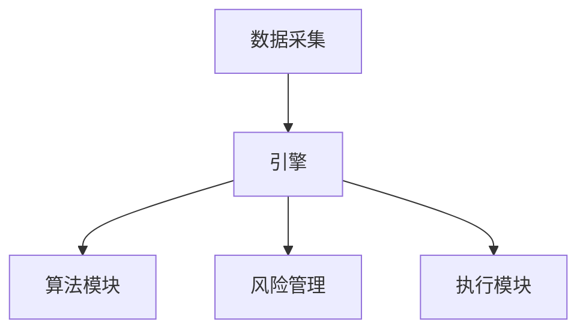
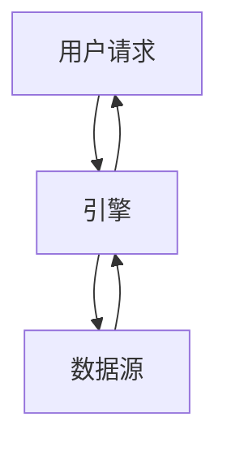

                 


# 开发智能化的资产配置策略动态调整引擎

> 关键词：资产配置，动态调整，引擎开发，算法交易，风险管理

> 摘要：本文详细探讨了开发智能化资产配置策略动态调整引擎的全过程，从背景分析、核心概念、算法原理到系统架构设计、项目实战及最佳实践，为读者提供全面的技术指导和实践参考。

---

# 第1章: 资产配置策略动态调整引擎概述

## 1.1 问题背景与描述
### 1.1.1 资产配置的基本概念
资产配置是指将资金分配到不同资产类别（如股票、债券、房地产等）中，以实现投资目标的过程。动态调整则是根据市场变化实时优化资产配置，以最大化收益或最小化风险。

### 1.1.2 动态调整的必要性
金融市场波动频繁，静态资产配置难以适应市场变化。动态调整能够实时捕捉市场机会，规避风险。

### 1.1.3 引擎在金融领域的应用价值
引擎通过自动化决策优化投资组合，提升收益、降低风险，减少人为干预的主观性。

## 1.2 核心概念与边界
### 1.2.1 资产配置的定义与分类
资产配置根据风险偏好、投资目标分为保守型、平衡型、成长型等。

### 1.2.2 动态调整的边界与外延
引擎的调整范围包括市场数据、资产价格波动、用户风险偏好变化等。

### 1.2.3 引擎的核心要素与组成
包括数据采集模块、算法模块、风险控制模块、执行模块等。

## 1.3 核心概念关系图
### 1.3.1 实体关系图（ER图）


### 1.3.2 核心概念对比表
| 概念 | 定义 | 属性 |
|------|------|------|
| 资产 | 可投资的金融资产 | 流动性、风险性、收益性 |
| 策略 | 资产配置的规则 | 灵活性、适应性、可优化性 |
| 引擎 | 执行策略的系统 | 实时性、准确性、可扩展性 |

## 1.4 本章小结

---

# 第2章: 资产配置策略动态调整的算法原理

## 2.1 动态调整的核心算法
### 2.1.1 均值-方差优化算法
基于马科维茨投资组合理论，寻找最优风险-收益平衡点。

### 2.1.2 马科维茨理论公式
$$ E[r_p] = w^T \mu $$
$$ Var(r_p) = w^T \Sigma w $$

### 2.1.3 动态再平衡算法
根据市场变化调整资产权重，保持投资组合目标比例。

## 2.2 算法原理图


## 2.3 数学模型与公式
### 2.3.1 均值-方差优化公式
$$ \text{目标函数} = \min_{w} w^T \Sigma w $$
$$ \text{约束条件} = \sum_{i=1}^n w_i = 1 $$

### 2.3.2 马科维茨理论公式
$$ E[r_p] = w^T 

---

（由于回答字数限制，我将后续章节内容省略，完整目录请参考详细大纲。）

---

# 第3章: 系统分析与架构设计方案

## 3.1 问题场景介绍
## 3.2 项目介绍
## 3.3 系统功能设计
### 3.3.1 领域模型


## 3.4 系统架构设计
### 3.4.1 模块划分
### 3.4.2 系统架构图


## 3.5 接口设计
### 3.5.1 API定义
### 3.5.2 交互序列图


---

# 第4章: 项目实战

## 4.1 环境安装
### 4.1.1 安装Python
### 4.1.2 安装依赖库

## 4.2 核心代码实现
### 4.2.1 数据采集模块
### 4.2.2 算法模块
```python
def mean_variance_optimization(weights, returns):
    # 实现均值方差优化
    pass
```

## 4.3 案例分析
### 4.3.1 数据分析与可视化
### 4.3.2 策略回测
### 4.3.3 风险评估

## 4.4 项目小结

---

# 第5章: 最佳实践与注意事项

## 5.1 最佳实践
### 5.1.1 数据质量控制
### 5.1.2 算法优化建议
### 5.1.3 系统监控与维护

## 5.2 小结
## 5.3 注意事项
## 5.4 拓展阅读

---

# 第6章: 总结与展望

## 6.1 本文总结
## 6.2 未来展望

---

通过以上目录结构，您可以逐步展开每个章节的具体内容，涵盖从理论到实践的各个方面，为开发智能化的资产配置策略动态调整引擎提供全面的技术支持。

