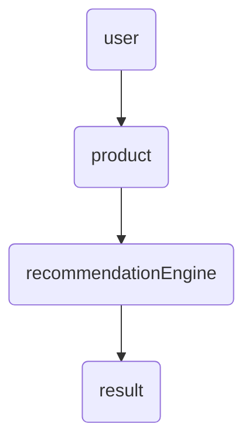
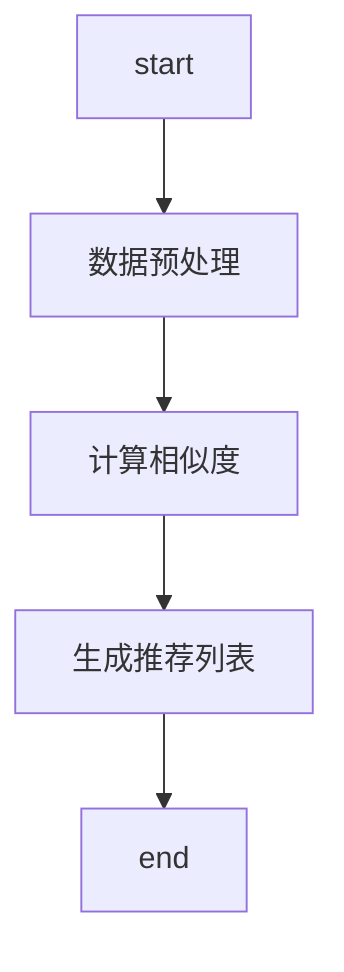
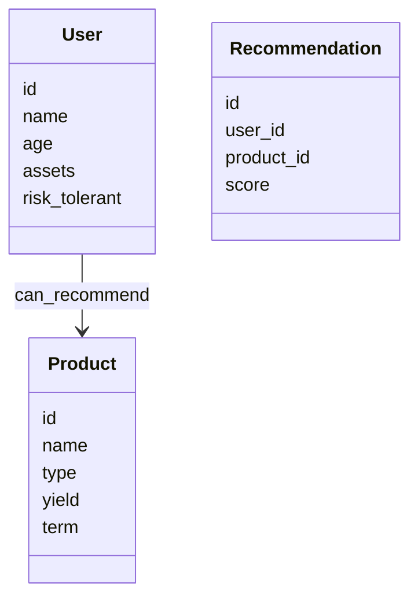
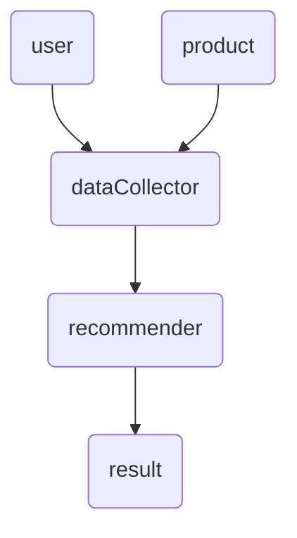
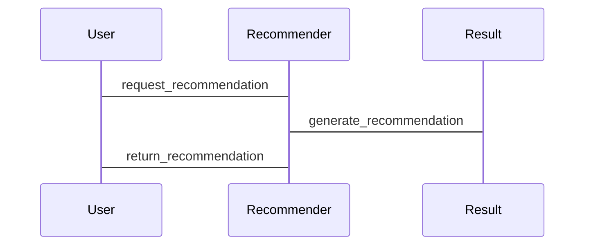

                 


# 开发智能化的金融产品交叉销售推荐引擎

## 关键词：
金融推荐引擎, 交叉销售, 智能推荐系统, 协同过滤算法, 系统架构设计

## 摘要：
本文详细探讨了开发智能化金融产品交叉销售推荐引擎的关键技术与实现方法。通过分析金融行业的交叉销售现状与挑战，提出了基于用户行为分析和产品特征提取的推荐引擎设计方案。文章从协同过滤算法原理、系统架构设计、项目实战实现等多个维度展开，结合具体案例和代码示例，全面阐述了如何构建一个高效、智能的金融推荐系统。

---

# 第一部分: 背景介绍与核心概念

## 第1章: 金融产品交叉销售推荐引擎的背景与问题描述

### 1.1 问题背景
#### 1.1.1 金融行业的交叉销售现状
在金融行业，交叉销售是提高客户满意度和银行收益的重要手段。传统的交叉销售主要依赖人工经验或简单的规则匹配，存在效率低、精准度差的问题。

#### 1.1.2 传统交叉销售的局限性
- 数据孤岛问题：各业务系统数据分散，难以整合。
- 用户需求复杂化：客户需求多样化，难以通过简单规则覆盖。
- 竞争加剧：客户对个性化服务的需求越来越高。

#### 1.1.3 智能化推荐引擎的必要性
智能化推荐引擎通过大数据分析和机器学习算法，能够实时、精准地为用户推荐合适的产品，提升客户满意度和银行收益。

### 1.2 问题描述
#### 1.2.1 交叉销售的核心目标
通过分析用户行为和需求，推荐适合的金融产品，提升客户满意度和银行收益。

#### 1.2.2 用户行为分析与需求挖掘
- 用户画像：分析用户的基本信息、资产状况、投资偏好等。
- 行为特征：分析用户的交易记录、浏览行为、点击行为等。

#### 1.2.3 数据驱动的推荐系统挑战
- 数据质量：数据的完整性和准确性对推荐效果影响重大。
- 算法选择：不同算法在不同场景下的表现差异。
- 系统性能：需要在实时性和准确性之间找到平衡。

### 1.3 问题解决思路
#### 1.3.1 数据分析与特征提取
通过对用户行为数据和产品数据的分析，提取关键特征，为推荐算法提供输入。

#### 1.3.2 智能推荐算法的选择
根据业务需求选择合适的推荐算法，如协同过滤、聚类分析、深度学习等。

#### 1.3.3 系统架构设计与实现
设计高效的系统架构，确保推荐引擎的可扩展性和可维护性。

### 1.4 系统的边界与外延
#### 1.4.1 系统功能边界
推荐引擎仅负责推荐结果生成，不涉及具体的产品销售和客户交互。

#### 1.4.2 与其它系统的交互
推荐引擎需要与用户行为分析系统、产品管理系统等进行数据交互。

#### 1.4.3 系统的可扩展性
系统设计应考虑未来的扩展性，例如新增算法、增加数据源等。

## 第2章: 核心概念与系统架构

### 2.1 核心概念
#### 2.1.1 用户画像与行为分析
- 用户画像：基于用户的基本信息、资产状况、投资偏好等构建用户画像。
- 行为分析：通过分析用户的交易记录、浏览行为、点击行为等，挖掘用户的潜在需求。

#### 2.1.2 金融产品特征提取
- 产品类别：如理财产品、保险产品、基金产品等。
- 产品属性：如收益率、风险等级、期限等。

#### 2.1.3 推荐策略与规则引擎
- 推荐策略：基于用户画像和产品特征，制定推荐规则。
- 规则引擎：通过条件判断和优先级排序，生成最终的推荐结果。

### 2.2 系统架构
#### 2.2.1 数据采集与处理模块
- 数据来源：用户行为数据、产品数据、市场数据等。
- 数据预处理：数据清洗、特征提取、数据标准化等。

#### 2.2.2 推荐算法实现模块
- 协同过滤算法：基于用户相似性或产品相似性进行推荐。
- 聚类分析：将用户或产品进行分组，推荐同类产品。
- 深度学习模型：如神经网络、LSTM等，用于复杂场景下的推荐。

#### 2.2.3 系统管理与监控模块
- 系统监控：监控推荐引擎的运行状态，及时发现和解决问题。
- 性能优化：通过日志分析和性能监控，优化推荐引擎的效率。

### 2.3 实体关系图（ER图）


---

# 第二部分: 算法原理与数学模型

## 第3章: 协同过滤算法

### 3.1 协同过滤原理
#### 3.1.1 基于用户的协同过滤
- 基于用户相似性进行推荐，相似用户的行为具有相似性，推荐用户喜欢的产品。

#### 3.1.2 基于物品的协同过滤
- 基于产品相似性进行推荐，相似产品被推荐给用户。

#### 3.1.3 混合协同过滤
- 综合基于用户和产品的协同过滤，结合两者的优势。

### 3.2 协同过滤的数学模型
#### 3.2.1 相似度计算公式
$$ sim(u_i, u_j) = \frac{\sum_{k} (r_{ik} - \bar{r_i})(r_{jk} - \bar{r_j})}{\sqrt{\sum_{k} (r_{ik} - \bar{r_i})^2} \sqrt{\sum_{k} (r_{jk} - \bar{r_j})^2}}} $$

#### 3.2.2 推荐评分预测公式
$$ \hat{r}_{ui} = \bar{r} + \sum_{j} w_{ij}(r_ji - \bar{r}) $$

### 3.3 协同过滤的实现步骤


---

## 第4章: 系统分析与架构设计方案

### 4.1 问题场景介绍
金融产品的推荐需要考虑用户的风险承受能力、资产状况、投资偏好等多方面因素。

### 4.2 项目介绍
开发一个基于协同过滤算法的金融产品推荐引擎，帮助用户发现适合自己的产品。

### 4.3 系统功能设计
#### 4.3.1 领域模型


#### 4.3.2 系统架构设计


#### 4.3.3 系统接口设计
- 数据接口：提供用户和产品数据的接口。
- 推荐接口：提供推荐结果的接口。

#### 4.3.4 系统交互流程


---

## 第5章: 项目实战

### 5.1 环境安装
- Python 3.8+
- NumPy, Pandas, Scikit-learn

### 5.2 系统核心实现

#### 5.2.1 数据预处理
```python
import pandas as pd
from sklearn.metrics.pairwise import cosine_similarity

# 加载数据
user_data = pd.read_csv('user.csv')
product_data = pd.read_csv('product.csv')

# 数据预处理
user_features = user_data[['age', 'assets', 'risk_tolerant']]
product_features = product_data[['yield', 'term']]
```

#### 5.2.2 模型训练
```python
from sklearn.neighbors import NearestNeighbors

# 训练协同过滤模型
model = NearestNeighbors(metric='cosine', algorithm='brute')
model.fit(product_features)
```

#### 5.2.3 推荐结果展示
```python
def recommend_products(user_id, model, product_features):
    user_features = user_data[user_data['id'] == user_id]
    distances, indices = model.kneighbors(user_features, n_neighbors=5)
    recommendations = product_data.iloc[indices.flatten()]
    return recommendations

recommendations = recommend_products(1, model, product_features)
print(recommendations)
```

### 5.3 实际案例分析
以一个高风险承受能力的用户为例，推荐高收益的理财产品。

### 5.4 项目小结
通过实际案例分析，验证了协同过滤算法在金融产品推荐中的有效性。

---

## 第6章: 最佳实践与未来展望

### 6.1 最佳实践
- 数据质量：确保数据的完整性和准确性。
- 模型调优：通过网格搜索优化模型参数。
- 系统扩展：设计可扩展的系统架构。

### 6.2 小结
智能化的金融产品交叉销售推荐引擎是金融行业的重要工具，通过大数据分析和机器学习算法，能够显著提升客户满意度和银行收益。

### 6.3 注意事项
- 保护用户隐私：确保数据的安全性和隐私性。
- 系统稳定性：确保推荐引擎的稳定运行。

### 6.4 未来展望
- 深度学习的应用：探索深度学习模型在推荐系统中的应用。
- 实时推荐：开发实时推荐系统，提升用户体验。

---

# 结语
开发智能化的金融产品交叉销售推荐引擎是一个复杂的系统工程，需要结合数据分析、算法设计和系统架构等多个方面。通过本文的详细讲解，读者可以掌握推荐引擎的核心技术与实现方法，并在实际项目中灵活应用。

