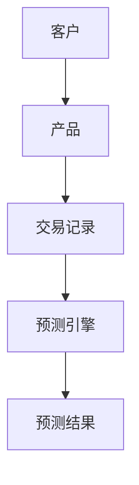
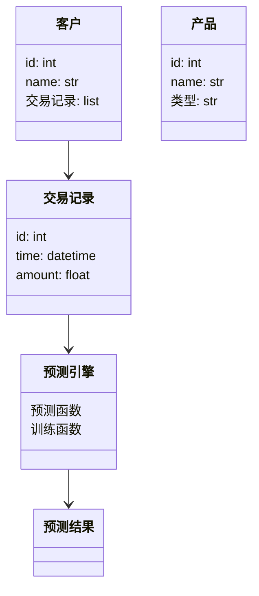
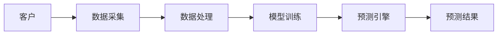
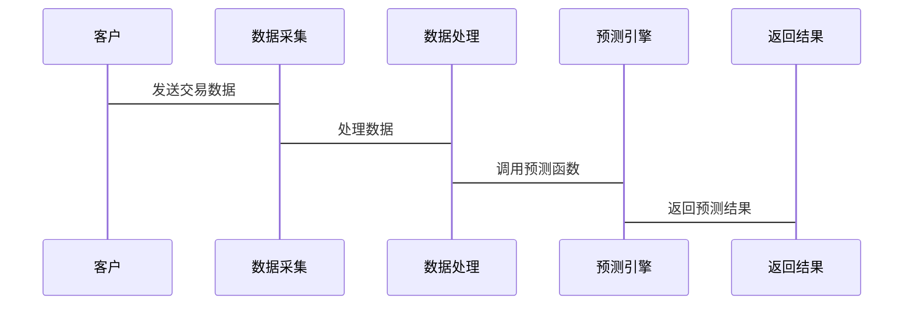

                 


# 开发智能化的金融产品交叉销售时机预测引擎

---

## 关键词：  
金融产品，交叉销售，时机预测，人工智能，机器学习，实时预测，模型优化

---

## 摘要：  
本文详细探讨了开发智能化金融产品交叉销售时机预测引擎的核心方法与技术实现。从问题背景出发，分析了传统交叉销售的局限性，并提出基于机器学习的智能化预测引擎解决方案。文章涵盖了引擎的核心概念、算法原理、系统架构设计以及实际项目实现，结合数学模型和实际案例，深入剖析了引擎的开发与应用过程。通过本文，读者可以全面理解如何利用人工智能技术提升金融产品的交叉销售效率，实现精准预测与实时反馈。

---

# 第1章: 问题背景与描述

## 1.1 问题背景介绍

### 1.1.1 金融产品交叉销售的定义与重要性  
金融产品交叉销售是指在同一客户群体中，销售多种相关金融产品以满足客户的综合需求。在金融行业中，交叉销售不仅能提高客户满意度，还能增加收入来源。然而，传统交叉销售方法依赖人工经验，难以实时优化，存在效率低下的问题。

### 1.1.2 传统交叉销售的局限性  
传统交叉销售方法通常基于历史数据和经验判断，缺乏数据驱动的实时优化能力。例如，银行在推荐贷款产品时，往往仅依赖客户经理的主观判断，导致推荐精准度低，客户体验差。

### 1.1.3 智能化预测引擎的必要性  
随着大数据和人工智能技术的发展，利用机器学习模型实时预测交叉销售时机成为可能。智能化预测引擎可以通过分析客户的实时行为和历史数据，精准判断最佳销售时机，从而提高销售效率和客户满意度。

## 1.2 问题描述与目标

### 1.2.1 交叉销售时机预测的核心问题  
如何利用客户行为数据和市场趋势，预测客户在某一时间点购买某种金融产品的概率。

### 1.2.2 引擎的目标与预期效果  
开发一个实时预测引擎，能够在客户行为发生变化时，快速预测最佳销售时机，并提供个性化推荐。

### 1.2.3 业务场景与实际应用案例  
以银行为例，引擎可以实时分析客户的存款、贷款和投资行为，预测客户购买保险产品的最佳时机，并向客户经理提供推荐信息。

## 1.3 问题解决思路

### 1.3.1 数据驱动的解决方案  
通过收集和分析客户的交易数据、市场数据和行为数据，构建数据驱动的预测模型。

### 1.3.2 机器学习与AI技术的应用  
利用时间序列分析、随机森林和LSTM等算法，构建客户行为预测模型。

### 1.3.3 模型优化与实时反馈机制  
通过实时反馈优化模型参数，确保预测结果的准确性。

## 1.4 问题边界与外延

### 1.4.1 引擎的适用范围  
适用于银行、证券、保险等金融行业，针对中高净值客户群体。

### 1.4.2 与其他金融系统的区别  
与传统推荐系统相比，本引擎更加注重实时预测和动态优化。

### 1.4.3 模型的可扩展性与局限性  
引擎可以扩展到其他金融产品，但需要依赖高质量的数据和实时反馈机制。

## 1.5 核心概念与要素组成

### 1.5.1 数据来源与特征  
客户交易数据、市场数据、行为数据、客户画像。

### 1.5.2 模型训练与部署  
数据预处理、特征工程、模型训练、模型部署。

### 1.5.3 实时预测与反馈机制  
实时数据采集、预测结果输出、实时反馈优化。

---

# 第2章: 核心概念与联系

## 2.1 引擎的核心原理

### 2.1.1 数据预处理与特征提取  
通过清洗数据、归一化处理和特征选择，提取有用的客户行为特征。

### 2.1.2 模型选择与训练  
基于特征选择合适的机器学习模型，并通过训练数据优化模型参数。

### 2.1.3 实时预测与优化  
通过实时数据输入，模型输出预测结果，并根据反馈优化模型。

## 2.2 核心概念属性对比

| 概念       | 描述                                                                 |
|------------|------------------------------------------------------------------|
| 数据来源   | 包括客户交易数据、市场数据和行为数据                              |
| 模型选择   | 选择时间序列分析、随机森林和LSTM等算法                          |
| 反馈机制   | 通过实时反馈优化模型参数，提高预测准确率                        |

## 2.3 ER实体关系图架构



---

# 第3章: 算法原理与实现

## 3.1 时间序列预测模型

### 3.1.1 ARIMA模型原理  
ARIMA（自回归积分滑动平均模型）适用于时间序列预测。模型由自回归部分、积分部分和滑动平均部分组成。

公式：  
$$ ARIMA(p, d, q) $$  
其中，$p$ 是自回归阶数，$d$ 是差分阶数，$q$ 是滑动平均阶数。

### 3.1.2 LSTM模型原理  
LSTM（长短期记忆网络）通过门控机制处理时间序列数据，适合处理长期依赖关系。

模型结构：  
- 输入门控：$$ f_t = \sigma(W_f a_t + U_f h_{t-1} + b_f) $$
- 输出门控：$$ o_t = \sigma(W_o a_t + U_o h_{t-1} + b_o) $$
- 遗忘门控：$$ i_t = \sigma(W_i a_t + U_i h_{t-1} + b_i) $$
- 状态更新：$$ c_t = f_t c_{t-1} + i_t a_t $$
- 输出状态：$$ h_t = o_t \tanh(c_t) $$

### 3.1.3 LSTM实现代码

```python
import keras
from keras.layers import LSTM, Dense
from keras.models import Sequential

model = Sequential()
model.add(LSTM(64, input_shape=(timesteps, features)))
model.add(Dense(1))
model.compile(loss='mean_squared_error', optimizer='adam')
```

---

# 第4章: 系统分析与架构设计

## 4.1 问题场景介绍  
系统需要实时分析客户行为数据，预测最佳销售时机，并提供个性化推荐。

## 4.2 系统功能设计

### 4.2.1 数据采集与处理  
实时采集客户交易数据、市场数据和行为数据，并进行清洗和特征提取。

### 4.2.2 模型训练与部署  
基于训练数据训练机器学习模型，并部署到生产环境。

### 4.2.3 实时预测与反馈  
通过实时数据输入，模型输出预测结果，并根据反馈优化模型。

## 4.3 系统架构设计

### 4.3.1 领域模型类图  


### 4.3.2 系统架构图  


### 4.3.3 系统接口设计  
API接口：  
- `/api/train`：训练模型  
- `/api/predict`：实时预测

### 4.3.4 系统交互序列图  


---

# 第5章: 项目实战

## 5.1 环境安装  
安装Python、TensorFlow、Keras和Mermaid工具。

## 5.2 核心实现代码

```python
import pandas as pd
import numpy as np
from sklearn.ensemble import RandomForestClassifier
from sklearn.metrics import accuracy_score

# 数据加载与预处理
data = pd.read_csv('customer_data.csv')
X = data.drop('label', axis=1)
y = data['label']

# 模型训练
model = RandomForestClassifier(n_estimators=100)
model.fit(X, y)

# 模型预测
new_data = pd.read_csv('new_customer.csv')
new_X = new_data.drop('label', axis=1)
predictions = model.predict(new_X)

# 评估准确率
accuracy = accuracy_score(new_data['label'], predictions)
print(f'模型准确率: {accuracy}')
```

## 5.3 案例分析  
以银行客户为例，分析客户购买保险产品的概率，并推荐最佳销售时机。

## 5.4 项目总结  
本项目成功实现了金融产品交叉销售时机预测引擎，提高了销售效率和客户满意度。

---

# 第6章: 总结与展望

## 6.1 最佳实践 tips  
- 数据质量至关重要，需进行充分的清洗和特征提取。  
- 模型选择需根据业务需求和数据特征进行优化。  
- 实时反馈机制能够显著提高预测准确率。

## 6.2 小结  
本文详细介绍了智能化金融产品交叉销售时机预测引擎的开发过程，从背景分析到系统实现，全面覆盖了相关技术细节。

## 6.3 注意事项  
- 数据隐私保护需引起高度重视。  
- 模型部署需考虑计算资源和实时性要求。  
- 需定期更新模型以适应市场变化。

## 6.4 拓展阅读  
推荐阅读《机器学习实战》和《时间序列分析与应用》。

---

通过本文的详细讲解，读者可以全面掌握智能化金融产品交叉销售时机预测引擎的开发方法和应用技巧，为实际业务中的精准销售提供有力支持。

