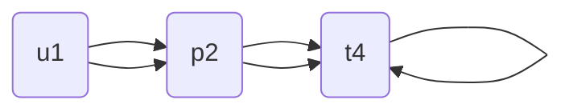
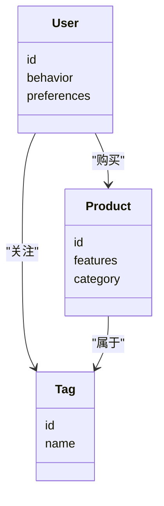
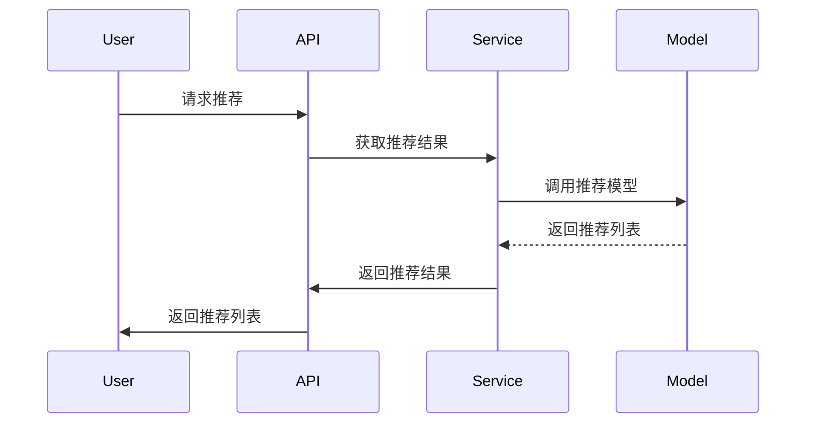

                 


# 开发智能化的金融产品推荐引擎

> 关键词：金融产品推荐引擎、人工智能、机器学习、深度学习、推荐系统、金融数字化

> 摘要：本文详细探讨了开发智能化金融产品推荐引擎的关键技术与实现方法。首先介绍了金融行业数字化转型的背景与推荐引擎的基本概念，然后深入分析了推荐引擎的核心算法原理，包括协同过滤、聚类分析和深度学习模型。接着，通过系统架构设计展示了推荐引擎的实现过程，最后通过项目实战部分详细讲解了推荐引擎的开发步骤与实际案例。本文旨在为金融机构的技术人员提供一份全面的技术指南，帮助他们构建高效、智能的金融产品推荐系统。

---

## 第1章: 金融行业数字化转型与推荐系统

### 1.1 金融行业的数字化转型

#### 1.1.1 传统金融业务的痛点与挑战
- 传统金融业务的低效性与高成本
- 客户需求多样化与金融产品的复杂性
- 数字化转型的必要性与目标

#### 1.1.2 数字化转型的必要性与目标
- 提高客户体验与满意度
- 降低运营成本与风险
- 提升金融机构的竞争力

#### 1.1.3 金融产品推荐引擎在数字化转型中的作用
- 通过智能化推荐提高客户转化率
- 提供个性化服务增强客户粘性
- 优化资源配置提升运营效率

### 1.2 推荐引擎的基本概念

#### 1.2.1 推荐引擎的定义与分类
- 推荐引擎的定义
- 基于协同过滤的推荐
- 基于内容的推荐
- 混合推荐模型

#### 1.2.2 金融产品推荐的独特性
- 金融产品的风险与收益平衡
- 客户风险承受能力的多样性
- 金融市场的动态变化

#### 1.2.3 推荐引擎的核心目标与价值
- 核心目标：提高客户匹配度与满意度
- 价值：提升金融机构的销售效率与客户忠诚度

### 1.3 智能化推荐引擎的背景与意义

#### 1.3.1 人工智能在金融领域的应用趋势
- AI技术在金融分析中的应用
- 智能推荐系统在金融领域的优势

#### 1.3.2 智能化推荐引擎的核心优势
- 高度个性化与精准化
- 实时性与动态调整能力
- 高效的数据处理与分析能力

#### 1.3.3 推荐引擎对金融机构和客户的双重价值
- 对金融机构：提高销售效率与客户留存率
- 对客户：提供更适合的金融产品与服务

---

## 第2章: 推荐引擎的核心概念与联系

### 2.1 推荐引擎的核心概念

#### 2.1.1 推荐引擎的工作原理
- 数据驱动的推荐
- 模型驱动的推荐
- 混合推荐模型

#### 2.1.2 推荐引擎的核心要素
- 数据：用户行为数据、产品特征数据、市场数据
- 模型：协同过滤、聚类分析、深度学习模型
- 策略：个性化推荐策略、风险管理策略

### 2.2 推荐引擎的核心算法

#### 2.2.1 协同过滤算法
- 基于用户的协同过滤
- 基于物品的协同过滤
- 混合协同过滤

#### 2.2.2 聚类分析
- K-means聚类
- 层次聚类
- 聚类在推荐系统中的应用

#### 2.2.3 深度学习模型
- 基于神经网络的推荐模型
- 基于注意力机制的推荐模型
- 基于图神经网络的推荐模型

### 2.3 推荐引擎的实体关系图



---

## 第3章: 推荐引擎的算法原理讲解

### 3.1 协同过滤算法

#### 3.1.1 协同过滤的数学模型
$$
相似度 = \frac{\sum (r_{u,i} - \bar{r}_u)(r_{u,j} - \bar{r}_j)}{\sqrt{\sum (r_{u,i} - \bar{r}_u)^2} \cdot \sqrt{\sum (r_{u,j} - \bar{r}_j)^2}}
$$

#### 3.1.2 协同过滤的实现步骤
1. 数据预处理：缺失值处理、归一化处理
2. 计算相似度：基于用户的协同过滤或基于物品的协同过滤
3. 生成推荐列表：基于相似度排序

#### 3.1.3 协同过滤的Python实现
```python
def collaborative_filtering(user_id, user_data):
    # 计算用户相似度
    similarities = {}
    for user in user_data:
        if user != user_id:
            similarities[user] = cosine_similarity(user_data[user_id], user_data[user])
    # 根据相似度排序
    sorted_users = sorted(similarities.items(), key=lambda x: x[1], reverse=True)
    # 生成推荐列表
    recommendations = []
    for user in sorted_users:
        recommendations.extend(user_data[user[0]])
    return recommendations
```

### 3.2 聚类分析算法

#### 3.2.1 聚类分析的数学模型
$$
距离 = \sqrt{\sum_{i=1}^{n} (x_i - y_i)^2}
$$

#### 3.2.2 聚类分析的实现步骤
1. 数据预处理：标准化、降维
2. 选择聚类算法：K-means、层次聚类
3. 聚类结果分析与可视化

#### 3.2.3 聚类分析的Python实现
```python
from sklearn.cluster import KMeans

def kmeans_clustering(data, num_clusters):
    # 数据预处理
    data_scaled = StandardScaler().fit_transform(data)
    # 模型训练
    kmeans = KMeans(n_clusters=num_clusters)
    kmeans.fit(data_scaled)
    # 获取聚类结果
    clusters = kmeans.labels_
    return clusters
```

### 3.3 深度学习模型

#### 3.3.1 深度学习模型的数学模型
$$
y = f(x; \theta)
$$
其中，$f$ 是深度神经网络模型，$\theta$ 是模型参数。

#### 3.3.2 深度学习模型的实现步骤
1. 数据预处理：特征提取、归一化
2. 模型设计：搭建神经网络模型
3. 模型训练：使用梯度下降优化模型参数
4. 模型评估与调优

#### 3.3.3 深度学习模型的Python实现
```python
import torch
import torch.nn as nn

class RecommendationModel(nn.Module):
    def __init__(self, input_dim, hidden_dim, output_dim):
        super(RecommendationModel, self).__init__()
        self.fc1 = nn.Linear(input_dim, hidden_dim)
        self.fc2 = nn.Linear(hidden_dim, output_dim)
        self.relu = nn.ReLU()
    
    def forward(self, x):
        x = self.fc1(x)
        x = self.relu(x)
        x = self.fc2(x)
        return x

# 初始化模型
model = RecommendationModel(input_dim=10, hidden_dim=20, output_dim=5)
# 定义损失函数和优化器
criterion = nn.MSELoss()
optimizer = torch.optim.Adam(model.parameters(), lr=0.001)
```

---

## 第4章: 推荐引擎的系统分析与架构设计

### 4.1 项目背景与目标

#### 4.1.1 项目背景
- 金融机构的数字化转型需求
- 金融产品推荐的痛点与挑战

#### 4.1.2 项目目标
- 构建智能化的金融产品推荐引擎
- 提供个性化、精准化的推荐服务
- 提升客户满意度与留存率

### 4.2 系统功能设计

#### 4.2.1 系统功能模块
- 数据采集与处理模块
- 模型训练与优化模块
- 推荐结果生成模块
- 接口调用与展示模块

#### 4.2.2 领域模型设计


### 4.3 系统架构设计

#### 4.3.1 分层架构设计
- 数据层：数据存储与管理
- 服务层：推荐引擎的核心逻辑
- 接口层：API接口与前端展示

#### 4.3.2 架构设计图


### 4.4 接口设计与交互流程

#### 4.4.1 接口设计
- RESTful API设计
- 接口文档编写

#### 4.4.2 交互流程


---

## 第5章: 推荐引擎的项目实战

### 5.1 环境搭建与数据准备

#### 5.1.1 环境安装
- 安装Python与相关库
- 安装机器学习框架（如TensorFlow、PyTorch）

#### 5.1.2 数据准备
- 数据获取与清洗
- 数据预处理与特征提取

### 5.2 系统核心实现

#### 5.2.1 数据预处理
```python
import pandas as pd
import numpy as np

data = pd.read_csv('financial_products.csv')
data.dropna(inplace=True)
data = data.drop_duplicates()
```

#### 5.2.2 模型训练
```python
from sklearn.model_selection import train_test_split
from sklearn.metrics import accuracy_score

X_train, X_test, y_train, y_test = train_test_split(data_features, data_labels, test_size=0.2)
model.fit(X_train, y_train)
```

#### 5.2.3 推荐结果生成
```python
recommendations = model.predict(new_user_input)
print(recommendations)
```

### 5.3 项目实战案例分析

#### 5.3.1 案例背景
- 某银行的客户推荐系统
- 数据来源与特征分析

#### 5.3.2 案例实现
- 数据清洗与特征工程
- 模型训练与调优
- 推荐结果展示与分析

---

## 第6章: 最佳实践、小结与展望

### 6.1 最佳实践 tips

#### 6.1.1 数据处理建议
- 数据清洗的重要性
- 特征工程的关键性

#### 6.1.2 模型选择建议
- 根据业务需求选择模型
- 多模型融合的优势

#### 6.1.3 系统优化建议
- 系统架构的可扩展性设计
- 模型的实时更新与优化

### 6.2 小结与项目总结

#### 6.2.1 项目总结
- 项目目标的实现情况
- 遇到的问题与解决方法
- 实践中的经验与教训

#### 6.2.2 项目小结
- 系统的核心功能与价值
- 对未来发展的思考

### 6.3 项目展望与未来方向

#### 6.3.1 未来发展方向
- 更精准的推荐算法
- 更高效的系统架构
- 更多样化的推荐场景

#### 6.3.2 对读者的建议
- 持续学习与实践
- 关注行业动态与技术趋势
- 积极参与项目与技术交流

---

## 参考文献与拓展阅读

1. [文献1] 《推荐系统实战：基于机器学习的推荐算法与实现》
2. [文献2] 《深度学习在金融领域的应用：从理论到实践》
3. [文献3] 《Python机器学习：基于Scikit-learn和TensorFlow的实践》
4. [文献4] 《金融产品推荐系统的优化与创新》
5. [文献5] 《推荐系统中的用户行为分析与建模》

---

# 结语

开发智能化的金融产品推荐引擎是一项复杂但极具价值的工程。通过本文的系统介绍与实战指导，读者可以掌握推荐引擎的核心技术与实现方法。未来，随着人工智能技术的不断发展，推荐引擎将在金融领域发挥越来越重要的作用，为金融机构和客户提供更高效、更精准的服务。

