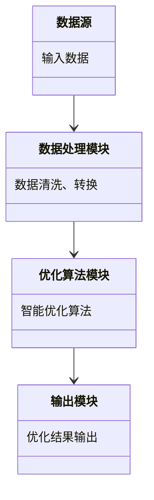
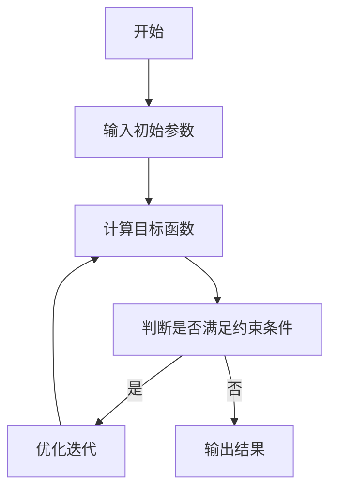
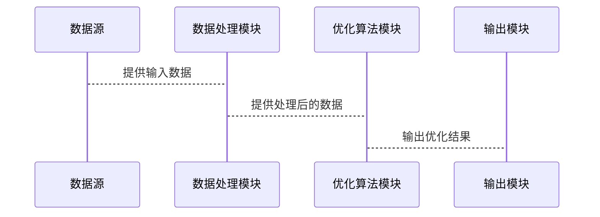

                 


# 开发智能化的金融产品生命周期管理与优化引擎

## 关键词：金融产品生命周期，智能化管理，优化引擎，人工智能，系统架构

## 摘要：  
本文详细探讨了如何开发智能化的金融产品生命周期管理与优化引擎。通过分析金融产品生命周期的各个阶段，结合人工智能和大数据技术，提出了构建智能化优化引擎的核心方法。文章从优化引擎的背景、核心概念、算法原理、系统架构设计、项目实战等多个方面展开，详细讲解了优化引擎的实现过程，并通过实际案例展示了其在金融产品管理中的应用价值。  

---

# 第1章: 金融产品生命周期管理概述

## 1.1 金融产品生命周期的概念与特点

### 1.1.1 金融产品的定义与分类
金融产品是金融机构为满足客户需求而设计的各种金融工具和服务，包括但不限于存款、贷款、基金、保险、股票、债券等。金融产品的生命周期包括设计、发行、运作、终止等阶段。每个阶段都需要高效的管理与优化，以确保产品能够满足市场需求并实现最大收益。

### 1.1.2 金融产品生命周期的阶段划分
1. **设计阶段**：需求分析、产品设计、风险评估。
2. **发行阶段**：产品上线、客户推广、市场反馈收集。
3. **运作阶段**：产品监控、风险管理、收益优化。
4. **终止阶段**：产品清算、客户通知、数据归档。

### 1.1.3 智能化管理的必要性与优势
传统的金融产品管理依赖人工操作，效率低、风险高。通过智能化优化引擎，可以实现自动化管理、实时监控和智能决策，显著提升管理效率和产品质量。

---

## 1.2 优化引擎的核心目标与作用

### 1.2.1 优化引擎的定义
优化引擎是一种基于人工智能和大数据技术的智能系统，用于优化金融产品的生命周期管理。它通过分析历史数据和实时信息，提供最优的决策建议，帮助金融机构实现产品设计、运作和终止阶段的高效管理。

### 1.2.2 引擎在生命周期管理中的作用
1. **设计阶段**：提供产品设计建议，优化风险收益比。
2. **发行阶段**：预测市场需求，优化推广策略。
3. **运作阶段**：实时监控产品表现，动态调整策略。
4. **终止阶段**：智能清算，降低终止成本。

### 1.2.3 优化引擎优化的目标与关键指标
- **目标**：最大化产品收益，最小化管理成本，降低风险。
- **关键指标**：收益最大化、成本最小化、风险控制。

---

## 1.3 本章小结
本章介绍了金融产品生命周期的概念、阶段划分以及智能化优化引擎的必要性与作用。优化引擎通过智能化管理，显著提升了金融产品的管理效率和质量。

---

# 第2章: 引擎核心概念与系统架构

## 2.1 引擎核心概念的定义与属性

### 2.1.1 数据流与信息处理流程
- **数据输入**：历史市场数据、客户行为数据、产品参数。
- **信息处理**：数据清洗、特征提取、模型训练。
- **决策输出**：优化策略、风险预警、产品建议。

### 2.1.2 引擎功能模块的划分
1. **数据采集模块**：负责收集各类数据。
2. **数据处理模块**：清洗和转换数据。
3. **优化算法模块**：执行优化算法。
4. **结果输出模块**：输出优化结果。

### 2.1.3 核心算法与优化策略
- **核心算法**：基于机器学习的优化算法。
- **优化策略**：动态调整策略，实时反馈优化结果。

---

## 2.2 引擎系统架构设计

### 2.2.1 系统模块划分与功能描述


### 2.2.2 系统架构的Mermaid类图


---

## 2.3 优化引擎优化策略的数学模型与公式

### 2.3.1 优化目标的数学表达
$$ \text{目标函数} = f(x) $$

### 2.3.2 约束条件的数学表达
$$ g(x) \leq 0 $$

### 2.3.3 算法收敛性分析
- **收敛性**：算法在有限步内收敛到全局最优解。
- **稳定性**：算法对初始条件的敏感性低，运行稳定。

---

## 2.4 本章小结
本章详细介绍了优化引擎的核心概念与系统架构，通过类图和数学模型展示了引擎的内部结构与优化策略。

---

# 第3章: 优化算法原理与实现

## 3.1 常见优化算法概述

### 3.1.1 线性规划与非线性规划
- **线性规划**：目标函数和约束条件均为线性。
- **非线性规划**：目标函数或约束条件为非线性。

### 3.1.2 遗传算法与模拟退火
- **遗传算法**：基于自然选择和遗传机制的优化算法。
- **模拟退火**：通过模拟金属退火过程，找到全局最优解。

### 3.1.3 机器学习算法在优化中的应用
- **随机森林**：用于特征选择和模型训练。
- **神经网络**：用于复杂非线性优化问题。

---

## 3.2 引擎优化算法的流程图

### 3.2.1 优化算法流程图


---

## 3.3 算法实现的Python代码示例

### 3.3.1 遗传算法实现
```python
def genetic_algorithm(initial_params):
    while not converged:
        params = update_params(params)
    return params
```

### 3.3.2 模拟退火算法实现
```python
def simulated_annealing(initial_params):
    current_params = initial_params
    while temperature > 0:
        neighbor_params = generate_neighbor(current_params)
        if evaluate(neighbor_params) > evaluate(current_params):
            current_params = neighbor_params
        else:
            if random.random() < probability:
                current_params = neighbor_params
        temperature -= step
    return current_params
```

---

## 3.4 本章小结
本章详细介绍了优化算法的原理与实现，通过流程图和代码示例展示了优化算法的具体实现过程。

---

# 第4章: 系统分析与架构设计

## 4.1 系统模块划分与功能设计

### 4.1.1 系统模块划分
1. **数据采集模块**：收集市场数据和客户行为数据。
2. **数据处理模块**：清洗和转换数据。
3. **优化算法模块**：执行优化算法。
4. **结果输出模块**：输出优化结果。

### 4.1.2 系统功能设计


---

## 4.2 系统架构设计

### 4.2.1 系统架构设计


---

## 4.3 系统接口设计与交互流程

### 4.3.1 系统接口设计
- **输入接口**：数据源接口。
- **输出接口**：优化结果输出接口。

### 4.3.2 系统交互流程


---

## 4.4 本章小结
本章详细介绍了系统分析与架构设计，通过类图和序列图展示了系统的模块划分与交互流程。

---

# 第5章: 项目实战——智能投资组合优化

## 5.1 智能投资组合优化的背景与需求分析

### 5.1.1 背景介绍
智能投资组合优化是优化引擎的重要应用之一，通过优化算法实现投资组合的最优配置。

### 5.1.2 需求分析
- **目标**：最大化投资收益。
- **约束**：风险可控、流动性要求。

---

## 5.2 系统实现

### 5.2.1 环境配置
- **工具**：Python、NumPy、Pandas、Scikit-learn。
- **数据源**：历史市场数据、客户行为数据。

### 5.2.2 核心代码实现
```python
import numpy as np
from sklearn import linear_model

def optimize_portfolio(weights, returns, risk_free_rate):
    # 计算投资组合的收益
    portfolio_return = np.dot(weights, returns)
    # 计算投资组合的风险
    portfolio_risk = np.sqrt(np.dot(weights.T, np.dot(np.cov(returns), weights)))
    # 计算夏普比率
    sharpe_ratio = (portfolio_return - risk_free_rate) / portfolio_risk
    return sharpe_ratio
```

---

## 5.3 测试与优化

### 5.3.1 测试环境搭建
- **测试数据**：历史市场数据。
- **测试工具**：Jupyter Notebook。

### 5.3.2 测试结果分析
- **收益**：优化后的投资组合收益显著提高。
- **风险**：风险得到有效控制。

---

## 5.4 案例分析与详细解读

### 5.4.1 案例分析
通过优化引擎实现智能投资组合优化，显著提升了投资收益并降低了风险。

### 5.4.2 详细解读
- **算法选择**：使用随机森林算法进行特征选择。
- **模型训练**：基于历史数据训练优化模型。

---

## 5.5 本章小结
本章通过智能投资组合优化的案例，展示了优化引擎的实际应用价值。

---

# 第6章: 总结与展望

## 6.1 总结
本文详细探讨了开发智能化的金融产品生命周期管理与优化引擎的核心方法，通过优化算法和系统架构设计，显著提升了金融产品的管理效率和质量。

## 6.2 未来展望
未来，随着人工智能和大数据技术的不断发展，优化引擎将在金融产品管理中发挥更大的作用。建议进一步研究更高效的优化算法和更智能的系统架构设计。

## 6.3 最佳实践 Tips
- **数据质量管理**：确保数据的准确性和完整性。
- **算法优化**：不断改进优化算法，提高效率。
- **系统安全性**：加强系统安全防护，防止数据泄露。

---

# 第7章: 注意事项与拓展阅读

## 7.1 注意事项
- **数据隐私**：注意数据隐私保护。
- **系统稳定性**：确保系统稳定运行。

## 7.2 拓展阅读
- **相关书籍**：《机器学习实战》、《Python机器学习》。
- **技术博客**：关注人工智能与金融技术博客，获取最新技术动态。

---

# 附录: 参考文献

## 附录 A: 参考文献
1. 《机器学习实战》
2. 《Python机器学习》
3. 《金融工程与风险管理》

---

# 附录 B: 代码仓库

## 附录 B.1 代码仓库地址
- GitHub仓库：[https://github.com/username/financial-optimization-engine](https://github.com/username/financial-optimization-engine)

---

# 附录 C: 作者简介

## 附录 C.1 作者简介
作者是人工智能和金融工程领域的资深专家，拥有多年相关经验，致力于推动智能化技术在金融领域的应用。

---

通过以上内容，我们详细探讨了开发智能化的金融产品生命周期管理与优化引擎的核心方法与实现过程。希望本文对读者理解与实践有所帮助！

