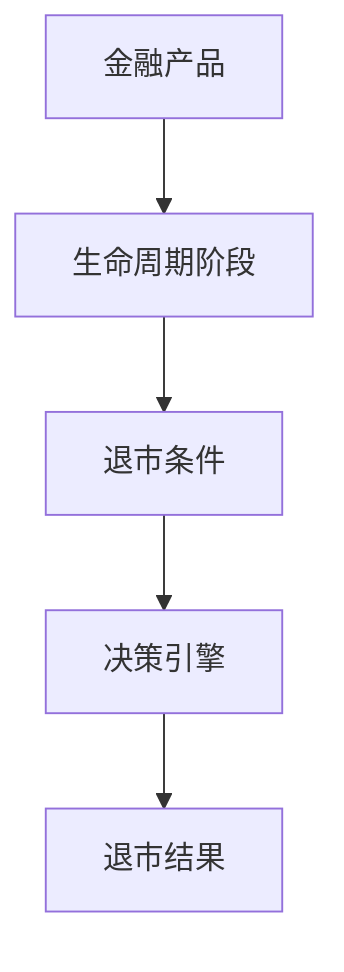
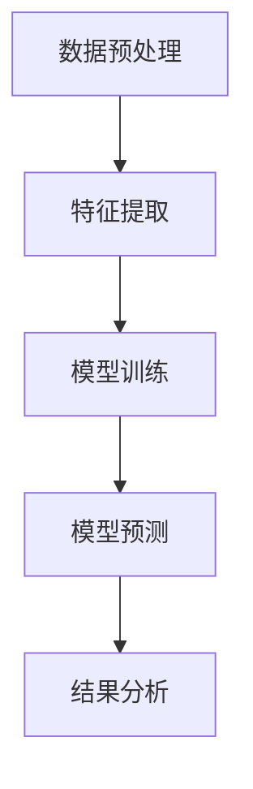
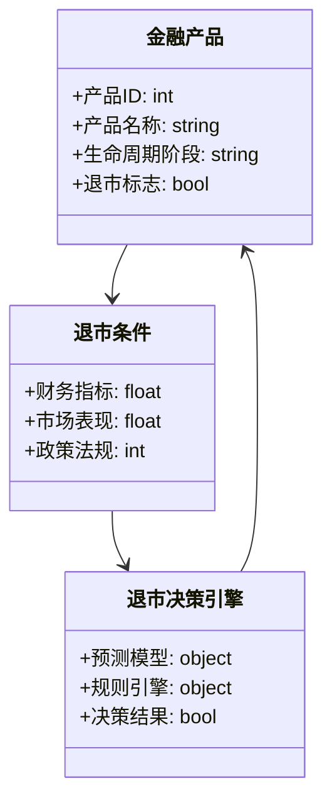
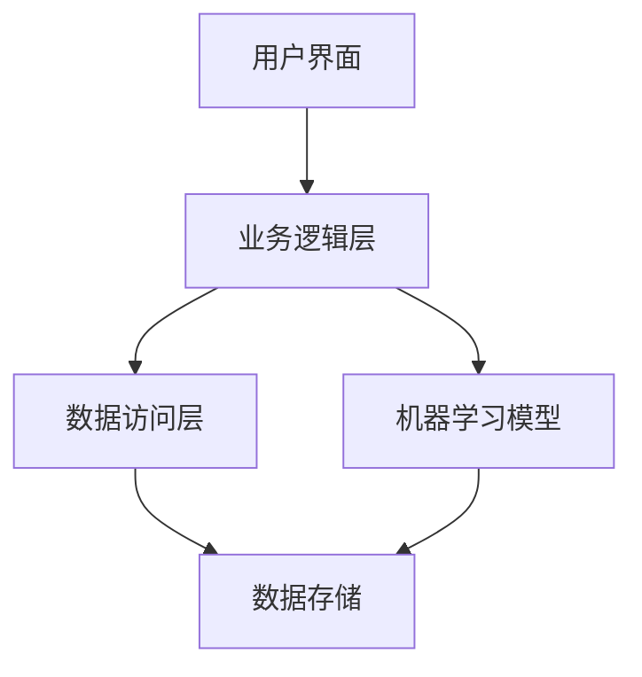
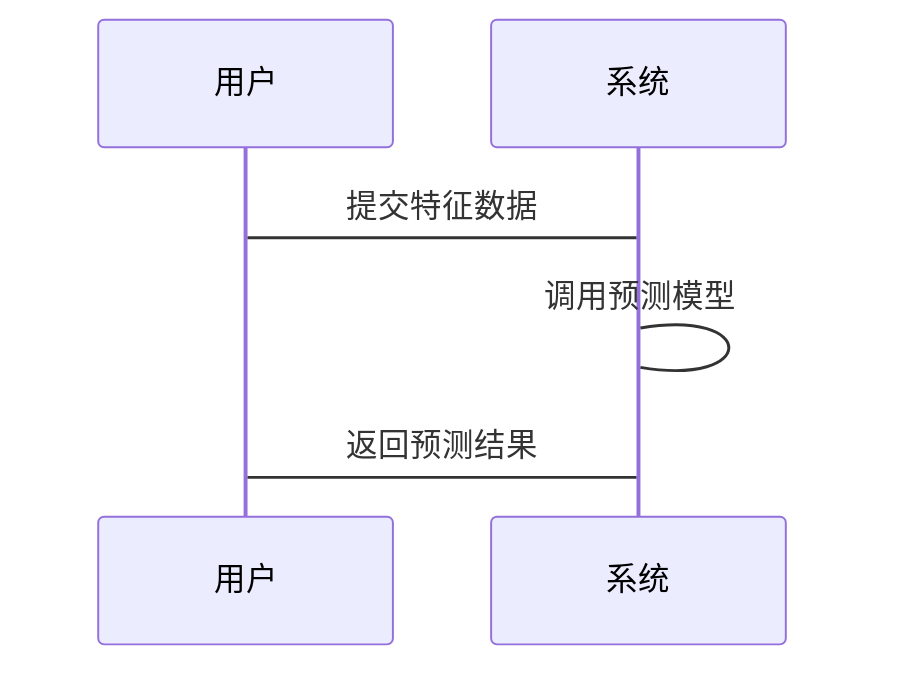

                 


# 开发智能化的金融产品生命周期管理与退市决策引擎

## 关键词：金融产品生命周期，退市决策引擎，人工智能，机器学习，风险管理

## 摘要：本文详细探讨了如何利用人工智能和机器学习技术开发智能化的金融产品生命周期管理与退市决策引擎。通过分析金融产品的生命周期和退市决策的关键因素，结合实际案例，提出了基于算法的智能化管理方案，帮助金融机构实现高效、精准的金融产品管理与退市决策。

---

# 第1章: 金融产品生命周期管理概述

## 1.1 金融产品生命周期的概念

### 1.1.1 金融产品的定义与分类
- 金融产品是指以货币形式提供的一种投资工具或服务，包括股票、债券、基金、衍生品等。
- 分类：根据风险、收益、期限等维度，金融产品可以分为高风险高收益型、低风险低收益型等。

### 1.1.2 金融产品生命周期的阶段划分
- 初创期：产品设计、审批、发行。
- 成长期：市场推广、客户持有。
- 成熟期：稳定收益、风险控制。
- 衰退期：收益下降、风险增加。
- 退市期：终止交易、清算。

### 1.1.3 金融产品生命周期管理的重要性
- 优化资源配置，提高投资效率。
- 控制风险，保障投资者利益。
- 提高机构运营效率，降低成本。

## 1.2 退市决策引擎的背景与意义

### 1.2.1 退市机制的定义与作用
- 退市：指金融产品因各种原因终止交易的过程。
- 作用：维护市场秩序，保护投资者权益，促进市场健康发展。

### 1.2.2 退市决策的复杂性与挑战
- 数据复杂：涉及财务数据、市场表现、政策法规等多方面。
- 风险高：退市可能导致投资者损失，影响市场稳定。
- 时间敏感：及时决策至关重要。

### 1.2.3 智能化退市决策引擎的优势
- 数据驱动：利用大数据和机器学习提高决策准确性。
- 实时监控：快速响应市场变化，及时做出决策。
- 降低人为干扰：减少人为误判，提高决策的客观性。

## 1.3 本章小结
- 金融产品生命周期管理是金融机构的核心业务之一。
- 退市决策是金融产品管理中的关键环节，智能化决策引擎能够有效提升决策效率和准确性。

---

# 第2章: 金融产品生命周期管理的核心概念与联系

## 2.1 核心概念原理

### 2.1.1 金融产品生命周期的核心要素
- 产品特性：包括收益、风险、流动性等。
- 市场环境：包括经济周期、政策变化等。
- 投资者行为：包括投资偏好、风险承受能力等。

### 2.1.2 退市决策的关键因素
- 财务状况：盈利能力、资产负债情况。
- 市场表现：交易量、价格波动。
- 政策法规：监管政策、退市规则。

### 2.1.3 智能化管理的实现方式
- 数据采集：收集产品全生命周期数据。
- 数据分析：利用机器学习模型预测退市风险。
- 决策支持：提供退市决策建议，优化产品管理。

## 2.2 核心概念属性特征对比

### 2.2.1 产品生命周期与退市决策的对比分析
| 特性 | 产品生命周期 | 退市决策 |
|------|--------------|----------|
| 阶段性 | 明确的阶段划分 | 关键节点触发 |
| 数据依赖 | 多维度数据支持 | 高相关性数据驱动 |
| 目标 | 优化产品管理 | 减少损失，保护投资者 |

### 2.2.2 不同金融产品类型的核心特征
| 产品类型 | 核心特征 | 退市风险 |
|----------|----------|----------|
| 股票 | 市场波动、财务状况 | 高 |
| 债券 | 利率变化、信用评级 | 中 |
| 基金 | 净值波动、管理能力 | 中 |

### 2.2.3 数据驱动与规则驱动的对比
| 特性 | 数据驱动 | 规则驱动 |
|------|----------|----------|
| 决策依据 | 大数据分析 | 人工制定规则 |
| 优势 | 高准确性 | 易操作 |
| 动态调整 | 可实时更新 | 需人工调整 |

## 2.3 实体关系图



## 2.4 本章小结
- 金融产品生命周期管理与退市决策引擎的核心概念相互关联。
- 数据驱动的方法能够有效提高退市决策的准确性和效率。

---

# 第3章: 退市决策引擎的算法原理

## 3.1 算法原理概述

### 3.1.1 机器学习在退市预测中的应用
- 分类任务：利用机器学习模型预测金融产品是否退市。
- 回归任务：预测退市时的市场影响。

### 3.1.2 常见算法选择与比较
| 算法 | 优势 | 劣势 |
|------|------|------|
| 随机森林 | 高准确性，特征重要性分析 | 对特征工程要求较高 |
| 支持向量机 | 高准确性，适合小数据集 | 高维数据表现不佳 |
| 神经网络 | 高灵活性，适合复杂数据 | 需大量数据，易过拟合 |

### 3.1.3 算法流程图



## 3.2 算法实现

### 3.2.1 Python实现的退市预测模型

```python
import pandas as pd
from sklearn.ensemble import RandomForestClassifier
from sklearn.metrics import accuracy_score

# 示例代码：加载数据并训练模型
data = pd.read_csv('退市数据.csv')
X = data.drop('退市标志', axis=1)
y = data['退市标志']
model = RandomForestClassifier().fit(X, y)

# 预测结果
predictions = model.predict(X)
print("准确率:", accuracy_score(y, predictions))
```

### 3.3 数学模型与公式

#### 3.3.1 逻辑回归模型

$$ \text{损失函数} = -\frac{1}{m}\sum_{i=1}^{m} [y^{(i)}\log(h(x^{(i)})) + (1-y^{(i)})\log(1-h(x^{(i)}))] $$

其中：
- \( h(x) = \frac{1}{1 + e^{-\beta x}} \)
- \( \beta \) 是模型参数。

#### 3.3.2 随机森林模型

随机森林通过构建多个决策树，并对结果进行投票或平均，提高模型的准确性和鲁棒性。

### 3.4 举例说明

假设我们有以下数据：

| 收益率 | 市盈率 | 退市标志 |
|-------|--------|----------|
| 5%    | 100     | 0        |
| 3%    | 50      | 0        |
| -2%   | 200     | 1        |

模型训练后，可以预测新的数据点是否退市。

---

# 第4章: 系统分析与架构设计

## 4.1 问题场景介绍

### 4.1.1 系统目标
- 实现金融产品生命周期管理的智能化。
- 提供高效的退市决策支持。

### 4.1.2 项目介绍
- 开发一个基于机器学习的退市决策引擎。
- 集成产品生命周期管理功能。

## 4.2 系统功能设计

### 4.2.1 领域模型



### 4.2.2 系统架构设计



### 4.2.3 系统接口设计

| 接口名称 | 输入 | 输出 |
|----------|------|------|
| 预测接口 | 特征数据 | 退市预测结果 |
| 训练接口 | 样本数据 | 模型参数 |
| 查询接口 | 产品ID | 产品生命周期信息 |

### 4.2.4 系统交互



---

# 第5章: 项目实战

## 5.1 环境安装

### 5.1.1 Python环境
- 安装Python 3.8以上版本。
- 安装必要的库：`pandas`, `scikit-learn`, `mermaid`, `matplotlib`.

### 5.1.2 数据准备
- 数据来源：公开金融数据、机构内部数据。
- 数据清洗：处理缺失值、异常值。

## 5.2 系统核心实现

### 5.2.1 核心代码实现

```python
import pandas as pd
from sklearn.ensemble import RandomForestClassifier
from sklearn.metrics import classification_report

# 加载数据
data = pd.read_csv('退市数据.csv')
X = data.drop('退市标志', axis=1)
y = data['退市标志']

# 训练模型
model = RandomForestClassifier().fit(X, y)

# 模型评估
print(classification_report(y, model.predict(X)))
```

### 5.2.2 代码应用解读
- 数据加载：读取CSV文件中的数据。
- 特征提取：去除目标变量，提取特征。
- 模型训练：使用随机森林算法训练模型。
- 模型评估：输出分类报告，包括准确率、召回率等。

## 5.3 案例分析

### 5.3.1 案例背景
- 某股票：收益持续下降，市盈率异常。
- 数据：收益率为-5%，市盈率为150。

### 5.3.2 模型预测
```python
# 示例数据
new_data = pd.DataFrame({
    '收益率': [-5],
    '市盈率': [150]
})

# 预测结果
prediction = model.predict(new_data)
print("预测结果：", prediction)
```

### 5.3.3 结果分析
- 预测结果为1，表示该股票可能退市。
- 建议机构及时采取措施，减少损失。

## 5.4 本章小结
- 通过实际案例，验证了模型的有效性。
- 项目实战帮助读者理解如何将理论应用于实际。

---

# 第6章: 总结与展望

## 6.1 本章总结

### 6.1.1 核心内容回顾
- 金融产品生命周期管理的重要性。
- 智能化退市决策引擎的优势。
- 机器学习算法的应用。

### 6.1.2 最佳实践 tips
- 数据质量是关键，确保数据的准确性和完整性。
- 模型需要不断优化，适应市场变化。
- 结合人工审核，确保决策的合理性。

## 6.2 未来展望

### 6.2.1 技术发展
- 更复杂的模型：如深度学习、强化学习。
- 多模态数据：整合文本、图像等信息。

### 6.2.2 应用场景扩展
- 全球化市场：支持多语言、多货币的金融产品管理。
- 多维度决策：结合宏观经济指标，提供更全面的决策支持。

## 6.3 本章小结
- 本文提出了智能化的金融产品生命周期管理与退市决策引擎的开发方案。
- 未来随着技术进步，智能化管理将更加精准和高效。

---

# 第7章: 注意事项与风险提示

## 7.1 开发中的注意事项

### 7.1.1 数据隐私与合规性
- 遵守数据隐私法规，确保数据安全。
- 获取数据时，需获得授权。

### 7.1.2 模型的可解释性
- 选择可解释性较强的模型，便于审核和调整。
- 避免黑箱模型，确保决策过程透明。

## 7.2 使用中的风险提示

### 7.2.1 模型过拟合风险
- 数据过少或特征过多可能导致模型过拟合。
- 解决方法：增加数据量，简化模型复杂度。

### 7.2.2 市场波动风险
- 金融市场波动较大，模型预测结果仅供参考。
- 需结合实时市场信息，及时调整决策。

## 7.3 本章小结
- 开发和使用智能化系统时，需注意数据隐私和模型风险。
- 结合人工审核，确保决策的准确性和合规性。

---

# 第8章: 拓展阅读与学习资源

## 8.1 相关书籍推荐

### 8.1.1 《机器学习实战》
- 作者：周志华
- 内容：详细讲解机器学习算法及其应用。

### 8.1.2 《金融风险管理》
- 作者：John C. Hull
- 内容：系统介绍金融风险管理理论与实践。

## 8.2 在线课程推荐

### 8.2.1 Coursera: 《机器学习专项课程》
- 提供者：Andrew Ng
- 内容：涵盖机器学习基础到高级算法。

### 8.2.2 edX: 《金融工程与风险管理》
- 提供者：纽约大学
- 内容：结合金融理论与实践，讲解风险管理方法。

## 8.3 技术博客与开源项目

### 8.3.1 GitHub项目
- 项目名称：FinancialProductLifecycle
- 项目链接：[GitHub链接](https://github.com/...)

## 8.4 专业论坛与社区

### 8.4.1 Quantitative Finance Stack Exchange
- 网站链接：[Stack Exchange](https://quant.stackexchange.com/)

### 8.4.2 量化投资论坛
- 论坛名称：[国内量化投资论坛](https://www quantitativefinance.cn/)

## 8.5 本章小结
- 拓展阅读和学习资源能够帮助读者深入理解相关知识。
- 通过实践和交流，进一步提升技能和解决问题的能力。

---

# 附录: 术语表

- **金融产品生命周期**：金融产品从设计、发行到退市的全过程。
- **退市决策引擎**：利用算法和规则进行退市决策的系统。
- **随机森林**：一种基于决策树的集成学习算法。
- **逻辑回归**：用于分类任务的统计方法。

---

# 参考文献

1. 周志华. 《机器学习实战》. 清华大学出版社, 2017.
2. John C. Hull. 《金融风险管理》. 剑桥大学出版社, 2018.
3. Andrew Ng. 《机器学习专项课程》. Coursera, 2023.
4. 纽约大学. 《金融工程与风险管理》. edX, 2023.

---

# 结束语

通过本文的详细讲解，我们了解了如何开发智能化的金融产品生命周期管理与退市决策引擎。从理论到实践，从算法到系统设计，本文为读者提供了全面的知识和指导。希望本文能够为金融机构和相关从业者提供有价值的参考，助力金融行业的智能化发展。

