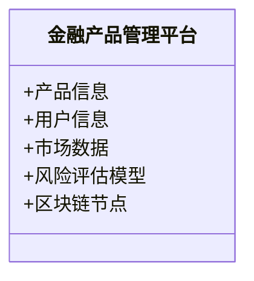
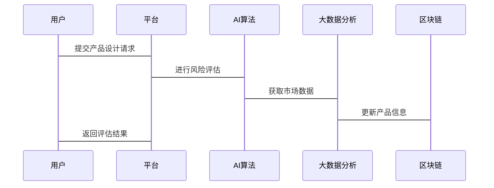

                 


# 开发智能化的金融产品生命周期管理平台

> 关键词：智能化，金融产品，生命周期管理，人工智能，大数据，区块链，系统架构

> 摘要：本文详细探讨了开发智能化金融产品生命周期管理平台的核心技术与实现方案。通过结合人工智能、大数据和区块链等技术，构建了一个高效、安全且智能的金融产品管理平台，涵盖从产品设计到市场退出的全生命周期管理。文章从背景介绍、核心概念、算法原理、系统架构到项目实战，全面解析了平台的开发过程，并通过实际案例展示了平台的应用效果。

---

## 第1章: 背景介绍

### 1.1 问题背景

#### 1.1.1 金融行业的现状与挑战
随着金融市场的快速发展，金融产品的种类和数量急剧增加，传统的金融产品管理方式已难以应对日益复杂的市场需求。金融机构在产品设计、风险评估、用户匹配和市场反馈等方面面临诸多挑战。

#### 1.1.2 传统金融产品管理的局限性
传统金融产品管理依赖人工操作，效率低下，且容易受到主观因素的影响。例如，产品设计周期长，风险评估不够准确，用户需求难以精准匹配，市场反馈难以及时响应等问题。

#### 1.1.3 智能化管理的必要性
通过引入人工智能、大数据和区块链等技术，智能化金融产品管理平台能够实现自动化、智能化的管理，提高效率、准确性和透明度，为金融机构提供强有力的支持。

### 1.2 问题描述

#### 1.2.1 金融产品生命周期管理的核心问题
金融产品生命周期管理涉及多个环节，包括产品设计、审批、发行、监控和退市等。每个环节都需要高效、准确的管理，以确保产品的顺利运行和风险可控。

#### 1.2.2 现有解决方案的不足
现有的解决方案多为单一功能模块，缺乏智能化和自动化能力，难以满足复杂多变的市场需求。此外，数据孤岛问题严重，各系统之间的协同性不足，导致整体效率低下。

#### 1.2.3 智能化平台的解决方案
通过构建智能化的金融产品生命周期管理平台，整合人工智能、大数据和区块链等技术，实现全生命周期的智能化管理，提升效率和准确性，降低风险。

### 1.3 问题解决

#### 1.3.1 智能化平台的解决方案
引入机器学习算法进行产品设计优化，利用大数据分析用户需求和市场趋势，通过区块链技术确保数据的透明性和不可篡改性。

#### 1.3.2 技术选型与实现路径
选择合适的AI算法（如随机森林、神经网络等）进行风险评估和产品推荐；利用Hadoop和Spark进行大数据处理和分析；采用以太坊或Hyperledger Fabric搭建区块链平台。

#### 1.3.3 平台的预期效果与优势
智能化平台能够实现产品快速设计、精准风险评估、用户需求匹配和实时监控，显著提高管理效率和准确性，降低运营成本。

### 1.4 边界与外延

#### 1.4.1 平台的功能边界
平台主要负责金融产品的全生命周期管理，包括产品设计、审批、发行、监控和退市等环节，不涉及具体的交易执行和客户关系管理。

#### 1.4.2 与相关系统的接口关系
平台需要与CRM系统、风险管理系统、交易系统等进行数据交互，确保各系统之间的协同工作。

#### 1.4.3 平台的扩展性与灵活性
平台设计具有良好的扩展性，能够根据市场需求快速添加新的功能模块，同时支持多种数据源和多种区块链协议。

### 1.5 概念结构与核心要素

#### 1.5.1 平台的整体架构
平台由前端（用户界面）、后端（业务逻辑）和底层技术（AI算法、大数据分析、区块链）组成，各部分协同工作。

#### 1.5.2 核心要素的组成与关系
核心要素包括金融产品数据、用户数据、市场数据、AI算法模型和区块链节点。数据通过AI算法进行分析和处理，生成决策支持信息，并通过区块链进行数据存储和传输。

#### 1.5.3 平台的业务流程与数据流
业务流程包括数据采集、数据处理、数据分析、决策支持和数据存储。数据流通过区块链进行实时同步，确保数据的准确性和一致性。

---

## 第2章: 智能化金融产品管理的核心概念

### 2.1 人工智能在金融产品管理中的应用

#### 2.1.1 人工智能的核心原理
人工智能通过机器学习算法从大量数据中学习模式和规律，用于预测和决策。例如，使用随机森林算法进行风险评估，使用神经网络进行市场趋势预测。

#### 2.1.2 人工智能在金融领域的具体应用
在金融产品管理中，AI用于产品推荐、风险评估、市场分析和用户画像构建。

#### 2.1.3 人工智能与金融产品生命周期的关系
AI技术贯穿于金融产品的设计、审批、发行和监控等各个环节，提供智能化支持。

### 2.2 大数据在金融产品管理中的作用

#### 2.2.1 数据的收集与处理
通过多种渠道收集用户行为数据、市场数据和产品数据，并进行清洗和预处理。

#### 2.2.2 数据分析与挖掘
利用大数据分析技术进行数据挖掘，发现潜在的市场机会和风险点，为决策提供支持。

#### 2.2.3 数据驱动的决策支持
基于数据分析结果，优化产品设计和营销策略，提升用户体验和市场竞争力。

### 2.3 区块链在金融产品管理中的应用

#### 2.3.1 区块链的基本原理
区块链是一种分布式账本技术，通过去中心化和共识机制确保数据的安全性和不可篡改性。

#### 2.3.2 区块链在金融产品管理中的应用场景
在金融产品管理中，区块链用于产品发行记录、用户身份验证和交易清算，确保数据的透明性和高效性。

#### 2.3.3 区块链的优势与挑战
优势包括数据安全、透明性和高效性；挑战包括技术复杂性、法律合规性和性能瓶颈。

### 2.4 核心概念的协同作用

#### 2.4.1 人工智能、大数据和区块链的协同作用
人工智能提供智能化决策支持，大数据提供海量数据的分析能力，区块链提供数据的安全和信任机制，三者协同工作，构建一个高效、安全且智能的金融产品管理平台。

#### 2.4.2 技术对比与表格展示
| 技术 | 核心功能 | 优势 |
|------|----------|------|
| AI   | 数据分析与预测 | 智能化决策支持 |
| 大数据 | 数据处理与挖掘 | 高效数据处理 |
| 区块链 | 数据存储与验证 | 数据安全与透明 |

#### 2.4.3 ER实体关系图架构
```mermaid
erd
    title 实体关系图
    章节
    章节_1 到 章节_2 章节_3
```

---

## 第3章: 算法原理讲解

### 3.1 机器学习算法原理

#### 3.1.1 机器学习的定义与分类
机器学习是一种人工智能技术，通过数据训练模型，实现预测和分类。主要分类包括监督学习、无监督学习和强化学习。

#### 3.1.2 随机森林算法的工作原理
随机森林是一种基于树的集成学习方法，通过构建多棵决策树并进行投票或平均，提高模型的准确性和鲁棒性。

#### 3.1.3 算法流程图
```mermaid
graph TD
    A[数据预处理] -> B[特征选择]
    B -> C[模型训练]
    C -> D[预测]
    D -> E[结果分析]
```

#### 3.1.4 随机森林算法的Python实现
```python
from sklearn.ensemble import RandomForestClassifier
import pandas as pd
import numpy as np

# 数据加载与预处理
data = pd.read_csv('data.csv')
X = data.drop('target', axis=1)
y = data['target']

# 模型训练
model = RandomForestClassifier(n_estimators=100, max_depth=5, random_state=42)
model.fit(X, y)

# 预测
predictions = model.predict(X)
```

#### 3.1.5 算法的数学模型
随机森林的预测结果是多棵决策树预测结果的平均值，公式如下：
$$ y = \frac{1}{N} \sum_{i=1}^{N} y_i $$

### 3.2 自然语言处理（NLP）算法原理

#### 3.2.1 NLP的核心任务与技术
NLP主要用于文本处理，包括文本分类、情感分析和实体识别等。

#### 3.2.2 TF-IDF算法的工作原理
TF-IDF是一种常用的文本特征提取方法，通过计算词在文档中的重要性，用于文本分类和检索。

#### 3.2.3 NLP流程图
```mermaid
graph TD
    A[文本预处理] -> B[特征提取]
    B -> C[模型训练]
    C -> D[文本分类]
```

#### 3.2.4 TF-IDF算法的Python实现
```python
from sklearn.feature_extraction.text import TfidfVectorizer

vectorizer = TfidfVectorizer()
X = vectorizer.fit_transform(documents)
```

#### 3.2.5 算法的数学模型
TF-IDF的计算公式为：
$$ \text{TF-IDF}(t, d) = \text{TF}(t, d) \times \text{IDF}(t, D) $$
其中，TF是词t在文档d中的词频，IDF是词t在文档集合D中的逆文档频率。

---

## 第4章: 系统分析与架构设计方案

### 4.1 问题场景介绍

#### 4.1.1 问题场景描述
金融产品生命周期管理涉及多个环节，包括产品设计、审批、发行、监控和退市等，每个环节都需要高效、准确的管理。

#### 4.1.2 系统需求分析
系统需要具备产品设计模块、风险评估模块、用户管理模块和数据管理模块。

### 4.2 项目介绍

#### 4.2.1 项目目标
构建一个智能化的金融产品生命周期管理平台，实现产品全生命周期的智能化管理。

#### 4.2.2 项目范围
平台涵盖产品设计、审批、发行、监控和退市等环节，支持多种金融产品类型。

### 4.3 系统功能设计

#### 4.3.1 领域模型


### 4.4 系统架构设计

#### 4.4.1 系统架构图
```mermaid
graph TD
    A[用户界面] -> B[业务逻辑]
    B -> C[AI算法]
    C -> D[大数据分析]
    D -> E[区块链]
```

### 4.5 系统接口设计

#### 4.5.1 系统接口描述
平台需要与第三方系统（如CRM系统、交易系统）进行数据交互，通过API接口实现数据的实时同步。

### 4.6 系统交互设计

#### 4.6.1 系统交互流程图


---

## 第5章: 项目实战

### 5.1 环境安装

#### 5.1.1 系统环境要求
安装Python 3.8及以上版本，安装JDK 1.8及以上版本，安装Hadoop和Spark。

#### 5.1.2 安装开发工具
安装PyCharm、Jupyter Notebook和Postman。

### 5.2 系统核心实现

#### 5.2.1 核心代码实现
```python
import pandas as pd
from sklearn.ensemble import RandomForestClassifier
from sklearn.metrics import accuracy_score

# 数据加载
data = pd.read_csv('data.csv')
X = data.drop('target', axis=1)
y = data['target']

# 模型训练
model = RandomForestClassifier()
model.fit(X, y)

# 预测与评估
predictions = model.predict(X)
print(accuracy_score(y, predictions))
```

#### 5.2.2 代码应用解读与分析
上述代码实现了随机森林模型的训练和预测，用于金融产品的风险评估。数据加载、模型训练和预测结果输出是关键步骤。

### 5.3 项目小结

#### 5.3.1 项目成果
成功开发了一个智能化的金融产品生命周期管理平台，实现了产品设计、审批、发行和监控的智能化管理。

#### 5.3.2 项目经验与教训
在开发过程中，遇到的主要挑战是数据质量和算法选型。未来需要进一步优化数据预处理流程，并尝试引入更先进的AI算法。

---

## 第6章: 最佳实践与总结

### 6.1 最佳实践 tips

#### 6.1.1 开发过程中的注意事项
在开发过程中，需要注意数据隐私保护、系统性能优化和功能模块的扩展性设计。

#### 6.1.2 技术选型建议
根据具体需求选择合适的AI算法和大数据工具，确保系统的高效性和可维护性。

### 6.2 小结

#### 6.2.1 平台的核心价值
智能化金融产品生命周期管理平台通过整合AI、大数据和区块链技术，显著提高了金融产品的管理效率和准确性。

#### 6.2.2 未来的研究方向
未来可以进一步研究AI和区块链的结合应用，探索更高效的数据处理和存储方式，进一步提升平台的智能化水平。

### 6.3 注意事项

#### 6.3.1 系统安全性
在开发过程中，需要特别注意系统的安全性，防止数据泄露和网络攻击。

#### 6.3.2 合规性
平台需要符合金融行业的相关法规和标准，确保数据的合法性和合规性。

### 6.4 拓展阅读

#### 6.4.1 推荐的书籍和资源
推荐阅读《机器学习实战》、《区块链入门到精通》和《大数据分析与挖掘》等书籍，深入学习相关技术。

---

## 结语

开发智能化的金融产品生命周期管理平台是一个复杂而充满挑战的任务，但通过结合人工智能、大数据和区块链等技术，我们能够构建一个高效、安全且智能的金融产品管理平台。本文从背景介绍、核心概念、算法原理、系统架构到项目实战，全面解析了平台的开发过程，为读者提供了一个系统的参考。希望本文能够为金融行业的发展提供新的思路和启示。

---

# END

