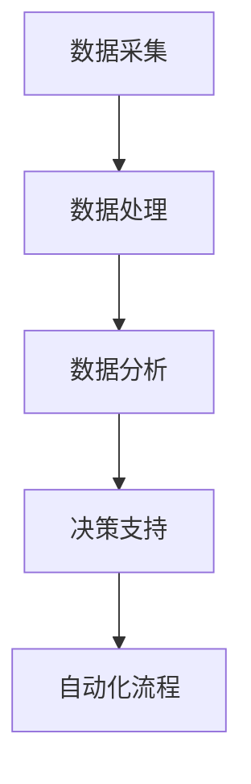

                 

# 开发智能化的金融产品生命周期管理平台

## 关键词
智能化、金融产品、生命周期管理、平台开发、数据驱动、人工智能

## 摘要
智能化的金融产品生命周期管理平台是金融行业数字化转型的重要组成部分。本文从背景与问题背景出发，详细分析了传统金融产品管理的痛点以及智能化管理的需求。通过核心概念的讲解，阐述了智能化管理平台的关键技术与实现方式。结合具体的算法原理与系统架构设计，深入探讨了平台开发的实践过程。最后，通过项目实战和总结，提出了平台开发的最佳实践建议和未来发展方向。

---

# 第一部分: 开发智能化的金融产品生命周期管理平台概述

## 第1章: 金融产品生命周期管理平台的背景与问题背景

### 1.1 问题背景

#### 1.1.1 传统金融产品管理的痛点
传统的金融产品管理流程存在以下痛点：
1. **人工依赖**：大部分操作依赖人工完成，效率低下，容易出错。
2. **信息孤岛**：不同部门和系统之间数据不互通，导致信息不对称。
3. **缺乏实时性**：无法实时监控和调整产品状态，影响决策效率。
4. **风险控制不足**：传统管理方式难以全面覆盖风险点，导致潜在风险难以及时发现和处理。

#### 1.1.2 智能化管理的需求驱动
随着金融行业的快速发展，智能化管理的需求日益迫切：
1. **提升效率**：通过自动化流程减少人工干预，提高管理效率。
2. **增强决策能力**：利用大数据和人工智能技术，提供更精准的决策支持。
3. **优化用户体验**：通过智能化服务，提升客户体验和满意度。
4. **降低风险**：通过实时监控和智能预警，有效降低金融产品的风险。

#### 1.1.3 金融行业数字化转型的必然性
数字化转型已成为金融行业的必然趋势：
1. **技术驱动**：人工智能、大数据等技术的快速发展为金融行业的智能化转型提供了技术支撑。
2. **政策支持**：监管机构鼓励金融机构采用数字化手段提升管理水平。
3. **市场竞争**：金融机构通过数字化转型提升竞争力，以应对市场的激烈竞争。

### 1.2 问题描述

#### 1.2.1 金融产品生命周期的复杂性
金融产品的生命周期包括多个阶段：
1. **设计与审批**：产品设计、风险评估、审批流程。
2. **发行与销售**：产品上线、销售推广。
3. **运营与监控**：产品运营、实时监控。
4. **终止与清算**：产品终止、资产清算。

#### 1.2.2 现有管理系统的局限性
现有金融产品管理系统存在以下问题：
1. **功能模块孤立**：各个功能模块之间缺乏协同，导致数据重复和流程断层。
2. **数据处理能力有限**：无法处理非结构化数据，难以支持复杂的数据分析需求。
3. **缺乏智能化**：系统缺乏智能决策能力，难以应对复杂多变的市场环境。

#### 1.2.3 数据孤岛与信息不对称的问题
数据孤岛和信息不对称导致以下问题：
1. **信息传递延迟**：数据在不同部门和系统之间传递不及时，导致决策延迟。
2. **数据利用率低**：数据资源未被充分利用，难以发挥数据的潜在价值。
3. **难以支持创新**：信息不对称限制了金融产品的创新能力和市场响应速度。

### 1.3 问题解决

#### 1.3.1 智能化平台的核心目标
智能化金融产品生命周期管理平台的核心目标包括：
1. **实现全流程自动化**：从产品设计到终止清算，全流程自动化处理。
2. **提供智能决策支持**：基于实时数据和历史数据，提供智能决策支持。
3. **支持快速创新**：通过灵活的系统架构，快速响应市场需求，支持产品创新。

#### 1.3.2 数据驱动的决策支持
数据驱动的决策支持体现在以下几个方面：
1. **实时数据分析**：通过实时数据分析，快速识别市场机会和风险。
2. **预测与模拟**：利用机器学习模型进行预测和模拟，优化产品设计和运营策略。
3. **个性化推荐**：基于客户数据，提供个性化的产品推荐和定制化服务。

#### 1.3.3 自动化流程管理的实现路径
自动化流程管理的实现路径包括：
1. **流程标准化**：对现有的业务流程进行标准化，消除冗余和不合理的步骤。
2. **系统集成**：通过系统集成，实现不同部门和系统的协同工作。
3. **引入RPA技术**：利用机器人流程自动化技术，实现业务流程的自动化处理。

### 1.4 边界与外延

#### 1.4.1 平台的功能边界
平台的功能边界包括：
1. **核心功能**：产品设计、审批、发行、销售、运营、监控、终止、清算。
2. **辅助功能**：数据采集、数据处理、数据分析、决策支持、报告生成。
3. **用户角色**：产品经理、风险管理人员、运营人员、客户。

#### 1.4.2 与其它系统的交互边界
与其它系统的交互边界包括：
1. **客户系统**：与客户交互的前端系统，如手机银行、网上银行。
2. **第三方支付系统**：与支付平台的接口，如支付宝、微信支付。
3. **监管系统**：与金融监管机构的数据接口。

#### 1.4.3 平台的可扩展性与外延性
平台的可扩展性与外延性体现在：
1. **模块化设计**：各功能模块独立开发，便于后续扩展和升级。
2. **灵活配置**：支持多种配置方式，适应不同业务需求。
3. **接口开放**：提供丰富的API接口，便于与其他系统集成和扩展。

### 1.5 概念结构与核心要素

#### 1.5.1 平台的核心组成模块
平台的核心组成模块包括：
1. **数据采集模块**：负责采集各种来源的数据，包括结构化数据和非结构化数据。
2. **数据处理模块**：对采集的数据进行清洗、转换和存储，确保数据的准确性和一致性。
3. **数据分析模块**：利用大数据和人工智能技术，对数据进行分析和挖掘，生成决策支持信息。
4. **自动化流程模块**：根据分析结果，自动执行相应的业务流程。
5. **决策支持模块**：为用户提供智能化的决策支持，包括预测和推荐功能。

#### 1.5.2 各模块之间的关系
模块之间的关系可以用以下流程图表示：

#### 1.5.3 核心要素的定义与属性
核心要素的定义与属性如下表所示：

| 概念 | 属性 | 特征 |
|------|------|------|
| 数据采集 | 数据来源 | 结构化数据、非结构化数据 |
| 数据处理 | 处理方式 | 清洗、转换、存储 |
| 数据分析 | 分析方法 | 机器学习、统计分析 |
| 自动化流程 | 执行方式 | 机器学习、规则引擎 |
| 决策支持 | 决策依据 | 实时数据、历史数据 |

### 1.6 本章小结
本章主要介绍了开发智能化的金融产品生命周期管理平台的背景与问题背景。通过分析传统金融产品管理的痛点，提出了智能化管理的需求和目标。同时，详细描述了平台的功能边界、核心组成模块及其之间的关系，为后续章节的深入分析奠定了基础。

---

接下来，我们将继续分析平台的核心概念与联系，包括核心概念原理、概念属性特征对比表、ER实体关系图等内容。如果您对本章内容有疑问或需要进一步解释，请随时提出。

