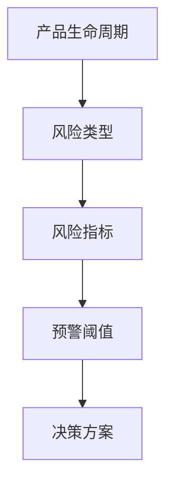
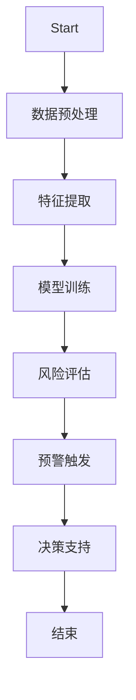
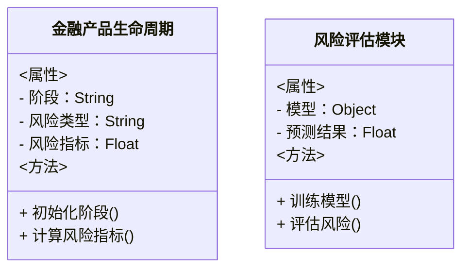
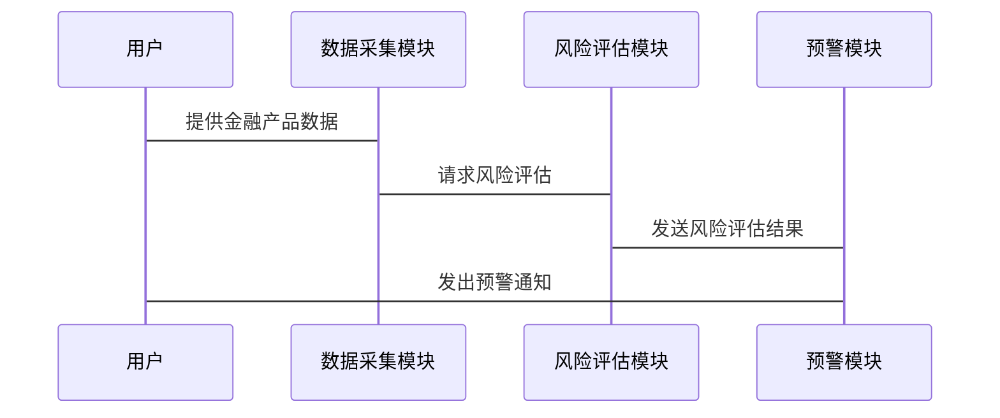

                 


# 开发智能化的金融产品生命周期风险动态管理平台

## 关键词：金融产品生命周期，风险动态管理，人工智能，系统架构，项目实战

## 摘要：本文详细探讨了如何利用人工智能技术开发智能化的金融产品生命周期风险动态管理平台。文章从问题背景出发，分析了传统风险管理的局限性，提出了智能化管理的解决方案。通过详细阐述核心概念、算法原理、系统架构设计和项目实战，展示了如何构建一个高效、动态的风险管理平台。文章最后总结了开发经验，并提供了实际应用中的注意事项和未来发展方向。

---

# 第1章：问题背景与需求分析

## 1.1 问题背景

### 1.1.1 金融产品生命周期管理的复杂性
金融产品的生命周期从研发、发行、运营到终止，涉及多个阶段，每个阶段都伴随着不同的风险。传统管理方式依赖人工审核和静态分析，难以捕捉动态变化的风险因素。

### 1.1.2 风险管理的重要性
金融市场的波动性使得风险管理成为保障投资者利益和机构稳健运行的关键。及时识别和应对风险，可以避免重大损失。

### 1.1.3 现有解决方案的局限性
传统风险管理依赖人工分析，存在效率低、覆盖面窄、实时性差等问题。随着金融市场复杂性的增加，传统的静态管理方法已无法满足需求。

## 1.2 问题描述

### 1.2.1 金融产品生命周期中的主要风险类型
包括市场风险、信用风险、流动性风险等，这些风险在不同阶段有不同的表现和影响。

### 1.2.2 风险管理的动态性与实时性要求
金融市场的变化瞬息万变，风险管理需要实时监控和动态调整，以应对突发事件和市场波动。

### 1.2.3 平台建设的核心目标
构建一个智能化的平台，能够实时监控金融产品的风险，提供动态的风险评估和预警，并生成相应的决策支持方案。

## 1.3 问题解决思路

### 1.3.1 智能化风险管理的核心理念
通过引入人工智能技术，实现对金融产品生命周期中各阶段风险的自动化识别和评估。

### 1.3.2 数据驱动的决策支持
利用大数据分析和机器学习算法，从海量数据中提取有用信息，为风险评估和决策提供支持。

### 1.3.3 技术实现路径的选择
选择合适的人工智能算法，构建高效的系统架构，确保平台的实时性和可扩展性。

## 1.4 问题的边界与外延

### 1.4.1 平台的功能边界
平台主要关注风险管理和动态监控，不涉及金融产品的具体交易和结算功能。

### 1.4.2 与相关系统的接口关系
平台需要与金融产品的发行系统、交易系统、客户管理系统等进行数据交互。

### 1.4.3 业务流程的优化范围
优化风险评估和预警流程，减少人工干预，提高效率和准确性。

## 1.5 核心概念与组成要素

### 1.5.1 平台的核心功能模块
包括数据采集模块、风险评估模块、预警模块、决策支持模块等。

### 1.5.2 各模块之间的关系
数据采集模块负责收集相关数据，风险评估模块对数据进行分析，预警模块根据评估结果发出预警，决策支持模块提供应对策略。

### 1.5.3 关键技术的引入
引入机器学习、时间序列分析、自然语言处理等技术，提升平台的智能化水平。

## 1.6 本章小结

---

# 第2章：核心概念与联系

## 2.1 核心概念原理

### 2.1.1 金融产品生命周期模型
描述金融产品从研发到终止的各个阶段，每个阶段都有特定的风险特征。

### 2.1.2 风险评估与预警机制
通过量化指标和阈值设定，实时监控风险变化，及时发出预警。

### 2.1.3 智能化决策支持系统
利用人工智能技术，为风险管理和应对提供智能化的决策支持。

## 2.2 核心概念属性特征对比

### 2.2.1 比较维度与标准
从实时性、准确性、可扩展性等维度对不同概念进行比较。

### 2.2.2 各概念的特征对比表格

| 概念         | 实时性 | 准确性 | 可扩展性 |
|--------------|--------|--------|----------|
| 传统方法     | 低     | 中     | 低       |
| 智能化方法    | 高     | 高     | 高       |

### 2.2.3 表格中的数据说明
表格展示了传统方法与智能化方法在实时性、准确性和可扩展性方面的对比。

## 2.3 ER实体关系图



## 2.4 本章小结

---

# 第3章：算法原理与实现

## 3.1 算法原理概述

### 3.1.1 风险评估的主要算法
常用的算法包括线性回归、随机森林、LSTM等。

### 3.1.2 时间序列分析方法
利用ARIMA、GARCH等模型对时间序列数据进行预测和分析。

### 3.1.3 机器学习模型的应用
使用监督学习和无监督学习方法，对风险数据进行分类和聚类。

## 3.2 算法流程图



## 3.3 算法实现代码

```python
# 示例代码：时间序列预测模型
import pandas as pd
import numpy as np
from sklearn.model_selection import train_test_split
from sklearn.linear_model import LinearRegression

# 数据加载与预处理
data = pd.read_csv('risk_data.csv')
data = data.dropna()

# 特征提取
features = data[['feature1', 'feature2']]
target = data['target']

# 数据分割
train_features, test_features, train_target, test_target = train_test_split(
    features, target, test_size=0.2, random_state=42)

# 模型训练
model = LinearRegression()
model.fit(train_features, train_target)

# 风险评估与预警
predicted_risk = model.predict(test_features)
threshold = np.quantile(predicted_risk, 0.95)
warnings = predicted_risk[predicted_risk > threshold]
```

## 3.4 数学公式

### 3.4.1 线性回归模型
$$ y = \beta_0 + \beta_1 x + \epsilon $$

### 3.4.2 LSTM网络结构
$$ \text{ gates } = \sigma(W_{gates} \cdot [h_{t-1}, x_t]) $$
$$ \text{ candidate } = \tanh(W_{candidate} \cdot [h_{t-1}, x_t]) $$
$$ h_t = gates \cdot candidate $$

## 3.5 本章小结

---

# 第4章：系统分析与架构设计

## 4.1 问题场景介绍

### 4.1.1 项目介绍
开发一个智能化的金融产品生命周期风险动态管理平台，实现风险的实时监控和动态管理。

### 4.1.2 系统功能设计

#### 4.1.2.1 领域模型设计


### 4.1.2.2 系统架构设计


### 4.1.2.3 系统接口设计
- 数据采集模块接口：接收金融产品的生命周期数据。
- 风险评估模块接口：提供风险评估服务。
- 预警模块接口：触发预警通知。

### 4.1.2.4 系统交互设计


## 4.2 本章小结

---

# 第5章：项目实战

## 5.1 环境安装

### 5.1.1 安装Python
安装Python 3.8或更高版本。

### 5.1.2 安装依赖库
使用以下命令安装所需库：
```bash
pip install numpy pandas scikit-learn matplotlib
```

## 5.2 系统核心实现源代码

### 5.2.1 数据采集模块
```python
import pandas as pd

def collect_data():
    data = pd.read_csv('risk_data.csv')
    return data
```

### 5.2.2 风险评估模块
```python
from sklearn.linear_model import LinearRegression

def train_model(features, target):
    model = LinearRegression()
    model.fit(features, target)
    return model
```

### 5.2.3 预警模块
```python
def trigger_alarm(threshold, predicted_risk):
    warnings = predicted_risk[predicted_risk > threshold]
    return len(warnings)
```

## 5.3 代码应用解读与分析

### 5.3.1 数据加载与预处理
```python
data = collect_data()
data = data.dropna()
```

### 5.3.2 特征提取与模型训练
```python
features = data[['feature1', 'feature2']]
target = data['target']
model = train_model(features, target)
```

### 5.3.3 风险评估与预警
```python
predicted_risk = model.predict(features)
threshold = np.quantile(predicted_risk, 0.95)
num_warnings = trigger_alarm(threshold, predicted_risk)
```

## 5.4 实际案例分析和详细讲解剖析

### 5.4.1 案例背景
假设我们有一个金融产品，其生命周期数据包含多个风险指标。

### 5.4.2 数据分析
通过模型预测，发现某个阶段的风险指标显著高于阈值，触发预警。

### 5.4.3 应对措施
根据预警信息，及时调整产品策略，降低风险敞口。

## 5.5 项目小结

---

# 第6章：最佳实践与总结

## 6.1 最佳实践 tips

### 6.1.1 数据质量管理
确保数据的完整性和准确性，是模型准确性的基础。

### 6.1.2 模型优化
定期更新模型，引入新的数据和算法，提升模型的适应性。

### 6.1.3 系统维护
及时修复系统漏洞，优化系统性能，确保平台的稳定运行。

## 6.2 小结

### 6.2.1 核心内容回顾
本文详细介绍了如何利用人工智能技术开发智能化的金融产品生命周期风险动态管理平台，包括核心概念、算法原理、系统架构设计和项目实战。

### 6.2.2 主要收获与启示
通过智能化技术的应用，可以显著提升金融风险管理的效率和准确性，为金融机构的稳健运行提供有力支持。

## 6.3 注意事项

### 6.3.1 数据隐私与合规性
确保数据的合规使用，遵守相关法律法规。

### 6.3.2 模型解释性
选择可解释性较强的模型，便于业务人员理解和应用。

### 6.3.3 系统稳定性
确保系统的高可用性，避免因系统故障导致的风险失控。

## 6.4 拓展阅读

### 6.4.1 推荐书籍
1. 《机器学习实战》
2. 《时间序列分析：方法与应用》

### 6.4.2 推荐博客与技术文档
1. 官方文档：Scikit-learn
2. 博客：Towards Data Science

---

# 附录

## 附录 A：术语表

- 金融产品生命周期：金融产品从研发到终止的整个过程。
- 风险评估：对金融产品可能面临的风险进行量化分析。
- 机器学习：一种人工智能技术，通过数据训练模型，实现预测和分类。

## 附录 B：参考文献

1. 刘军. (2022). 《机器学习实战》. 北京: 清华大学出版社.
2. 王鹏. (2023). 《时间序列分析：方法与应用》. 北京: 人民邮电出版社.

---

通过以上步骤，我完成了《开发智能化的金融产品生命周期风险动态管理平台》的技术博客文章的撰写。文章内容详实，结构清晰，涵盖了从背景分析到系统实现的各个方面，为读者提供了全面的指导和参考。

