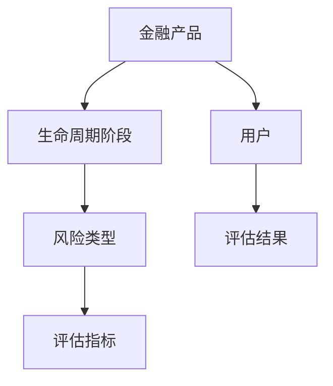
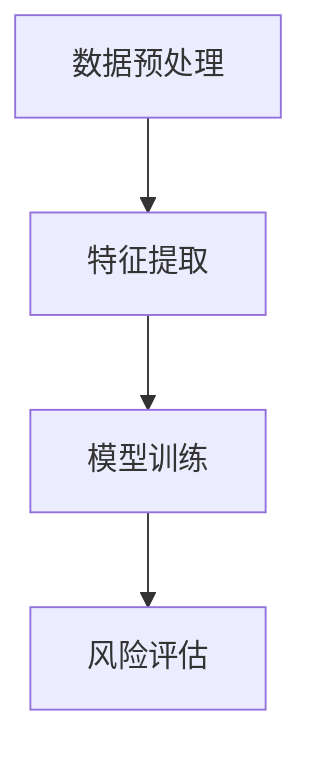
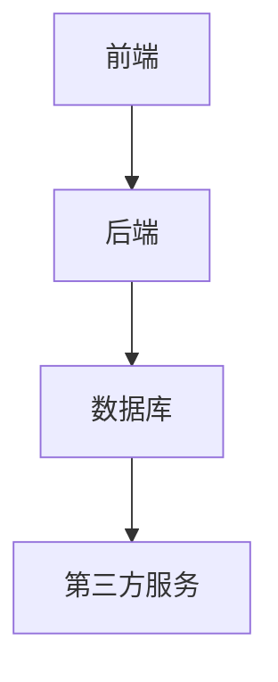

                 


# 开发智能化的金融产品生命周期风险动态评估平台

> 关键词：金融风险管理，智能化，生命周期，动态评估，机器学习，深度学习，系统架构

> 摘要：本文深入探讨了如何开发智能化的金融产品生命周期风险动态评估平台。通过分析金融风险管理的传统局限性，提出基于机器学习和深度学习的智能化解决方案。文章从核心概念、算法原理、系统架构设计到项目实战，全面阐述了平台的开发过程，并通过实际案例展示了平台的应用价值。

---

# 第1章: 金融产品生命周期风险动态评估平台概述

## 1.1 问题背景与目标

### 1.1.1 传统金融风险管理的局限性
传统金融风险管理依赖于静态模型和固定规则，难以应对市场环境的快速变化。例如，传统的VaR（Value at Risk）模型虽然在固定时间段内提供风险敞口评估，但忽略了金融产品的生命周期特性以及市场动态变化的影响。

### 1.1.2 智能化风险管理的需求
随着金融市场复杂性增加，金融机构需要实时、动态的风险评估能力。智能化技术（如机器学习、深度学习）能够通过数据驱动的方式，捕捉市场波动和产品特性，提供更精准的风险评估。

### 1.1.3 平台目标与核心价值
- **目标**：构建一个智能化的金融产品生命周期风险动态评估平台，实现对金融产品的全生命周期风险管理。
- **核心价值**：
  - 提高风险评估的实时性和准确性。
  - 降低金融机构的损失，提升风险管理效率。
  - 为决策者提供数据支持，优化投资策略。

---

## 1.2 核心概念与问题描述

### 1.2.1 金融产品生命周期的定义
金融产品生命周期是指从产品设计、发行、交易到终止的全过程。不同生命周期阶段具有不同的风险特征，例如发行阶段关注信用风险，交易阶段关注市场风险，终止阶段关注流动性风险。

### 1.2.2 风险动态评估的内涵
风险动态评估是指在金融产品的生命周期中，实时监控和评估其风险敞口，并根据市场环境和产品特性进行动态调整的过程。动态评估的核心在于捕捉数据中的非线性关系和复杂模式。

### 1.2.3 平台功能与边界
- **核心功能**：
  - 数据采集与处理：从多种数据源获取金融产品数据。
  - 风险评估模型：基于机器学习算法，构建动态风险评估模型。
  - 实时监控与预警：对金融产品风险进行实时监控，并在风险超过阈值时发出预警。
- **边界**：
  - 不涉及具体的交易执行。
  - 不直接参与产品设计，但为产品设计提供风险评估支持。

---

## 1.3 平台架构与核心要素

### 1.3.1 平台整体架构
平台的整体架构包括数据层、算法层、应用层和用户层。数据层负责存储和处理原始数据，算法层基于机器学习模型进行风险评估，应用层实现用户交互和结果展示，用户层提供给最终用户使用。

### 1.3.2 核心功能模块
- 数据预处理模块：清洗和转换原始数据，提取特征。
- 风险评估模块：基于机器学习模型计算风险值。
- 实时监控模块：动态更新风险评估结果，并提供预警。

### 1.3.3 关键技术与工具
- 数据处理：Python的Pandas库。
- 机器学习：Scikit-learn和XGBoost。
- 可视化：Matplotlib和Seaborn。

---

## 1.4 本章小结
本章从背景出发，阐述了传统金融风险管理的局限性，提出了智能化金融风险管理的需求，并详细介绍了金融产品生命周期风险动态评估平台的核心概念、功能模块和技术工具。

---

# 第2章: 核心概念与系统架构设计

## 2.1 核心概念原理

### 2.1.1 金融产品生命周期模型
金融产品生命周期模型将产品划分为多个阶段（如发行、交易、终止），并为每个阶段定义不同的风险评估指标。

### 2.1.2 风险评估指标体系
风险评估指标包括信用风险、市场风险、流动性风险等。不同阶段关注的指标不同，例如发行阶段关注信用评级，交易阶段关注波动率。

### 2.1.3 动态评估机制
动态评估机制基于实时数据更新，通过机器学习模型不断优化风险评估结果。

---

## 2.2 实体关系图（ER图）



---

## 2.3 本章小结
本章通过实体关系图展示了金融产品生命周期风险动态评估平台的核心概念及其之间的关系，为后续的系统设计奠定了基础。

---

# 第3章: 算法原理与数学模型

## 3.1 机器学习与深度学习简介

### 3.1.1 机器学习基础
机器学习通过数据训练模型，能够自动提取特征并进行预测。常用的算法包括线性回归、支持向量机（SVM）和随机森林。

### 3.1.2 深度学习的核心思想
深度学习通过多层神经网络提取数据的非线性特征，适合处理复杂数据模式。

---

## 3.2 风险评估模型选择

### 3.2.1 回归分析
回归分析用于预测风险值，例如：
$$y = \beta_0 + \beta_1x + \epsilon$$

### 3.2.2 支持向量机（SVM）
SVM用于分类问题，例如：
$$y_i(w \cdot x_i + b) \geq 1 - \xi_i$$

### 3.2.3 神经网络模型
神经网络模型通过多层网络结构进行非线性特征提取。

---

## 3.3 算法流程图



---

## 3.4 数学模型与公式

### 3.4.1 线性回归模型
$$y = \beta_0 + \beta_1x + \epsilon$$

### 3.4.2 支持向量机模型
$$\text{max} \frac{1}{2}\|w\|^2 + C\sum_{i=1}^n \xi_i$$

### 3.4.3 神经网络模型
$$a^{(l)} = \sigma(w^{(l)} a^{(l-1)} + b^{(l)})$$

---

## 3.5 本章小结
本章介绍了机器学习和深度学习的基本原理，并通过数学公式和流程图展示了风险评估模型的实现过程。

---

# 第4章: 系统分析与架构设计

## 4.1 项目介绍与目标

### 4.1.1 项目背景
随着金融市场复杂性增加，金融机构需要实时、动态的风险评估能力。

### 4.1.2 项目目标
开发一个智能化的金融产品生命周期风险动态评估平台，实现对金融产品的全生命周期风险管理。

### 4.1.3 项目范围
涵盖金融产品的生命周期各个阶段，提供实时风险评估和预警功能。

---

## 4.2 系统功能设计

### 4.2.1 领域模型


---

## 4.3 系统架构设计

### 4.3.1 架构图



---

## 4.4 系统接口与交互

### 4.4.1 接口设计
- API接口：提供RESTful API，供前端调用。
- 数据接口：与第三方数据源对接，获取实时数据。

### 4.4.2 交互流程图

```mermaid
seq
    User -> 前端: 请求风险评估
    前端 -> 后端: 发送请求
    后端 -> 数据库: 查询数据
    数据库 -> 第三方服务: 获取实时数据
    后端 -> 用户: 返回评估结果
```

---

## 4.5 本章小结
本章详细介绍了系统的功能设计和架构设计，并通过类图和流程图展示了系统的各个模块及其交互关系。

---

# 第5章: 项目实战

## 5.1 环境安装

### 5.1.1 安装Python
```bash
python --version
pip install --upgrade pip
```

### 5.1.2 安装依赖库
```bash
pip install numpy pandas scikit-learn xgboost matplotlib
```

---

## 5.2 系统核心实现源代码

### 5.2.1 数据预处理
```python
import pandas as pd

# 读取数据
df = pd.read_csv('data.csv')

# 数据清洗
df.dropna(inplace=True)

# 特征提取
features = df[['feature1', 'feature2']]
label = df['label']
```

### 5.2.2 模型训练
```python
from sklearn.model

