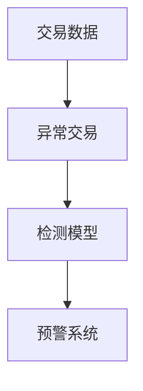
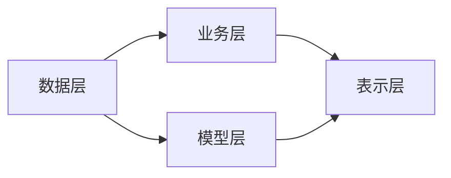

                 


# 开发智能化的金融市场异常交易检测模型

## 关键词：金融市场、异常交易、检测模型、机器学习、深度学习、交易数据、实时检测

## 摘要：金融市场异常交易检测是维护市场公平性和稳定性的关键任务。本文系统地探讨了异常交易检测的核心概念、算法原理、系统架构及项目实现。通过基于孤立森林算法的模型，结合深度学习技术，构建了一个智能化的异常交易检测系统。文章详细分析了模型的实现步骤，并通过实际案例展示了系统的应用价值，最后总结了模型的优势与优化方向。

---

# 第1章：金融市场异常交易检测的背景与挑战

## 1.1 异常交易的背景与重要性

金融市场是现代经济体系的核心，其稳定性和公平性至关重要。异常交易，如操纵市场、 insider trading 和高频交易，严重破坏市场秩序，损害投资者利益。及时检测异常交易，对维护市场健康至关重要。

## 1.2 异常交易的表现形式

### 1.2.1 市场操纵
通过虚假交易或散布信息影响股价，谋取不当利益。

### 1.2.2 内幕交易
利用未公开信息进行交易，违反公平原则。

### 1.2.3 高频交易异常
高频交易可能引发闪崩，造成市场波动。

## 1.3 异常交易检测的必要性

### 1.3.1 维护市场公平
防止 insider trading 和 market manipulation。

### 1.3.2 保障投资者权益
保护中小投资者免受大资金操控的损失。

### 1.3.3 维持市场稳定性
防范系统性风险，避免市场剧烈波动。

## 1.4 异常交易检测的挑战

### 1.4.1 数据复杂性
高频交易、大数据量和多维度特征增加检测难度。

### 1.4.2 模型泛化能力
金融市场数据变化快，模型需具备良好的适应性。

### 1.4.3 实时性要求
异常交易检测需快速响应，避免损失扩大。

---

# 第2章：异常交易检测的核心概念与联系

## 2.1 异常交易检测的定义与特征

### 2.1.1 定义
检测交易数据中的异常行为，识别潜在的非法交易。

### 2.1.2 特征
- 交易量突变：短时间内大量买入或卖出。
- 价格异常：价格波动远超正常范围。
- 时间模式：交易时间集中或异常。

## 2.2 异常检测的分类与方法

### 2.2.1 分类
- 基于统计的方法：如Z-score，适用于正态分布数据。
- 基于机器学习：如孤立森林、SVM，适用于复杂场景。
- 基于深度学习：如LSTM，适用于时间序列数据。

### 2.2.2 方法对比
| 方法         | 优点                          | 缺点                          |
|--------------|-------------------------------|-------------------------------|
| 统计方法     | 实现简单，适合正态分布数据    | 对复杂分布适应性差            |
| 机器学习     | 高准确性，适用多种数据类型    | 需大量数据，计算复杂           |
| 深度学习     | 能捕捉复杂模式，适合时间序列  | 训练时间长，需要大量计算资源    |

## 2.3 实体关系图

### 2.3.1 ER图展示


---

# 第3章：异常交易检测的算法原理与实现

## 3.1 基于孤立森林的异常检测

### 3.1.1 算法原理
孤立森林通过构建决策树，将数据点隔离，判断是否为异常。其核心思想是通过随机选择特征和样本，建立森林，计算每个点的异常评分。

### 3.1.2 算法步骤
1. 随机选择特征和样本，构建决策树。
2. 计算每个样本的异常评分，分数越低，异常可能性越大。
3. 对所有样本进行评分，筛选出异常交易。

## 3.2 Python代码实现

### 3.2.1 示例代码
```python
import numpy as np
from sklearn.ensemble import IsolationForest

# 生成示例数据
X = np.random.randn(100, 2)
X[-1] = [10, 10]  # 添加一个异常点

# 初始化孤立森林模型
iforest = IsolationForest(n_estimators=10, random_state=42)

# 训练模型
iforest.fit(X)

# 预测异常标记
y_pred = iforest.predict(X)
print("异常标记：", y_pred)
```

## 3.3 算法数学模型

### 3.3.1 异常评分公式
$$ \text{异常评分} = \frac{1}{\text{树的路径长度}} $$

---

# 第4章：异常交易检测的系统架构与设计

## 4.1 系统功能模块

### 4.1.1 数据采集模块
实时采集交易数据，处理清洗。

### 4.1.2 特征提取模块
从交易数据中提取关键特征，如交易量、价格波动。

### 4.1.3 异常检测模块
应用检测模型，识别异常交易。

### 4.1.4 预警模块
生成预警信息，通知监管机构。

## 4.2 系统架构设计

### 4.2.1 分层架构
- 数据层：存储原始数据。
- 业务层：处理交易数据。
- 表示层：展示检测结果。

### 4.2.2 模块交互


---

# 第5章：异常交易检测的项目实战

## 5.1 环境搭建与安装

### 5.1.1 安装依赖
```bash
pip install numpy pandas scikit-learn
```

## 5.2 核心功能实现

### 5.2.1 数据预处理
清洗数据，处理缺失值和异常值。

### 5.2.2 模型训练与测试
训练孤立森林模型，测试其准确率和召回率。

## 5.3 案例分析

### 5.3.1 数据分析
分析交易数据，识别异常点。

### 5.3.2 模型评估
评估模型性能，优化参数。

---

# 第6章：异常交易检测的扩展与优化

## 6.1 模型的局限性与改进

### 6.1.1 局限性
孤立森林适用于低维数据，高维数据性能下降。

### 6.1.2 改进方向
引入图神经网络，捕捉更多关联性。

## 6.2 深度学习的应用

### 6.2.1 LSTM网络
处理时间序列数据，捕捉交易模式。

### 6.2.2 Transformer架构
捕捉长距离依赖关系，提升检测准确性。

## 6.3 总结与关键点

### 6.3.1 关键技术总结
- 数据处理与特征提取
- 孤立森林与深度学习模型
- 系统架构设计与优化

---

# 第7章：异常交易检测的总结与展望

## 7.1 总结

### 7.1.1 核心内容回顾
- 介绍了异常交易检测的重要性
- 讲解了多种算法及其优缺点
- 展示了系统的架构设计与实现

## 7.2 未来展望

### 7.2.1 研究方向
- 更高效的算法
- 多模态数据融合
- 智能化预警系统

### 7.2.2 学习建议
建议深入研究时间序列分析和图神经网络，探索新的检测方法。

---

通过以上结构，文章详细讲解了异常交易检测的各个方面，从理论到实践，为读者提供了全面的知识和实用的代码示例。希望这篇文章能帮助读者理解并掌握开发智能化的金融市场异常交易检测模型的关键技术和方法。

