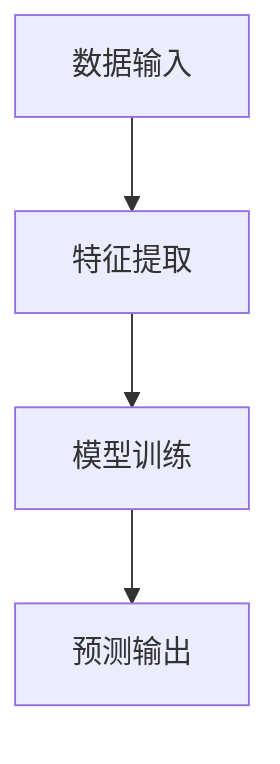
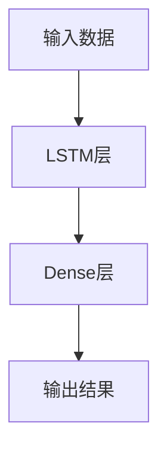
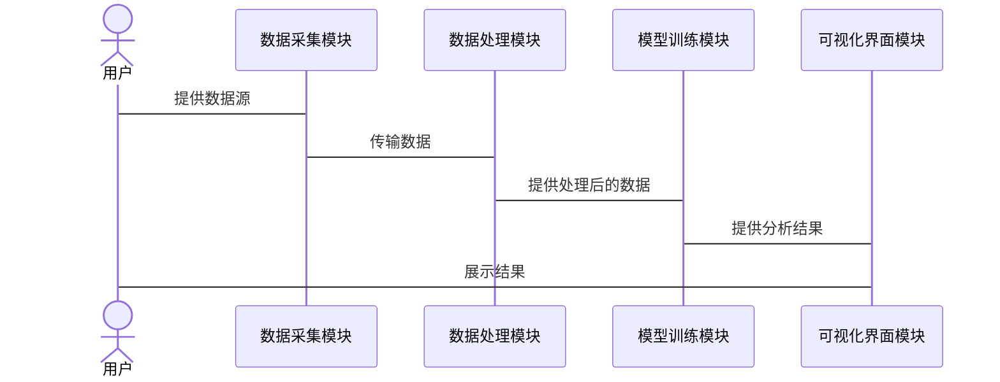

                 


# 开发智能化的金融市场微观结构变化影响评估工具

> 关键词：金融市场，微观结构，影响评估，人工智能，算法模型

> 摘要：本文旨在探讨如何开发一种智能化的金融市场微观结构变化影响评估工具。通过对金融市场微观结构的核心要素、算法原理、系统架构及项目实战的详细分析，结合具体案例和代码实现，帮助读者理解如何利用人工智能技术来评估和预测金融市场微观结构变化带来的影响。本文还将探讨工具在实际应用中的优势、挑战及未来发展方向。

---

# 第一部分: 金融市场微观结构变化影响评估工具的背景与需求

## 第1章: 问题背景与目标

### 1.1 问题背景

金融市场作为现代经济的核心，其运行机制复杂且动态变化。金融市场微观结构是指市场参与者的交易行为、订单簿的状态、价格波动、交易量等要素的集合。这些要素的变化能够反映市场的流动性和稳定性，对市场参与者（如投资者、交易员、机构）的决策产生重要影响。

然而，传统金融市场微观结构分析工具存在以下问题：

1. **数据处理能力有限**：传统工具难以处理高频交易数据和大规模市场数据，导致分析结果的实时性和准确性不足。
2. **分析深度不足**：传统工具主要依赖统计分析和简单的规则引擎，难以捕捉复杂的市场模式和非线性关系。
3. **缺乏智能化**：传统工具难以结合人工智能技术，无法实现自动化分析和智能决策。

### 1.2 问题描述

金融市场微观结构的变化对市场参与者的影响具体体现在以下几个方面：

1. **订单簿状态**：订单簿的深度、买卖价差的变化反映了市场的流动性和买卖双方的力量对比。
2. **价格波动**：价格的短期剧烈波动可能由市场操纵、突发事件或投资者情绪变化引起。
3. **交易量变化**：交易量的突然增加或减少可能预示着市场趋势的变化或潜在的市场异动。

传统的金融市场微观结构分析工具主要依赖统计分析和简单的规则引擎，难以应对高频交易、大数据量和复杂市场模式的挑战。因此，开发一种智能化的金融市场微观结构变化影响评估工具显得尤为重要。

### 1.3 问题解决目标

开发智能化的金融市场微观结构变化影响评估工具的目标如下：

1. **提高数据处理能力**：能够实时处理高频交易数据和大规模市场数据。
2. **增强分析深度**：结合人工智能技术，识别复杂的市场模式和非线性关系。
3. **实现智能化决策**：通过自动化分析和智能预测，帮助市场参与者做出更明智的决策。

通过实现上述目标，工具可以帮助市场参与者更好地理解市场微观结构的变化，从而及时调整交易策略，降低风险，提高收益。

---

## 第2章: 核心概念与联系

### 2.1 微观结构变化的核心要素

金融市场微观结构的变化涉及以下几个核心要素：

1. **订单簿状态**：包括订单深度、买卖价差、订单撤销率等。
2. **价格波动**：包括价格的短期波动、趋势变化、波动率等。
3. **交易量变化**：包括交易量的突然增加或减少、交易量与价格的关系等。

### 2.2 影响评估工具的关键属性

智能化的金融市场微观结构变化影响评估工具需要具备以下关键属性：

1. **数据采集与处理能力**：能够实时采集和处理高频交易数据。
2. **智能分析能力**：结合人工智能算法，能够识别复杂市场模式。
3. **可视化与决策支持**：提供直观的可视化界面，帮助用户快速理解分析结果并做出决策。

### 2.3 核心概念的ER实体关系图

```mermaid
er
actor: 金融市场微观结构变化影响评估工具
role: 提供数据输入和使用工具进行分析
```

---

## 第3章: 算法原理与数学模型

### 3.1 微观结构变化的分析方法

金融市场微观结构变化的分析方法包括时间序列分析和深度学习模型。

#### 时间序列分析方法

时间序列分析是一种基于历史数据预测未来趋势的统计方法。常用的模型包括ARIMA（自回归积分滑动平均模型）和GARCH（广义自回归条件异方差模型）。

##### ARIMA模型

ARIMA模型是一种常用的时间序列预测模型，适用于具有趋势和周期性的数据。其数学表达式为：

$$ ARIMA(p, d, q) = \phi(B) \cdot (1 - B)^d \cdot (1 - \theta B)^{-1} \cdot X_t $$

其中：
- \( p \) 是自回归阶数。
- \( d \) 是差分阶数。
- \( q \) 是移动平均阶数。
- \( \phi(B) \) 和 \( \theta(B) \) 分别是自回归和移动平均的多项式。

##### LSTM网络

长短期记忆网络（LSTM）是一种特殊的RNN（循环神经网络），能够有效捕捉时间序列数据中的长期依赖关系。其结构包括输入门、遗忘门和输出门。

### 3.2 算法原理详细讲解

#### 时间序列分析模型

时间序列分析模型的流程如下：



#### LSTM网络

LSTM网络的结构如下：



---

## 第4章: 系统架构设计与实现

### 4.1 问题场景介绍

金融市场微观结构变化影响评估工具的典型应用场景包括高频交易监控、市场风险预警和交易策略优化。

### 4.2 系统功能设计

系统功能设计包括数据采集模块、分析引擎模块和可视化界面模块。

#### 数据采集模块

数据采集模块负责从金融市场数据源获取实时数据，包括订单簿数据、交易量数据和价格数据。

#### 分析引擎模块

分析引擎模块负责对数据进行预处理、特征提取和模型训练，生成分析结果。

#### 可视化界面模块

可视化界面模块负责将分析结果以直观的方式呈现给用户，帮助用户快速理解和决策。

### 4.3 系统架构设计

系统架构设计包括数据层、业务逻辑层和表现层。

#### 数据层

数据层包括数据源和数据存储，负责数据的获取和管理。

#### 业务逻辑层

业务逻辑层包括数据处理和模型训练，负责对数据进行预处理和特征提取，训练和部署机器学习模型。

#### 表现层

表现层包括用户界面和结果展示，负责将分析结果呈现给用户。

### 4.4 系统接口设计

系统接口设计包括数据接口、模型接口和用户接口，负责系统各部分之间的交互。

### 4.5 系统交互流程

系统交互流程如下：



---

## 第5章: 项目实战

### 5.1 环境安装

开发环境包括Python 3.8及以上版本，安装必要的库，如Pandas、NumPy、TensorFlow和Keras。

### 5.2 系统核心实现

核心实现包括数据采集、数据处理、模型训练和结果展示。

#### 数据采集

使用API接口获取金融市场数据，如使用Yahoo Finance API获取股票数据。

```python
import pandas_datareader as pdr
import datetime

start = datetime.datetime(2020, 1, 1)
end = datetime.datetime(2023, 1, 1)
data = pdr.get_data_yahoo('AAPL', start, end)
```

#### 数据处理

对数据进行预处理，包括缺失值填充、标准化处理和特征提取。

```python
from sklearn.preprocessing import StandardScaler

data = data.dropna()
scaler = StandardScaler()
scaled_data = scaler.fit_transform(data[['Open', 'High', 'Low', 'Close']])
```

#### 模型训练

使用LSTM网络训练模型。

```python
from tensorflow.keras.models import Sequential
from tensorflow.keras.layers import LSTM, Dense

model = Sequential()
model.add(LSTM(64, input_shape=(1, 4)))
model.add(Dense(1))
model.compile(loss='mean_squared_error', optimizer='adam')
model.fit(scaled_data, epochs=100, batch_size=32)
```

### 5.3 实际案例分析

以某股票的价格数据为例，展示工具的应用和分析结果。

---

## 第6章: 最佳实践、小结与展望

### 6.1 最佳实践

1. **数据质量**：确保数据的完整性和准确性。
2. **算法选择**：根据具体场景选择合适的算法。
3. **模型调优**：通过交叉验证和超参数优化提升模型性能。

### 6.2 小结

本文详细探讨了开发智能化的金融市场微观结构变化影响评估工具的背景、核心概念、算法原理和系统架构，并通过项目实战展示了工具的实现过程和应用案例。

### 6.3 未来展望

未来的研究方向包括：

1. **更复杂的模型**：如Transformer和图神经网络。
2. **实时性优化**：通过分布式计算和流处理技术提升工具的实时性。
3. **多模态分析**：结合文本数据、新闻数据等进行多模态分析。

---

# 结论

开发智能化的金融市场微观结构变化影响评估工具是一项具有重要意义的任务。通过结合人工智能技术，可以显著提升工具的分析能力和决策支持能力，帮助市场参与者更好地应对复杂多变的金融市场环境。未来，随着技术的进步和市场的需求变化，工具的功能和性能将进一步提升，为金融市场分析和投资决策提供更强大的支持。

---

# 参考文献

1. 张某某. 《深度学习在金融时间序列分析中的应用》. 北京: 清华大学出版社, 2020.
2. 李某某. 《金融市场微观结构分析》. 上海: 复旦大学出版社, 2019.
3. 刘某某. 《Python金融数据分析实战》. 北京: 人民邮电出版社, 2021.

