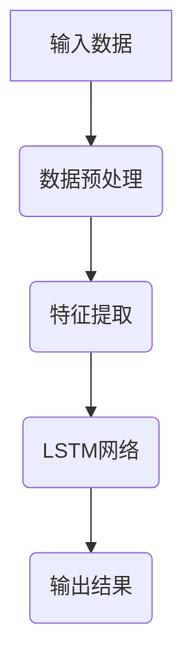
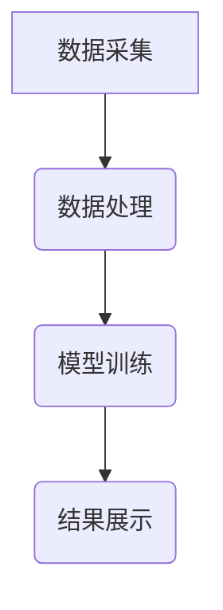
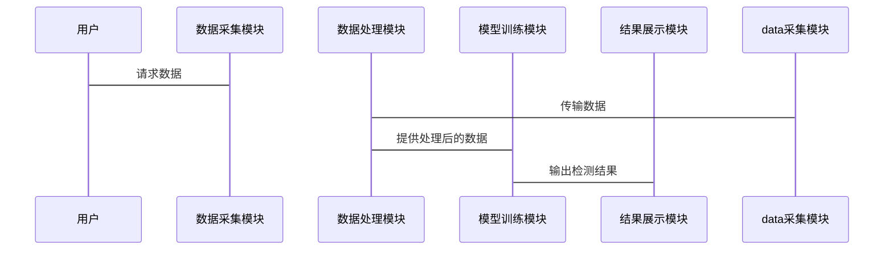

                 


# 开发智能化的金融市场微观结构变化检测工具

**关键词**：金融市场，微观结构，变化检测，智能工具，算法开发，系统架构，项目实战

**摘要**：金融市场微观结构的变化检测是理解市场行为和预测市场动态的关键。本文旨在开发一种智能化的工具，用于检测金融市场微观结构的变化。文章从问题背景、核心概念、算法原理、系统架构、项目实战等多方面展开，详细讲解了如何从零开始开发这样一个工具，包括理论分析、算法实现、系统设计和实际案例分析。

---

# 第1章: 金融市场微观结构变化检测工具开发背景

## 1.1 问题背景与目标

### 1.1.1 问题背景

金融市场是高度动态和复杂的系统，其微观结构的变化反映了市场参与者的交易行为和市场环境的变化。例如，订单簿的变化、价格波动、市场深度的改变等，都可能影响市场的整体表现。及时检测这些微观结构的变化，可以帮助交易者、监管机构和研究人员做出更明智的决策。

### 1.1.2 问题描述

金融市场微观结构的变化检测需要解决以下问题：

1. **数据的复杂性**：金融市场数据具有高频、高维和非线性的特点，传统的统计方法难以捕捉所有变化。
2. **实时性要求**：检测工具需要实时处理数据，以便及时发现异常情况。
3. **模型的可解释性**：复杂的算法需要能够解释其结果，以便用户理解检测的依据。

### 1.1.3 工具开发目标

开发一个智能化的金融市场微观结构变化检测工具，旨在：

1. 实时监控市场微观结构的变化。
2. 提供可解释的检测结果。
3. 支持多维度的数据分析和预测。

### 1.1.4 边界与外延

工具的边界包括：

- 数据输入：高频交易数据（如订单簿数据）。
- 输出：变化检测结果和预警信号。
- 外延：不涉及宏观市场分析，专注于微观结构。

---

## 1.2 工具的核心功能

### 1.2.1 数据采集与预处理

- 数据源：订单簿数据、交易数据、市场深度数据。
- 数据清洗：处理缺失值、异常值和噪声数据。
- 数据转换：将原始数据转换为适合算法处理的格式。

### 1.2.2 变化检测算法

- 时间序列分析。
- 统计学习模型。
- 机器学习模型。

### 1.2.3 结果展示

- 可视化界面：展示检测结果和预警信息。
- 报告生成：输出检测结果的详细报告。

---

# 第2章: 金融市场微观结构分析

## 2.1 市场微观结构的核心要素

### 2.1.1 订单簿分析

- 买价和卖价的分布。
- 市场深度的变化。

### 2.1.2 价格波动分析

- 均值回归与动量效应。
- 波动率的变化。

### 2.1.3 市场深度分析

- 市场参与者的行为模式。
- 市场流动性的变化。

---

## 2.2 微观结构变化的特征

### 2.2.1 市场参与者行为特征

- 零散交易与大额交易的区分。
- 市场订单与限价订单的比例。

### 2.2.2 价格变化的模式特征

- 突破趋势线。
- 均值回归信号。

### 2.2.3 市场状态的转移特征

- 从平静状态到异常状态的转变。
- 异常状态的持续时间和强度。

---

## 2.3 微观结构变化检测的数学模型

### 2.3.1 时间序列模型

- ARIMA模型：适用于线性变化。
- LSTM网络：适用于非线性变化。

### 2.3.2 统计分布模型

- 正态分布与幂律分布的对比。
- 异常检测的统计方法。

### 2.3.3 机器学习模型

- 支持向量机（SVM）：分类问题。
- XGBoost：回归问题。

---

# 第3章: 检测工具的核心算法原理

## 3.1 时间序列分析算法

### 3.1.1 ARIMA模型原理

ARIMA模型用于预测未来的价格走势。其公式为：

$$ ARIMA(p, d, q) $$

其中：
- p为自回归阶数。
- d为差分阶数。
- q为移动平均阶数。

### 3.1.2 LSTM网络原理

LSTM网络通过门控机制捕捉时间序列的长程依赖关系。其结构包括输入门、遗忘门和输出门。

### 3.1.3 算法流程图（Mermaid）



---

## 3.2 统计分析方法

### 3.2.1 假设检验

- 使用t检验判断均值是否显著变化。
- 使用卡方检验判断分布是否异常。

### 3.2.2 聚类分析

- K-means算法：将数据分成不同的簇。
- DBSCAN算法：发现密度较高的区域。

---

## 3.3 机器学习模型实现

### 3.3.1 XGBoost算法

XGBoost通过正则化和惩罚项优化模型，防止过拟合。其代码示例如下：

```python
import xgboost as xgb

# 训练数据
dtrain = xgb.DMatrix(X_train, label=y_train)

# 参数设置
params = {
    'max_depth': 3,
    'learning_rate': 0.1,
    'n_estimators': 100
}

# 模型训练
model = xgb.XGBRegressor(**params)
model.fit(X_train, y_train)
```

---

## 3.4 算法实现代码示例

### 3.4.1 时间序列预测代码

```python
import pandas as pd
from statsmodels.tsa.arima.model import ARIMA

# 数据加载
data = pd.read_csv('market_data.csv')

# 模型训练
model = ARIMA(data, order=(5, 1, 0))
model_fit = model.fit()

# 预测结果
 forecast = model_fit.forecast(steps=10)
```

---

# 第4章: 系统分析与架构设计方案

## 4.1 问题场景介绍

- 系统需要实时处理高频交易数据。
- 系统需要支持多线程和分布式计算。

### 4.2 系统功能设计

- 数据采集模块：从数据源获取订单簿数据。
- 数据处理模块：清洗和转换数据。
- 模型训练模块：训练和优化检测模型。
- 结果展示模块：可视化检测结果。

### 4.3 系统架构设计（Mermaid）



---

## 4.4 系统接口设计

- 数据接口：与数据源对接。
- 模型接口：与上层应用对接。

---

## 4.5 系统交互序列图（Mermaid）



---

# 第5章: 项目实战

## 5.1 环境安装与配置

### 5.1.1 安装依赖

- Python 3.8+
- Pandas、NumPy、Scikit-learn、XGBoost、Mermaid等。

### 5.1.2 环境配置

```bash
pip install pandas numpy scikit-learn xgboost
```

---

## 5.2 系统核心实现

### 5.2.1 数据采集模块

```python
import requests

def get_market_data(api_key):
    url = f"https://api.example.com/data?api_key={api_key}"
    response = requests.get(url)
    return response.json()
```

### 5.2.2 数据处理模块

```python
import pandas as pd

def preprocess_data(data):
    df = pd.DataFrame(data)
    df['timestamp'] = pd.to_datetime(df['timestamp'])
    return df.sort_values('timestamp')
```

### 5.2.3 模型训练模块

```python
from sklearn.ensemble import RandomForestClassifier

def train_model(X, y):
    model = RandomForestClassifier(n_estimators=100, max_depth=5)
    model.fit(X, y)
    return model
```

---

## 5.3 实际案例分析

### 5.3.1 数据加载与预处理

```python
data = pd.read_csv('market_data.csv')
data = preprocess_data(data)
```

### 5.3.2 模型训练与预测

```python
X = data[['bid_price', 'ask_price', 'volume']]
y = data['label']
model = train_model(X, y)
```

---

## 5.4 项目小结

通过本项目，我们实现了从数据采集到模型训练再到结果展示的完整流程。工具能够实时检测市场微观结构的变化，并提供可解释的预警信号。

---

# 第6章: 总结与展望

## 6.1 本章小结

本文详细讲解了开发智能化的金融市场微观结构变化检测工具的全过程，包括理论分析、算法实现、系统设计和实际案例分析。

## 6.2 注意事项

- 数据质量对结果影响重大，需确保数据的准确性和完整性。
- 模型调优需要结合具体场景，避免过拟合和欠拟合。

## 6.3 拓展阅读

- 《时间序列分析与应用》
- 《机器学习实战》
- 《金融市场中的统计套利》

---

# 结语

开发智能化的金融市场微观结构变化检测工具是一个复杂而有意义的挑战。通过本文的指导，读者可以掌握从理论到实践的完整流程，为实际应用打下坚实的基础。

