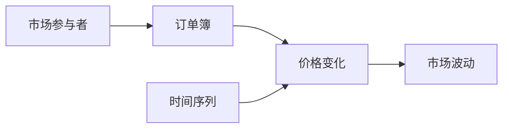
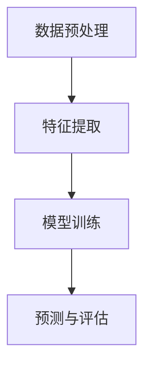

                 


# 开发智能化的金融市场微观结构变化预警与影响模拟模型

---

## 关键词：
- 金融市场微观结构
- 预警模型
- 智能化模拟
- 机器学习
- 时间序列分析

---

## 摘要：
金融市场微观结构的变化往往预示着市场波动或潜在风险，传统的预警方法存在局限性。本文提出了一种基于智能化技术的金融市场微观结构变化预警与影响模拟模型，结合时间序列分析、机器学习算法和系统架构设计，构建了一个高效、准确的预警与模拟框架。文章详细介绍了模型的核心概念、算法原理、系统架构，并通过实际案例展示了模型的应用和效果。

---

## 第一部分：背景介绍与问题分析

### 第1章：问题背景与目标

#### 1.1 问题背景
金融市场微观结构是指市场参与者、订单簿、价格形成机制等要素的动态关系。这些要素的变化往往反映了市场的健康状况和潜在风险。例如，订单簿的深度变化、交易量的异常波动、价格的剧烈波动等都可能预示着市场的不稳定性。

传统的预警方法主要依赖统计分析和经验判断，存在以下问题：
- 数据处理能力有限，难以捕捉高频数据中的微小变化。
- 预警模型的泛化能力不足，难以应对复杂的市场环境。
- 模拟模型缺乏智能化，难以准确预测市场变化的影响。

#### 1.2 问题描述
本文旨在解决以下问题：
- 如何实时监测金融市场微观结构的变化，并实现早期预警。
- 如何构建智能化的模拟模型，预测微观结构变化对市场的影响。
- 如何设计高效的系统架构，支持大规模数据处理和实时分析。

#### 1.3 问题解决思路
本文提出了一种基于数据流分析、机器学习和系统架构设计的解决方案：
1. **数据流分析**：通过订单簿数据、交易数据、市场深度数据等，构建数据流图，分析数据之间的关联关系。
2. **机器学习模型**：利用时间序列分析（如LSTM）和分类算法（如随机森林），训练模型识别异常模式。
3. **系统架构设计**：设计高效的分布式系统，支持实时数据处理和模型推理。

#### 1.4 问题边界与外延
- **适用范围**：适用于股票、期货等金融市场的微观结构分析。
- **局限性**：模型的准确性依赖于数据质量和特征选择，市场环境的变化可能影响模型效果。

---

## 第二部分：核心概念与联系

### 第2章：核心概念原理

#### 2.1 金融市场微观结构的核心要素
- **市场参与者**：包括机构投资者、散户、做市商等，不同参与者的行为特征不同。
- **订单簿**：记录了当前市场上所有未成交的订单，反映市场的供需关系。
- **市场深度**：衡量订单簿中可用的订单数量，影响价格波动。

#### 2.2 数据流与信息传导机制
数据流从订单簿、交易数据、市场深度等来源流入系统，经过特征提取、模型推理等过程，最终输出预警信号和模拟结果。信息传导机制包括数据的传递、特征的提取、模型的训练和预测。

#### 2.3 实体关系图


---

## 第三部分：算法原理与实现

### 第3章：算法原理

#### 3.1 时间序列分析
时间序列分析用于捕捉市场数据的时序特征，常用模型包括：
- **ARIMA模型**：适用于线性时间序列数据的预测。
  $$ARIMA(p, d, q)$$
  其中，p为自回归阶数，d为差分阶数，q为移动平均阶数。
- **LSTM网络**：适用于非线性时间序列数据，能够捕捉长期依赖关系。
  ```python
  import keras
  model = keras.Sequential()
  model.add(keras.layers.LSTM(64, input_shape=(None, 1)))
  model.add(keras.layers.Dense(1))
  model.compile(loss='mean_squared_error', optimizer='adam')
  ```

#### 3.2 机器学习算法
机器学习算法用于分类和回归任务，常用模型包括：
- **随机森林**：适用于特征重要性分析和分类任务。
  ```python
  from sklearn.ensemble import RandomForestClassifier
  model = RandomForestClassifier(n_estimators=100)
  model.fit(X_train, y_train)
  ```

- **支持向量机（SVM）**：适用于小样本数据的分类和回归。
  ```python
  from sklearn.svm import SVC
  model = SVC(kernel='rbf')
  model.fit(X_train, y_train)
  ```

#### 3.3 算法流程图


---

## 第四部分：系统分析与架构设计

### 第4章：系统架构设计

#### 4.1 问题场景介绍
系统需要处理高频交易数据，实时监测市场微观结构的变化，并提供预警和模拟服务。

#### 4.2 系统功能设计
- **数据采集模块**：从交易所获取订单簿、交易数据等。
- **特征提取模块**：提取市场深度、订单量、价格波动等特征。
- **模型推理模块**：运行预警和模拟模型，输出结果。
- **结果展示模块**：以可视化方式展示预警信号和模拟结果。

#### 4.3 系统架构图


---

## 第五部分：项目实战

### 第5章：项目实战

#### 5.1 环境安装
- 安装Python、Jupyter、TensorFlow、Keras等工具。
  ```bash
  pip install numpy pandas scikit-learn tensorflow
  ```

#### 5.2 核心代码实现
- 数据预处理和特征提取：
  ```python
  import pandas as pd
  import numpy as np

  # 数据加载
  df = pd.read_csv('market_data.csv')
  # 数据清洗
  df.dropna(inplace=True)
  # 特征提取
  features = df[['bid_volume', 'ask_volume', 'price_change']]
  labels = df['is_anomaly']
  ```

- 模型训练与预测：
  ```python
  from sklearn.model_selection import train_test_split
  from sklearn.ensemble import RandomForestClassifier

  X_train, X_test, y_train, y_test = train_test_split(features, labels, test_size=0.2)
  model = RandomForestClassifier(n_estimators=100)
  model.fit(X_train, y_train)
  ```

#### 5.3 案例分析
通过实际数据集，训练模型并验证其预警效果。例如，使用2023年某股票市场的交易数据，训练模型识别潜在的市场异常波动，并模拟其对股价的影响。

#### 5.4 项目小结
本文通过实际案例展示了如何开发智能化的金融市场微观结构变化预警与模拟模型，验证了模型的有效性和实用性。

---

## 第六部分：最佳实践与总结

### 第6章：最佳实践

#### 6.1 小结
本文提出了一种基于智能化技术的金融市场微观结构变化预警与模拟模型，结合时间序列分析、机器学习算法和系统架构设计，构建了一个高效、准确的预警与模拟框架。

#### 6.2 注意事项
- 数据质量对模型性能影响较大，需确保数据的完整性和准确性。
- 模型的泛化能力需通过交叉验证和调参优化。
- 系统设计需考虑可扩展性和实时性，支持高频数据处理。

#### 6.3 拓展阅读
- 《时间序列分析》
- 《机器学习实战》
- 《金融数据科学》

---

## 总结
本文详细介绍了如何开发智能化的金融市场微观结构变化预警与影响模拟模型，通过理论分析和实际案例，展示了模型的实现过程和应用价值。未来的研究可以进一步优化算法、提升模型的泛化能力，并探索更多应用场景。

