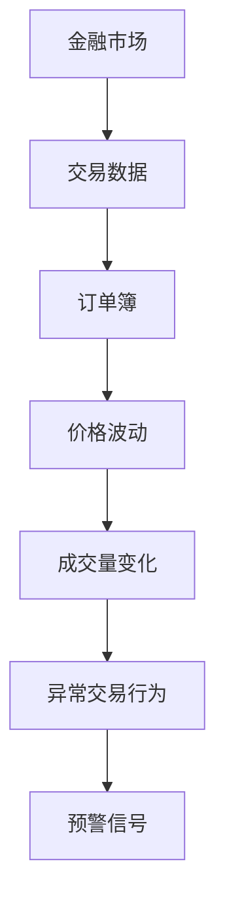
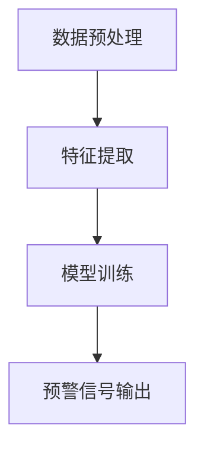
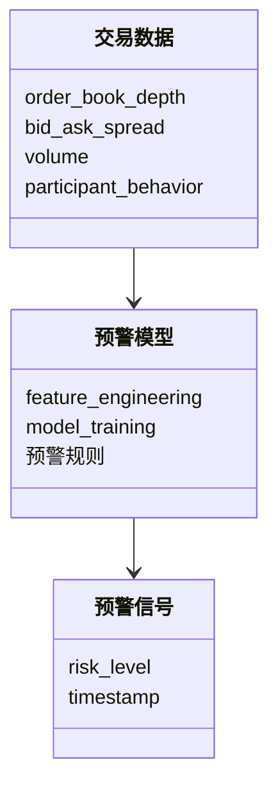
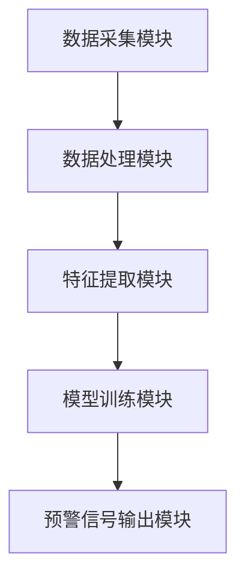
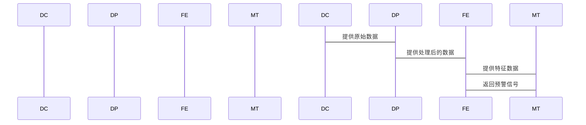

                 


# 开发智能化的金融市场微观结构变化预警模型

> 关键词：金融市场，微观结构，预警模型，时间序列分析，机器学习，深度学习

> 摘要：本文详细探讨了开发智能化的金融市场微观结构变化预警模型的各个方面，从背景介绍到系统架构设计，再到项目实战，旨在为读者提供一个全面的视角。通过分析模型的核心概念、算法原理、系统架构和项目实现，本文为金融市场的风险预警提供了一个创新的解决方案。

---

# 第一部分: 金融市场微观结构变化预警模型背景与概述

## 第1章: 金融市场微观结构与预警模型概述

### 1.1 问题背景

#### 1.1.1 金融市场微观结构的基本概念

金融市场微观结构是指金融市场的组织方式和交易机制，包括订单簿、交易参与者、市场深度、订单类型、成交规则等。这些因素共同影响市场的流动性和价格形成机制。

#### 1.1.2 微观结构变化对市场的影响

微观结构的变化可能导致市场流动性下降、价格波动加剧、交易成本上升等问题。例如，订单簿的深度变化可能影响市场的买卖均衡，异常交易行为可能导致市场操纵或闪崩。

#### 1.1.3 预警模型的必要性与目标

随着金融市场日益复杂，及时发现和预警微观结构的变化变得至关重要。预警模型的目标是通过分析市场数据，识别潜在的风险信号，帮助交易员和监管机构采取措施，避免或减少市场损失。

### 1.2 问题描述

#### 1.2.1 金融市场中的异常交易行为

异常交易行为包括高频交易、算法交易、市场操纵等。这些行为可能导致市场失灵，影响市场的公平性和稳定性。

#### 1.2.2 微观结构变化的特征与表现

微观结构变化通常表现为订单簿深度的突变、买卖价差异常扩大、成交量突增或突减、市场参与者行为异常等。这些特征可以通过数据分析和模式识别来捕捉。

#### 1.2.3 预警模型的核心任务与边界

预警模型的核心任务是通过实时监控市场数据，识别潜在的异常行为或风险信号，并发出预警。模型的边界包括数据来源的限制、模型的实时性和可解释性要求。

### 1.3 问题解决与模型构建

#### 1.3.1 数据驱动与模型构建的必要性

金融市场数据具有高频性、复杂性和噪声多等特点，需要通过数据驱动的方法来提取有用的特征，并构建有效的预警模型。

#### 1.3.2 多维度数据的整合与处理

市场微观结构变化的预警需要整合多维度的数据，包括订单簿数据、交易数据、市场参与者行为数据等。数据的整合和处理是模型构建的关键步骤。

#### 1.3.3 模型的实时性与可解释性要求

预警模型需要具备实时性，能够快速响应市场变化。同时，模型的可解释性也是重要的，便于交易员和监管机构理解模型的预警结果。

### 1.4 模型的边界与外延

#### 1.4.1 模型适用的市场类型与规模

预警模型适用于股票市场、期货市场、外汇市场等，但需要根据市场的特点进行调整和优化。模型的适用性还取决于数据的可获得性和质量。

#### 1.4.2 数据来源的限制与扩展

数据来源的限制可能影响模型的性能，例如数据样本不足、数据噪声过多等。需要通过数据清洗、特征工程等方法来优化数据质量。

#### 1.4.3 模型的局限性与应用场景

模型的局限性包括数据依赖性、模型的过拟合风险、外部冲击的不可预测性等。需要结合实际应用场景，合理设置模型的参数和阈值。

### 1.5 概念结构与核心要素

#### 1.5.1 模型的核心要素分析

预警模型的核心要素包括数据源、特征提取、模型训练、预警规则、结果输出等。这些要素相互关联，共同构成模型的整体架构。

#### 1.5.2 数据流、特征提取与模型输出的关系

数据流经过特征提取后，形成模型的输入，模型通过对输入的特征进行分析，生成预警信号。特征提取是连接数据与模型的关键桥梁。

#### 1.5.3 模型的输入、处理与输出过程

模型的输入包括订单簿数据、交易数据、市场参与者行为数据等。模型通过对输入数据进行处理，提取特征，训练模型，最终输出预警信号。

---

## 第2章: 核心概念与联系

### 2.1 核心概念原理

#### 2.1.1 微观结构变化的定义与特征

微观结构变化是指市场交易机制和参与者行为的变化，通常表现为订单簿深度突变、买卖价差异常、成交量突增等。这些变化可能影响市场的流动性和价格稳定性。

#### 2.1.2 预警模型的基本原理

预警模型通过分析市场数据，识别潜在的异常行为或风险信号，并发出预警。模型的基本原理包括数据预处理、特征提取、模型训练、预警规则设置等。

#### 2.1.3 数据驱动与模型训练的关系

数据驱动是模型训练的基础，通过数据预处理和特征工程，将市场数据转化为模型的输入，模型通过学习数据中的模式，生成预警信号。

### 2.2 核心概念属性特征对比

#### 2.2.1 微观结构变化的特征对比表格

| 特征 | 正常状态 | 异常状态 |
|------|----------|----------|
| 订单簿深度 | 稳定 | 突变 |
| 买卖价差 | 合理 | 显著扩大 |
| 成交量 | 平稳 | 突增或突减 |
| 市场参与者行为 | 正常 | 异常 |

#### 2.2.2 数据特征与模型性能的关系

数据特征的质量和数量直接影响模型的性能。高质量的数据特征能够提高模型的预警准确率，而低质量的数据特征可能导致模型的误报或漏报。

#### 2.2.3 不同模型的优缺点分析

| 模型类型 | 优点 | 缺点 |
|----------|------|------|
| 时间序列分析 | 简单易懂 | 对异常数据敏感 |
| 机器学习 | 高准确性 | 黑箱问题 |
| 深度学习 | 强大学习能力 | 计算资源消耗大 |

### 2.3 ER实体关系图



---

## 第3章: 算法原理与实现

### 3.1 算法原理

#### 3.1.1 时间序列分析

时间序列分析是一种通过分析数据随时间变化的模式，预测未来趋势的方法。常用的模型包括ARIMA、GARCH等。

#### 3.1.2 机器学习模型

机器学习模型包括监督学习、无监督学习和半监督学习。常用的模型有支持向量机（SVM）、随机森林（Random Forest）、逻辑回归（Logistic Regression）等。

#### 3.1.3 深度学习模型

深度学习模型包括卷积神经网络（CNN）、长短时记忆网络（LSTM）、Transformer等。这些模型能够捕捉复杂的非线性关系，适用于处理高维和复杂的数据。

### 3.2 算法流程图



### 3.3 数学模型

#### 3.3.1 时间序列分析模型

ARIMA模型的数学表达式为：
$$ ARIMA(p, d, q) $$

其中，p为自回归阶数，d为差分阶数，q为移动平均阶数。

#### 3.3.2 机器学习模型

支持向量机（SVM）的数学表达式为：
$$ \text{minimize } \frac{1}{2}||\theta||^2 + C \sum_{i=1}^n \xi_i $$
$$ \text{subject to } y_i (\theta^T x_i + b) \geq 1 - \xi_i, \xi_i \geq 0 $$

#### 3.3.3 深度学习模型

长短时记忆网络（LSTM）的数学表达式为：
$$ f_t = \sigma(W_f x_t + U_f h_{t-1} + b_f) $$
$$ i_t = \sigma(W_i x_t + U_i h_{t-1} + b_i) $$
$$ o_t = \sigma(W_o x_t + U_o h_{t-1} + b_o) $$
$$ h_t = f_t \cdot c_{t-1} + i_t \cdot tanh(W_o x_t + U_o h_{t-1} + b_o) $$

### 3.4 代码实现

#### 3.4.1 数据预处理

```python
import pandas as pd
import numpy as np

# 加载数据
data = pd.read_csv('market_data.csv')

# 数据清洗
data = data.dropna()
data = data[~data['volume'].isin([0])]

# 数据标准化
from sklearn.preprocessing import StandardScaler
scaler = StandardScaler()
data_scaled = scaler.fit_transform(data[['open', 'high', 'low', 'close', 'volume']])
```

#### 3.4.2 特征提取

```python
from sklearn.decomposition import PCA

# 提取特征
features = data_scaled
pca = PCA(n_components=10)
principal_components = pca.fit_transform(features)
```

#### 3.4.3 模型训练

```python
from sklearn.model_selection import train_test_split
from sklearn.ensemble import RandomForestClassifier

# 划分训练集和测试集
X_train, X_test, y_train, y_test = train_test_split(principal_components, data['label'], test_size=0.2, random_state=42)

# 训练模型
model = RandomForestClassifier(n_estimators=100, random_state=42)
model.fit(X_train, y_train)
```

#### 3.4.4 预警信号输出

```python
# 预测结果
y_pred = model.predict(X_test)

# 计算准确率
from sklearn.metrics import accuracy_score
print(accuracy_score(y_test, y_pred))
```

---

## 第4章: 系统架构设计

### 4.1 问题场景介绍

金融市场微观结构变化预警系统的应用场景包括高频交易监控、市场操纵识别、交易风险预警等。

### 4.2 领域模型设计



### 4.3 系统架构设计



### 4.4 接口设计

系统接口包括数据接口、模型接口、预警信号输出接口等。数据接口用于获取市场数据，模型接口用于训练和预测，预警信号输出接口用于发送预警信号。

### 4.5 交互流程



---

## 第5章: 项目实战

### 5.1 环境安装

#### 5.1.1 安装Python和必要的库

```bash
pip install numpy pandas scikit-learn
```

### 5.2 核心实现

#### 5.2.1 数据预处理

```python
import pandas as pd
import numpy as np

# 加载数据
data = pd.read_csv('market_data.csv')

# 数据清洗
data = data.dropna()
data = data[~data['volume'].isin([0])]
```

#### 5.2.2 特征提取

```python
from sklearn.decomposition import PCA

# 提取特征
features = data[['open', 'high', 'low', 'close', 'volume']]
pca = PCA(n_components=10)
principal_components = pca.fit_transform(features)
```

#### 5.2.3 模型训练

```python
from sklearn.model_selection import train_test_split
from sklearn.ensemble import RandomForestClassifier

# 划分训练集和测试集
X_train, X_test, y_train, y_test = train_test_split(principal_components, data['label'], test_size=0.2, random_state=42)

# 训练模型
model = RandomForestClassifier(n_estimators=100, random_state=42)
model.fit(X_train, y_train)
```

#### 5.2.4 模型评估

```python
# 预测结果
y_pred = model.predict(X_test)

# 计算准确率
from sklearn.metrics import accuracy_score
print(accuracy_score(y_test, y_pred))
```

### 5.3 案例分析

通过实际案例分析，验证模型的预警效果。例如，假设在某次市场闪崩事件中，模型能够提前发现异常交易行为并发出预警，帮助交易员避免损失。

---

## 第6章: 总结与展望

### 6.1 总结

本文详细介绍了开发智能化的金融市场微观结构变化预警模型的各个方面，从背景介绍到系统架构设计，再到项目实战，为读者提供了一个全面的视角。

### 6.2 展望

未来的研究方向包括提高模型的实时性和可解释性，优化数据特征提取方法，探索新的算法和模型，如图神经网络、强化学习等，进一步提升预警模型的准确性和实用性。

### 6.3 最佳实践 tips

- 数据质量是模型性能的基础，需要重视数据清洗和特征工程。
- 模型的实时性和可解释性是实际应用中的重要考量，需要在设计阶段就予以考虑。
- 模型的调优和维护是持续的过程，需要定期监控和更新模型参数。

---

# 结语

开发智能化的金融市场微观结构变化预警模型是一项复杂的系统工程，需要结合金融领域的专业知识和计算机科学的技术手段。通过不断的研究和实践，我们可以为金融市场的风险管理和监管提供更有效的工具和解决方案。

