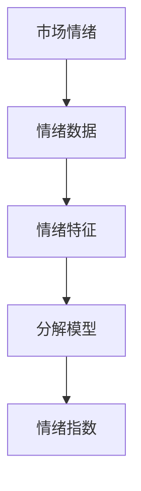
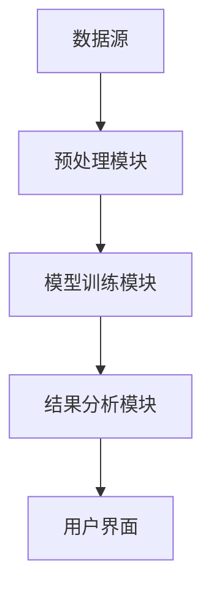

                 


# 开发智能化的金融市场情绪指数分解模型

> 关键词：金融市场，情绪指数，分解模型，机器学习，自然语言处理

> 摘要：本文详细探讨了开发智能化的金融市场情绪指数分解模型的各个方面，包括模型的背景、核心概念、算法原理、系统架构设计以及项目实战。通过结合金融市场的复杂性与人工智能技术，本文提出了一种创新的情绪指数分解方法，旨在帮助投资者更好地理解市场情绪，做出更明智的投资决策。

---

## 第一部分: 金融市场情绪指数分解模型的背景与意义

### 第1章: 金融市场情绪指数分解模型的背景与意义

#### 1.1 金融市场的现状与挑战
金融市场是一个复杂且高度动态的环境，受到多种因素的影响，包括经济指标、政策变化、市场参与者的情绪等。情绪在金融市场中起着至关重要的作用，它能够影响投资者的决策，从而进一步影响资产价格的波动。然而，传统的情绪分析方法往往难以捕捉市场情绪的细微变化，导致分析结果的不准确。

#### 1.2 情绪指数分解模型的提出
为了更准确地捕捉和分析市场情绪，本文提出了一种智能化的情绪指数分解模型。该模型结合了自然语言处理、时间序列分析和机器学习等技术，能够从大量金融市场数据中提取情绪特征，并将其分解为多个指数，以便更好地理解和预测市场行为。

#### 1.3 模型的应用场景
- **投资决策支持**：帮助投资者根据市场情绪的变化做出更明智的投资决策。
- **风险管理**：通过分析情绪指数，识别潜在的市场风险，提前采取应对措施。
- **市场研究**：为金融研究人员提供情绪数据的详细分析，支持更深入的市场研究。

### 第2章: 情绪指数分解模型的核心概念与联系

#### 2.1 情绪指数分解模型的定义
情绪指数分解模型是一种基于人工智能技术的模型，旨在从金融市场数据中提取情绪特征，并将其分解为多个指数，以便更好地理解和分析市场情绪。

#### 2.2 情绪数据的特征
情绪数据具有以下特征：
- **实时性**：情绪数据通常基于最新的市场信息，具有很强的实时性。
- **波动性**：情绪数据往往表现出高度的波动性，受到市场事件的影响。
- **复杂性**：情绪数据可能受到多种因素的影响，包括市场参与者的心理、外部事件等。

#### 2.3 实体关系图
以下是情绪指数分解模型的核心实体关系图：



---

## 第二部分: 情绪指数分解模型的算法原理

### 第3章: 情绪指数分解模型的算法流程

#### 3.1 数据预处理
数据预处理是情绪指数分解模型的重要步骤，主要包括以下几个方面：
- **数据清洗**：去除噪声数据，如重复数据、异常值等。
- **数据标准化**：将数据归一化，使其适用于后续的分析。
- **数据增强**：通过增加数据的多样性，提高模型的泛化能力。

#### 3.2 情绪特征提取
情绪特征提取是情绪指数分解模型的核心部分，主要包括以下几种方法：
- **词袋模型**：基于词语的出现频率，提取情绪特征。
- **词嵌入模型**：使用如Word2Vec等模型，将词语转换为低维向量，捕捉词语之间的语义关系。
- **情感分析模型**：利用预训练的情感分析模型（如Vader-Sentiment）对文本进行情感分类。

#### 3.3 情绪指数分解
情绪指数分解是模型的最终目标，旨在将提取的情绪特征分解为多个指数，以便更好地分析市场情绪。常用的分解方法包括：
- **线性分解方法**：如主成分分析（PCA）等。
- **非线性分解方法**：如深度学习模型中的自动编码器（Autoencoder）等。

---

### 第4章: 情绪指数分解模型的数学模型

#### 4.1 线性分解模型
线性分解模型是一种简单但有效的分解方法，其数学表达式如下：
$$
X = W \cdot Y + \epsilon
$$
其中，\(X\) 是原始数据矩阵，\(Y\) 是分解后的指数矩阵，\(W\) 是权重矩阵，\(\epsilon\) 是误差项。

#### 4.2 非线性分解模型
非线性分解模型能够捕捉更复杂的情绪特征，常用的模型包括深度神经网络。其数学表达式如下：
$$
Y = f(X; \theta)
$$
其中，\(f\) 是一个非线性函数，\(\theta\) 是模型的参数。

#### 4.3 综合分解模型
综合分解模型结合了线性和非线性分解方法的优势，其数学表达式如下：
$$
Y = \alpha \cdot f(X; \theta) + (1 - \alpha) \cdot W \cdot X
$$
其中，\(\alpha\) 是一个权重系数，控制线性和非线性部分的贡献。

---

## 第三部分: 情绪指数分解模型的系统架构设计

### 第5章: 系统架构设计

#### 5.1 系统功能设计
系统功能设计包括以下几个模块：
- **数据源模块**：获取金融市场数据，如新闻、社交媒体评论等。
- **预处理模块**：对数据进行清洗、标准化等处理。
- **模型训练模块**：训练情绪指数分解模型。
- **结果分析模块**：分析和展示情绪指数结果。

#### 5.2 系统架构图
以下是系统的架构图：



---

## 第四部分: 项目实战

### 第6章: 项目实战

#### 6.1 环境安装
- **Python 3.8+**
- **TensorFlow或Keras**
- **Vader-Sentiment**

#### 6.2 核心代码实现
以下是情绪指数分解模型的核心代码实现：

```python
import numpy as np
from sklearn.decomposition import PCA
from sklearn.preprocessing import StandardScaler

# 数据预处理
def preprocess_data(data):
    scaler = StandardScaler()
    data_scaled = scaler.fit_transform(data)
    return data_scaled

# 情绪特征提取
def extract_emotion_features(text_data):
    # 假设我们使用Vader-Sentiment进行情感分析
    from vaderSentiment.vaderSentiment import SentimentIntensityAnalyzer
    analyzer = SentimentIntensityAnalyzer()
    features = []
    for text in text_data:
        sentiment = analyzer.polarity_scores(text)
        features.append([sentiment['compound'], sentiment['positive'], sentiment['negative']])
    return np.array(features)

# 情绪指数分解
def decompose_emotion_indices(features):
    # 使用主成分分析（PCA）进行分解
    pca = PCA(n_components=3)
    decomposed = pca.fit_transform(features)
    return decomposed

# 主程序
def main():
    # 假设我们有以下数据
    text_data = ["Market is bullish", "Investors are confident", "Earnings are growing"]
    features = extract_emotion_features(text_data)
    features_scaled = preprocess_data(features)
    decomposed_indices = decompose_emotion_indices(features_scaled)
    print("Decomposed emotion indices:", decomposed_indices)

if __name__ == "__main__":
    main()
```

#### 6.3 代码解读与分析
- **数据预处理**：使用标准化方法对数据进行预处理，确保数据适合模型训练。
- **情绪特征提取**：利用Vader-Sentiment工具对文本进行情感分析，提取化合物情感得分、正面情感得分和负面情感得分。
- **情绪指数分解**：使用主成分分析（PCA）对提取的情绪特征进行分解，得到多个情绪指数。

#### 6.4 实际案例分析
假设我们有以下文本数据：
- "Market is bullish"（市场情绪乐观）
- "Investors are confident"（投资者信心充足）
- "Earnings are growing"（盈利增长）

通过上述代码，我们可以提取这些文本的情感特征，并进行分解，得到情绪指数。

---

## 第五部分: 最佳实践与总结

### 第7章: 最佳实践

#### 7.1 小结
- 情绪指数分解模型是一种 powerful工具，能够帮助投资者更好地理解市场情绪。
- 通过结合自然语言处理和机器学习技术，可以实现更准确的情绪分析。

#### 7.2 注意事项
- 在实际应用中，需要注意数据的质量和多样性。
- 情绪指数分解模型的结果需要结合其他因素进行综合分析，避免单一依赖情绪指数。

#### 7.3 拓展阅读
- 《Deep Learning for NLP》
- 《Financial Time Series Analysis》

---

通过本文的详细讲解，读者可以全面理解情绪指数分解模型的开发过程，并能够将其应用于实际的金融市场分析中。

