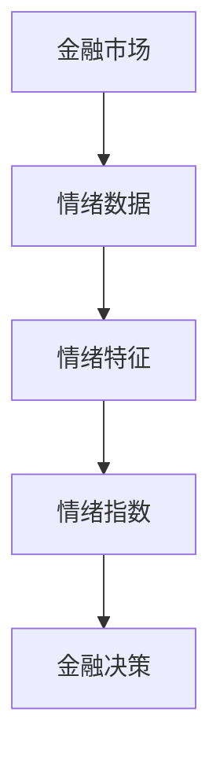

                 


# 开发智能化的金融市场情绪指数模型

**关键词**：金融市场情绪指数、人工智能、自然语言处理、机器学习、金融数据分析

**摘要**：本文将详细探讨如何开发智能化的金融市场情绪指数模型。通过结合自然语言处理和机器学习技术，我们能够更准确地捕捉和预测金融市场的情绪变化，从而为投资者提供更可靠的决策支持。本文从背景介绍、核心概念、算法原理、系统架构设计到项目实战，全面解析情绪指数模型的开发过程，并提供实际案例和代码示例，帮助读者掌握这一前沿技术。

---

## 正文

### 第一部分: 金融市场情绪指数模型概述

#### 第1章: 金融市场情绪指数模型的背景与意义

##### 1.1 金融市场情绪指数的定义与背景

金融市场情绪指数（Market Sentiment Index，MSI）是一种量化金融市场参与者情绪的指标。它通过分析新闻、社交媒体、市场交易数据等信息，捕捉市场参与者的情绪变化，从而预测市场的短期走势。与传统的金融指标（如股价指数、成交量等）不同，情绪指数更关注市场参与者的心理状态，因此具有更强的前瞻性。

金融市场情绪指数的背景可以追溯到行为金融学。行为金融学研究表明，投资者的情绪波动往往会导致非理性决策，从而影响市场走势。通过量化这些情绪波动，情绪指数能够帮助投资者更好地理解市场动态，制定更科学的投资策略。

##### 1.2 情绪指数模型的开发背景

随着人工智能技术的快速发展，自然语言处理（NLP）和机器学习技术在金融领域的应用越来越广泛。金融市场数据的复杂性和多样性使得传统的统计方法难以捕捉市场情绪的细微变化。因此，开发智能化的情绪指数模型成为必然趋势。

##### 1.3 情绪指数模型的核心目标

情绪指数模型的核心目标包括：
- 提高情绪预测的准确性：通过结合多种数据源和先进算法，准确捕捉市场情绪的变化。
- 实现模型的实时性：能够快速响应市场动态，提供实时的情绪指数。
- 提高模型的可解释性：确保模型的预测结果能够被投资者理解和信任。
- 提高模型的可扩展性：能够适应不同市场和数据规模的需求。

---

#### 第2章: 情绪指数模型的核心概念与联系

##### 2.1 情绪指数模型的核心要素

情绪指数模型的核心要素包括：
- **数据来源**：包括新闻、社交媒体、市场评论、交易数据等。
- **情绪分析方法**：包括情感分类、主题分析、情感强度分析等。
- **模型构建与优化**：包括特征提取、模型训练、参数调优等。

##### 2.2 情绪指数模型的实体关系图

以下是一个情绪指数模型的实体关系图：



##### 2.3 情绪指数模型的特征对比

以下是几种常见的情绪指数模型的特征对比：

| 特征 | 描述 |
|------|------|
| 数据来源 | 文本数据、市场数据、社交媒体数据 |
| 情绪维度 | 开心、悲伤、愤怒、惊讶 |
| 时间窗口 | 短期、中期、长期 |

---

### 第二部分: 情绪指数模型的算法原理

#### 第3章: 情绪指数模型的算法选择

##### 3.1 情绪指数模型的算法选择

目前，主流的情绪指数模型主要基于以下几种算法：
- **LSTM（长短期记忆网络）**：适用于时间序列数据，能够捕捉情绪的变化趋势。
- **Transformer**：基于注意力机制，能够捕捉数据中的长距离依赖关系。
- **混合模型**：结合LSTM和Transformer的优势，进一步提高预测准确性。

##### 3.2 情绪指数模型的流程图

以下是情绪指数模型的流程图：


##### 3.3 情绪指数模型的数学公式

以下是情绪预测公式：

$$ y = f(x) $$

其中，$x$ 是输入特征，$y$ 是情绪预测值，$f$ 是模型函数。

---

#### 第4章: 情绪指数模型的系统架构设计

##### 4.1 系统架构概述

以下是情绪指数模型的系统架构图：


##### 4.2 系统功能设计

以下是系统的功能模块：

- 数据采集模块：负责采集金融市场相关的数据，包括新闻、社交媒体数据等。
- 数据预处理模块：对采集的数据进行清洗、标准化等预处理。
- 特征提取模块：从预处理后的数据中提取情绪相关的特征。
- 模型训练模块：基于提取的特征训练情绪预测模型。
- 模型预测模块：利用训练好的模型对实时数据进行情绪预测。
- 结果输出模块：将预测结果输出，供投资者参考。

##### 4.3 系统接口设计

以下是系统的接口设计：

- 数据接口：提供数据采集和预处理的接口。
- 模型接口：提供模型训练和预测的接口。
- 结果接口：提供结果输出的接口。

##### 4.4 系统交互流程

以下是系统的交互流程：


---

### 第三部分: 情绪指数模型的项目实战

#### 第5章: 项目实战

##### 5.1 环境安装

以下是项目实战所需的环境安装步骤：

1. 安装Python
2. 安装必要的Python库（如numpy、pandas、tensorflow等）
3. 安装Jupyter Notebook

##### 5.2 系统核心实现源代码

以下是情绪指数模型的核心代码：

```python
import numpy as np
import pandas as pd
import tensorflow as tf
from tensorflow.keras import layers

# 数据预处理
def preprocess_data(data):
    # 这里进行数据清洗、标准化等处理
    pass

# 特征提取
def extract_features(data):
    # 这里进行特征提取
    pass

# 模型训练
def train_model(features, labels):
    model = tf.keras.Sequential([
        layers.LSTM(64, input_shape=(None, features.shape[2])),
        layers.Dense(1, activation='sigmoid')
    ])
    model.compile(loss='binary_crossentropy', optimizer='adam')
    model.fit(features, labels, epochs=10, batch_size=32)
    return model

# 模型预测
def predict_emotion(model, new_features):
    predictions = model.predict(new_features)
    return predictions
```

##### 5.3 代码应用解读与分析

以下是代码的解读与分析：

- 数据预处理：对数据进行清洗、标准化等处理，确保数据的质量。
- 特征提取：从数据中提取情绪相关的特征，如情感分类、主题分析等。
- 模型训练：基于提取的特征训练情绪预测模型。
- 模型预测：利用训练好的模型对实时数据进行情绪预测。

##### 5.4 实际案例分析

以下是实际案例分析：

假设我们有一个社交媒体数据集，包含数万条关于金融市场的评论。我们需要通过情绪指数模型来预测市场的短期走势。

##### 5.5 项目小结

通过项目实战，我们可以看到情绪指数模型的实际应用价值。通过结合自然语言处理和机器学习技术，我们可以更准确地捕捉市场情绪的变化，从而为投资者提供更可靠的决策支持。

---

### 第四部分: 总结与展望

#### 第6章: 总结与展望

##### 6.1 总结

通过本文的详细讲解，我们可以看到情绪指数模型的开发过程。从数据预处理、特征提取、模型训练到结果输出，每一步都需要仔细设计和实现。同时，我们还需要结合实际情况，不断优化模型的性能，提高预测的准确性。

##### 6.2 展望

未来，随着人工智能技术的不断发展，情绪指数模型将变得更加智能化和自动化。我们可以预见，情绪指数模型将在金融市场的实时监控、风险预警、投资决策等领域发挥更大的作用。

##### 6.3 最佳实践 tips

- 数据预处理是关键：确保数据的高质量是模型性能的基础。
- 特征提取要多样化：结合多种数据源和特征提取方法，提高模型的泛化能力。
- 模型调优要细致：通过不断实验和调整模型参数，找到最佳的模型配置。
- 实际应用要谨慎：情绪指数模型只是一个辅助工具，不能完全依赖模型的预测结果。

---

通过本文的详细讲解，我们希望能够帮助读者更好地理解情绪指数模型的开发过程，并能够在实际应用中灵活运用这一技术。

