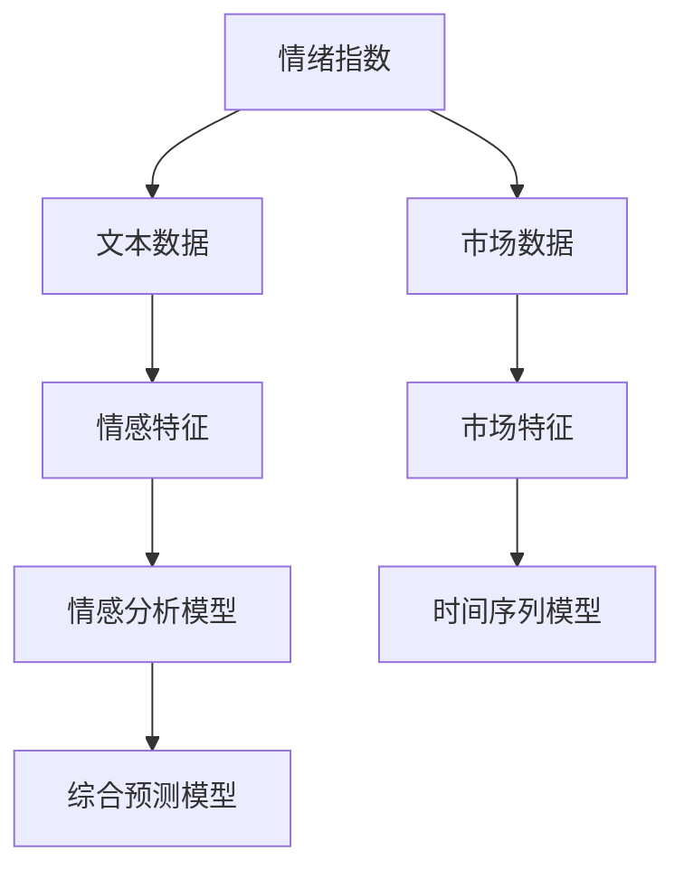
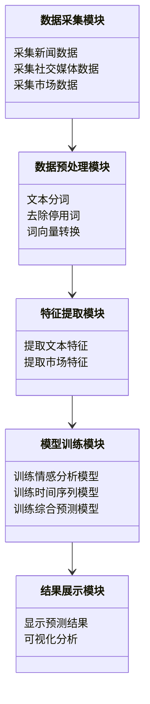
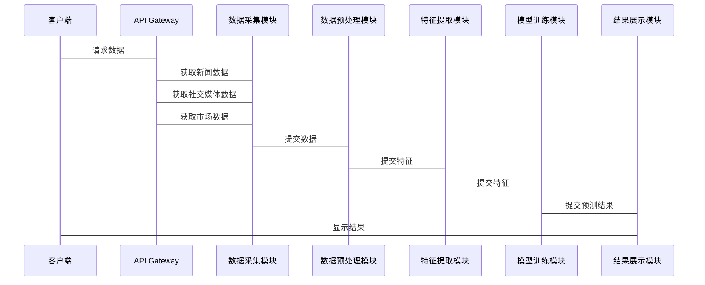

                 


# 开发智能化的金融市场情绪指数预测模型

## 关键词：金融市场、情绪指数、预测模型、人工智能、大数据、自然语言处理

## 摘要：本文将详细介绍如何开发一个智能化的金融市场情绪指数预测模型。从情绪指数的定义与作用入手，分析当前市场情绪分析的技术挑战，探讨如何利用大数据和人工智能技术，结合文本挖掘、时间序列分析和机器学习模型，构建一个高效、准确的金融市场情绪指数预测系统。文章将涵盖从数据预处理、特征提取、模型训练到系统架构设计的完整流程，帮助读者全面理解并掌握开发此类模型的核心技术和方法。

---

# 第一部分: 金融市场情绪指数预测模型概述

# 第1章: 问题背景与数据来源

## 1.1 问题背景介绍

### 1.1.1 金融市场情绪指数的定义与作用
金融市场情绪指数是一种量化市场参与者情绪的指标，能够反映投资者对市场的乐观或悲观程度。情绪指数在投资决策中起着重要作用，可以帮助投资者预测市场的波动性和潜在风险。

### 1.1.2 情绪指数在投资决策中的重要性
情绪指数能够帮助投资者识别市场的过度乐观或悲观情绪，从而提前调整投资策略。例如，在市场情绪过于乐观时，投资者可能需要警惕潜在的市场回调风险。

### 1.1.3 当前市场情绪分析的技术挑战
- 数据来源多样，包括新闻、社交媒体、市场数据等，数据清洗和预处理的难度较大。
- 市场情绪具有动态变化的特点，传统静态模型难以捕捉情绪的实时变化。
- 情绪分析的准确性受到语言复杂性和语境影响，尤其是在处理金融领域专业术语时。

## 1.2 数据来源与特征

### 1.2.1 文本数据：新闻、社交媒体、评论
- 新闻标题和正文：通过分析新闻内容，提取市场情绪相关的关键词和情感倾向。
- 社交媒体数据：包括 Twitter、Reddit 等平台上的用户评论，反映市场参与者的实时情绪。
- 评论数据：包括投资者在论坛、博客等平台上的评论，进一步补充市场情绪信息。

### 1.2.2 市场数据：价格、成交量、波动率
- 股票价格：通过分析股票价格的波动，反推市场情绪的变化。
- 成交量：高成交量可能表明市场情绪高涨或恐慌。
- 波动率：高波动率通常与市场情绪的剧烈变化相关。

### 1.2.3 其他数据：情绪指标、宏观经济指标
- 情绪指标：如 VIX 指数，反映市场的恐慌程度。
- 宏观经济指标：如 GDP、失业率等，可能影响市场情绪。

## 1.3 技术基础与工具

### 1.3.1 自然语言处理（NLP）技术
- 用于分析文本数据，提取情感特征。
- 常用工具包括 NLTK、spaCy、Gensim 等。

### 1.3.2 时间序列分析
- 用于分析市场数据的时间依赖性。
- 常用工具包括 Python 的 statsmodels 库、R 的时间序列分析包等。

### 1.3.3 机器学习与深度学习框架
- 机器学习：如支持向量机（SVM）、随机森林（Random Forest）等。
- 深度学习：如 LSTM、Transformer 等，用于捕捉时间序列中的复杂模式。

## 1.4 当前研究现状与挑战

### 1.4.1 情绪指数预测的现有方法
- 基于文本的情感分析：通过分析新闻和社交媒体内容，预测市场情绪。
- 基于市场数据的统计模型：通过分析价格和成交量等数据，预测情绪指数。
- 综合模型：结合文本和市场数据，构建多模态情绪预测模型。

### 1.4.2 现有方法的优缺点
- 文本情感分析的优点是能够捕捉市场参与者的实时情绪，但缺点是数据可能存在噪声，且情感分析的准确性受语言复杂性影响。
- 基于市场数据的统计模型的优点是数据可靠，但缺点是难以捕捉市场情绪的实时变化。

### 1.4.3 本研究的目标与创新点
- 目标：开发一种智能化的金融市场情绪指数预测模型，结合文本和市场数据，提高预测的准确性和实时性。
- 创新点：引入深度学习模型（如 LSTM 和 Transformer），结合多模态数据，构建更加准确和高效的情绪预测系统。

## 1.5 本章小结
本章从问题背景出发，介绍了金融市场情绪指数的定义和作用，分析了当前市场情绪分析的技术挑战，并详细介绍了数据来源和技术基础。最后，提出了本研究的目标和创新点，为后续章节的展开奠定了基础。

---

# 第2章: 情绪指数预测模型的核心概念

## 2.1 情绪指数的计算方法

### 2.1.1 基于文本的情感分析
- 通过 NLP 技术，对新闻和社交媒体数据进行情感分析，计算市场情绪的正负倾向。
- 示例：使用 VaderSentiment 工具对新闻标题进行情感分析，计算整体情绪得分。

### 2.1.2 基于市场数据的情绪指标
- 使用 VIX 指数等情绪指标，结合价格和成交量数据，计算市场情绪的综合指标。
- 示例：通过统计分析，计算市场波动率与情绪指数的相关性。

### 2.1.3 综合模型的情绪指数计算
- 结合文本情感分析和市场数据，构建综合情绪指数模型。
- 示例：使用加权平均的方法，将文本情感得分和市场数据情绪指标进行融合，计算最终的情绪指数。

## 2.2 数据特征与模型选择

### 2.2.1 文本数据的预处理方法
- 分词：将文本数据进行分词处理，提取关键词。
- 去停用词：去除无意义的停用词，如“的”、“了”等。
- 词向量表示：使用 Word2Vec 或 GloVe 将文本转换为词向量。

### 2.2.2 时间序列数据的特征提取
- 滑动窗口：提取过去一段时间内的价格、成交量等数据，作为模型输入。
- 坐标变换：对时间序列数据进行标准化或归一化处理。

### 2.2.3 模型选择的依据与策略
- 根据数据类型选择模型：文本数据选择情感分析模型，时间序列数据选择 LSTM 或 ARIMA 模型。
- 根据预测目标选择模型：情绪指数预测选择回归模型或分类模型。

## 2.3 情绪指数预测的评价指标

### 2.3.1 常见的评价指标
- 准确率（Accuracy）：预测结果与实际结果的匹配程度。
- 召回率（Recall）：预测结果中正确预测的正例比例。
- F1 值：准确率和召回率的调和平均数。

### 2.3.2 评价指标的选择依据
- 根据问题类型选择指标：分类问题选择准确率和 F1 值，回归问题选择均方误差（MSE）或均方根误差（RMSE）。
- 根据数据分布选择指标：类别不平衡问题选择召回率和 F1 值。

### 2.3.3 指标的优缺点对比
- 准确率：优点是简单直观，缺点是不能反映分类模型的精确性和召回率。
- 召回率：优点是能够反映模型对正例的识别能力，缺点是不能反映模型的误报率。
- F1 值：优点是综合考虑了准确率和召回率，缺点是不能反映模型的预测速度。

## 2.4 核心概念的关系图（ER图）



## 2.5 本章小结
本章详细介绍了情绪指数的计算方法，分析了数据特征与模型选择的关系，并通过 ER 图展示了核心概念之间的关系。最后，讨论了情绪指数预测的评价指标及其选择依据，为后续模型的构建奠定了基础。

---

# 第3章: 情绪指数预测模型的算法原理

## 3.1 文本挖掘与情感分析

### 3.1.1 基于规则的情感分析
- 通过预定义的规则，对文本进行情感分类。
- 示例：使用 VaderSentiment 工具对新闻标题进行情感分析，计算整体情绪得分。

### 3.1.2 基于机器学习的情感分析
- 使用支持向量机（SVM）或随机森林（Random Forest）进行情感分类。
- 示例：将文本数据分为训练集和测试集，使用 SVM 进行训练和预测。

### 3.1.3 基于深度学习的情感分析
- 使用 LSTM 或 Transformer 模型进行情感分类。
- 示例：使用预训练的BERT模型对文本进行情感分析，提取上下文语义信息。

## 3.2 时间序列分析

### 3.2.1 LSTM 模型
- 通过 LSTM 捕捉时间序列中的长期依赖关系。
- 示例：使用 LSTM 对股票价格进行预测，捕捉市场情绪的变化。

### 3.2.2 ARIMA 模型
- 使用 ARIMA 模型进行时间序列预测。
- 示例：通过 ARIMA 模型预测市场波动率，反映市场情绪的变化。

### 3.2.3 综合模型
- 结合 LSTM 和 ARIMA 模型，构建综合情绪预测模型。
- 示例：将 LSTM 预测的结果与 ARIMA 预测的结果进行融合，提高预测的准确性和稳定性。

## 3.3 机器学习与深度学习模型

### 3.3.1 支持向量机（SVM）
- 通过 SVM 进行分类或回归预测。
- 示例：将文本情感得分和市场数据情绪指标作为输入，使用 SVM 进行情绪指数预测。

### 3.3.2 随机森林（Random Forest）
- 通过随机森林进行特征重要性分析和预测。
- 示例：使用随机森林对市场情绪进行分类，识别关键特征。

### 3.3.3 LSTM 与 Transformer 模型
- 使用 LSTM 和 Transformer 模型进行序列预测。
- 示例：将文本数据和市场数据进行融合，使用 Transformer 模型捕捉全局语义信息，预测市场情绪。

## 3.4 算法原理的数学模型和公式

### 3.4.1 LSTM 模型
- LSTM 的基本结构包括输入门、遗忘门和输出门。
- 输入门：$i_t = \sigma(w_i x_t + u_i h_{t-1} + b_i)$
- 遗忘门：$f_t = \sigma(w_f x_t + u_f h_{t-1} + b_f)$
- 输出门：$o_t = \sigma(w_o x_t + u_o h_{t-1} + b_o)$
- 隐藏状态：$h_t = o_t \cdot \tanh(w_c x_t + u_c h_{t-1} + b_c)$

### 3.4.2 Transformer 模型
- Transformer 模型由编码器和解码器组成。
- 自注意力机制：$QK^T$ 的计算公式为 $QK^T = q k^T$，其中 $q$ 和 $k$ 分别是查询和键的向量。

### 3.4.3 ARIMA 模型
- ARIMA 模型由自回归（AR）部分、差分（I）部分和移动平均（MA）部分组成。
- ARIMA(p, d, q) 模型的公式为：$y_t = \phi_1 y_{t-1} + \phi_2 y_{t-2} + \dots + \phi_p y_{t-p} + \epsilon_t + \theta_1 \epsilon_{t-1} + \theta_2 \epsilon_{t-2} + \dots + \theta_q \epsilon_{t-q}$

## 3.5 本章小结
本章详细介绍了文本挖掘与情感分析、时间序列分析和机器学习与深度学习模型的算法原理，并通过数学公式和示例，深入讲解了这些模型的实现细节和应用方法。

---

# 第4章: 情绪指数预测模型的系统架构设计

## 4.1 问题场景介绍

### 4.1.1 问题描述
- 开发一个智能化的金融市场情绪指数预测系统，能够实时分析市场数据和文本数据，预测市场情绪指数。
- 系统需要具备数据采集、预处理、特征提取、模型训练和结果展示等功能。

### 4.1.2 边界与外延
- 数据来源包括新闻、社交媒体、市场数据等。
- 预测目标是市场情绪指数，帮助投资者进行投资决策。

## 4.2 系统功能设计

### 4.2.1 领域模型（mermaid 类图）


### 4.2.2 系统架构设计（mermaid 架构图）
```mermaid
archiecture
    client --> API Gateway
    API Gateway --> Load Balancer
    Load Balancer --> Service1
    Load Balancer --> Service2
    Service1 --> Database
    Service2 --> Database
    Database --> File Storage
```

### 4.2.3 系统接口设计

#### 4.2.3.1 数据接口
- 数据采集模块通过 API 接口获取新闻数据、社交媒体数据和市场数据。
- 示例：使用 REST API 获取新闻数据，接口地址为 `http://news_api.com/api/v1/headlines`。

#### 4.2.3.2 模型接口
- 模型训练模块通过接口调用情感分析模型和时间序列模型。
- 示例：使用 Flask 搭建 Web 服务，提供情感分析接口 `http://localhost:5000/predict_sentiment`。

### 4.2.4 系统交互流程（mermaid 序列图）


## 4.3 本章小结
本章从系统架构的角度，详细介绍了问题场景、系统功能设计和系统架构设计。通过类图、架构图和序列图，展示了系统的整体结构和各模块之间的交互流程。

---

# 第5章: 项目实战

## 5.1 环境搭建与数据采集

### 5.1.1 环境搭建
- 安装 Python 和必要的库：如 numpy、pandas、scikit-learn、keras、transformers 等。
- 示例：使用 virtualenv 创建虚拟环境，安装所需库：
  ```bash
  pip install numpy pandas scikit-learn keras transformers
  ```

### 5.1.2 数据采集
- 通过 API 接口获取新闻数据、社交媒体数据和市场数据。
- 示例：使用 Python 的 requests 库获取新闻数据：
  ```python
  import requests
  response = requests.get('http://news_api.com/api/v1/headlines')
  print(response.json())
  ```

## 5.2 系统核心实现

### 5.2.1 数据预处理
- 文本分词：使用 NLTK 或 spaCy 对文本进行分词处理。
- 示例：使用 NLTK 进行分词：
  ```python
  from nltk.tokenize import word_tokenize
  text = "The market is bullish on tech stocks."
  tokens = word_tokenize(text)
  print(tokens)
  ```

### 5.2.2 特征提取
- 提取文本特征：使用 TF-IDF 或词向量表示。
- 示例：使用 sklearn 的 TfidfVectorizer 提取文本特征：
  ```python
  from sklearn.feature_extraction.text import TfidfVectorizer
  vectorizer = TfidfVectorizer()
  tfidf = vectorizer.fit_transform(documents)
  ```

### 5.2.3 模型训练
- 训练情感分析模型：使用 LSTM 或 Transformer 进行训练。
- 示例：使用 Keras 搭建 LSTM 模型：
  ```python
  from tensorflow.keras.models import Sequential
  from tensorflow.keras.layers import LSTM, Dense, Dropout
  model = Sequential()
  model.add(LSTM(64, input_shape=(None, 1)))
  model.add(Dropout(0.5))
  model.add(Dense(1, activation='sigmoid'))
  model.compile(loss='binary_crossentropy', optimizer='adam', metrics=['accuracy'])
  model.fit(X_train, y_train, epochs=10, batch_size=32)
  ```

## 5.3 代码实现与应用解读

### 5.3.1 文本情感分析代码
```python
import pandas as pd
from sklearn.feature_extraction.text import TfidfVectorizer
from sklearn.svm import SVC
from sklearn.metrics import accuracy_score

# 加载数据
data = pd.read_csv('news.csv')
X = data['text']
y = data['label']

# 特征提取
vectorizer = TfidfVectorizer()
X_tfidf = vectorizer.fit_transform(X)

# 训练模型
model = SVC()
model.fit(X_tfidf.toarray(), y)

# 预测与评估
y_pred = model.predict(X_tfidf.toarray())
print('准确率:', accuracy_score(y, y_pred))
```

### 5.3.2 时间序列预测代码
```python
import numpy as np
from sklearn.metrics import mean_squared_error
from tensorflow.keras.models import Sequential
from tensorflow.keras.layers import LSTM, Dense

# 加载数据
data = pd.read_csv('market.csv')
X = data['price'].values
y = data['volume'].values

# 数据预处理
X = X.reshape((len(X), 1))
y = y.reshape((len(y), 1))

# 划分训练集和测试集
train_size = int(len(X) * 0.7)
X_train, X_test = X[:train_size], X[train_size:]
y_train, y_test = y[:train_size], y[train_size:]

# 模型训练
model = Sequential()
model.add(LSTM(64, input_shape=(None, 1)))
model.add(Dense(1))
model.compile(loss='mean_squared_error', optimizer='adam')
model.fit(X_train, y_train, epochs=50, batch_size=32, validation_data=(X_test, y_test))

# 预测与评估
y_pred = model.predict(X_test)
print('均方误差:', mean_squared_error(y_test, y_pred))
```

## 5.4 实际案例分析

### 5.4.1 数据预处理与特征提取
- 示例：从新闻数据中提取关键词，计算情感得分。
- 代码示例：
  ```python
  from nltk.sentiment import SentimentIntensityAnalyzer
  analyzer = SentimentIntensityAnalyzer()
  text = "The market is bullish on tech stocks."
  sentiment = analyzer.polarity_scores(text)
  print(sentiment)
  ```

### 5.4.2 模型训练与预测
- 示例：使用 LSTM 模型预测市场情绪指数。
- 代码示例：
  ```python
  import numpy as np
  from tensorflow.keras.models import load_model

  model = load_model('sentiment_model.h5')
  new_data = np.array([[1.0]])
  prediction = model.predict(new_data)
  print('预测情绪指数:', prediction[0][0])
  ```

## 5.5 项目小结
本章通过实际案例分析，详细介绍了系统的实现过程，包括环境搭建、数据预处理、特征提取、模型训练和结果展示。通过代码示例，帮助读者理解如何将理论应用于实践。

---

# 第6章: 总结与展望

## 6.1 项目总结

### 6.1.1 核心成果
- 开发了一个智能化的金融市场情绪指数预测系统，能够实时分析市场数据和文本数据，预测市场情绪指数。
- 系统具有数据采集、预处理、特征提取、模型训练和结果展示等功能。

### 6.1.2 实践经验
- 文本数据的预处理和特征提取是系统实现的关键步骤，需要仔细处理数据噪声和语义信息。
- 深度学习模型（如 LSTM 和 Transformer）在情绪预测中表现优异，但需要大量的计算资源和数据支持。

## 6.2 未来展望

### 6.2.1 技术改进方向
- 引入更先进的深度学习模型，如 Vision Transformer（ViT）和 GPT-3 等，进一步提高预测的准确性和实时性。
- 探索多模态数据的融合方法，如图像数据和音频数据，丰富市场情绪的分析维度。

### 6.2.2 应用拓展方向
- 将情绪指数预测系统应用于更多金融领域，如外汇市场、加密货币市场等。
- 结合宏观经济指标，构建更加全面的市场情绪分析系统。

## 6.3 最佳实践 tips

### 6.3.1 数据处理
- 文本数据的清洗和分词是情绪分析的关键，建议使用专业的 NLP 工具（如 spaCy）进行处理。
- 市场数据的预处理需要注意时间序列的连续性和完整性，避免数据缺失。

### 6.3.2 模型选择
- 根据数据类型和预测目标选择合适的模型，如文本数据选择情感分析模型，时间序列数据选择 LSTM 或 ARIMA 模型。
- 在模型训练中，建议进行交叉验证和超参数调优，提高模型的泛化能力。

### 6.3.3 系统优化
- 在系统设计中，建议采用模块化设计，方便功能扩展和维护。
- 使用高效的计算框架（如 TensorFlow 和 PyTorch）进行模型训练，提高计算效率。

## 6.4 本章小结
本章总结了项目的成果和实践经验，展望了未来的技术改进和应用拓展方向，并提出了最佳实践 tips，帮助读者在实际应用中避免常见问题，提高系统的性能和稳定性。

---

# 结语

通过本文的详细讲解，读者可以全面理解如何开发一个智能化的金融市场情绪指数预测模型。从数据采集到模型训练，从系统设计到实际应用，每一步都有详细的指导和代码示例。希望本文能够为读者在金融市场情绪分析领域的研究和实践提供有价值的参考和启示。

