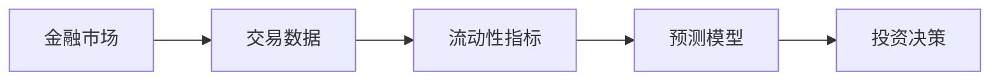

                 


# 开发智能化的金融市场流动性预测工具

> 关键词：金融市场流动性预测，机器学习，深度学习，时间序列分析，金融风险管理，Python编程，数学模型

> 摘要：本文旨在探讨如何开发智能化的金融市场流动性预测工具。通过分析流动性预测的背景与意义，介绍核心概念与算法原理，详细讲解系统架构设计，提供项目实战案例，并总结开发过程中的最佳实践。本文将从基础理论到实际应用，系统地阐述开发智能化流动性预测工具的全过程。

---

## 第一部分: 金融市场流动性预测工具开发基础

### 第1章: 金融市场流动性预测概述

#### 1.1 金融市场的基本概念
金融市场是资金流动的核心场所，主要包括股票市场、债券市场、外汇市场等。流动性是指资产能够迅速转化为现金而不遭受重大损失的能力。流动性预测在金融市场的稳定性、投资决策以及风险管理中具有重要意义。

#### 1.2 流动性预测的背景与意义
随着金融市场的复杂化和全球化，流动性预测变得越来越重要。市场的波动性、突发事件和政策变化都会影响流动性，进而影响资产价格和投资决策。通过预测流动性，投资者可以更好地管理风险，优化资产配置。

#### 1.3 本书的核心问题与目标
本文将探讨如何利用机器学习、深度学习等技术，结合时间序列分析，开发智能化的流动性预测工具。目标是通过理论与实践结合，帮助读者掌握流动性预测的核心方法和技术。

---

### 第2章: 核心概念与联系

#### 2.1 核心概念原理
流动性预测涉及多个核心概念，包括时间序列分析、机器学习和深度学习。时间序列分析是基于历史数据预测未来趋势的传统方法，而机器学习和深度学习则通过特征提取和复杂模式识别，提高预测的准确性。

#### 2.2 核心概念属性特征对比
| 概念       | 优点                           | 缺点                           |
|------------|--------------------------------|--------------------------------|
| 时间序列分析 | 方法简单，易于解释             | 对非线性关系的捕捉能力有限       |
| 机器学习    | 能够捕捉复杂关系，准确性高       | 黑箱模型，解释性较差             |
| 深度学习    | 能够处理高维数据，捕捉深度模式     | 计算资源需求高，训练时间长         |

#### 2.3 ER实体关系图架构


---

## 第二部分: 算法原理讲解

### 第3章: 时间序列分析算法

#### 3.1 ARIMA模型原理
ARIMA（Autoregressive Integrated Moving Average）是一种常用的时间序列预测模型。它通过自回归和移动平均的组合，捕捉数据中的趋势和周期性。

#### 3.2 使用Python实现ARIMA模型
```python
from statsmodels.tsa.arima_model import ARIMA
import pandas as pd

# 示例数据加载
data = pd.read_csv('liquidity_data.csv')

# ARIMA模型训练
model = ARIMA(data['value'], order=(5, 1, 0))
model_fit = model.fit()

# 预测未来值
forecast = model_fit.forecast(steps=5)
print(forecast)
```

#### 3.3 ARIMA模型的优缺点
ARIMA模型的优势在于简单易用和计算效率高，但其对非线性关系的捕捉能力有限，且需要手动调整参数。

---

### 第4章: 深度学习算法

#### 4.1 LSTM网络原理
LSTM（长短期记忆网络）是一种特殊的RNN（循环神经网络），通过引入记忆单元，能够有效捕捉时间序列中的长期依赖关系。

#### 4.2 使用Python实现LSTM模型
```python
from keras.models import Sequential
from keras.layers import LSTM, Dense

# 示例数据准备
X = ...  # 输入数据
y = ...  # 输出数据

# LSTM模型构建
model = Sequential()
model.add(LSTM(50, input_shape=(timesteps, features)))
model.add(Dense(1))
model.compile(loss='mean_squared_error', optimizer='adam')

# 模型训练
model.fit(X, y, epochs=50, batch_size=32)
```

#### 4.3 LSTM模型的数学公式
$$ LSTM: h_t = \sigma(g_{h}(h_{t-1}, x_t)) $$
其中，$h_t$ 表示当前时刻的状态，$x_t$ 表示输入，$g_h$ 表示门控函数。

---

## 第三部分: 系统分析与架构设计方案

### 第5章: 问题场景介绍

#### 5.1 问题场景介绍
流动性预测的主要场景包括市场波动监测、投资组合优化和风险管理。系统需要处理高维数据、实时更新和高精度预测等问题。

#### 5.2 系统功能设计
系统功能包括数据采集、模型训练、预测服务和结果展示。

#### 5.3 系统架构设计


---

## 第四部分: 项目实战

### 第6章: 环境配置与核心代码实现

#### 6.1 环境配置
```bash
pip install numpy pandas scikit-learn keras
```

#### 6.2 核心代码实现
```python
import numpy as np
import pandas as pd
from sklearn.metrics import mean_squared_error
from keras.models import Sequential
from keras.layers import LSTM, Dense

# 数据预处理
data = pd.read_csv('liquidity_data.csv')
X = data.iloc[:-1, :-1].values
y = data.iloc[-1, -1].values

# 模型训练
model = Sequential()
model.add(LSTM(50, input_shape=(X.shape[1], 1)))
model.add(Dense(1))
model.compile(loss='mean_squared_error', optimizer='adam')
model.fit(X, y, epochs=50, batch_size=32)

# 模型评估
y_pred = model.predict(X)
print(mean_squared_error(y, y_pred))
```

---

## 第五部分: 总结与展望

### 第7章: 总结与最佳实践

#### 7.1 总结
本文详细介绍了开发智能化的金融市场流动性预测工具的核心方法和技术，包括时间序列分析、机器学习和深度学习。通过理论与实践结合，帮助读者掌握流动性预测的关键步骤。

#### 7.2 最佳实践 tips
- 数据 preprocessing 是关键，需注意数据的完整性和代表性。
- 模型评估需结合业务场景，选择合适的指标和方法。
- 在实际应用中，需考虑实时性、计算资源和模型可解释性。

---

### 关键词：金融市场流动性预测，机器学习，深度学习，时间序列分析，Python编程，数学模型

### 摘要：本文探讨了如何开发智能化的金融市场流动性预测工具，通过理论与实践结合，系统地阐述了流动性预测的核心方法和技术，为读者提供了从基础到应用的全面指导。

