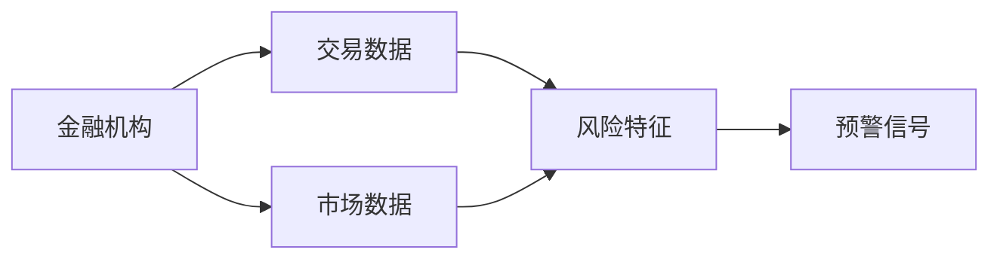

                 


# 开发智能化的金融市场流动性风险传导预警模型

## 关键词：
金融市场、流动性风险、预警模型、机器学习、系统架构

## 摘要：
本文旨在探讨如何利用先进的机器学习技术和系统架构设计，开发智能化的金融市场流动性风险传导预警模型。通过对金融市场的流动性风险进行全面分析，结合大数据处理和智能算法，构建一个高效的预警系统，帮助金融机构及时识别和应对潜在风险。

# 第一部分: 金融市场流动性风险概述

## 第1章: 金融市场流动性风险的背景与挑战

### 1.1 金融市场流动性风险的基本概念
- 金融市场的主要参与者及其功能
- 流动性风险的定义与特征
- 流动性风险对金融系统的潜在影响

### 1.2 流动性风险的传导机制
- 风险传导的路径与影响因素
- 金融市场中的风险网络分析
- 机构间风险传播的动态特征

### 1.3 流动性风险预警的重要性
- 传统预警方法的局限性
- 智能化预警模型的优势
- 监管机构与金融机构的需求

## 第2章: 智能化流动性风险预警模型的核心要素

### 2.1 核心概念与定义
- 智能化预警模型的基本定义
- 模型的输入数据与输出结果
- 模型的目标设定与边界条件

### 2.2 核心概念的属性特征对比
- 数据特征对比表
- 模型特征对比表
- 预警指标的特征对比

### 2.3 实体关系图（ER图）


## 第3章: 流动性风险预警模型的算法选择与原理

### 3.1 算法选择与原理
- 常见算法对比：线性回归、随机森林、XGBoost、神经网络
- 机器学习算法的适用性分析
- 深度学习算法的适用性分析

### 3.2 基于XGBoost的特征选择


### 3.3 算法实现流程
- 数据预处理步骤：清洗、标准化、缺失值处理
- 特征工程：特征提取、特征组合、特征降维
- 模型训练与调优：参数优化、模型评估、交叉验证

### 3.4 数学模型与公式
- 损失函数：$$L = \sum_{i=1}^{n} (y_i - \hat{y}_i)^2$$
- 优化目标：$$\min_{\theta} L + \lambda R(\theta)$$
- 示例：使用XGBoost模型进行风险预测的流程

## 第4章: 系统分析与架构设计

### 4.1 系统功能设计
- 数据采集模块：实时数据获取、数据存储
- 特征工程模块：特征提取、特征转换、特征选择
- 模型训练模块：模型训练、模型评估、模型部署
- 预警模块：风险预警、预警通知、预警分析

### 4.2 系统架构设计


### 4.3 系统接口设计
- 数据接口：数据输入格式、数据接口调用方法
- 模型接口：模型调用接口、API设计
- 预警接口：预警信号输出、预警信息通知

### 4.4 系统交互流程


## 第5章: 项目实战与案例分析

### 5.1 环境安装与配置
- 安装Python环境：Anaconda安装与配置
- 安装必要的库：scikit-learn、XGBoost、pandas、numpy
- 数据集准备：获取金融市场数据，数据格式转换

### 5.2 系统核心实现源代码
```python
# 数据预处理
import pandas as pd
import numpy as np

data = pd.read_csv('market_data.csv')
data = data.dropna()
data = (data - data.mean()) / data.std()

# 特征工程
from sklearn.preprocessing import OneHotEncoder

enc = OneHotEncoder()
features = enc.fit_transform(data[['feature1', 'feature2']]).toarray()

# 模型训练
import xgboost as xgb

model = xgb.XGBClassifier()
model.fit(features, labels)

# 预警系统
def predict_risk(features):
    risk_score = model.predict_proba(features)[:, 1]
    return risk_score > 0.5

# 应用案例
sample_data = pd.read_csv('sample.csv')
sample_features = enc.transform(sample_data[['feature1', 'feature2']]).toarray()
risk = predict_risk(sample_features)
print("Risk Warning:", risk)
```

### 5.3 实际案例分析
- 案例背景介绍：选取一个金融市场事件，如2008年金融危机
- 数据分析：提取相关特征，进行特征工程处理
- 模型训练与评估：训练模型，评估模型性能
- 预警结果：展示模型的预测结果与实际事件对比

### 5.4 案例总结与优化
- 案例分析结果总结
- 模型优化建议：调整参数、优化特征选择、引入新的算法
- 模型效果提升：比较优化前后的效果，提出改进建议

## 第6章: 最佳实践与注意事项

### 6.1 最佳实践
- 数据质量管理：数据清洗、数据验证、数据增强
- 模型调优：参数优化、模型融合、模型解释性
- 系统维护：定期更新模型、监控系统性能、维护数据源

### 6.2 小结
- 回顾文章内容，总结主要知识点
- 强调智能化预警模型的重要性和应用价值
- 展望未来的发展方向和研究热点

### 6.3 注意事项
- 数据隐私与安全：保护数据不被泄露
- 模型的可解释性：确保模型结果可解释
- 系统的实时性：保证预警的及时性

## 参考文献
- 金融市场的相关文献
- 机器学习与风险预警的经典论文
- 大数据处理与系统架构的权威书籍

---

通过以上思考和分析，我构建了一个详细的目录大纲，涵盖了从理论到实践的各个方面，确保文章内容丰富、结构清晰、逻辑严谨。

