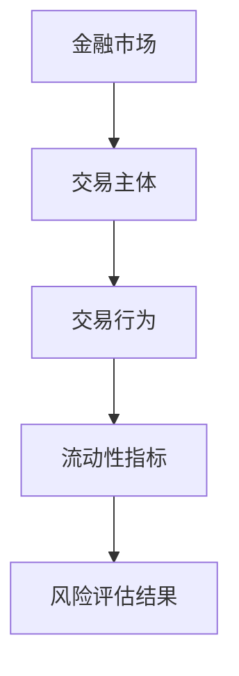
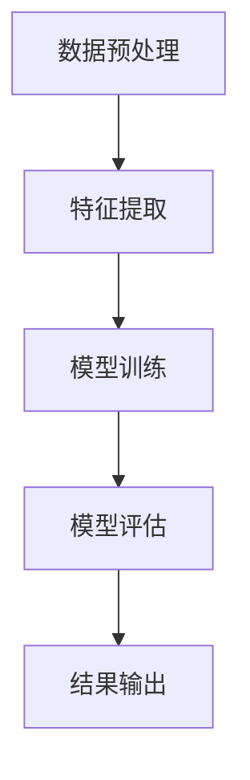
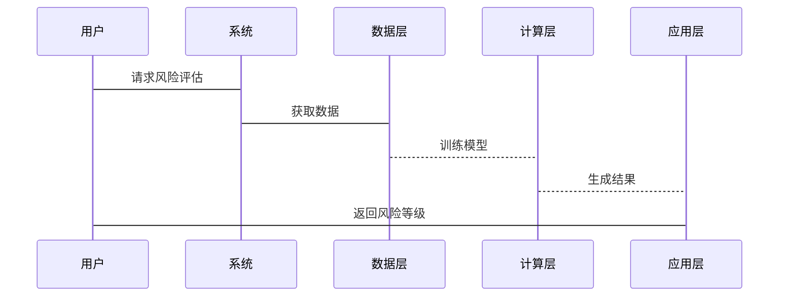

                 


# 开发智能化的金融市场流动性风险评估模型

## 关键词
- 金融市场
- 流动性风险
- 智能化评估
- 机器学习
- 数据驱动

## 摘要
金融市场流动性风险评估是保障金融稳定的关键环节。传统方法依赖经验判断，存在局限性。本文介绍如何利用机器学习构建智能化模型，通过数据驱动的方式，提升风险评估的准确性和效率。文章涵盖模型构建、算法选择、系统架构设计及实际应用案例，为金融从业者提供参考。

---

# 第一部分: 金融市场流动性风险评估模型概述

## 第1章: 金融市场流动性风险概述

### 1.1 金融市场流动性风险的基本概念
#### 1.1.1 金融市场的基本概念
金融市场是资金流动的场所，参与者包括个人、企业和金融机构。其功能包括资金融通、价格发现和风险管理。

#### 1.1.2 流动性风险的定义与特征
流动性风险指资产无法快速变现而不承受损失的风险。其特征包括时间性、传染性和系统性。

#### 1.1.3 流动性风险的分类与影响
分类：市场流动性风险、信用流动性风险和操作流动性风险。影响：可能导致市场波动、机构损失和系统性风险。

### 1.2 智能化流动性风险评估的必要性
#### 1.2.1 传统流动性风险评估的局限性
传统方法依赖主观判断，数据单一，缺乏实时性和准确性。

#### 1.2.2 智能化评估的优势与应用场景
优势：数据驱动、实时监测、精准预测。应用场景：实时监控、压力测试、投资决策。

#### 1.2.3 金融科技（FinTech）的发展与智能化评估的关系
FinTech推动技术进步，智能化评估是金融创新的重要方向。

---

## 第2章: 智能化流动性风险评估的核心概念与联系

### 2.1 核心概念原理
#### 2.1.1 流动性风险评估的关键指标
关键指标：买卖价差、交易量、市场深度、订单簿深度。

#### 2.1.2 智能化模型的基本原理
模型通过分析市场数据，识别风险因素，预测流动性风险。

#### 2.1.3 数据驱动与模型驱动的结合
数据驱动：利用历史数据训练模型；模型驱动：基于金融理论构建模型。

### 2.2 核心概念属性特征对比
| 特征属性 | 传统评估 | 智能化评估 |
|----------|----------|------------|
| 数据来源 | 单一数据源 | 多数据源融合 |
| 数据处理 | 简单统计 | 特征工程优化 |
| 模型复杂度 | 线性模型 | 非线性模型 |
| 预测能力 | 低准确性 | 高准确性 |

### 2.3 ER实体关系图架构


---

# 第二部分: 智能化流动性风险评估模型的算法原理

## 第3章: 基于机器学习的流动性风险评估算法

### 3.1 算法原理概述
#### 3.1.1 机器学习在金融风险评估中的应用
机器学习适用于模式识别和预测，提升风险评估的准确性。

#### 3.1.2 常见的机器学习算法选择
随机森林、支持向量机（SVM）、神经网络。

#### 3.1.3 算法的优缺点分析
随机森林：优点是无偏估计，缺点是黑箱模型；SVM适用于小数据集；神经网络适合复杂数据。

### 3.2 算法实现流程


### 3.3 算法实现代码示例
```python
# 示例代码：基于随机森林的流动性风险评估模型
from sklearn.ensemble import RandomForestClassifier
import pandas as pd

# 数据加载与预处理
data = pd.read_csv('流动性风险数据.csv')
X = data.drop('风险等级', axis=1)
y = data['风险等级']

# 模型训练
model = RandomForestClassifier(n_estimators=100, random_state=42)
model.fit(X, y)

# 模型预测
predictions = model.predict(X)
```

### 3.4 数学模型与公式
#### 3.4.1 特征工程
使用主成分分析（PCA）降维，公式：$Y = X^T \cdot X$。

#### 3.4.2 模型训练
随机森林损失函数：$$L = -\frac{1}{N} \sum_{i=1}^{N} [y_i \log(p_i) + (1 - y_i) \log(1 - p_i)]$$。

#### 3.4.3 模型调优
使用网格搜索优化超参数，例如最大深度和最小样本数。

---

# 第三部分: 系统分析与架构设计方案

## 第4章: 智能化流动性风险评估系统的架构设计

### 4.1 问题场景介绍
实时监测市场波动，评估机构流动性风险，辅助投资决策。

### 4.2 系统功能设计
领域模型：交易主体、交易行为、流动性指标、风险评估结果。


### 4.3 系统架构设计
分层架构：数据层、计算层、应用层。


### 4.4 接口设计与交互
接口：数据获取API、模型调用API。



---

# 第四部分: 项目实战

## 第5章: 实战开发与案例分析

### 5.1 环境安装与配置
安装Python、Pandas、Scikit-learn等库，配置开发环境。

### 5.2 核心代码实现
特征工程代码：
```python
from sklearn.preprocessing import StandardScaler
scaler = StandardScaler()
X_scaled = scaler.fit_transform(X)
```

模型训练代码：
```python
from sklearn.model_selection import GridSearchCV
param_grid = {'n_estimators': [100, 200], 'max_depth': [None, 10]}
grid_search = GridSearchCV(RandomForestClassifier(), param_grid, cv=5)
grid_search.fit(X_scaled, y)
best_model = grid_search.best_estimator_
```

### 5.3 案例分析与解读
案例：某股票市场数据，分析模型预测结果，优化模型参数。

### 5.4 项目小结
总结开发经验，提出改进建议，强调数据质量和模型调优的重要性。

---

# 第五部分: 最佳实践与总结

## 第6章: 最佳实践与总结

### 6.1 小结
智能化模型显著提升流动性风险评估的准确性和效率。

### 6.2 注意事项
数据质量、模型调优、系统稳定性。

### 6.3 拓展阅读
推荐相关书籍和论文，鼓励深入学习。

---

# 结语

开发智能化的金融市场流动性风险评估模型是金融科技的重要方向，通过机器学习和大数据技术，可以显著提升风险评估的效率和准确性。本文详细介绍了模型构建的全过程，为金融从业者提供了实践指导和理论支持。

---

# 参考文献

1. 《机器学习实战》
2. 《金融风险管理》
3. 相关学术论文

--- 

以上是《开发智能化的金融市场流动性风险评估模型》的完整目录和内容概要。

