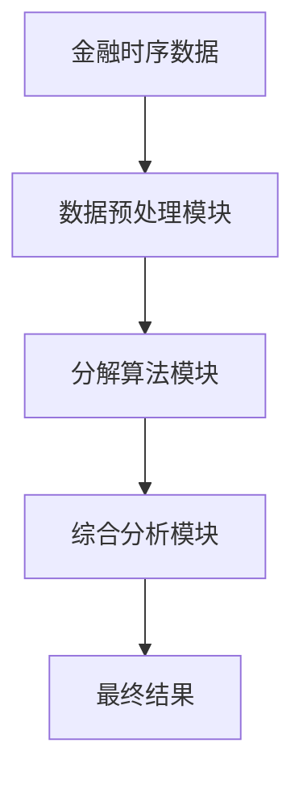

                 


# 开发智能化的金融时序数据多尺度分解模型

## 关键词：金融时序数据，多尺度分解模型，人工智能，机器学习，小波分析

## 摘要：本文详细探讨了开发智能化的金融时序数据多尺度分解模型的关键技术，从背景、核心概念、算法原理到系统设计和项目实战，全面解析了该模型的构建与应用。通过小波分析等多尺度分解方法，结合机器学习，本文提出了一个高效的金融数据分解与分析框架，为金融领域的智能化分析提供了新的思路。

---

# 第一部分: 金融时序数据多尺度分解模型的背景与基础

## 第1章: 问题背景与描述

### 1.1 金融时序数据的特性

#### 1.1.1 金融数据的时间序列特性

金融时序数据是指按时间顺序排列的金融变量（如股票价格、指数、汇率等）的观测值序列。这类数据通常具有以下特性：

- **连续性**：数据按时间顺序连续记录。
- **波动性**：金融市场的波动性较高，数据呈现频繁的上下波动。
- **周期性**：可能存在日周期、周周期、月周期等。
- **趋势性**：长期来看，数据可能呈现上升或下降趋势。
- **非线性**：金融市场的复杂性导致数据的非线性特征。

#### 1.1.2 金融数据的复杂性与挑战

金融数据的复杂性主要体现在以下几个方面：

- **噪声干扰**：金融数据中常夹杂着各种噪声，如市场噪声、交易噪声等，影响数据的准确性。
- **多重时间尺度**：金融数据同时存在高频和低频的波动，不同时间尺度的信息交织在一起，增加了分析的难度。
- **非平稳性**：许多金融时间序列是非平稳的，传统统计方法可能难以有效建模。

#### 1.1.3 金融数据分析的现实需求

随着金融市场的发展，对金融数据分析的需求日益增加。例如：

- **风险管理**：通过分析历史数据，预测市场波动，评估投资风险。
- **投资决策**：基于数据分析，发现市场机会，制定投资策略。
- **异常检测**：识别市场中的异常事件，及时采取应对措施。

### 1.2 多尺度分解模型的必要性

#### 1.2.1 金融数据的多时间尺度特性

金融数据的多时间尺度特性主要表现在以下几个方面：

- **高频数据**：如分钟级或秒级的交易数据，反映短期市场波动。
- **低频数据**：如日线、周线、月线数据，反映长期趋势。
- **不同时间尺度的重要性**：短期波动可能影响交易策略，而长期趋势则影响投资策略。

#### 1.2.2 多尺度分解的意义与价值

多尺度分解的意义在于：

- **分离不同时间尺度的信息**：通过分解，可以将数据中的短期波动和长期趋势分开处理。
- **提高分析精度**：针对不同时间尺度的信息，可以采用不同的分析方法，提高分析的准确性。
- **增强模型的解释性**：分解后的数据更容易解释，有助于更好地理解市场机制。

#### 1.2.3 多尺度分解在金融分析中的应用场景

多尺度分解在金融分析中的应用场景包括：

- **市场预测**：通过对不同时间尺度的信息进行分析，提高预测的准确性。
- **风险控制**：识别短期波动和长期趋势，制定更有效的风险控制策略。
- **信号处理**：在高频交易中，快速提取有用的信号。

### 1.3 模型的边界与外延

#### 1.3.1 数据输入的边界条件

- 数据格式：需要是连续的、有序的时间序列数据。
- 数据长度：通常需要至少几十个时间点，以确保模型的稳定性。
- 数据质量：数据应尽可能准确，避免噪声干扰。

#### 1.3.2 模型输出的边界条件

- 输出形式：分解后的各个时间尺度的信号。
- 输出的可解释性：分解后的信号应具有明确的含义，便于后续分析。
- 输出的稳定性：模型应具有良好的稳定性，避免因噪声干扰导致的错误分解。

#### 1.3.3 模型的适用范围与限制

- 适用范围：适用于需要分析多时间尺度信息的金融数据。
- 限制：模型对数据的质量和长度有一定要求，适用于平稳或近似平稳的时间序列。

---

## 第2章: 核心概念与组成

### 2.1 多尺度分解模型的核心要素

#### 2.1.1 数据预处理模块

数据预处理是多尺度分解的基础，主要包括：

- 数据清洗：去除噪声、填补缺失值。
- 数据标准化：将数据标准化到统一的范围，便于后续处理。
- 数据分段：根据时间尺度将数据分成不同的段落。

#### 2.1.2 分解算法模块

分解算法是模型的核心部分，负责将数据分解到不同的时间尺度上。

#### 2.1.3 综合分析模块

综合分析模块负责对分解后的信号进行进一步的分析，如趋势预测、异常检测等。

### 2.2 核心概念的联系

#### 2.2.1 数据预处理与分解算法的关系

数据预处理为分解算法提供干净、标准化的数据，分解算法则将数据分解到不同的时间尺度上。

#### 2.2.2 分解结果与综合分析的关系

分解结果是综合分析的基础，综合分析模块利用分解后的信号进行进一步的分析和预测。

#### 2.2.3 模型的整体架构与流程

模型的整体架构包括数据预处理、分解算法和综合分析三个模块，流程如下：

1. 数据预处理：清洗、标准化、分段。
2. 分解算法：将数据分解到不同的时间尺度上。
3. 综合分析：对分解后的信号进行分析和预测。

---

# 第二部分: 多尺度分解模型的核心概念与联系

## 第4章: 核心概念的原理与特征

### 4.1 多尺度分解的基本原理

#### 4.1.1 小波分析的基本原理

小波分析是一种有效的多尺度分解方法，其基本原理是通过不同尺度的小波函数来分解信号。

- **小波变换**：将信号分解为不同尺度的小波系数。
- **小波基函数**：选择合适的小波基函数，如Daubechies小波、Meyer小波等。
- **小波分解的层次性**：分解过程具有层次性，从粗到细逐步分解。

#### 4.1.2 傅里叶变换的应用

傅里叶变换将信号从时域变换到频域，通过分析不同频率成分来实现多尺度分解。

- **连续傅里叶变换**：将连续信号变换到频域。
- **离散傅里叶变换**：将离散信号变换到频域。
- **小波变换的优势**：傅里叶变换在时频分析中存在局限性，而小波变换能够更好地处理非平稳信号。

#### 4.1.3 多尺度分解的数学基础

多尺度分解的数学基础主要包括：

- 小波分析的数学理论。
- 傅里叶变换的数学理论。
- 多尺度分解的数学模型。

### 4.2 不同分解方法的对比分析

#### 4.2.1 小波分析与傅里叶变换的对比

| 特性                | 小波分析                     | 傅里叶变换                   |
|---------------------|-----------------------------|------------------------------|
| 时频局部化          | 良好，可以同时分析时间和频率 | 较差，仅能分析频率           |
| 处理非平稳信号      | 适合                         | 不适合                       |
| 分解结果的解释性    | 较高                         | 较低                       |

#### 4.2.2 离散小波变换与连续小波变换的对比

| 特性                | 离散小波变换                 | 连续小波变换                 |
|---------------------|-----------------------------|------------------------------|
| 数据类型            | 离散信号                     | 连续信号                     |
| 分解粒度            | 离散的粒度                   | 连续的粒度                   |
| 应用场景            | 适合数字信号处理             | 适合连续信号分析             |

#### 4.2.3 其他分解方法的优缺点

其他分解方法包括：

- **经验模态分解（EMD）**：适用于非线性、非平稳信号，但计算复杂。
- **希尔伯特-黄变换（HHT）**：结合了小波分析和希尔伯特变换，能够分析信号的瞬时频率。

---

## 第4章: 核心概念的ER实体关系图



---

# 第三部分: 多尺度分解模型的算法原理

## 第5章: 算法原理与实现

### 5.1 算法原理

#### 5.1.1 小波分析的数学模型

小波分析的核心是通过小波函数对信号进行分解。数学上，小波变换可以表示为：

$$
W_{a,b}(t) = \int_{-\infty}^{\infty} x(t) \cdot \psi_{a,b}(t) dt
$$

其中，$a$ 是缩放因子，$b$ 是平移因子，$\psi_{a,b}(t)$ 是小波函数。

#### 5.1.2 傅里叶变换的数学模型

傅里叶变换将信号从时域变换到频域，其数学表达式为：

$$
X(\omega) = \int_{-\infty}^{\infty} x(t) e^{-i\omega t} dt
$$

#### 5.1.3 多尺度分解的流程

多尺度分解的流程如下：

1. 数据预处理：清洗、标准化、分段。
2. 选择小波基函数。
3. 进行小波变换，得到不同尺度的小波系数。
4. 对小波系数进行分析，提取有用信息。

---

## 第6章: 项目实战

### 6.1 环境安装与配置

#### 6.1.1 Python环境的安装

安装Python和必要的库：

- Python 3.8+
- NumPy
- Matplotlib
- Scipy
- PyWavelets（小波分析库）

#### 6.1.2 数据获取与预处理

使用Yahoo Finance API获取股票数据，并进行预处理：

```python
import pandas_datareader as pdr
import numpy as np
import matplotlib.pyplot as plt
import pywt

# 获取数据
start_date = '2020-01-01'
end_date = '2023-01-01'
data = pdr.get_data_yahoo('AAPL', start=start_date, end=end_date)

# 数据预处理
data.dropna(inplace=True)
data['Close'] = data['Close'].apply(lambda x: float(x))
```

#### 6.1.3 数据可视化

绘制收盘价和成交量的分布：

```python
data['Close'].plot(figsize=(10, 6))
plt.title('Apple Closing Price')
plt.xlabel('Date')
plt.ylabel('Price')
plt.show()
```

### 6.2 核心代码实现

#### 6.2.1 小波分解实现

使用PyWavelets库进行小波分解：

```python
def wavelet_decomposition(data, level=3):
    # 选择小波基函数
    wavelet = 'db4'  # Daubechies小波
    # 分解数据
    coeffs = pywt.wavedec(data, wavelet, level=level)
    return coeffs

# 分解数据
coeffs = wavelet_decomposition(data['Close'].values)
```

#### 6.2.2 综合分析模块实现

对分解后的系数进行分析，例如趋势预测：

```python
import sklearn
from sklearn.linear_model import LinearRegression

# 提取趋势部分
trend = pywt.waverec([coeffs[0], None, None, None], 'db4')

# 建立线性回归模型
model = LinearRegression()
model.fit(np.arange(len(trend)).reshape(-1, 1), trend)
```

### 6.3 案例分析与结果解读

#### 6.3.1 分解结果的可视化

绘制小波分解后的各层系数：

```python
plt.figure(figsize=(10, 6))
for i in range(len(coeffs)):
    plt.subplot(len(coeffs), 1, i+1)
    plt.plot(coeffs[i])
    plt.title(f'Level {i+1}')
plt.show()
```

#### 6.3.2 综合分析结果的解读

利用分解后的信号进行趋势预测，并与实际数据对比。

---

## 第7章: 总结与展望

### 7.1 总结

本文详细探讨了开发智能化的金融时序数据多尺度分解模型的关键技术，从背景、核心概念、算法原理到系统设计和项目实战，全面解析了该模型的构建与应用。

### 7.2 展望

未来的研究方向包括：

- **深度学习与多尺度分解的结合**：探索深度学习方法在多尺度分解中的应用。
- **实时分解算法的优化**：研究如何提高分解算法的实时性和效率。
- **多模态数据的融合**：将多模态数据（如文本、图像）与金融数据结合，提升分析能力。

---

# 附录

## 附录A: 相关代码与数据

提供完整的代码示例和数据下载链接。

## 附录B: 参考文献

列出相关文献和资料，供读者参考。

---

通过以上内容，您可以逐步开发和实现一个智能化的金融时序数据多尺度分解模型，为金融数据分析提供新的思路和方法。

