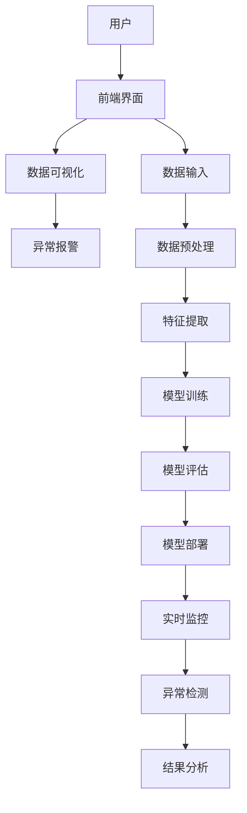
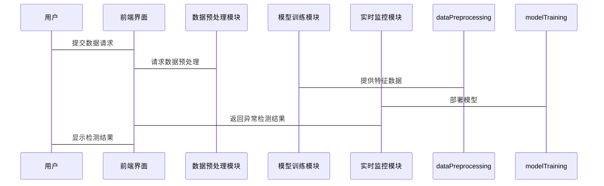

                 


# 开发智能化的金融时序数据异常检测模型

> 关键词：金融时序数据，异常检测，深度学习，AI，时间序列分析

> 摘要：本文深入探讨了开发智能化金融时序数据异常检测模型的关键技术与实践。从金融时序数据的基本概念出发，结合深度学习算法（如LSTM和Transformer）的核心原理，分析了在金融场景中的实际应用。通过系统设计、项目实战和优化策略，提供了从理论到实践的完整解决方案，帮助读者掌握智能化金融时序数据异常检测的核心方法。

---

## 第一部分: 金融时序数据异常检测背景与基础

### 第1章: 金融时序数据概述

#### 1.1 金融时序数据的基本概念

金融时序数据是指在金融市场中随着时间推移连续记录的数值型数据，例如股票价格、汇率、债券收益率等。这类数据具有以下特点：

- **时间依赖性**：数据点之间存在时间相关性，过去的价格走势可能影响未来的价格。
- **非线性关系**：金融市场的波动往往受到多种复杂因素的影响，数据关系可能呈现非线性特征。
- **异常值敏感性**：金融数据中的异常值（如突然的价格跳水或飙升）往往预示着市场风险或重要事件。

#### 1.2 异常检测的定义与重要性

异常检测是指在数据中识别出不符合预期模式或偏离正常行为的数据点。在金融领域，异常检测具有重要意义：

- **风险管理**：及时发现异常交易或价格波动，可以帮助机构规避潜在风险。
- **市场分析**：通过分析异常数据，可以识别市场操纵、欺诈行为或突发事件。
- **投资机会**：某些异常可能预示着短期投资机会。

#### 1.3 传统方法的局限性

传统的时间序列分析方法（如ARIMA）在处理复杂金融数据时存在以下问题：

- **假设限制**：假设数据服从平稳过程，难以处理非线性波动。
- **计算复杂度**：对于高频金融数据，传统方法的计算效率较低。
- **特征提取不足**：难以捕捉复杂的模式和长距离依赖关系。

---

### 第2章: 传统金融时序数据分析方法

#### 2.1 统计学方法

统计学方法是金融数据分析的基础，但在处理复杂问题时存在局限性。

- **均值和标准差法**：通过计算数据的均值和标准差，识别偏离正常范围的观测值。这种方法简单但容易受到数据分布偏斜的影响。
- **独立成分分析（ICA）**：通过分解数据矩阵，提取独立的成分，识别异常信号。但ICA对金融数据的有效性仍有待验证。

#### 2.2 时间序列分析方法

时间序列分析方法是专门针对时序数据设计的统计学方法。

- **ARIMA模型**：通过自回归和移动平均的组合，预测未来的趋势。但ARIMA模型假设数据平稳，难以处理非线性波动。
- **指数平滑法**：通过加权平均的方法平滑数据，适用于短期预测。但在处理异常值时效果有限。

#### 2.3 传统机器学习方法

传统机器学习方法通过特征工程提取有用的信号，但需要大量人工干预。

- **基于聚类的异常检测**：将数据点聚类，识别与大多数点偏离的异常点。
- **基于分类的异常检测**：将数据分为正常和异常两类，使用SVM等模型进行分类。

---

### 第3章: 智能化金融时序数据异常检测的核心概念

#### 3.1 基于深度学习的时序数据建模

深度学习模型在处理复杂时序数据方面具有显著优势。

- **循环神经网络（RNN）**：通过循环结构捕捉时序数据的依赖关系。但RNN容易出现梯度消失或爆炸问题。
- **长短期记忆网络（LSTM）**：通过门控机制解决RNN的短期记忆问题，能够有效捕捉长距离依赖关系。
- **Transformer模型**：通过自注意力机制捕捉全局依赖关系，适用于长序列建模。

#### 3.2 深度学习模型的优势

- **非线性表达能力**：深度学习模型能够捕捉复杂的非线性关系。
- **长距离依赖捕捉**：通过自注意力机制，模型可以捕捉远距离的依赖关系。
- **自动特征提取**：深度学习模型能够自动提取有用的特征，减少人工干预。

#### 3.3 深度学习模型的挑战

- **训练难度与计算成本**：深度学习模型需要大量计算资源和时间进行训练。
- **模型可解释性**：深度学习模型通常是“黑箱”，难以解释异常检测的依据。
- **数据稀疏性**：金融数据可能存在小样本问题，影响模型的泛化能力。

---

## 第二部分: 智能化金融时序数据异常检测算法原理

### 第4章: 基于深度学习的时间序列异常检测算法

#### 4.1 基于RNN的异常检测算法

- **RNN的基本结构与训练过程**：通过输入门控、遗忘门控和输出门控捕捉时序数据的依赖关系。
- **异常检测原理**：通过比较模型预测值与实际值的差异，识别异常点。
- **实例分析与代码实现**：使用LSTM模型对股票价格进行异常检测，展示代码实现和结果分析。

#### 4.2 基于LSTM的异常检测算法

- **LSTM网络的结构与特点**：通过门控机制有效捕捉长距离依赖关系。
- **在时间序列预测中的应用**：通过LSTM模型预测未来的价格走势，并通过残差分析识别异常点。
- **代码实现与结果分析**：展示LSTM模型的训练过程和异常检测结果。

---

### 第5章: 基于Transformer的时间序列异常检测算法

#### 5.1 Transformer模型的基本原理

- **自注意力机制**：通过查询、键和值三部分计算每个位置的重要性。
- **位置编码**：通过位置编码将序列位置信息嵌入模型。
- **模型结构**：由编码器和解码器组成，适用于长序列建模。

#### 5.2 Transformer模型在时间序列分析中的应用

- **时间序列预测**：通过Transformer模型预测未来的趋势。
- **异常检测**：通过残差分析识别异常点。

#### 5.3 基于Transformer的异常检测实现

- **模型训练**：通过监督学习训练模型。
- **异常检测评估**：通过AUC等指标评估模型性能。

---

## 第三部分: 智能化金融时序数据异常检测系统设计

### 第6章: 系统架构设计

#### 6.1 系统功能设计

- **数据预处理**：包括数据清洗、特征提取和数据增强。
- **模型训练**：包括模型选择、超参数调优和模型训练。
- **异常检测**：包括实时监控和异常报警。
- **结果分析**：包括结果可视化和异常原因分析。

#### 6.2 系统架构图



#### 6.3 系统接口设计

- **数据接口**：与金融数据库对接，获取时序数据。
- **模型接口**：与深度学习模型对接，获取预测结果。
- **报警接口**：与报警系统对接，触发异常报警。

#### 6.4 系统交互流程图



---

## 第四部分: 项目实战

### 第7章: 项目实战

#### 7.1 环境安装

- **安装Python环境**：使用Anaconda安装Python 3.8以上版本。
- **安装深度学习库**：安装TensorFlow、Keras、PyTorch等深度学习框架。
- **安装数据处理库**：安装Pandas、NumPy等数据处理库。
- **安装可视化库**：安装Matplotlib、Seaborn等可视化库。

#### 7.2 核心实现

- **数据预处理**：加载数据、清洗数据、特征提取。
- **模型实现**：实现LSTM或Transformer模型，训练模型。
- **异常检测**：通过模型预测结果，识别异常点。
- **结果分析**：通过可视化工具分析检测结果。

#### 7.3 代码实现

```python
import numpy as np
import pandas as pd
import matplotlib.pyplot as plt
from tensorflow.keras.models import Model
from tensorflow.keras.layers import Input, LSTM, Dense, Dropout

# 加载数据
data = pd.read_csv('financial_data.csv')

# 数据预处理
def preprocess_data(data):
    # 数据归一化
    data_norm = (data - data.mean()) / data.std()
    return data_norm

processed_data = preprocess_data(data)

# 模型构建
input_shape = (None, 1)
inputs = Input(shape=input_shape)
lstm_layer = LSTM(64, return_sequences=True)(inputs)
dropout_layer = Dropout(0.2)(lstm_layer)
dense_layer = Dense(1)(dropout_layer)
model = Model(inputs=inputs, outputs=dense_layer)

# 模型训练
model.compile(optimizer='adam', loss='mean_squared_error')
model.fit(processed_data, epochs=10, batch_size=32)

# 异常检测
predictions = model.predict(processed_data)
errors = np.abs(predictions - processed_data)
threshold = np.quantile(errors, 0.95)
anomalies = errors > threshold

# 可视化
plt.figure(figsize=(12, 6))
plt.plot(processed_data, color='blue', label='Normal data')
plt.plot(processed_data[anomalies], color='red', label='Anomalies')
plt.title('Financial Time Series Anomaly Detection')
plt.xlabel('Time')
plt.ylabel('Value')
plt.legend()
plt.show()
```

#### 7.4 案例分析

- **数据获取与预处理**：从金融数据库获取股票价格数据，进行归一化处理。
- **模型训练与评估**：训练LSTM模型，评估模型性能。
- **异常检测与分析**：识别异常点，分析异常原因。
- **结果可视化**：通过图表展示异常点分布。

---

## 第五部分: 高级主题与优化

### 第8章: 高级主题

#### 8.1 多模态数据的异常检测

- **文本数据**：分析新闻、社交媒体数据，识别情绪波动对股价的影响。
- **图像数据**：通过图像识别技术分析K线图中的异常模式。

#### 8.2 在线学习与自适应模型

- **在线学习**：模型实时更新，适应市场变化。
- **自适应模型**：通过反馈机制调整模型参数。

#### 8.3 模型解释性与可解释性

- **模型解释性**：通过特征重要性分析，识别影响异常检测的关键因素。
- **可解释性优化**：通过可视化工具解释模型决策过程。

---

## 第六部分: 附录

### 第9章: 附录

#### 9.1 工具安装指南

- **Python环境**：Anaconda
- **深度学习框架**：TensorFlow、PyTorch
- **数据处理库**：Pandas、NumPy
- **可视化工具**：Matplotlib、Seaborn

#### 9.2 数据集推荐

- **股票价格数据**：Yahoo Finance API
- **汇率数据**：XE.com API
- **债券收益率数据**：FRED数据库

#### 9.3 参考文献

- 刘洋, 《深度学习与金融时间序列分析》，人民邮电出版社，2022。
- 王鹏, 《金融数据分析与Python实现》，机械工业出版社，2021。

---

通过本文的详细讲解，读者可以系统地了解智能化金融时序数据异常检测的核心方法，从理论到实践，掌握开发智能化异常检测模型的关键技术与最佳实践。

