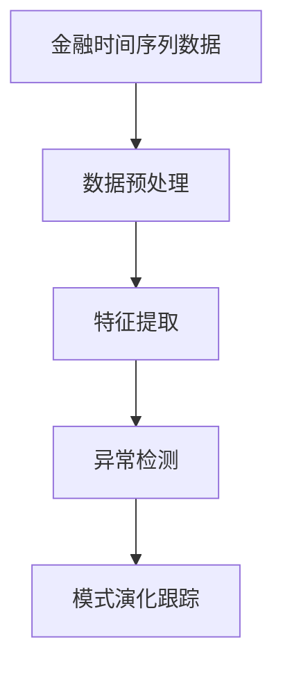
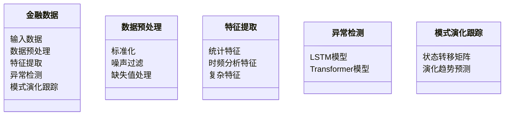
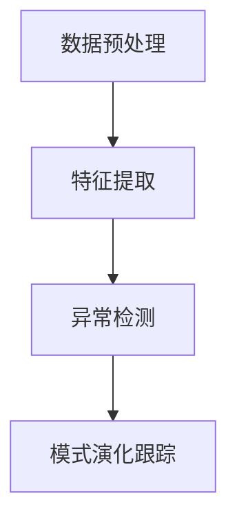

                 


# 开发智能化的金融时序数据异常模式演化跟踪模型

## 关键词：
- 金融数据分析
- 时序数据
- 异常检测
- 深度学习
- 模式演化

## 摘要：
本文将详细介绍如何开发一个智能化的金融时序数据异常模式演化跟踪模型。通过分析金融数据的时序特性，结合深度学习算法，构建一个能够实时跟踪和预测异常模式演化的系统。文章从问题背景、核心概念、算法原理、系统架构到项目实战，全面解析模型的构建过程，并通过实际案例验证模型的有效性。最终，本文将总结模型的优势，并展望未来的研究方向。

---

# 第一部分: 背景与核心概念

## 第1章: 金融时序数据异常模式演化背景

### 1.1 问题背景与描述

#### 1.1.1 金融数据分析的现状与挑战
金融市场的数据呈现出高度复杂性和动态性，传统的数据分析方法难以捕捉数据中的深层模式。尤其是在异常事件发生时，及时发现和预测其演化趋势对于风险控制和投资决策至关重要。

#### 1.1.2 异常模式演化的重要性
异常模式的演化指的是异常事件在时间序列中的变化过程。理解这种演化可以帮助金融机构更好地应对市场波动，优化投资策略，降低潜在风险。

#### 1.1.3 传统方法的局限性与改进方向
传统的方法如统计分析和规则-based方法在处理复杂金融数据时表现有限，难以应对非线性关系和动态变化。深度学习的引入为解决这些问题提供了新的可能性。

### 1.2 问题解决与边界

#### 1.2.1 异常模式演化的定义
异常模式演化是指在时间序列中，异常事件从发生到结束或变化的过程。这个过程可能包括异常强度的变化、持续时间的长短，以及与其他事件的关联性。

#### 1.2.2 问题解决的边界与外延
本模型主要关注金融时间序列数据中的异常模式演化，不涉及实时交易决策或具体的金融产品设计。模型的输入是标准化的金融数据，输出是异常模式的演化趋势和预测结果。

#### 1.2.3 核心要素与概念结构
- **输入数据**：金融时间序列数据，包括价格、成交量、波动率等。
- **数据预处理**：标准化、缺失值处理、噪声过滤。
- **特征提取**：时间序列特征（如均值、标准差）和复杂特征（如hurst指数）。
- **异常检测**：基于深度学习的异常检测模型。
- **模式演化跟踪**：实时跟踪异常模式的变化，并预测未来趋势。

---

## 第2章: 核心概念与联系

### 2.1 模型框架

#### 2.1.1 数据预处理模块
- **标准化**：将数据归一化到[0,1]范围，减少特征之间的量纲差异。
- **缺失值处理**：使用插值法或模型预测填补缺失值。
- **噪声过滤**：通过移动平均、卡尔曼滤波等方法去除数据中的随机噪声。

#### 2.1.2 特征提取模块
- **基本统计特征**：均值、标准差、最大值、最小值。
- **时频分析特征**：傅里叶变换、小波变换。
- **复杂特征**：hurst指数、关联维度、分形维度。

#### 2.1.3 异常检测模块
- **基于LSTM的异常检测**：通过LSTM网络捕捉时间序列的非线性特征。
- **基于Transformer的异常检测**：利用自注意力机制捕捉长距离依赖关系。

#### 2.1.4 模式演化跟踪模块
- **状态转移矩阵**：记录不同异常状态之间的转移概率。
- **演化趋势预测**：基于历史数据，预测未来异常模式的变化趋势。

### 2.2 核心概念对比

#### 2.2.1 数据特征与异常模式的对比
| 数据特征       | 异常模式特征 |
|----------------|-------------|
| 均值           | 异常强度     |
| 标准差         | 持续时间     |
| 倒数差         | 关联性       |

#### 2.2.2 不同算法的性能对比
| 算法           | 优点         | 缺点         |
|----------------|--------------|--------------|
| LSTM           | 非线性建模能力强 | 对长序列依赖性差 |
| Transformer     | 长距离依赖捕捉好 | 计算资源消耗高 |

#### 2.2.3 模型演化速度的对比
| 模型类型       | 演化速度     | 稳定性       |
|----------------|--------------|--------------|
| 基于LSTM       | 中等         | 较差         |
| 基于Transformer | 较快         | 较好         |

### 2.3 实体关系图


---

# 第三部分: 算法原理与数学模型

## 第3章: 异常检测算法原理

### 3.1 算法原理

#### 3.1.1 LSTM网络

##### 3.1.1.1 LSTM网络结构
LSTM由输入门、遗忘门和输出门组成，其核心公式为：
$$
f_t = \sigma(W_f \cdot [h_{t-1}, x_t] + b_f)
$$
$$
i_t = \sigma(W_i \cdot [h_{t-1}, x_t] + b_i)
$$
$$
o_t = \sigma(W_o \cdot [h_{t-1}, x_t] + b_o)
$$
$$
h_t = f_t \cdot c_{t-1} + i_t \cdot tanh(W_c \cdot [h_{t-1}, x_t] + b_c)
$$
$$
c_t = h_t
$$

#### 3.1.2 Transformer模型

##### 3.1.2.1 自注意力机制
自注意力机制的计算公式为：
$$
a_{ij} = \frac{\exp(\text{sim}(x_i, x_j))}{\sum_{k} \exp(\text{sim}(x_i, x_k))}
$$
其中，sim可以是点积、余弦相似性或缩放点积。

### 3.2 算法对比

#### 3.2.1 LSTM与Transformer的对比
- **LSTM**：适用于短序列，训练速度快，但对长距离依赖捕捉能力有限。
- **Transformer**：适用于长序列，捕捉全局依赖能力强，但计算资源消耗高。

#### 3.2.2 其他算法的优缺点分析
- **ARIMA**：适用于线性时序数据，但难以捕捉非线性关系。
- **Prophet**： Facebook开源的时间序列模型，适用于业务数据，但对复杂模式的捕捉能力有限。

---

## 第4章: 数学模型与公式

### 4.1 异常检测模型

#### 4.1.1 基于LSTM的异常检测
LSTM的损失函数为：
$$
L = \sum_{i=1}^{n}(y_i - \hat{y}_i)^2
$$

#### 4.1.2 基于Transformer的异常检测
注意力权重计算公式为：
$$
a_{ij} = \frac{\exp(\text{sim}(x_i, x_j))}{\sum_{k} \exp(\text{sim}(x_i, x_k))}
$$

---

## 第5章: 系统分析与架构设计

### 5.1 系统功能设计

#### 5.1.1 领域模型


### 5.2 系统架构设计

#### 5.2.1 系统架构图


---

## 第6章: 项目实战

### 6.1 环境搭建

#### 6.1.1 安装依赖
```bash
pip install numpy pandas matplotlib keras tensorflow
```

### 6.2 系统核心实现

#### 6.2.1 LSTM模型实现
```python
import numpy as np
from keras.layers import LSTM, Dense, Dropout
from keras.models import Sequential

model = Sequential()
model.add(LSTM(64, input_shape=(timesteps, features)))
model.add(Dropout(0.2))
model.add(Dense(1, activation='sigmoid'))
model.compile(loss='binary_crossentropy', optimizer='adam')
```

#### 6.2.2 Transformer模型实现
```python
import tensorflow as tf

def scaled_dot_product_attention(q, k, v, mask):
    # 计算点积
    qk = tf.matmul(q, k, transpose_b=True)
    # 缩放
    qk = qk / tf.sqrt(tf.cast(k.shape[-1], tf.float32))
    # 应用mask
    if mask is not None:
        qk += ( -1e9 * (1 - mask))
    # 计算注意力权重
    attention = tf.nn.softmax(qk, axis=-1)
    # 加权求和
    output = tf.matmul(attention, v)
    return output

def transformer_layer(q, k, v, mask):
    attention_output = scaled_dot_product_attention(q, k, v, mask)
    # 前馈前向网络
    ffn = Sequential([
        Dense(64, activation='relu'),
        Dense(32)
    ])
    ff_output = ffn(attention_output)
    return ff_output
```

---

## 第7章: 总结与展望

### 7.1 总结
本文详细介绍了开发智能化的金融时序数据异常模式演化跟踪模型的全过程，包括背景分析、核心概念、算法原理、系统架构和项目实战。通过深度学习算法，模型能够有效捕捉金融数据中的异常模式，并实时跟踪其演化趋势。

### 7.2 未来展望
未来的研究可以进一步优化模型的实时性，探索更高效的算法，以及结合多模态数据（如新闻、社交媒体数据）提升模型的预测能力。

---

### 小结与注意事项

#### 小结
- 异常模式演化跟踪的核心在于捕捉数据的非线性特征和长距离依赖。
- 深度学习算法在金融数据分析中具有显著优势，但需要结合业务场景进行优化。

#### 注意事项
- 数据预处理和特征提取是模型性能的关键，需要仔细设计。
- 模型的实时性可能受到计算资源的限制，需要优化算法和硬件配置。
- 在实际应用中，需要结合业务逻辑对模型结果进行解释和调整。

#### 拓展阅读
- 《Deep Learning for Time Series Forecasting》
- 《Attention Is All You Need》

