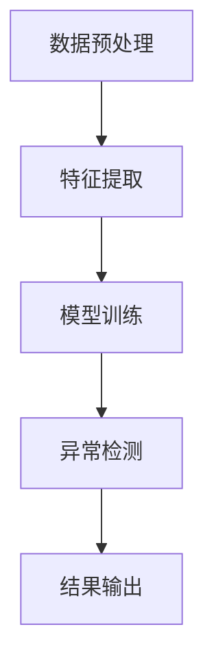
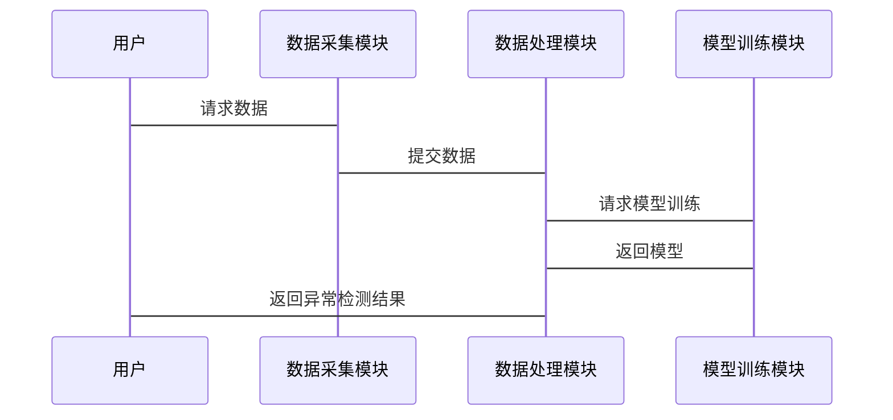

                 


# 开发智能化的金融时序数据异常模式识别模型

> 关键词：金融时序数据，异常模式识别，智能化模型，深度学习，时间序列分析

> 摘要：  
本文详细探讨了开发智能化的金融时序数据异常模式识别模型的关键技术与实现方案。从金融时序数据的特性出发，结合深度学习和传统统计方法的优势，提出了一种基于LSTM的异常检测模型，并通过实际案例展示了模型的应用效果。文章内容涵盖背景分析、核心概念、算法原理、系统设计、项目实战及优化建议，旨在为金融领域的数据科学家和工程师提供有价值的参考。

---

# 第1章 金融时序数据异常模式识别的背景与问题描述

## 1.1 问题背景

### 1.1.1 金融数据的特点与挑战
金融数据具有以下特点：
- **连续性**：金融数据通常是按时间顺序生成的连续序列。
- **波动性**：金融市场数据受多种因素影响，表现出高度的波动性。
- **复杂性**：金融数据可能受到宏观经济、政策、市场情绪等多种因素的影响。
- **实时性**：金融数据需要实时处理，这对模型的响应速度提出了更高的要求。

### 1.1.2 异常模式识别的必要性
- 异常交易的识别：检测市场操纵、欺诈交易等行为。
- 风险预警：通过识别异常数据模式，提前预警市场风险。
- 交易策略优化：基于异常数据的识别，优化交易策略。

### 1.1.3 智能化技术在金融领域的应用前景
- 人工智能技术在金融领域的应用日益广泛，包括股票预测、风险评估、异常检测等。
- 深度学习技术在时间序列数据处理方面表现出色，为金融时序数据的异常模式识别提供了新的可能性。

## 1.2 问题描述

### 1.2.1 时序数据的定义与特征
- 时序数据是指按时间顺序排列的数据，通常具有时间戳属性。
- 数据的连续性、周期性和趋势性是时序数据的重要特征。

### 1.2.2 异常模式的定义与分类
- 异常模式是指与正常数据模式显著不同的数据点或数据序列。
- 异常模式可以分为单点异常、趋势异常和分布异常。

### 1.2.3 金融场景中的异常模式识别需求
- 在金融交易中，异常模式可能对应市场操纵、欺诈交易等行为。
- 在风险管理中，异常模式可能预示着潜在的市场风险。

## 1.3 问题解决与边界

### 1.3.1 异常模式识别的核心目标
- 通过模型识别出金融时序数据中的异常模式。
- 提供可解释的异常检测结果，支持后续的决策过程。

### 1.3.2 问题的边界与适用场景
- 适用于金融市场的实时数据监控。
- 适用于高频交易数据和低频交易数据的异常检测。

### 1.3.3 模型的局限性与限制条件
- 模型对数据质量高度依赖，数据噪声可能影响检测效果。
- 模型需要定期更新，以适应市场环境的变化。

## 1.4 概念结构与核心要素

### 1.4.1 时序数据的构成要素
- 时间戳：数据生成的时间点。
- 数据值：具体的数值或指标。
- 数据源：数据的来源，如股票价格、交易量等。

### 1.4.2 异常模式识别的关键环节
1. 数据预处理：包括数据清洗、归一化等。
2. 模型训练：基于时序数据训练异常检测模型。
3. 异常检测：利用训练好的模型识别异常模式。

### 1.4.3 智能化模型的核心要素
- 数据输入：时序数据。
- 模型结构：深度学习模型（如LSTM）或传统统计模型。
- 输出结果：异常分数或异常标签。

---

# 第2章 核心概念与联系

## 2.1 核心概念原理

### 2.1.1 时序数据的特征提取
- 时间依赖性：数据的当前值与过去值密切相关。
- 趋势性：数据表现出长期的上升或下降趋势。
- 周期性：数据具有一定的周期性特征，如月度周期、季度周期等。

### 2.1.2 异常模式识别的数学基础
- 统计学方法：均值、方差、Z-score等。
- 机器学习方法：支持向量机（SVM）、随机森林等。
- 深度学习方法：LSTM、GRU等。

### 2.1.3 智能化模型的基本原理
- 深度学习模型能够捕捉时序数据中的复杂模式。
- 通过训练模型，可以学习正常数据的分布，进而识别异常数据。

## 2.2 核心概念对比分析

### 2.2.1 不同异常检测方法的对比
| 方法          | 优点                           | 缺点                           |
|---------------|--------------------------------|---------------------------------|
| 统计方法      | 实现简单，计算效率高           | 对复杂模式的捕捉能力有限       |
| 机器学习方法  | 能捕捉非线性模式               | 需要大量数据，计算复杂           |
| 深度学习方法  | 能捕捉复杂模式，效果好         | 需要大量数据，训练时间长         |

### 2.2.2 传统方法与智能化方法的差异
- 传统方法：基于统计或机器学习，适用于简单场景。
- 深度学习方法：基于神经网络，适用于复杂场景。

### 2.2.3 不同模型的性能对比
- LSTM模型在捕捉时间依赖性方面表现优异。
- GRU模型在计算效率上具有一定优势。

## 2.3 ER实体关系图架构

```mermaid
erDiagram
    customer[CUSTOMER] {
        code : string
        name : string
    }
    transaction[TRANSACTION] {
        id : integer
        time : datetime
        amount : float
        status : string
    }
    bank[BRANCH] {
        name : string
        location : string
    }
    CUSTOMER --> TRANSPORT: "makes"
    TRANSPORT --> BRANCH: "via"
```

---

# 第3章 算法原理讲解

## 3.1 算法原理概述

### 3.1.1 基于深度学习的异常检测
- 使用LSTM或GRU网络结构，捕捉时序数据中的复杂模式。
- 模型输出为异常概率或异常分数。

### 3.1.2 基于传统统计的方法
- 使用Z-score、LOF等方法进行异常检测。
- 方法简单，但对复杂模式的捕捉能力有限。

### 3.1.3 混合模型的优势与劣势
- 组合多种方法，提高检测效果。
- 但可能导致模型复杂性增加，计算效率下降。

## 3.2 算法流程图



---

## 3.3 算法实现代码

### 3.3.1 数据预处理代码

```python
import pandas as pd
import numpy as np

def preprocess_data(data):
    # 数据清洗
    data = data.dropna()
    # 数据归一化
    data = (data - data.mean()) / data.std()
    return data
```

### 3.3.2 模型训练代码

```python
import keras
from keras.models import Sequential
from keras.layers import LSTM, Dense

def build_model(input_shape):
    model = Sequential()
    model.add(LSTM(64, input_shape=input_shape))
    model.add(Dense(1, activation='sigmoid'))
    model.compile(loss='binary_crossentropy', optimizer='adam')
    return model
```

### 3.3.3 模型预测代码

```python
def detect_anomalies(model, data):
    # 预测正常概率
    predicted = model.predict(data)
    # 异常分数
    anomaly_scores = 1 - predicted
    return anomaly_scores
```

---

## 3.4 算法的数学模型

### 3.4.1 LSTM网络结构
- LSTM的三个门控：输入门、遗忘门、输出门。
- LSTM的数学公式：
  $$ f(t) = \sigma(W_f \cdot [h(t-1), x(t)] + b_f) $$
  $$ i(t) = \sigma(W_i \cdot [h(t-1), x(t)] + b_i) $$
  $$ o(t) = \sigma(W_o \cdot [h(t-1), x(t)] + b_o) $$
  $$ c(t) = f(t) \cdot c(t-1) + i(t) \cdot tanh(W_c \cdot [h(t-1), x(t)] + b_c) $$
  $$ h(t) = o(t) \cdot tanh(c(t)) $$

---

# 第4章 系统分析与架构设计方案

## 4.1 问题场景介绍

### 4.1.1 金融交易监控
- 监控股票价格的异常波动。
- 检测交易量的异常变化。

### 4.1.2 风险预警系统
- 预警市场风险。
- 提供风险评估报告。

### 4.1.3 数据源与目标
- 数据源：股票价格、交易量、市场指数等。
- 目标：识别异常模式，提供预警信息。

---

## 4.2 系统功能设计

### 4.2.1 数据采集模块
- 从金融数据源获取时序数据。
- 数据格式：CSV、JSON等。

### 4.2.2 数据处理模块
- 数据清洗：处理缺失值、异常值。
- 数据归一化：标准化处理。

### 4.2.3 模型训练模块
- 训练异常检测模型。
- 调参优化：调整模型参数，提高检测效果。

### 4.2.4 结果展示模块
- 展示异常检测结果。
- 提供可视化界面。

---

## 4.3 系统架构设计

### 4.3.1 分层架构
- 数据层：存储原始数据。
- 业务逻辑层：处理数据，训练模型。
- 表现层：展示结果。

### 4.3.2 微服务架构
- 数据采集服务：负责数据采集。
- 数据处理服务：负责数据清洗和归一化。
- 模型训练服务：负责模型训练和预测。

---

## 4.4 系统接口设计

### 4.4.1 数据接口
- 数据采集接口：REST API。
- 数据处理接口：处理数据请求。

### 4.4.2 模型接口
- 模型训练接口：接收数据，返回模型。
- 异常检测接口：接收数据，返回异常分数。

---

## 4.5 系统交互设计



---

# 第5章 项目实战

## 5.1 环境安装

### 5.1.1 安装Python环境
- 使用Anaconda或虚拟环境。
- 安装必要的库：pandas、numpy、keras、tensorflow。

### 5.1.2 安装Jupyter Notebook
- 安装Jupyter Notebook用于代码实现和结果展示。

## 5.2 系统核心实现源代码

### 5.2.1 数据预处理代码

```python
import pandas as pd
import numpy as np

def preprocess_data(data):
    data = data.dropna()
    data = (data - data.mean()) / data.std()
    return data
```

### 5.2.2 模型训练代码

```python
import keras
from keras.models import Sequential
from keras.layers import LSTM, Dense

def build_model(input_shape):
    model = Sequential()
    model.add(LSTM(64, input_shape=input_shape))
    model.add(Dense(1, activation='sigmoid'))
    model.compile(loss='binary_crossentropy', optimizer='adam')
    return model
```

### 5.2.3 模型预测代码

```python
def detect_anomalies(model, data):
    predicted = model.predict(data)
    anomaly_scores = 1 - predicted
    return anomaly_scores
```

---

## 5.3 代码应用解读与分析

### 5.3.1 数据预处理
- 数据清洗：处理缺失值。
- 数据归一化：消除不同特征的量纲影响。

### 5.3.2 模型训练
- 使用LSTM网络结构，捕捉时序数据中的复杂模式。
- 模型输出为异常概率。

### 5.3.3 模型预测
- 预测正常概率。
- 异常分数为1减去正常概率。

---

## 5.4 实际案例分析

### 5.4.1 股票价格预测案例
- 数据来源：某股票的历史价格数据。
- 模型训练：使用LSTM网络结构。
- 结果分析：识别出异常价格波动。

### 5.4.2 交易量异常检测案例
- 数据来源：某股票的交易量数据。
- 模型训练：使用GRU网络结构。
- 结果分析：识别出异常交易量。

---

## 5.5 项目小结

### 5.5.1 项目经验总结
- 数据预处理是关键步骤，直接影响模型效果。
- 模型选择需要根据具体场景和数据特点进行调整。
- 模型的可解释性是实际应用中的重要考量因素。

### 5.5.2 项目改进建议
- 引入可解释性增强技术，如SHAP值。
- 定期更新模型，适应市场变化。
- 结合其他技术，如图神经网络，提高检测效果。

---

# 第6章 总结与展望

## 6.1 总结
- 本文详细探讨了金融时序数据异常模式识别模型的开发过程。
- 提出了基于LSTM的异常检测模型，并通过实际案例展示了模型的应用效果。

## 6.2 未来展望
- 结合其他技术，如图神经网络，进一步提高模型性能。
- 研究模型的可解释性，提高实际应用的可信度。
- 探索模型的实时性优化，满足金融领域的实时需求。

---

# 参考文献
（此处列出相关的参考文献）

---

# 致谢
（感谢参与本文写作的团队成员或数据来源）

