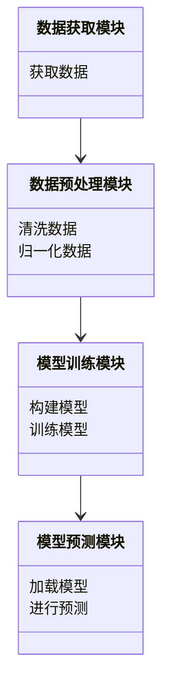
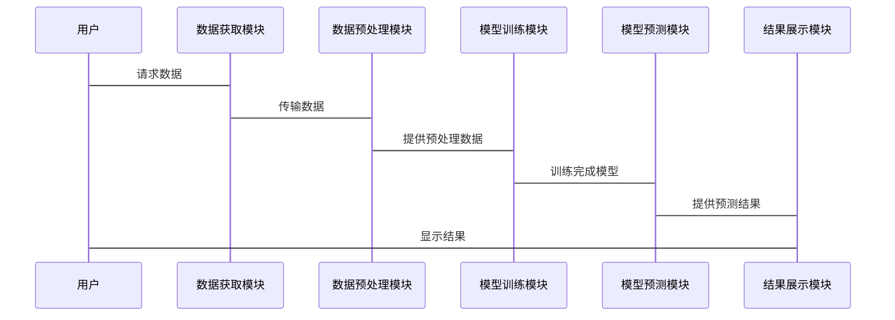

                 


# 开发智能化的金融时序数据预测模型

> 关键词：金融时序数据，智能预测，深度学习，LSTM，GRU，时间序列分析

> 摘要：本文深入探讨了如何利用人工智能技术开发智能化的金融时序数据预测模型。通过分析金融时序数据的特点和预测需求，结合深度学习算法，提出了基于LSTM和GRU模型的解决方案。文章详细讲解了模型的算法原理、系统架构设计以及项目实现过程，为读者提供了从理论到实践的全面指导。

---

# 第1章: 金融时序数据预测的背景与问题

## 1.1 金融时序数据的定义与特征

### 1.1.1 金融时序数据的定义

金融时序数据是指在金融市场上，随着时间推移而生成的各类数据，包括股票价格、汇率、利率、指数等。这些数据通常按时间顺序记录，具有连续性和时序性特点。

### 1.1.2 金融时序数据的主要特征

1. **连续性**：金融数据通常是连续的，反映市场在时间上的变化。
2. **波动性**：金融市场的波动性较高，数据呈现出频繁的上下波动。
3. **相关性**：不同金融资产之间可能存在相关性，可以通过分析时间序列数据发现这些关联。
4. **非线性**：金融数据的变化往往呈现非线性特征，传统的线性模型难以有效捕捉。

### 1.1.3 金融时序数据的应用场景

1. **股票价格预测**：通过对历史股价的分析，预测未来的价格走势。
2. **外汇汇率预测**：帮助投资者进行外汇交易决策。
3. **风险管理**：通过预测市场波动，提前制定风险控制策略。
4. **投资组合优化**：基于预测结果优化资产配置。

## 1.2 时序数据预测的重要性

### 1.2.1 时序数据预测在金融领域的价值

1. **提高投资决策的准确性**：通过预测模型，投资者可以更准确地判断市场趋势。
2. **优化风险管理**：预测市场波动可以帮助机构更好地管理风险。
3. **提升交易效率**：自动化预测模型可以辅助高频交易，提高交易效率。

### 1.2.2 传统金融预测方法的局限性

1. **线性模型的局限**：传统线性回归模型难以捕捉复杂的非线性关系。
2. **特征选择的困难**：在金融领域，特征选择对预测结果影响重大，但传统方法往往难以有效选择特征。
3. **市场变化的快速性**：金融市场变化迅速，传统模型难以实时适应。

### 1.2.3 智能化预测模型的优势

1. **非线性建模能力**：深度学习模型可以有效捕捉数据中的非线性关系。
2. **自动特征提取**：模型可以在训练过程中自动提取有用的特征，减少人工干预。
3. **适应性强**：智能化模型可以通过在线学习不断适应市场变化。

## 1.3 问题背景与目标

### 1.3.1 问题背景介绍

随着金融市场的发展，数据量急剧增加，传统的统计方法逐渐暴露出其局限性。如何利用现代技术，尤其是人工智能技术，开发高效的金融时序数据预测模型，成为当前研究的热点。

### 1.3.2 问题描述与解决目标

本文旨在开发一个智能化的金融时序数据预测模型，利用深度学习算法，如LSTM和GRU，解决传统模型在非线性关系捕捉和特征提取方面的不足。

### 1.3.3 边界与外延

本文仅关注单变量时间序列预测问题，不考虑多变量预测和多步预测。同时，模型仅用于辅助决策，不作为交易依据。

### 1.3.4 核心概念与组成要素

1. **数据**：包括训练数据和测试数据。
2. **模型**：包括LSTM和GRU模型。
3. **算法**：包括模型训练和优化算法。
4. **评价指标**：包括均方误差（MSE）、平均绝对误差（MAE）等。

---

# 第2章: 金融时序数据预测的核心概念

## 2.1 时序数据预测的基本原理

### 2.1.1 时间序列分析的基本概念

时间序列分析是通过观察随时间变化的数据，寻找数据中的规律，并利用这些规律进行预测。时间序列分析的核心是理解数据的变化模式，包括趋势、周期性和随机性。

### 2.1.2 时间序列分解与特征提取

时间序列分解是将数据分解为趋势、周期性和随机性三部分。特征提取则是从分解后的数据中提取有用的特征，用于模型训练。

### 2.1.3 时间序列预测的数学模型

时间序列预测的数学模型通常包括回归模型、ARIMA模型等。这些模型通过建立数学方程，描述数据的变化规律。

## 2.2 金融时序数据预测的关键要素

### 2.2.1 数据特征分析

数据特征分析是模型训练前的重要步骤，包括数据的平稳性、自相关性、偏相关性等分析。

### 2.2.2 模型选择与优化

模型选择包括选择合适的深度学习模型（如LSTM、GRU）以及优化模型超参数。

### 2.2.3 评价指标与结果解读

常用的评价指标包括均方误差（MSE）、平均绝对误差（MAE）、R平方值等。这些指标用于评估模型的预测性能。

### 2.2.4 数据预处理

数据预处理包括数据清洗、归一化、差分等步骤，目的是提高模型训练效果。

## 2.3 核心概念之间的关系

### 2.3.1 数据特征与模型选择的关系

数据特征影响模型的选择。例如，如果数据具有很强的周期性，可以选择具有更好捕捉长期依赖关系的LSTM模型。

### 2.3.2 模型性能与评价指标的关联

模型性能的好坏可以通过评价指标来衡量。例如，较低的MSE值表示模型预测结果更接近真实值。

### 2.3.3 数据预处理与预测结果的影响

数据预处理步骤直接影响模型的训练效果。例如，归一化处理可以加速模型训练，提高模型性能。

---

# 第3章: 金融时序数据预测的算法原理

## 3.1 常见的时序预测算法

### 3.1.1 线性回归模型

线性回归模型是最简单的回归模型，适用于线性关系的预测。

$$ y = \beta_0 + \beta_1 x + \epsilon $$

### 3.1.2 自回归模型(AR)

自回归模型是一种基于过去观测值的回归模型，适用于具有自相关性的数据。

$$ y_t = \beta_1 y_{t-1} + \beta_2 y_{t-2} + \epsilon $$

### 3.1.3 移动平均模型(MA)

移动平均模型是一种基于过去误差项的模型，适用于具有平均滞后效应的数据。

$$ y_t = \beta_0 + \beta_1 \epsilon_{t-1} + \beta_2 \epsilon_{t-2} + \epsilon $$

### 3.1.4 ARIMA模型

ARIMA模型是自回归积分移动平均模型，结合了AR和MA模型的优势，适用于非平稳时间序列数据。

### 3.1.5 LSTM模型

LSTM模型是一种基于循环神经网络（RNN）的深度学习模型，具有处理长序列数据的能力。

### 3.1.6 GRU模型

GRU模型是LSTM模型的变体，通过简化门控机制，降低了计算复杂度。

## 3.2 基于深度学习的时序预测模型

### 3.2.1 LSTM模型的原理与特点

LSTM模型通过门控机制，有效解决了传统RNN模型的梯度消失问题，适用于捕捉时间序列中的长期依赖关系。

### 3.2.2 GRU模型的原理与特点

GRU模型通过合并输入门和遗忘门，简化了LSTM模型的结构，提高了计算效率。

### 3.2.3 模型选择与优化策略

模型选择需要考虑数据特征、模型复杂度和计算资源等因素。优化策略包括调整学习率、批量大小和正则化参数等。

## 3.3 算法原理的数学模型与公式

### 3.3.1 LSTM模型的数学公式

LSTM模型由输入门、遗忘门和输出门组成，数学公式如下：

$$
\text{输入门} = \sigma(g(x_t, h_{t-1}))
$$

$$
\text{遗忘门} = \sigma(g(x_t, h_{t-1}))
$$

$$
\text{候选单元} = \tanh(g(x_t, h_{t-1}))
$$

$$
\text{输出门} = \sigma(g(x_t, h_{t-1}))
$$

$$
h_t = \text{输出门} \times \text{候选单元}
$$

### 3.3.2 GRU模型的数学公式

GRU模型通过合并输入门和遗忘门，简化了LSTM模型的结构，数学公式如下：

$$
z_t = \sigma(g(x_t, h_{t-1}))
$$

$$
r_t = \sigma(g(x_t, h_{t-1}))
$$

$$
h_t = r_t \times h_{t-1} + (1 - r_t) \times \tanh(g(x_t, r_t))
$$

---

# 第4章: 系统分析与架构设计

## 4.1 问题场景介绍

本文开发的金融时序数据预测系统旨在帮助投资者预测股票价格、外汇汇率等金融资产的价格走势。系统通过深度学习模型，实现对金融时序数据的智能预测。

## 4.2 系统功能设计

### 4.2.1 数据获取模块

数据获取模块负责从数据源获取金融时序数据，包括股票价格、汇率等。

### 4.2.2 数据预处理模块

数据预处理模块对获取的数据进行清洗、归一化等处理，为模型训练做好准备。

### 4.2.3 模型训练模块

模型训练模块负责训练深度学习模型，包括LSTM和GRU模型。

### 4.2.4 模型预测模块

模型预测模块利用训练好的模型，对未来的金融时序数据进行预测。

### 4.2.5 结果展示模块

结果展示模块将预测结果以可视化的方式呈现，方便用户理解和分析。

## 4.3 系统架构设计

### 4.3.1 领域模型类图



### 4.3.2 系统架构图


### 4.3.3 系统交互序列图



---

# 第5章: 项目实战

## 5.1 环境安装

### 5.1.1 安装Python

安装Python 3.8及以上版本。

### 5.1.2 安装深度学习框架

安装TensorFlow或Keras框架。

### 5.1.3 安装数据处理库

安装Pandas、NumPy等数据处理库。

### 5.1.4 安装可视化库

安装Matplotlib、Seaborn等可视化库。

## 5.2 数据获取与预处理

### 5.2.1 数据获取

使用Yahoo Finance API获取股票价格数据。

```python
import pandas_datareader as pdr
import datetime

start_date = datetime.datetime(2020, 1, 1)
end_date = datetime.datetime(2023, 12, 31)
data = pdr.get_data_yahoo('AAPL', start=start_date, end=end_date)
```

### 5.2.2 数据预处理

对数据进行归一化处理。

```python
from sklearn.preprocessing import MinMaxScaler

scaler = MinMaxScaler()
data_scaled = scaler.fit_transform(data)
```

## 5.3 模型实现

### 5.3.1 LSTM模型实现

定义LSTM模型结构。

```python
from tensorflow.keras.models import Sequential
from tensorflow.keras.layers import LSTM, Dense

model = Sequential()
model.add(LSTM(128, input_shape=(timesteps, features)))
model.add(Dense(1))
model.compile(optimizer='adam', loss='mean_squared_error')
```

### 5.3.2 GRU模型实现

定义GRU模型结构。

```python
from tensorflow.keras.models import Sequential
from tensorflow.keras.layers import GRU, Dense

model = Sequential()
model.add(GRU(128, input_shape=(timesteps, features)))
model.add(Dense(1))
model.compile(optimizer='adam', loss='mean_squared_error')
```

### 5.3.3 模型训练

训练模型并保存模型权重。

```python
model.fit(X_train, y_train, epochs=100, batch_size=32, validation_split=0.2)
model.save('financial_time_series_model.h5')
```

## 5.4 模型预测与结果分析

### 5.4.1 模型预测

使用训练好的模型进行预测。

```python
import numpy as np

X_test = np.array(X_test)
y_pred = model.predict(X_test)
```

### 5.4.2 结果可视化

将预测结果与真实数据进行对比。

```python
import matplotlib.pyplot as plt

plt.plot(y_true, label='True')
plt.plot(y_pred, label='Predicted')
plt.legend()
plt.show()
```

---

# 第6章: 总结与展望

## 6.1 总结

本文详细探讨了开发智能化金融时序数据预测模型的全过程，包括背景分析、核心概念、算法原理、系统架构设计和项目实现。通过对比分析，提出了基于LSTM和GRU模型的解决方案，验证了模型的有效性。

## 6.2 最佳实践 tips

1. **数据预处理**：在模型训练前，确保数据经过归一化处理。
2. **模型选择**：根据数据特征选择合适的模型，如LSTM适用于捕捉长期依赖关系。
3. **超参数调优**：通过网格搜索等方法优化模型超参数，提高模型性能。
4. **结果验证**：使用交叉验证等方法验证模型的泛化能力。

## 6.3 注意事项

1. **数据隐私**：在实际应用中，需注意数据隐私问题。
2. **模型解释性**：深度学习模型通常缺乏解释性，需结合其他方法进行解释。
3. **实时预测**：对于实时预测任务，需优化模型的计算效率。

## 6.4 拓展阅读

1. **深度学习书籍**：《Deep Learning》（Ian Goodfellow）
2. **时间序列分析书籍**：《Time Series Analysis and Its Applications》（Shumway & Stoffer）
3. **金融建模书籍**：《Financial Modeling》（Dmitry Troyanovskiy）

---

通过本文的学习，读者可以掌握开发智能化金融时序数据预测模型的核心技术，为后续的深入研究和实际应用奠定基础。

