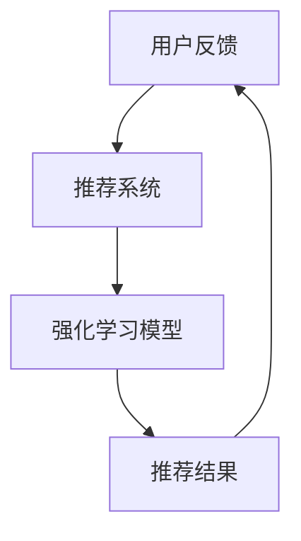

                 

# 强化学习在AI Agent个性化推荐中的应用

> **关键词**：强化学习、个性化推荐、AI Agent、推荐系统、机器学习、深度学习  
> **摘要**：本文深入探讨了强化学习在AI Agent个性化推荐中的应用，结合强化学习的核心原理与推荐系统的实际需求，分析了强化学习在提升推荐系统性能和用户体验方面的优势。通过具体案例和算法实现，展示了如何利用强化学习优化推荐策略，同时对强化学习在推荐系统中的未来发展方向进行了展望。

---

## 第1章: 强化学习与个性化推荐的背景

### 1.1 强化学习的基本概念

#### 1.1.1 强化学习的定义
强化学习（Reinforcement Learning, RL）是一种机器学习方法，通过智能体（Agent）与环境的交互，学习最优策略以最大化累计奖励。与监督学习不同，强化学习不需要明确的标注数据，而是通过试错和奖励机制进行学习。

#### 1.1.2 强化学习的核心要素
- **状态（State）**：环境中的当前情况，表示智能体所处的环境状态。
- **动作（Action）**：智能体在给定状态下采取的行为。
- **奖励（Reward）**：智能体采取动作后，环境给予的反馈，用于评估动作的好坏。
- **策略（Policy）**：智能体在给定状态下选择动作的概率分布。
- **值函数（Value Function）**：衡量某个状态或状态-动作对的优劣。

#### 1.1.3 强化学习的应用领域
强化学习广泛应用于游戏AI、机器人控制、自然语言处理、金融交易等领域。在推荐系统中，强化学习可以通过动态调整推荐策略，提升用户体验。

---

### 1.2 个性化推荐系统的概述

#### 1.2.1 个性化推荐的定义
个性化推荐是一种根据用户的行为、偏好和历史数据，为其推荐相关内容的技术。其目标是通过分析用户特征和行为模式，提供更精准的推荐结果。

#### 1.2.2 个性化推荐的实现方式
- **协同过滤**：基于用户相似性或物品相似性进行推荐。
- **基于内容的推荐**：根据物品的特征和用户偏好进行推荐。
- **基于模型的推荐**：利用机器学习模型（如矩阵分解、深度学习模型）进行推荐。

#### 1.2.3 个性化推荐的挑战与机遇
- **挑战**：数据稀疏性、冷启动问题、实时性要求高。
- **机遇**：通过强化学习动态优化推荐策略，提升推荐系统的实时性和精准度。

---

### 1.3 强化学习在推荐系统中的应用前景

#### 1.3.1 强化学习在推荐系统中的优势
- 动态调整推荐策略，适应用户行为的变化。
- 通过奖励机制实时优化推荐结果，提升用户体验。

#### 1.3.2 强化学习与传统推荐方法的对比
| 对比维度 | 传统推荐方法 | 强化学习推荐方法 |
|----------|--------------|------------------|
| 数据需求 | 需要大量标注数据 | 通过试错学习，不需要标注数据 |
| 实时性   | 较低          | 较高             |
| 策略优化 | 静态          | 动态             |

#### 1.3.3 强化学习在个性化推荐中的未来发展方向
- 结合深度学习提升推荐系统的表达能力。
- 优化强化学习算法的效率和稳定性。
- 在实时推荐系统中的应用。

---

## 第2章: 强化学习与推荐系统的核心概念

### 2.1 强化学习的核心原理

#### 2.1.1 状态、动作、奖励的定义
- **状态（State）**：用户当前的行为或系统状态，例如用户点击了某个推荐内容。
- **动作（Action）**：智能体根据当前状态采取的行为，例如推荐某篇文章。
- **奖励（Reward）**：智能体采取动作后获得的反馈，例如用户的点击或购买行为。

#### 2.1.2 Q-learning算法的基本原理
Q-learning是一种经典的强化学习算法，通过更新Q值表（Q-table）来学习最优策略。Q值表记录了每个状态-动作对的期望奖励。

#### 2.1.3 策略评估与策略优化
- **策略评估（Policy Evaluation）**：根据当前策略评估每个状态的价值。
- **策略优化（Policy Optimization）**：通过调整策略，使其更接近最优策略。

---

### 2.2 推荐系统的核心原理

#### 2.2.1 协同过滤的基本原理
协同过滤通过分析用户行为和物品特征，找到与目标用户相似的用户或与目标物品相似的物品，进行推荐。

#### 2.2.2 基于内容的推荐方法
基于内容的推荐方法通过分析物品的特征（如文章的关键词、视频的标签）和用户偏好，进行推荐。

#### 2.2.3 基于模型的推荐方法
基于模型的推荐方法利用机器学习模型（如矩阵分解、神经网络）对用户和物品的特征进行建模，预测用户的偏好。

---

### 2.3 强化学习与推荐系统的结合

#### 2.3.1 强化学习在推荐系统中的角色
- **智能体**：负责与用户交互，收集反馈并调整推荐策略。
- **环境**：用户行为和推荐系统的运行环境。

#### 2.3.2 推荐系统的强化学习框架
- **输入**：用户的行为和历史数据。
- **输出**：智能体根据当前状态选择推荐内容。
- **反馈**：用户对推荐内容的点击、点赞等行为，作为奖励信号。

#### 2.3.3 强化学习与推荐系统的协同优化
通过强化学习优化推荐策略，结合传统推荐方法的优势，提升推荐系统的整体性能。

---

## 第3章: 强化学习算法原理与数学模型

### 3.1 Q-Learning算法

#### 3.1.1 Q-Learning的基本原理
Q-Learning通过更新Q值表，学习最优策略。Q值表的更新公式为：
$$ Q(s, a) = Q(s, a) + \alpha \times (r + \gamma \times \max Q(s', a') - Q(s, a)) $$
其中：
- $\alpha$ 是学习率。
- $\gamma$ 是折扣因子。
- $r$ 是奖励。
- $s'$ 是下一个状态。

#### 3.1.2 Q-Learning的数学模型
通过状态转移矩阵和奖励矩阵，Q-Learning可以表示为一个马尔可夫决策过程（MDP）。

#### 3.1.3 Q-Learning的优缺点
- 优点：实现简单，易于部署。
- 缺点：在大规模问题中，Q值表的存储和更新效率较低。

---

### 3.2 Deep Q-Networks (DQN) 算法

#### 3.2.1 DQN的基本原理
DQN通过神经网络近似Q值函数，避免了Q值表的存储问题。DQN的核心思想是使用两个神经网络（主网络和目标网络）交替更新Q值函数。

#### 3.2.2 DQN的数学模型
DQN的损失函数为：
$$ \mathcal{L} = \mathbb{E}[(r + \gamma Q_{\text{target}}(s', a') - Q_{\text{main}}(s, a))^2] $$
其中：
- $Q_{\text{main}}$ 是主网络。
- $Q_{\text{target}}$ 是目标网络。

#### 3.2.3 DQN的优缺点
- 优点：适用于高维状态空间和动作空间。
- 缺点：训练过程复杂，需要处理经验回放和目标网络同步问题。

---

## 第4章: 强化学习在推荐系统中的应用

### 4.1 强化学习在推荐系统中的应用场景

#### 4.1.1 电商推荐系统
通过强化学习优化推荐策略，提升用户购买率和满意度。

#### 4.1.2 视频推荐系统
利用强化学习实时调整推荐策略，提升用户观看时长和互动率。

---

### 4.2 强化学习在推荐系统中的算法实现

#### 4.2.1 环境设计
- 状态空间：用户行为、历史点击记录。
- 动作空间：推荐内容列表。
- 奖励机制：用户点击率和满意度。

#### 4.2.2 策略网络设计
- 使用神经网络近似策略函数，通过强化学习更新网络参数。

---

### 4.3 强化学习在推荐系统中的系统架构

#### 4.3.1 系统功能设计
- 数据采集：收集用户行为和历史数据。
- 特征提取：提取用户和物品的特征。
- 模型训练：训练强化学习模型。
- 策略优化：根据用户反馈优化推荐策略。

#### 4.3.2 系统架构设计

---

### 4.4 强化学习在推荐系统中的案例分析

#### 4.4.1 案例：电商推荐系统
- **问题场景**：用户在电商平台上浏览商品，系统根据用户行为推荐相关商品。
- **解决方案**：通过强化学习优化推荐策略，提升用户点击率和购买率。

#### 4.4.2 案例：视频推荐系统
- **问题场景**：用户在视频平台上观看视频，系统根据用户的观看时长和互动行为推荐相关内容。
- **解决方案**：通过强化学习实时调整推荐策略，提升用户观看时长和互动率。

---

## 第5章: 强化学习在推荐系统中的优化与挑战

### 5.1 强化学习在推荐系统中的优化策略

#### 5.1.1 数据质量的优化
- 通过数据增强和特征工程提升数据质量。

#### 5.1.2 模型的优化
- 使用更深的神经网络结构，提升模型的表达能力。

#### 5.1.3 计算效率的优化
- 通过分布式计算和并行训练提升训练效率。

---

### 5.2 强化学习在推荐系统中的挑战

#### 5.2.1 稀疏性和冷启动问题
- 解决方法：结合协同过滤和深度学习方法。

#### 5.2.2 计算资源需求
- 解决方法：优化算法复杂度，使用轻量级模型。

---

## 第6章: 结论与展望

### 6.1 结论
强化学习通过动态调整推荐策略，显著提升了推荐系统的性能和用户体验。结合深度学习和传统推荐方法的优势，强化学习在个性化推荐中的应用前景广阔。

### 6.2 未来展望
- **算法优化**：进一步优化强化学习算法，提升训练效率和模型性能。
- **应用场景拓展**：探索强化学习在更多推荐场景中的应用，如社交网络、教育推荐等领域。
- **多模态推荐**：结合文本、图像、视频等多种模态信息，提升推荐系统的智能化水平。

---

通过本文的详细分析，我们不仅了解了强化学习在个性化推荐中的核心原理和应用，还通过具体案例展示了如何将强化学习技术落地到实际推荐系统中。未来，随着技术的不断发展，强化学习在推荐系统中的应用将更加广泛和深入，为用户带来更智能、更个性化的推荐体验。

