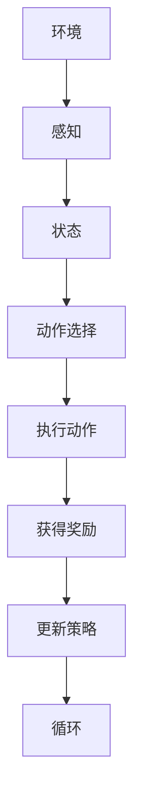
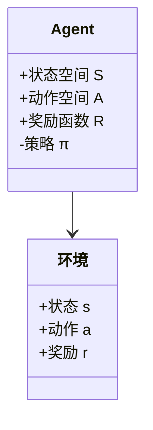
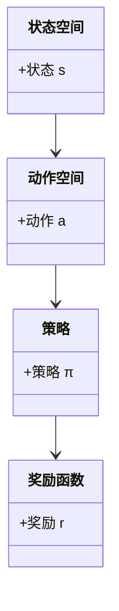
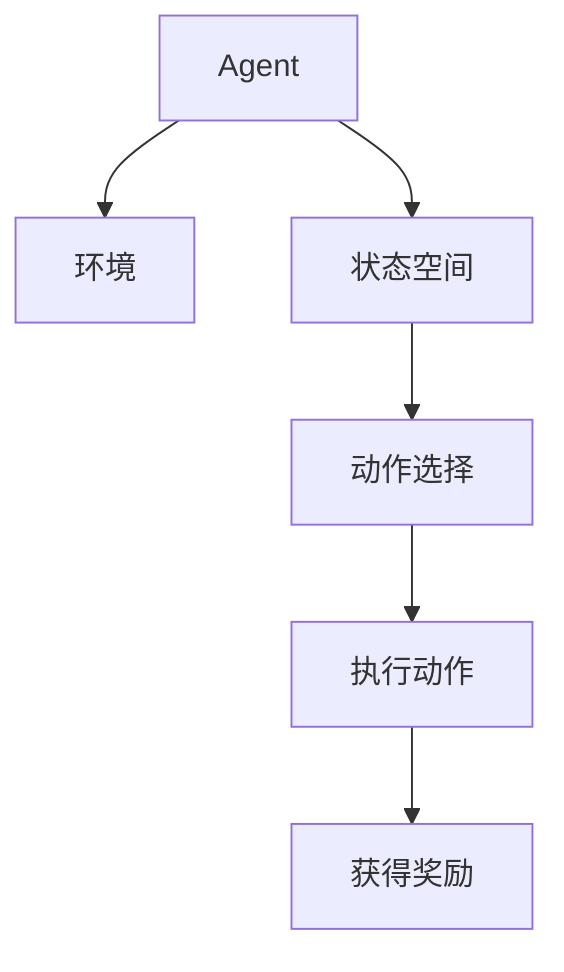
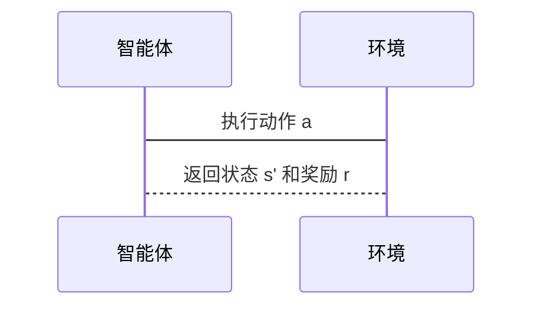
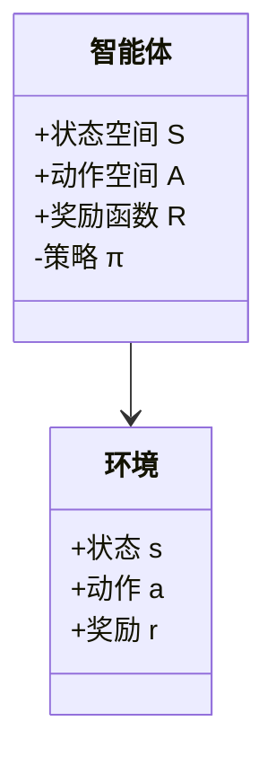
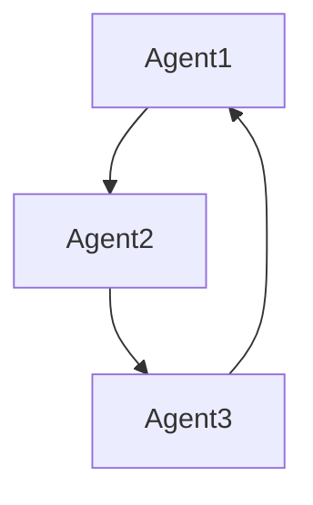

                 

# 强化学习在AI Agent中的应用：优化LLM的决策

> 关键词：强化学习，AI Agent，大语言模型，LLM决策优化，马尔可夫决策过程，Q-learning，Actor-Critic架构

> 摘要：本文深入探讨了强化学习在AI Agent中的应用，重点分析了如何通过强化学习优化大语言模型（LLM）的决策过程。文章从强化学习和AI Agent的基本概念入手，逐步展开对强化学习算法、系统架构设计、项目实战以及高级主题的详细讲解，最后通过实际案例分析，展示了强化学习在优化LLM决策中的巨大潜力和实际应用价值。

---

## 第一部分: 强化学习在AI Agent中的应用基础

### 第1章: 强化学习与AI Agent概述

#### 1.1 强化学习的基本概念
##### 1.1.1 强化学习的定义与特点
强化学习（Reinforcement Learning, RL）是一种机器学习范式，通过智能体与环境的交互，学习如何做出决策以最大化累计奖励。其特点包括：
- **试错性**：智能体通过与环境交互，逐步探索和学习。
- **延迟奖励**：奖励可能在多个动作之后才给出。
- **策略优化**：目标是找到最优策略，使累计奖励最大化。

##### 1.1.2 AI Agent的基本概念与类型
AI Agent是一种智能实体，能够感知环境、做出决策并执行动作。根据智能体的智能水平和决策方式，可以分为：
- **反应式智能体**：基于当前感知做出决策。
- **认知式智能体**：具备推理、规划能力，能够做出复杂决策。

##### 1.1.3 强化学习在AI Agent中的作用
强化学习为AI Agent提供了决策优化的框架，使其能够在动态环境中自主学习最优策略。通过与环境的交互，智能体不断改进其决策能力，从而实现目标。

#### 1.2 大语言模型（LLM）的基本原理
##### 1.2.1 LLM的定义与特点
大语言模型（Large Language Model, LLM）是基于深度学习的自然语言处理模型，具有以下特点：
- **大规模数据训练**：通常使用海量文本数据进行预训练。
- **上下文理解能力**：能够理解上下文并生成连贯的文本。
- **多任务能力**：通过微调可以适应多种自然语言处理任务。

##### 1.2.2 LLM的训练与推理过程
- **训练阶段**：使用监督学习或无监督学习方法，通过梯度下降优化模型参数。
- **推理阶段**：基于输入的上下文，生成最可能的下一步文本。

##### 1.2.3 LLM在决策优化中的应用潜力
LLM可以作为智能体的决策支持系统，通过生成文本提供多种可能的决策方案，结合强化学习优化决策过程。

#### 1.3 强化学习优化LLM决策的核心思想
##### 1.3.1 强化学习如何提升LLM的决策能力
通过强化学习，智能体可以学习到最优的决策策略，从而提高LLM的决策质量。

##### 1.3.2 LLM与强化学习结合的优势
- **结合语言理解能力**：LLM提供强大的自然语言处理能力。
- **强化学习优化决策**：通过强化学习优化LLM的决策过程。

##### 1.3.3 LLM决策优化的边界与外延
强化学习优化LLM决策的应用场景包括：
- **对话系统**：优化对话流程。
- **任务规划**：优化任务执行顺序。
- **策略选择**：优化策略的执行路径。

### 第2章: 强化学习的核心概念与数学模型

#### 2.1 强化学习的核心概念
##### 2.1.1 状态、动作、奖励的定义
- **状态（State）**：智能体所处的环境信息。
- **动作（Action）**：智能体采取的行为。
- **奖励（Reward）**：智能体执行动作后获得的反馈。

##### 2.1.2 马尔可夫决策过程（MDP）的数学描述
马尔可夫决策过程可以用以下数学模型描述：
- **状态空间**：$S$，可能的状态集合。
- **动作空间**：$A$，可能的动作集合。
- **转移概率**：$P(s'|s,a)$，从状态$s$执行动作$a$后转移到状态$s'$的概率。
- **奖励函数**：$R(s,a)$，执行动作$a$在状态$s$时获得的奖励。

##### 2.1.3 策略与价值函数的关系
- **策略（Policy）**：$\pi(a|s)$，在状态$s$下选择动作$a$的概率分布。
- **价值函数（Value Function）**：$V(s)$，从状态$s$开始的期望累计奖励。

#### 2.2 强化学习的数学模型
##### 2.2.1 Q-learning算法的数学推导
Q-learning的目标是学习状态-动作对的Q值$Q(s,a)$，其更新公式为：
$$
Q(s,a) \leftarrow Q(s,a) + \alpha \left[r + \gamma \max_{a'} Q(s',a') - Q(s,a)\right]
$$

##### 2.2.2 策略梯度方法的数学模型
策略梯度方法通过优化策略的参数$\theta$，使得累计奖励最大化。目标函数为：
$$
J(\theta) = \mathbb{E}_{\tau \sim \pi_\theta} \left[ R(\tau) \right]
$$

##### 2.2.3 Actor-Critic架构的数学表达
Actor-Critic架构结合了策略梯度和Q-learning的优势，通过Actor网络更新策略，并通过Critic网络评估Q值。

#### 2.3 强化学习的算法流程图

### 第3章: AI Agent的系统架构与设计

#### 3.1 AI Agent的系统架构
##### 3.1.1 领域模型的构建
领域模型需要明确智能体的决策空间、状态空间和动作空间。

##### 3.1.2 系统架构的模块划分
AI Agent的系统架构通常包括感知模块、决策模块和执行模块。

##### 3.1.3 系统架构的mermaid类图

#### 3.2 系统架构设计
##### 3.2.1 领域模型的mermaid类图

#### 3.3 系统架构设计的mermaid架构图

#### 3.4 系统接口设计
系统接口设计需要明确智能体与环境之间的交互接口。

#### 3.5 系统交互的mermaid序列图

## 第二部分: 强化学习优化LLM决策的系统分析

### 第4章: 系统分析与优化

#### 4.1 系统分析
##### 4.1.1 系统功能设计
智能体需要具备感知环境、选择动作和执行动作的能力。

##### 4.1.2 系统功能的mermaid类图

#### 4.2 系统优化
##### 4.2.1 系统优化策略
通过强化学习优化智能体的策略，使其在决策过程中不断改进。

##### 4.2.2 优化策略的数学模型
优化策略的目标是最大化累计奖励，可以通过策略梯度方法实现。

### 第5章: 项目实战

#### 5.1 环境安装
安装必要的库，如TensorFlow、Keras等。

#### 5.2 核心代码实现
实现强化学习算法，如Q-learning或Actor-Critic架构。

#### 5.3 代码解读与分析
详细解读代码，分析其工作原理。

#### 5.4 实际案例分析
通过具体案例展示强化学习优化LLM决策的实际效果。

#### 5.5 项目小结
总结项目经验，提出改进建议。

## 第三部分: 强化学习优化LLM决策的高级主题

### 第6章: 高级主题与案例分析

#### 6.1 多智能体协作
##### 6.1.1 多智能体协作的数学模型
多智能体协作可以通过分布式强化学习实现。

#### 6.1.2 多智能体协作的mermaid流程图

#### 6.2 在线学习与自适应决策
##### 6.2.1 在线学习的数学模型
在线学习可以通过实时更新策略实现。

#### 6.2.2 结合图神经网络的强化学习
结合图神经网络可以提高智能体的决策能力。

### 第7章: 总结与展望

#### 7.1 最佳实践 tips
- **持续学习**：保持对新技术的关注。
- **实践应用**：多参与实际项目。
- **团队协作**：加强团队合作。

#### 7.2 小结
总结全文，回顾强化学习在优化LLM决策中的应用。

#### 7.3 注意事项
在实际应用中，需要注意算法的收敛性和计算效率。

#### 7.4 拓展阅读
建议进一步学习强化学习和大语言模型的最新研究。

---

# 结语
通过本文的详细讲解，读者可以全面了解强化学习在优化AI Agent决策中的应用。从基础概念到高级主题，从理论分析到实际案例，全面掌握强化学习优化LLM决策的核心思想和技术细节。希望本文能为读者在相关领域的研究和实践中提供有价值的参考。

