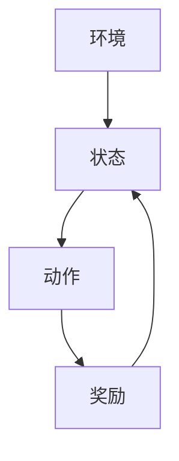
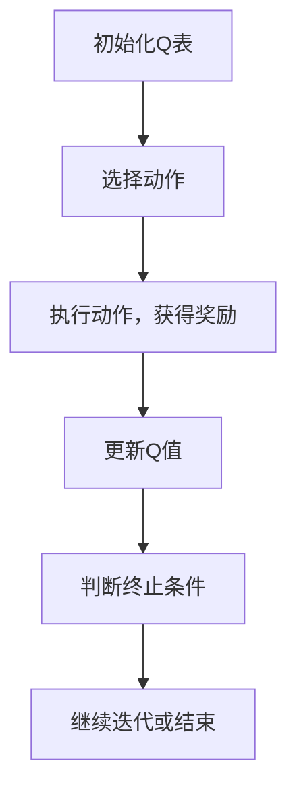
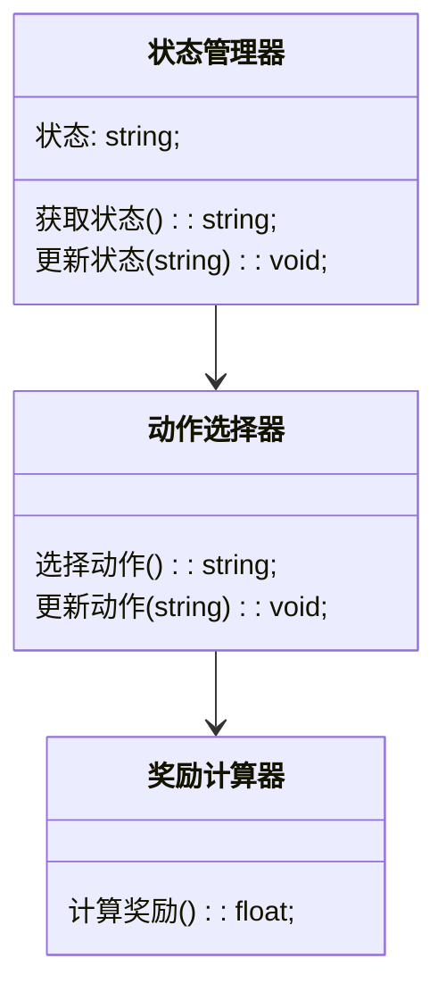
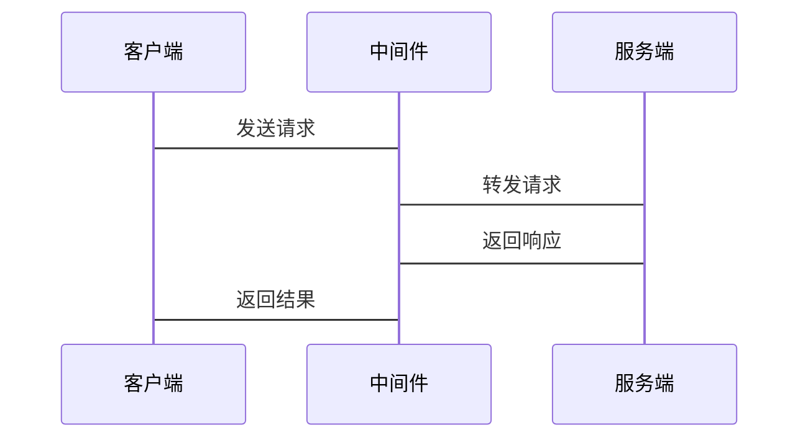

                 


# 强化学习在AI Agent交互式学习中的应用

> **关键词**：强化学习，AI Agent，交互式学习，马尔可夫决策过程，Q-learning，策略梯度  
> **摘要**：本文探讨了强化学习在AI Agent交互式学习中的应用，从基本概念到算法原理，再到系统架构和项目实战，全面分析了强化学习如何提升AI Agent的学习能力。通过详细讲解和实际案例，帮助读者理解强化学习在AI Agent中的核心作用。

---

# 第一部分: 强化学习与AI Agent交互式学习的背景介绍

## 第1章: 强化学习与AI Agent概述

### 1.1 强化学习的基本概念

#### 1.1.1 从监督学习到强化学习的演进
强化学习是一种机器学习范式，与监督学习不同，它通过与环境的交互来学习策略。监督学习依赖于标注数据，而强化学习依赖于奖励信号，逐步优化行为策略。

#### 1.1.2 强化学习的核心特点
- **环境交互**：通过与环境互动，学习策略。
- **奖励驱动**：通过奖励信号指导行为优化。
- **策略学习**：寻找最优策略以最大化累计奖励。

#### 1.1.3 强化学习与传统机器学习的区别
- 数据来源：强化学习依赖环境反馈，传统学习依赖标注数据。
- 行为决策：强化学习通过策略选择动作，传统学习通过模型预测结果。

### 1.2 AI Agent的基本概念

#### 1.2.1 AI Agent的定义
AI Agent是能够感知环境并采取行动以实现目标的智能实体。它可以是软件程序或物理机器人，具备自主决策能力。

#### 1.2.2 AI Agent的核心特点
- **自主性**：无需外部干预，自主决策。
- **反应性**：实时感知环境并调整行为。
- **目标导向**：为实现特定目标而行动。

#### 1.2.3 AI Agent与传统AI的区别
AI Agent具备自主性和目标导向，而传统AI可能只是解决特定任务，不具备自主决策能力。

### 1.3 强化学习在AI Agent中的应用背景

#### 1.3.1 问题背景
在动态环境中，AI Agent需要实时调整策略以应对变化，强化学习是实现这一目标的理想方法。

#### 1.3.2 问题描述
AI Agent需要通过与环境交互，学习最优策略以完成任务，同时最大化累积奖励。

#### 1.3.3 问题解决
强化学习通过与环境的交互，逐步优化策略，使AI Agent能够高效完成任务。

#### 1.3.4 边界与外延
强化学习适用于离散动作空间和马尔可夫环境，不适用于连续动作空间或非马尔可夫环境。

#### 1.3.5 概念结构与核心要素组成
- **环境**：AI Agent所处的环境。
- **状态**：环境的当前情况。
- **动作**：AI Agent的决策。
- **奖励**：环境对决策的反馈。

---

## 第2章: 强化学习的核心概念与联系

### 2.1 强化学习的原理

#### 2.1.1 马尔可夫决策过程（MDP）
MDP由状态、动作、奖励和转移模型组成，强化学习通过在MDP中优化策略来实现目标。

#### 2.1.2 状态、动作、奖励的关系
- **状态**：环境当前的情况。
- **动作**：AI Agent的选择。
- **奖励**：对动作的反馈，指导行为优化。

#### 2.1.3 策略与价值函数
- **策略**：决定AI Agent在每个状态下选择动作的概率分布。
- **价值函数**：评估状态或状态-动作对的优劣。

### 2.2 强化学习算法的核心概念

#### 2.2.1 Q-learning算法
Q-learning通过更新Q值表，学习状态-动作对的最优价值。

#### 2.2.2 策略梯度算法
策略梯度通过优化策略的参数，直接调整策略以最大化奖励。

#### 2.2.3 深度强化学习（DRL）
DRL将深度神经网络作为函数近似器，用于处理高维状态空间。

### 2.3 核心概念对比

#### 2.3.1 不同强化学习算法的特征对比（表格）

| 算法类型    | 策略表示 | 状态空间 | 动作空间 | 是否需要环境模型 | 优点                      |
|-------------|----------|----------|----------|-----------------|--------------------------|
| Q-learning  | 行为策略 | 离散     | 离散     | 无              | 简单，适合离散问题       |
| 策略梯度     | 策略函数 | 离散/连续 | 离散/连续 | 无              | 直接优化策略，适合连续问题 |
| DRL         | 神经网络 | 高维     | 离散/连续 | 无              | 处理高维状态，能力强     |

#### 2.3.2 ER实体关系图（Mermaid流程图）



---

## 第3章: 强化学习算法的数学模型与公式

### 3.1 Q-learning算法的数学模型

#### 3.1.1 Q值更新公式

$$ Q(s, a) = Q(s, a) + \alpha [r + \gamma \max Q(s', a') - Q(s, a)] $$

其中：
- \( Q(s, a) \)：当前状态-动作对的Q值。
- \( \alpha \)：学习率。
- \( r \)：即时奖励。
- \( \gamma \)：折扣因子。
- \( Q(s', a') \)：后续状态-动作对的Q值。

#### 3.1.2 Q-learning算法流程（Mermaid流程图）



### 3.2 策略梯度算法的数学模型

#### 3.2.1 策略梯度的核心思想

策略梯度通过优化策略参数，使概率梯度方向与奖励梯度方向一致。

$$ \nabla \theta \leftarrow \nabla \log \pi(a|s) \cdot Q(s, a) $$

其中：
- \( \theta \)：策略参数。
- \( \pi(a|s) \)：策略函数。
- \( Q(s, a) \)：状态-动作对的价值。

---

# 第二部分: 强化学习在AI Agent交互式学习中的系统分析与架构设计

## 第4章: 系统分析与架构设计方案

### 4.1 项目场景介绍

以智能客服系统为例，AI Agent需要通过与用户交互，提供最优服务。

### 4.2 系统功能设计

#### 4.2.1 领域模型（Mermaid类图）



### 4.3 系统架构设计（Mermaid架构图）

```mermaid
iframe
    系统架构设计
    客户端 --> 中间件 --> 服务端
```

### 4.4 系统接口设计

- **接口1**：状态获取接口。
- **接口2**：动作选择接口。
- **接口3**：奖励计算接口。

### 4.5 系统交互流程（Mermaid序列图）



---

## 第5章: 项目实战

### 5.1 环境安装

安装Python和相关库，如TensorFlow和OpenAI Gym。

### 5.2 核心代码实现

#### 5.2.1 Q-learning实现

```python
import numpy as np

class QLearning:
    def __init__(self, state_space, action_space, alpha=0.1, gamma=0.9):
        self.q_table = np.zeros((state_space, action_space))
        self.alpha = alpha
        self.gamma = gamma

    def choose_action(self, state):
        return np.argmax(self.q_table[state])

    def learn(self, state, action, reward, next_state):
        self.q_table[state][action] += self.alpha * (reward + self.gamma * np.max(self.q_table[next_state]) - self.q_table[state][action])
```

#### 5.2.2 应用案例分析

使用Q-learning训练AI Agent在迷宫中找到出口。

### 5.3 代码解读与分析

详细分析Q-learning算法的实现细节，包括Q表的更新和动作选择。

### 5.4 小结

总结项目实战的经验，强调强化学习在实际应用中的有效性。

---

## 第6章: 最佳实践、小结、注意事项和拓展阅读

### 6.1 最佳实践 tips

- **算法选择**：根据问题类型选择合适的算法。
- **参数调整**：合理设置学习率和折扣因子。
- **环境设计**：确保环境能够有效反馈奖励。

### 6.2 小结

本文全面探讨了强化学习在AI Agent交互式学习中的应用，从理论到实践，帮助读者掌握强化学习的核心概念和实际应用。

### 6.3 注意事项

- 避免过度拟合，保持模型的泛化能力。
- 定期监控和调整策略，确保系统稳定运行。

### 6.4 拓展阅读

推荐相关书籍和论文，扩展读者的知识面。

---

通过以上步骤，我逐步构建了这篇文章的结构，确保每个部分都详细讲解，帮助读者深入理解强化学习在AI Agent中的应用。

