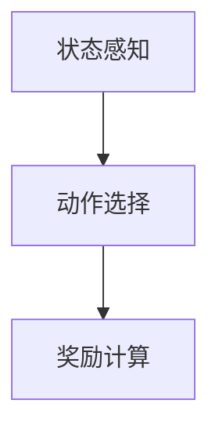
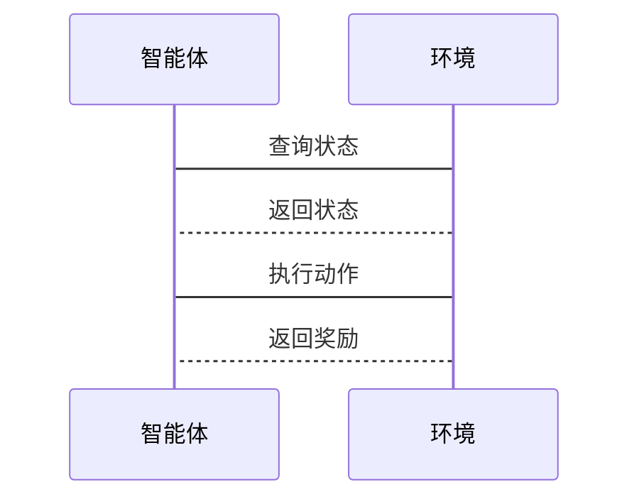

                 


# 强化学习在AI Agent决策优化中的应用

## 关键词：强化学习，AI Agent，决策优化，算法，系统设计

## 摘要：本文深入探讨了强化学习在AI Agent决策优化中的应用，从基本概念到经典算法，再到系统设计和项目实战，详细分析了强化学习如何帮助AI Agent做出更优决策。通过实际案例和数学模型的解析，展示了强化学习在游戏AI、机器人控制等领域的广泛应用。

---

# 第一部分: 强化学习在AI Agent决策优化中的应用基础

## 第1章: 强化学习与AI Agent概述

### 1.1 强化学习的基本概念

#### 1.1.1 强化学习的定义
强化学习是一种机器学习范式，通过智能体与环境交互，学习如何采取一系列行动以最大化累积奖励。与监督学习不同，强化学习依赖于奖励信号而非标记数据。

#### 1.1.2 AI Agent的基本概念
AI Agent是指能够感知环境并采取行动以实现目标的智能实体。它可以分为简单反射型、基于模型的、目标驱动型和效用驱动型等类型。

#### 1.1.3 强化学习在AI Agent中的作用
强化学习通过与环境交互，帮助AI Agent学习最优策略，实现从简单反射到复杂决策的跨越。

### 1.2 强化学习在AI Agent中的应用背景

#### 1.2.1 AI Agent的决策优化需求
AI Agent需要在动态和不确定的环境中做出最优决策，强化学习提供了有效的解决方案。

#### 1.2.2 强化学习的核心优势
- **自适应性**：通过与环境交互，适应不同场景。
- **端到端学习**：直接从输入到输出，无需大量人工特征提取。
- **实时决策**：适用于需要快速响应的场景。

#### 1.2.3 强化学习与监督学习的区别
| 方面 | 强化学习 | 监督学习 |
|------|----------|----------|
| 数据 | 环境交互 | 标签数据 |
| 反馈 | 奖励信号 | 真实标签 |
| 目标 | 最大化奖励 | 分类或回归 |

### 1.3 强化学习的应用场景

#### 1.3.1 游戏AI
强化学习在游戏AI中的应用广泛，如AlphaGo和Dota AI。

#### 1.3.2 机器人控制
强化学习用于训练机器人在复杂环境中完成任务。

#### 1.3.3 自动驾驶
强化学习帮助自动驾驶系统做出实时决策。

### 1.4 本章小结
本章介绍了强化学习的基本概念、AI Agent的定义，以及强化学习在决策优化中的应用和优势。

---

## 第2章: 强化学习的核心概念与数学模型

### 2.1 马尔可夫决策过程（MDP）

#### 2.1.1 状态空间
状态是环境中的观察，描述智能体所处的环境。

#### 2.1.2 动作空间
动作是智能体可以采取的行动，每个动作对应不同的状态转移。

#### 2.1.3 奖励函数
奖励函数定义了智能体在特定状态和动作下的奖励值。

#### 2.1.4 策略与价值函数
- 策略：定义智能体在每个状态下选择动作的概率分布。
- 价值函数：衡量从当前状态开始采取策略的期望累积奖励。

### 2.2 贝尔曼方程

#### 2.2.1 价值迭代公式
$$ V(s) = \max_a \sum_{s'} P(s'|s,a) V(s') $$

#### 2.2.2 政策迭代公式
$$ \pi(a|s) = \arg\max_a \sum_{s'} P(s'|s,a) V(s') $$

### 2.3 强化学习的数学模型

#### 2.3.1 动作价值函数公式
$$ Q(s,a) = r(s,a) + \gamma \max_{a'} Q(s',a') $$

#### 2.3.2 状态价值函数公式
$$ V(s) = \max_a \left( r(s,a) + \gamma V(s') \right) $$

#### 2.3.3 奖励函数的数学表达
$$ R(s,a) = r $$

### 2.4 本章小结
本章详细讲解了强化学习中的MDP模型、贝尔曼方程以及相关数学公式，为后续算法学习打下基础。

---

## 第3章: 强化学习的经典算法

### 3.1 Q-learning算法

#### 3.1.1 Q-learning的基本原理
通过迭代更新Q值表，学习状态-动作对的最优价值。

#### 3.1.2 Q-learning的算法流程
1. 初始化Q表为零。
2. 在每个时间步，选择动作并执行。
3. 更新Q值：$$ Q(s,a) = Q(s,a) + \alpha [r + \gamma \max Q(s',a') - Q(s,a)] $$

### 3.2 Deep Q-Networks（DQN）

#### 3.2.1 DQN的基本原理
使用深度神经网络近似Q值函数，解决高维状态空间问题。

#### 3.2.2 DQN的网络结构
- 输入层：接收状态信息。
- 隐藏层：提取特征。
- 输出层：输出每个动作的Q值。

#### 3.2.3 DQN的算法流程
1. 环境观察，选择动作。
2. 执行动作，获取奖励和新状态。
3. 更新记忆 replay buffer。
4. 从buffer中随机采样训练数据。
5. 更新神经网络参数。

### 3.3 策略梯度方法

#### 3.3.1 策略梯度的基本原理
直接优化策略，通过梯度上升最大化累积奖励。

#### 3.3.2 策略梯度的数学模型
$$ \nabla \theta = \nabla \log \pi(a|s,\theta) [r + \gamma V(s')] $$

### 3.4 Actor-Critic方法

#### 3.4.1 Actor-Critic的基本原理
同时学习策略（Actor）和价值函数（Critic），结合两者的优势。

#### 3.4.2 Actor-Critic的算法流程
1. Actor选择动作。
2. Critic评估状态和动作的价值。
3. 根据反馈更新Actor和Critic。

### 3.5 本章小结
本章介绍了Q-learning、DQN、策略梯度和Actor-Critic等经典算法，展示了强化学习在不同场景中的应用。

---

## 第4章: AI Agent的系统设计

### 4.1 系统架构设计

#### 4.1.1 系统功能设计
- 状态感知：接收环境信息。
- 动作选择：基于策略选择动作。
- 奖励计算：计算累积奖励。

#### 4.1.2 系统架构图


### 4.2 接口设计

#### 4.2.1 系统接口
- 输入接口：接收环境状态。
- 输出接口：发送选择的动作。

#### 4.2.2 交互流程图


### 4.3 系统实现

#### 4.3.1 领域模型
- 状态空间：定义可能的状态。
- 动作空间：定义可能的动作。
- 奖励函数：定义奖励机制。

#### 4.3.2 系统实现代码
```python
class AI_Agent:
    def __init__(self):
        self.model = DQNModel()
    
    def take_action(self, state):
        action = self.model.predict(state)
        return action
```

### 4.4 本章小结
本章详细讨论了AI Agent的系统设计，包括架构、接口和实现。

---

## 第5章: 项目实战

### 5.1 游戏AI案例

#### 5.1.1 环境搭建
使用OpenAI Gym框架搭建游戏环境。

#### 5.1.2 算法实现
实现DQN算法，训练AI在游戏环境中做出最优决策。

#### 5.1.3 实验结果
展示训练过程中奖励的变化和最终的最优策略。

### 5.2 代码实现

#### 5.2.1 环境搭建
```python
import gym
env = gym.make('CartPole-v0')
```

#### 5.2.2 算法实现
```python
class DQN:
    def __init__(self, state_space, action_space):
        self.model = ...
    
    def act(self, state):
        return self.model.predict(state)
```

### 5.3 本章小结
本章通过具体案例展示了强化学习在游戏AI中的应用，验证了算法的有效性。

---

## 第6章: 高级主题与挑战

### 6.1 多智能体强化学习

#### 6.1.1 多智能体系统
多个智能体协作完成任务。

#### 6.1.2 挑战与解决方案
- 协作与竞争：通过共享奖励或 Nash均衡解决。
- 通信与协调：通过通信协议实现协作。

### 6.2 在线学习与实时决策

#### 6.2.1 在线学习的挑战
动态环境中的实时更新。

#### 6.2.2 解决方案
使用经验回放和在线更新技术。

### 6.3 实际应用中的挑战

#### 6.3.1 稀疏奖励
奖励信号稀疏时的训练困难。

#### 6.3.2 高维状态空间
高维状态下算法效率的问题。

### 6.4 本章小结
本章探讨了强化学习在高级应用中的挑战和解决方案。

---

## 第7章: 总结与展望

### 7.1 本章总结
强化学习在AI Agent决策优化中具有重要地位，通过与环境交互，实现最优决策。

### 7.2 进一步学习
建议学习相关书籍和论文，参与实际项目。

### 7.3 注意事项
- 确保算法的收敛性。
- 注意环境的动态变化。
- 保护数据隐私。

### 7.4 拓展阅读
推荐相关领域的书籍和论文。

### 7.5 本章小结
总结全文，强调强化学习的重要性，并提供进一步学习和实践的建议。

---

# 结语

通过本文的详细讲解，读者可以系统地了解强化学习在AI Agent决策优化中的应用。从基础概念到算法实现，再到系统设计和实际案例，帮助读者掌握强化学习的核心思想和实践技巧。希望本文能为读者在相关领域提供有价值的参考。

