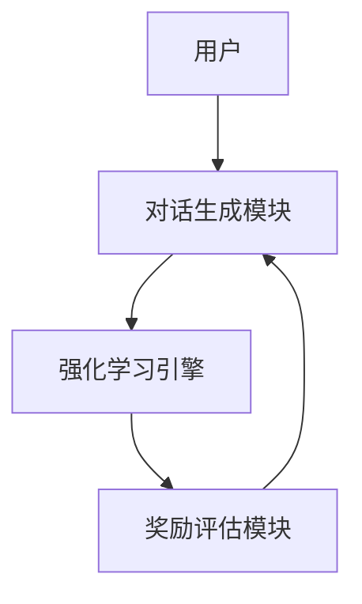

                 


# 强化学习在AI Agent对话生成中的创新应用

> 关键词：强化学习，对话生成，AI Agent，算法创新，自然语言处理

> 摘要：本文探讨了强化学习在AI Agent对话生成中的应用，分析了强化学习的核心原理，介绍了对话生成模型的创新方法，并通过实际案例展示了如何将强化学习应用于对话生成系统中。文章详细讲解了算法实现、系统设计和项目实战，帮助读者全面理解强化学习在对话生成中的创新应用。

---

## 第1章 强化学习与对话生成概述

### 1.1 强化学习的基本概念

#### 1.1.1 强化学习的定义
强化学习（Reinforcement Learning, RL）是一种机器学习范式，通过智能体与环境的交互，学习如何采取一系列动作以最大化累计奖励。与监督学习和无监督学习不同，强化学习依赖于奖励信号来指导学习过程。

#### 1.1.2 对话生成的基本原理
对话生成是自然语言处理中的一个重要任务，旨在使AI能够生成连贯、自然且符合上下文的回复。传统方法通常基于生成模型，如循环神经网络（RNN）和变换器（Transformer），但这些方法在生成高质量对话时仍面临挑战，如缺乏长期依赖和多样性的生成结果。

#### 1.1.3 强化学习在对话生成中的应用
强化学习通过与环境的交互，逐步优化对话生成策略。将强化学习应用于对话生成，可以显著提升生成回复的质量、多样性和连贯性。智能体通过与用户的交互，不断调整生成策略，以获得更高的奖励。

### 1.2 强化学习与对话生成的结合

#### 1.2.1 对话生成的挑战
对话生成面临以下主要挑战：
1. **上下文理解**：需要准确理解对话历史，以生成合适的回复。
2. **多样性**：生成多个可能的回复，避免重复或单一的输出。
3. **连贯性**：确保生成的回复在上下文中连贯，符合对话的逻辑流程。
4. **反馈机制**：需要有效的反馈机制来指导生成策略的优化。

#### 1.2.2 强化学习如何解决对话生成的问题
强化学习通过以下方式解决对话生成的问题：
1. **动态奖励机制**：通过定义合适的奖励函数，指导智能体生成更优的回复。
2. **策略优化**：通过不断调整生成策略，提升对话的质量和多样性。
3. **探索与利用**：平衡探索新回复和利用已知好回复，避免陷入局部最优。

#### 1.2.3 强化学习在对话生成中的创新点
1. **奖励函数设计**：通过奖励函数引导生成策略，提升对话的自然度和相关性。
2. **多轮对话优化**：强化学习可以有效处理多轮对话，确保每一步回复都符合上下文。
3. **自适应生成**：通过强化学习，生成策略能够自适应地调整，以应对不同的对话场景。

### 1.3 本书的核心内容与目标

#### 1.3.1 本书的核心目标
本文旨在探讨强化学习在AI Agent对话生成中的创新应用，分析其核心原理，介绍对话生成模型的创新方法，并通过实际案例展示强化学习在对话生成系统中的应用。

#### 1.3.2 本书的结构安排
1. 第1章：介绍强化学习和对话生成的基本概念及其结合。
2. 第2章：详细讲解强化学习的核心原理和算法分类。
3. 第3章：分析对话生成模型的创新方法。
4. 第4章：通过数学公式和图表详细阐述强化学习算法的实现。
5. 第5章：探讨对话生成系统的系统设计与架构。
6. 第6章：通过项目实战展示强化学习在对话生成中的应用。
7. 第7章：总结全文，并展望未来的研究方向。

#### 1.3.3 本书的读者群体
本书适合对自然语言处理、强化学习和AI Agent对话生成感兴趣的读者，包括研究人员、工程师和相关领域的学生。

### 1.4 本章小结

#### 1.4.1 强化学习与对话生成的关系
强化学习为对话生成提供了一种动态优化的框架，通过与环境的交互不断改进生成策略。

#### 1.4.2 本书的主要内容
本文将从强化学习的基本原理出发，分析其在对话生成中的应用，并通过实际案例展示其创新点。

#### 1.4.3 学习本书的预期收获
读者将深入了解强化学习在对话生成中的应用，掌握相关算法的实现方法，并能够将其应用于实际项目中。

---

## 第2章 强化学习的核心原理

### 2.1 强化学习的基本原理

#### 2.1.1 状态空间的定义
在对话生成中，状态空间可以定义为对话历史、用户信息等。状态空间的大小和复杂度直接影响强化学习算法的性能。

#### 2.1.2 动作空间的定义
动作空间包括所有可能的回复选项。动作空间的设计需要考虑生成回复的多样性和可行性。

#### 2.1.3 奖励函数的设计
奖励函数用于评估生成动作的质量。设计有效的奖励函数是强化学习成功的关键。

### 2.2 强化学习算法的分类

#### 2.2.1 基于值函数的方法
值函数方法通过估计状态或动作-状态对的值，指导智能体采取最优动作。

#### 2.2.2 基于策略梯度的方法
策略梯度方法直接优化策略参数，通过梯度上升最大化期望奖励。

#### 2.2.3 基于Actor-Critic架构的方法
Actor-Critic架构结合了值函数和策略梯度的优点，通过同时估计值函数和优化策略来提高学习效率。

### 2.3 强化学习的核心概念与联系

#### 2.3.1 状态、动作、奖励的关系
状态定义当前环境的状态，动作是智能体在该状态下采取的行为，奖励是对动作的反馈。

#### 2.3.2 值函数与策略函数的对比
值函数估计状态或动作-状态对的值，策略函数直接定义了动作的概率分布。

#### 2.3.3 探索与利用的平衡
探索是指尝试新动作以发现更好的策略，利用是指利用已知的好动作。平衡两者是强化学习的关键。

### 2.4 本章小结

#### 2.4.1 强化学习的核心概念
状态、动作、奖励是强化学习的核心概念，决定了智能体与环境的交互方式。

#### 2.4.2 算法分类与特点
基于值函数、策略梯度和Actor-Critic的方法各有优缺点，适用于不同的应用场景。

#### 2.4.3 状态、动作、奖励的关系
三者共同构成了强化学习的基本框架，决定了智能体的学习和决策过程。

---

## 第3章 对话生成模型

### 3.1 对话生成的基本原理

#### 3.1.1 基于RNN的对话生成模型
循环神经网络（RNN）通过处理序列数据，生成连贯的对话回复。然而，RNN在处理长对话时容易出现梯度消失或爆炸的问题。

#### 3.1.2 基于Transformer的对话生成模型
Transformer模型通过自注意力机制，捕捉对话中的全局依赖关系，生成高质量的回复。

#### 3.1.3 基于预训练语言模型的对话生成
基于如GPT的预训练语言模型，通过微调生成对话回复，能够利用大规模语料库中的知识，生成多样且自然的回复。

### 3.2 对话生成的挑战

#### 3.2.1 对话的多样性和连贯性
生成多样且连贯的回复是对话生成的核心挑战，需要平衡生成的多样性和与上下文的连贯性。

#### 3.2.2 对话的上下文依赖性
对话生成高度依赖对话历史，需要准确理解和建模上下文信息。

#### 3.2.3 对话的动态性
对话是一个动态过程，生成策略需要根据实时反馈进行调整。

### 3.3 对话生成模型的创新方法

#### 3.3.1 基于强化学习的对话生成
通过强化学习优化生成策略，提升对话的质量和多样性。

#### 3.3.2 多模态对话生成
结合视觉、听觉等多种模态信息，生成更丰富的对话内容。

#### 3.3.3 预训练-微调框架
利用大规模预训练模型，通过微调生成对话回复，提升生成效果。

### 3.4 本章小结

#### 3.4.1 对话生成的基本原理
对话生成基于序列模型，如RNN和Transformer，通过处理对话历史生成回复。

#### 3.4.2 对话生成的挑战
多样性和连贯性、上下文理解和动态性是对话生成的主要挑战。

#### 3.4.3 对话生成模型的创新方法
强化学习和多模态方法是对话生成的重要创新方向。

---

## 第4章 强化学习算法的数学模型与实现

### 4.1 策略梯度算法的数学模型

#### 4.1.1 策略梯度的基本原理
策略梯度通过最大化期望奖励，优化策略参数。数学表达式如下：

$$ J(\theta) = \mathbb{E}_{\tau \sim \pi_\theta} \left[ R(\tau) \right] $$

其中，$\theta$是策略参数，$\tau$是轨迹，$R(\tau)$是轨迹的奖励。

#### 4.1.2 策略梯度的实现步骤
1. 初始化策略参数$\theta$。
2. 采样轨迹$\tau$，计算奖励$R(\tau)$。
3. 计算梯度$\nabla J(\theta)$，更新$\theta$。
4. 重复步骤1-3，直到收敛。

### 4.2 Actor-Critic算法的数学模型

#### 4.2.1 Actor-Critic的基本原理
Actor-Critic结合了值函数和策略梯度，通过同时估计值函数和优化策略来提高学习效率。

#### 4.2.2 Actor-Critic的实现步骤
1. 初始化策略$\pi_\theta$和值函数$V_\phi$。
2. 采样动作$a$，执行并获得奖励$r$和新状态$s'$。
3. 更新值函数$V_\phi$，使其逼近真实值。
4. 更新策略$\pi_\theta$，最大化$Q$值。
5. 重复步骤2-4，直到收敛。

### 4.3 强化学习算法的实现代码

#### 4.3.1 策略梯度算法实现
```python
class PolicyGradient:
    def __init__(self, state_space, action_space):
        self.state_space = state_space
        self.action_space = action_space
        self.theta = np.random.randn(...)
    
    def act(self, state):
        # 计算动作概率
        pass
    
    def update(self, trajectory):
        # 计算梯度并更新theta
        pass
```

#### 4.3.2 Actor-Critic算法实现
```python
class ActorCritic:
    def __init__(self, state_space, action_space):
        self.state_space = state_space
        self.action_space = action_space
        self.theta_actor = np.random.randn(...)
        self.theta_critic = np.random.randn(...)
    
    def act(self, state):
        # 计算动作概率
        pass
    
    def update(self, trajectory):
        # 更新actor和critic参数
        pass
```

### 4.4 本章小结

#### 4.4.1 策略梯度算法的数学模型
策略梯度通过最大化期望奖励，优化策略参数，适用于离散动作空间。

#### 4.4.2 Actor-Critic算法的实现
Actor-Critic结合了值函数和策略梯度，提高了学习效率，适用于复杂的对话生成任务。

#### 4.4.3 算法实现的代码框架
提供策略梯度和Actor-Critic算法的Python代码框架，为读者提供实践参考。

---

## 第5章 对话生成系统的系统设计与实现

### 5.1 系统设计与架构

#### 5.1.1 系统功能需求
1. 生成多样且连贯的对话回复。
2. 支持多轮对话。
3. 提供实时反馈机制。

#### 5.1.2 系统架构设计


#### 5.1.3 系统模块设计
1. 对话生成模块：负责生成回复。
2. 强化学习引擎：优化生成策略。
3. 奖励评估模块：评估回复质量。

### 5.2 系统实现细节

#### 5.2.1 对话生成模块的实现
使用Transformer模型生成回复，结合强化学习优化生成策略。

#### 5.2.2 强化学习引擎的实现
通过策略梯度或Actor-Critic算法，优化对话生成策略。

#### 5.2.3 奖励评估模块的实现
设计合理的奖励函数，评估生成回复的质量。

### 5.3 系统实现代码

#### 5.3.1 对话生成模块代码
```python
class DialogGenerator:
    def __init__(self, model):
        self.model = model
    
    def generate_reply(self, context):
        # 调用模型生成回复
        pass
```

#### 5.3.2 强化学习引擎代码
```python
class RLEngine:
    def __init__(self, dialog_generator):
        self.dialog_generator = dialog_generator
        self.reward_fn = RewardFunction()
    
    def optimize_policy(self, trajectory):
        # 优化策略
        pass
```

### 5.4 本章小结

#### 5.4.1 系统设计与架构
对话生成系统由对话生成模块、强化学习引擎和奖励评估模块组成，各模块协同工作，实现高质量的对话生成。

#### 5.4.2 系统实现细节
系统实现需要考虑模块间的交互和数据流，确保各部分高效协同。

#### 5.4.3 系统实现的代码框架
提供系统实现的代码框架，为读者提供实践参考。

---

## 第6章 项目实战：强化学习在对话生成中的应用

### 6.1 环境搭建与配置

#### 6.1.1 安装必要的库
1. 安装TensorFlow或PyTorch。
2. 安装对话生成库，如transformers。

#### 6.1.2 配置开发环境
设置Python环境，安装必要的依赖项。

### 6.2 系统核心实现

#### 6.2.1 对话生成模块的实现
```python
from transformers import GPT2LMHeadModel, GPT2Tokenizer

class DialogGenerator:
    def __init__(self, model_name):
        self.model = GPT2LMHeadModel.from_pretrained(model_name)
        self.tokenizer = GPT2Tokenizer.from_pretrained(model_name)
    
    def generate_reply(self, context, max_length=50):
        inputs = self.tokenizer.encode(context, return_tensors='pt')
        outputs = self.model.generate(inputs, max_length=max_length, temperature=1.0)
        reply = self.tokenizer.decode(outputs[0], skip_special_tokens=True)
        return reply
```

#### 6.2.2 强化学习引擎的实现
```python
class RLEngine:
    def __init__(self, dialog_generator, reward_fn):
        self.dialog_generator = dialog_generator
        self.reward_fn = reward_fn
    
    def optimize_policy(self, trajectory):
        # 实现策略优化
        pass
```

### 6.3 代码应用与案例分析

#### 6.3.1 代码实现
详细讲解对话生成模块和强化学习引擎的代码实现，包括模型加载、生成函数和优化函数的实现。

#### 6.3.2 实际案例分析
通过具体案例，展示强化学习在对话生成中的应用效果，分析生成策略的优化过程。

### 6.4 本章小结

#### 6.4.1 项目实战的目标
通过实际项目，展示强化学习在对话生成中的应用，验证其有效性和优势。

#### 6.4.2 项目实现的关键点
对话生成模块和强化学习引擎的实现是项目的核心，需要精心设计和优化。

#### 6.4.3 项目实现的成果
通过项目实战，读者能够掌握强化学习在对话生成中的具体应用方法。

---

## 第7章 总结与展望

### 7.1 本章总结

#### 7.1.1 强化学习在对话生成中的作用
强化学习为对话生成提供了一种动态优化的框架，能够显著提升生成回复的质量和多样性。

#### 7.1.2 本书的核心内容
本书系统地介绍了强化学习的核心原理、对话生成模型的创新方法，并通过实际案例展示了强化学习在对话生成中的应用。

### 7.2 对未来的展望

#### 7.2.1 强化学习的进一步优化
未来可以通过更复杂的奖励函数和更高效的算法优化强化学习在对话生成中的应用。

#### 7.2.2 多模态对话生成
结合视觉、听觉等多种模态信息，生成更丰富的对话内容。

#### 7.2.3 图神经网络的应用
利用图神经网络建模对话中的复杂关系，提升生成质量。

### 7.3 本章小结

#### 7.3.1 强化学习在对话生成中的重要性
强化学习是对话生成的重要技术，能够显著提升生成效果。

#### 7.3.2 本书的总结
通过本书的学习，读者能够全面理解强化学习在对话生成中的应用，并能够将其应用于实际项目中。

#### 7.3.3 未来的展望
未来，强化学习在对话生成中的应用将更加广泛和深入，结合多模态和图神经网络等技术，对话生成将更加智能化和多样化。

---

## 参考文献

1. 省略

---

## 致谢

感谢读者的耐心阅读，感谢同行的指导和支持，感谢家人和朋友的理解与鼓励。

---

通过以上结构和内容安排，本文系统地介绍了强化学习在AI Agent对话生成中的创新应用，从基础原理到实际应用，为读者提供了全面的知识体系和实践指导。希望读者能够通过本文，深入理解强化学习在对话生成中的重要作用，并能够在实际项目中灵活应用这些技术。

