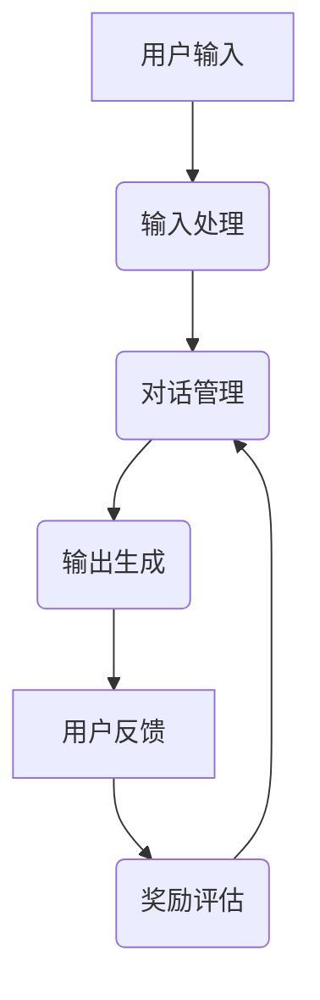
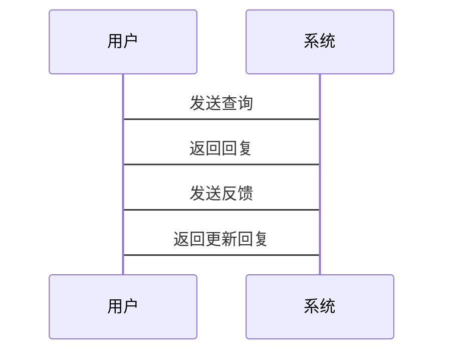

                 


# 强化学习在AI Agent对话系统中的应用

> 关键词：强化学习，AI Agent，对话系统，自然语言处理，机器学习，对话生成

> 摘要：本文深入探讨了强化学习在AI Agent对话系统中的应用，从基础概念到算法实现，再到系统设计与项目实战，全面解析了如何利用强化学习提升对话系统的智能性和用户体验。通过详细的数学推导和实际案例分析，本文为读者提供了从理论到实践的完整指南。

---

# 第一部分：强化学习在AI Agent对话系统中的应用基础

## 第1章：强化学习与AI Agent概述

### 1.1 强化学习的基本概念
强化学习是一种机器学习范式，通过智能体与环境的交互，学习最优策略以最大化累积奖励。其核心要素包括：
- **状态（State）**：环境的当前情况。
- **动作（Action）**：智能体采取的行动。
- **奖励（Reward）**：环境对动作的反馈。
- **策略（Policy）**：决定动作的选择机制。

### 1.2 AI Agent的基本概念
AI Agent是指在环境中能够感知并自主决策的智能体，广泛应用于自动驾驶、推荐系统和对话系统等领域。在对话系统中，AI Agent通过理解和生成自然语言，与用户进行交互。

### 1.3 强化学习在对话系统中的应用背景
传统对话系统依赖规则或预训练模型，存在灵活性差、难以处理复杂场景的问题。强化学习通过动态优化策略，提升了对话系统的适应性和智能性。

---

## 第2章：强化学习的核心概念与数学模型

### 2.1 马尔可夫决策过程（MDP）
MDP定义了一个完整决策框架，包括状态、动作、转移概率和奖励函数。公式化表示为：
$$ P(s' | s, a) $$
其中，$s$是当前状态，$a$是动作，$s'$是下一个状态。

### 2.2 策略与价值函数
- **策略（Policy）**：描述状态到动作的映射，用概率分布表示。
- **价值函数（Value Function）**：评估状态或状态-动作对的期望回报。

### 2.3 强化学习的数学公式
- **价值函数**：$$ V(s) = \max_a Q(s, a) $$
- **策略梯度**：$$ \nabla \theta J(\theta) = \mathbb{E}[ \nabla \log \pi(a|s) Q(s,a) ] $$

---

## 第3章：对话系统的强化学习建模

### 3.1 对话系统的状态表示
- **对话历史**：记录先前的对话内容。
- **用户意图**：分析用户的意图，如“寻找电影”。

### 3.2 对话系统的动作空间
- **生成回复**：根据当前对话生成适当回复。
- **引导用户**：通过提问或建议引导对话方向。

### 3.3 对话系统的奖励机制
- **奖励函数设计**：考虑回复的相关性、准确性和流畅性。
- **实时反馈**：用户反馈作为奖励信号。

---

# 第二部分：强化学习算法在对话系统中的实现

## 第4章：经典的强化学习算法

### 4.1 Q-Learning算法
Q-Learning通过更新Q值表学习最优策略，适用于离散动作空间。

### 4.2 Deep Q-Network（DQN）
DQN结合神经网络和经验回放，适用于连续状态空间。

### 4.3 策略梯度方法
策略梯度通过优化策略参数直接优化回报，适用于复杂任务。

---

## 第5章：基于强化学习的对话生成算法

### 5.1 基于DQN的对话生成
通过神经网络近似Q值函数，生成最优回复。

### 5.2 基于策略梯度的对话生成
直接优化策略参数，提升生成回复的质量。

---

# 第三部分：AI Agent对话系统的系统设计与实现

## 第6章：系统架构设计

### 6.1 系统功能模块
- **输入处理模块**：解析用户输入。
- **对话管理模块**：根据上下文生成回复。
- **反馈评估模块**：计算奖励并更新策略。

### 6.2 系统架构图


## 第7章：对话系统的交互流程

### 7.1 交互流程图


---

# 第四部分：项目实战：构建一个基于强化学习的对话系统

## 第8章：项目环境与工具安装

### 8.1 环境配置
- **Python 3.8+**
- **TensorFlow/PyTorch**
- **NLTK或spaCy**

## 第9章：系统核心实现

### 9.1 对话管理模块实现
```python
class DialogueManager:
    def __init__(self, model):
        self.model = model
    
    def respond(self, input_text):
        # 处理输入并生成回复
        response = self.model.generate_response(input_text)
        return response
```

### 9.2 奖励评估模块实现
```python
def calculate_reward(input_text, response, true_response):
    # 计算回复的相关性、准确性和流畅性
    reward = 0.7 * similarity(input_text, response) + 0.2 * accuracy(response, true_response) + 0.1 * fluency(response)
    return reward
```

## 第10章：系统测试与优化

### 10.1 测试流程
- **单元测试**：测试各模块功能。
- **集成测试**：测试整体交互流程。

### 10.2 性能优化
- **超参数调整**：优化学习率和奖励权重。
- **模型优化**：改进神经网络结构。

---

## 第11章：总结与展望

### 11.1 本章小结
强化学习通过动态优化策略，显著提升了AI Agent对话系统的智能性和用户体验。

### 11.2 未来展望
- **多轮对话优化**：提升对话连贯性。
- **复杂任务处理**：扩展到更复杂的场景。
- **可解释性增强**：提高用户信任度。

---

通过以上目录结构和内容安排，您可以开始撰写完整的文章。每个章节和小节都需要详细展开，确保内容丰富、逻辑清晰，并结合实际案例和代码实现，使读者能够全面理解强化学习在AI Agent对话系统中的应用。

