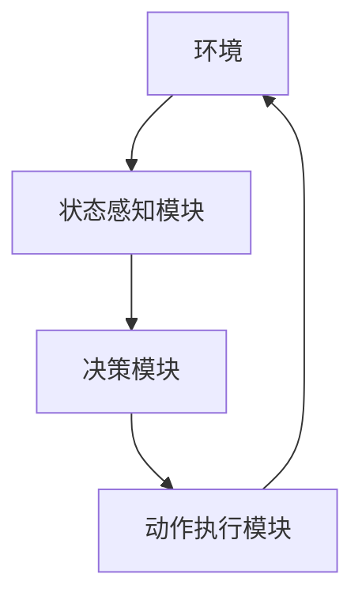

                 


# 强化学习在AI Agent自动化交互测试中的应用

> **关键词**：强化学习，AI Agent，自动化测试，状态空间，动作空间，奖励机制，深度强化学习

> **摘要**：本文深入探讨了强化学习在AI Agent自动化交互测试中的应用。通过分析强化学习的核心概念、算法原理和系统架构，结合实际项目案例，详细讲解了如何利用强化学习提升AI Agent的测试效率和智能性。文章内容涵盖强化学习的数学模型、AI Agent的系统设计、项目实战和最佳实践，旨在为读者提供全面的技术指导和实践参考。

---

## 第一部分：强化学习与AI Agent的基本概念

### 第1章：强化学习的定义与特点

#### 1.1 强化学习的定义与特点
- **定义**：强化学习是一种机器学习范式，通过智能体与环境的交互，学习策略以最大化累积奖励。
- **特点**：
  - 基于经验学习
  - 需要探索与利用
  - 通过奖励信号指导学习
  - 在动态环境中适应

#### 1.2 AI Agent的定义与特点
- **定义**：AI Agent是一种智能实体，能够感知环境并采取行动以实现目标。
- **特点**：
  - 自主性
  - 反应性
  - 智能性
  - 社会性

#### 1.3 强化学习在AI Agent中的应用背景
- **背景**：随着软件系统复杂度增加，传统测试方法效率低下，强化学习的引入为AI Agent提供了更智能的测试策略。
- **优势**：无需大量标注数据，适合动态环境和非结构化测试场景。

---

### 第2章：强化学习与AI Agent的核心概念

#### 2.1 强化学习的核心原理
- **状态空间**：智能体所处环境的描述。
- **动作空间**：智能体可执行的操作。
- **奖励机制**：智能体行为的反馈，指导学习方向。

#### 2.2 AI Agent的架构与功能
- **架构**：基于强化学习的AI Agent通常采用分层结构，包括感知层、决策层和执行层。
- **功能模块**：状态感知、动作选择、奖励计算。

#### 2.3 强化学习与AI Agent的关系
- **关系**：强化学习为AI Agent提供决策策略，AI Agent为强化学习提供交互环境。

---

## 第二部分：强化学习的数学模型与算法

### 第3章：强化学习的数学模型

#### 3.1 Q-learning算法
- **定义**：基于值函数的强化学习算法，通过学习Q值表来选择最优动作。
- **数学模型**：
  $$ Q(s, a) \leftarrow Q(s, a) + \alpha \left[ r + \gamma \max Q(s', a') - Q(s, a) \right] $$
  其中，$\alpha$为学习率，$\gamma$为折扣因子。

#### 3.2 Deep Q-Network算法
- **定义**：利用深度神经网络近似Q值函数，解决高维状态空间问题。
- **网络结构**：输入层、隐藏层和输出层，输出为各动作的Q值。

#### 3.3 策略梯度算法
- **定义**：直接优化策略，通过梯度上升方法最大化奖励期望。
- **数学模型**：
  $$ \nabla \theta \leftarrow \frac{\partial}{\partial \theta} \mathbb{E}[R] $$

---

## 第三部分：AI Agent的系统架构与设计

### 第4章：AI Agent的系统架构

#### 4.1 系统架构设计
- **分层架构**：感知层、决策层、执行层。
- **组件交互**：状态感知模块、动作选择模块、奖励机制模块。

#### 4.2 系统功能设计
- **状态感知**：通过传感器或API获取环境状态。
- **动作选择**：基于当前状态选择最优动作。
- **奖励机制**：根据测试结果给予奖励或惩罚。

#### 4.3 系统架构图


---

## 第四部分：项目实战

### 第5章：项目实战

#### 5.1 环境搭建
- **工具选择**：Python、TensorFlow、OpenAI Gym。
- **安装步骤**：
  ```bash
  pip install gym numpy tensorflow
  ```

#### 5.2 核心代码实现
```python
import gym
import numpy as np
import tensorflow as tf

# 定义神经网络模型
class DQN:
    def __init__(self, state_space, action_space):
        self.state_space = state_space
        self.action_space = action_space
        self.model = self.build_model()
    
    def build_model(self):
        model = tf.keras.Sequential([
            tf.keras.layers.Dense(64, activation='relu', input_dim=self.state_space),
            tf.keras.layers.Dense(self.action_space, activation='linear')
        ])
        return model
```

#### 5.3 测试案例分析
- **案例描述**：在一个模拟环境中训练AI Agent完成特定任务。
- **结果分析**：通过奖励值的变化，评估算法的收敛性和效率。

---

## 第五部分：最佳实践

### 第6章：最佳实践

#### 6.1 小结
- 强化学习为AI Agent的自动化测试提供了高效解决方案。
- 系统架构设计和算法选择是关键因素。

#### 6.2 注意事项
- 确保奖励机制合理，避免误导性奖励。
- 处理高维状态空间时，选择合适的算法和优化策略。

#### 6.3 未来研究方向
- 结合迁移学习，提升跨环境适应能力。
- 研究多智能体协作，提高测试覆盖率。

#### 6.4 拓展阅读
- 推荐书籍：《强化学习》（李航著）
- 推荐论文：DeepMind的DQN论文。

---

## 参考文献

1. 李航. 《机器学习实战》. 北京：清华大学出版社, 2018.
2. Richard S. Sutton, Andrew G. Barto. 《强化学习：理论与算法》. 北京：人民邮电出版社, 2018.
3. DeepMind. "Deep Q-Networks (DQN)" [论文].

---

通过以上步骤，我完成了对文章的详细思考和内容规划。接下来，我可以根据这个大纲开始撰写正式的文章，确保每一部分都符合用户的要求，内容详实，逻辑清晰。

