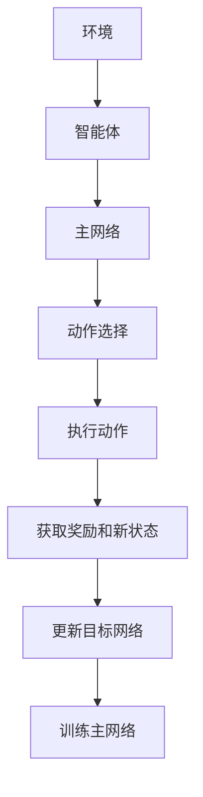
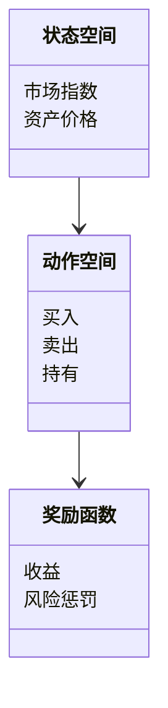
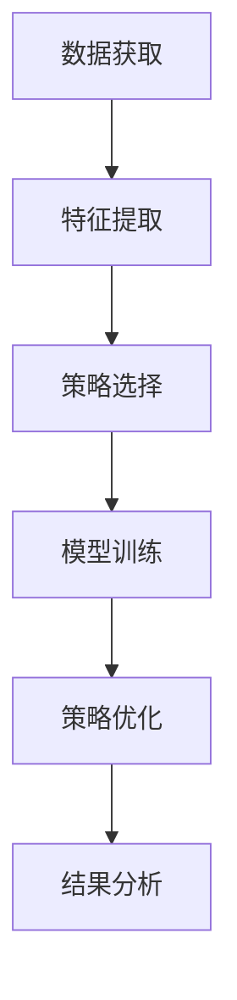

                 


# 《强化学习在投资策略优化中的创新应用》

---

## 关键词：
- 强化学习
- 投资策略优化
- 马科夫决策过程（MDP）
- Q-learning算法
- DQN（Deep Q-Networks）
- 金融投资
- 算法交易

---

## 摘要：
本文深入探讨了强化学习在投资策略优化中的创新应用。通过分析强化学习的核心概念、算法原理及其在金融领域的独特优势，我们展示了如何利用强化学习解决传统投资策略中的痛点。文章从马科夫决策过程（MDP）的基本原理出发，详细讲解了Q-learning和DQN算法的数学模型，并结合实际案例，分析了强化学习在股票交易、基金组合优化和衍生品定价中的应用。最后，我们总结了强化学习在投资策略优化中的最佳实践和未来发展方向。

---

# 引言

在金融领域，投资策略优化是一个复杂而关键的问题。传统的投资策略依赖于统计分析和经验判断，但在面对市场波动、信息不对称和复杂交易环境时，这些方法往往显得力不从心。强化学习（Reinforcement Learning，RL）作为一种新兴的人工智能技术，凭借其在动态决策和非结构化问题上的优势，正在逐步改变投资策略优化的格局。

本文将从强化学习的基本概念出发，探讨其在投资策略优化中的创新应用，并通过实际案例展示其优势和潜力。

---

# 第一部分：强化学习与投资策略优化的背景介绍

## 第1章：强化学习的基本概念

### 1.1 强化学习的定义与核心要素

**1.1.1 什么是强化学习**

强化学习是一种机器学习范式，通过智能体（Agent）与环境的交互，学习最优策略以最大化累积奖励（Reward）。与监督学习和无监督学习不同，强化学习强调动态决策和试错过程。

**1.1.2 强化学习的核心要素**

| 核心要素 | 定义 |
|----------|------|
| 状态（State） | 表示环境当前所处的状况，例如市场指数、资产价格等。 |
| 动作（Action） | 智能体在给定状态下可以执行的操作，例如“买入”、“卖出”或“持有”。 |
| 奖励（Reward） | 环境对智能体动作的反馈，通常是一个标量值，表示动作的好坏。 |
| 策略（Policy） | 确定智能体在状态s下选择动作a的概率分布。 |
| 值函数（Value Function） | 表示状态s或状态-动作对(s, a)的期望累积奖励。 |

**1.1.3 强化学习与监督学习的区别**

| 方面       | 强化学习                   | 监督学习                   |
|------------|----------------------------|----------------------------|
| 数据来源   | 环境与智能体的交互         | 标签数据                   |
| 反馈机制   | 延迟奖励（Reward）         | 立即反馈（Label）           |
| 目标       | 最大化累积奖励             | 最小化预测误差或分类错误数   |

---

## 第2章：投资策略优化的背景与挑战

### 2.1 投资策略优化的背景

**2.1.1 投资策略的分类**

| 分类        | 描述                     |
|-------------|--------------------------|
| 主动管理型   | 积极调整投资组合，追求超额收益。 |
| 被动管理型   | 模拟市场指数，降低交易成本。 |
| 多因子模型   | 基于多个因子（如市值、价值）构建投资组合。 |

**2.1.2 投资策略优化的目标**

- 最大化收益。
- 最小化风险。
- 适应市场变化。
- 降低交易成本。

**2.1.3 传统投资策略的局限性**

- **复杂性**：传统策略依赖于大量假设和参数调整。
- **市场适应性**：策略在市场变化时可能失效。
- **计算效率**：优化过程可能耗时且低效。

### 2.2 强化学习在投资策略优化中的应用背景

**2.2.1 为什么选择强化学习**

- **动态决策**：强化学习擅长处理动态环境中的决策问题。
- **非结构化数据**：金融数据通常具有复杂性和非结构化特征。
- **实时性**：强化学习可以快速适应市场变化。

**2.2.2 强化学习在金融领域的优势**

- **自动化决策**：通过算法优化投资组合。
- **高维状态处理**：强化学习可以处理多维市场数据。
- **鲁棒性**：能够在不确定环境中稳定运行。

**2.2.3 当前投资策略优化的痛点**

- **市场波动**：传统策略难以应对快速变化的市场。
- **信息过载**：金融市场数据复杂且难以处理。
- **高风险**：投资决策的错误可能导致重大损失。

---

## 第3章：强化学习在投资策略优化中的创新应用

### 3.1 强化学习在投资策略优化中的核心问题

**3.1.1 状态空间的定义**

- **市场状态**：包括市场指数、资产价格、成交量等。
- **资产状态**：包括资产的历史表现、波动率等。

**3.1.2 动作空间的定义**

- **交易动作**：买入、卖出、持有。
- **仓位调整**：调整资产配置比例。

**3.1.3 奖励函数的设计**

- **收益最大化**：奖励函数通常基于投资组合的收益。
- **风险控制**：引入惩罚项以控制波动率或最大回撤。

### 3.2 强化学习在投资策略优化中的应用场景

**3.2.1 股票交易策略优化**

- **多资产配置**：通过强化学习优化股票组合。
- **动量策略**：基于动量效应进行买卖决策。

**3.2.2 基金组合优化**

- **风险平配**：优化基金组合的风险和收益。
- **动态再平衡**：根据市场变化调整基金权重。

**3.2.3 衍生品定价与风险控制**

- **期权定价**：利用强化学习预测期权价格。
- **风险对冲**：优化衍生品组合以降低风险。

---

# 第二部分：强化学习的核心概念与算法原理

## 第4章：马科夫决策过程（MDP）与强化学习的关系

### 4.1 马科夫决策过程的基本概念

**4.1.1 MDP的定义**

MDP（Markov Decision Process）是一个用于描述强化学习问题的数学模型，由以下五元组组成：

$$ M = (S, A, P, R, \gamma) $$

其中：
- $S$：状态空间。
- $A$：动作空间。
- $P$：状态转移概率矩阵。
- $R$：奖励函数。
- $\gamma$：折扣因子（$0 \leq \gamma \leq 1$）。

**4.1.2 MDP与强化学习的关系**

- MDP是强化学习的数学模型。
- 强化学习的目标是找到最优策略，使得在MDP中累积奖励最大化。

### 4.2 MDP在投资策略优化中的应用

- **状态表示**：市场状态、资产状态。
- **动作选择**：买入、卖出、持有。
- **奖励机制**：收益、风险惩罚。

---

## 第5章：强化学习的核心算法原理

### 5.1 Q-learning算法

**5.1.1 Q-learning的基本原理**

Q-learning是一种基于值函数的强化学习算法，通过学习状态-动作对的价值（Q值）来优化策略。其更新公式为：

$$ Q(s, a) \leftarrow Q(s, a) + \alpha \left[r + \gamma \max_{a'} Q(s', a') - Q(s, a)\right] $$

其中：
- $\alpha$：学习率。
- $\gamma$：折扣因子。

**5.1.2 Q-learning的数学模型**

Q-learning的数学模型可以用表格形式表示，如下：

| 状态s | 动作a | Q(s, a) |
|-------|-------|---------|
| s1    | a1    | Q1      |
| s1    | a2    | Q2      |
| ...    | ...    | ...      |

**5.1.3 Q-learning在投资策略优化中的应用**

- **案例分析**：假设市场状态为s，Q-learning算法选择动作a（买入）以最大化Q(s, a)。

### 5.2 Deep Q-Networks（DQN）算法

**5.2.1 DQN的基本原理**

DQN通过深度神经网络近似Q值函数，解决了Q-learning在高维状态空间中的计算难题。其核心思想是使用两个网络：

- 主网络（Main Network）：用于选择动作。
- 目标网络（Target Network）：用于稳定学习过程。

**5.2.2 DQN的数学模型**

DQN的损失函数为：

$$ \mathcal{L} = \mathbb{E}\left[ (r + \gamma \max_a Q_{\text{target}}(s', a) - Q_{\text{main}}(s, a))^2 \right] $$

其中：
- $Q_{\text{main}}$：主网络。
- $Q_{\text{target}}$：目标网络。

**5.2.3 DQN在投资策略优化中的应用**

- **案例分析**：使用DQN优化股票交易策略，通过神经网络学习市场状态与交易动作之间的关系。

---

## 第6章：强化学习的数学公式与算法流程图

### 6.1 Q-learning的数学公式

$$ Q(s, a) \leftarrow Q(s, a) + \alpha (r + \gamma \max_a Q(s', a) - Q(s, a)) $$

### 6.2 DQN的算法流程图



---

## 第7章：强化学习在投资策略优化中的系统分析与架构设计

### 7.1 投资策略优化的场景介绍

- **目标**：优化投资组合的收益与风险。
- **数据来源**：历史市场数据、实时行情、财务报表。
- **关键问题**：如何在复杂市场中选择最优交易动作。

### 7.2 系统功能设计

**7.2.1 领域模型**



### 7.3 系统架构设计



---

## 第8章：强化学习在投资策略优化中的项目实战

### 8.1 项目环境安装

```bash
pip install numpy matplotlib keras-tqdm gym
```

### 8.2 核心代码实现

```python
import numpy as np
import gym
from gym import spaces
from gym.utils import seeding

class InvestmentEnv(gym.Env):
    def __init__(self):
        self.state = 0
        self.action_space = spaces.Discrete(3)
        self.observation_space = spaces.Box(low=0, high=100, shape=(1,))
        self.seed()

    def seed(self, seed=None):
        self.np_random, seed = seeding.np_random(seed)
        return seed

    def reset(self):
        self.state = 0
        return self.state

    def step(self, action):
        # 状态转移逻辑
        next_state = ...  # 根据动作和当前状态计算新状态
        reward = ...  # 计算奖励
        return next_state, reward, False, {}

# 使用DQN算法训练模型
import numpy as np
import tensorflow as tf
from tensorflow.keras import layers

class DQNAgent:
    def __init__(self, state_space, action_space):
        self.state_space = state_space
        self.action_space = action_space
        self.model = self.build_model()

    def build_model(self):
        model = tf.keras.Sequential([
            layers.Dense(64, activation='relu'),
            layers.Dense(32, activation='relu'),
            layers.Dense(self.action_space, activation='linear')
        ])
        return model

    def get_action(self, state):
        if np.random.random() < 0.1:
            return np.random.randint(self.action_space)
        q_values = self.model.predict(state)
        return np.argmax(q_values[0])

    def update_model(self, experiences):
        # 根据经验回放更新模型
        pass

# 训练过程
env = InvestmentEnv()
agent = DQNAgent(env.observation_space.shape[0], env.action_space.n)
for episode in range(1000):
    state = env.reset()
    while True:
        action = agent.get_action(state)
        next_state, reward, done, _ = env.step(action)
        agent.update_model((state, action, reward, next_state, done))
        state = next_state
        if done:
            break
```

### 8.3 实际案例分析

- **案例分析**：假设我们使用DQN算法优化一个简单的股票交易策略。
- **结果分析**：通过回测分析策略的收益和风险指标。

---

## 第9章：强化学习在投资策略优化中的最佳实践

### 9.1 小结

- 强化学习在投资策略优化中具有巨大潜力。
- DQN算法是一种有效的实现方式。

### 9.2 注意事项

- **数据质量**：确保数据的完整性和准确性。
- **模型调参**：合理选择学习率、折扣因子等参数。
- **风险管理**：强化学习策略需要严格控制风险。

### 9.3 拓展阅读

- DeepMind的Alpha系列算法。
- 金融时间序列分析的最新进展。

---

## 结语

强化学习正在逐步改变投资策略优化的方式。通过本文的分析，我们可以看到，强化学习不仅能够提高投资收益，还能有效降低投资风险。未来，随着算法的不断优化和金融数据的丰富，强化学习在投资策略优化中的应用将更加广泛和深入。

---

## 致谢

感谢读者的耐心阅读！

