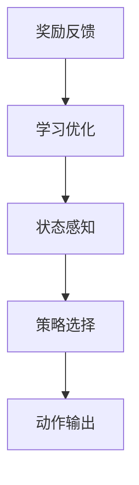
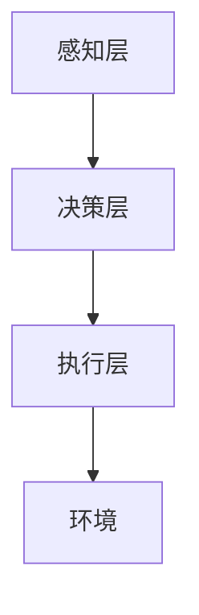
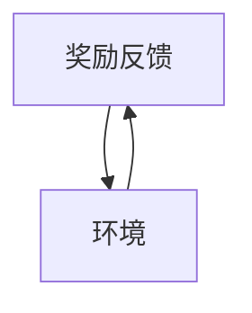

                 


```markdown
# 强化学习驱动的AI Agent自主探索与学习

> 关键词：强化学习，AI Agent，自主探索，深度学习，Q-learning，DQN

> 摘要：本文深入探讨了强化学习在AI Agent自主探索与学习中的应用。通过详细分析强化学习的基本原理、数学模型、系统架构设计以及实际项目案例，展示了如何构建能够自主学习和优化的AI Agent。文章内容涵盖从理论到实践的各个方面，旨在帮助读者全面理解并掌握强化学习驱动的AI Agent的实现方法。

---

# 第一部分: 强化学习驱动的AI Agent背景与基础

## 第1章: 强化学习与AI Agent概述

### 1.1 强化学习的基本概念
#### 1.1.1 什么是强化学习
强化学习是一种机器学习范式，通过智能体与环境的交互，逐步优化策略以最大化累积奖励。与监督学习和无监督学习不同，强化学习强调通过试错和经验积累来实现目标。

#### 1.1.2 强化学习的核心要素
| 要素 | 描述 |
|------|------|
| 状态 (State) | 智能体所处的环境情况，例如游戏中的棋盘状态。 |
| 动作 (Action) | 智能体在某一状态下做出的行为，例如下棋的一个步骤。 |
| 奖励 (Reward) | 环境对智能体行为的反馈，通常表现为数值形式，用于指导学习方向。 |
| 策略 (Policy) | 智能体在某一状态下选择动作的概率分布或确定性规则。 |
| 价值函数 (Value Function) | 表示在某个状态下采取某种策略能够获得的期望奖励。 |

#### 1.1.3 AI Agent的定义与特点
AI Agent是一种智能实体，能够感知环境、自主决策并执行动作。其特点包括：
- **自主性**：能够在无外部干预的情况下独立运作。
- **反应性**：能够根据环境反馈实时调整行为。
- **学习能力**：通过强化学习等方法不断优化自身的策略。

### 1.2 强化学习与AI Agent的关系
强化学习为AI Agent提供了自主学习和优化的机制。通过强化学习，AI Agent能够在动态和不确定的环境中，通过试错和经验积累，找到最优或近似最优的决策策略。

### 1.3 强化学习驱动的AI Agent的应用场景
- **游戏AI**：例如AlphaGo、OpenAI的Dota AI。
- **机器人控制**：用于机器人路径规划和动作控制。
- **自动驾驶**：通过强化学习优化驾驶策略。
- **金融交易**：用于股票交易策略的优化。

---

## 第2章: 强化学习的基本原理

### 2.1 马尔可夫决策过程（MDP）
马尔可夫决策过程是强化学习的核心模型，描述了智能体与环境之间的交互过程。

#### MDP的数学定义
一个马尔可夫决策过程可以表示为五元组 $(S, A, P, R, \gamma)$，其中：
- $S$：状态空间。
- $A$：动作空间。
- $P(s' | s, a)$：从状态$s$执行动作$a$后转移到状态$s'$的概率。
- $R(s, a, s')$：执行动作$a$后从状态$s$转移到状态$s'$时获得的奖励。
- $\gamma$：折扣因子，用于平衡当前奖励和未来奖励的重要性。

#### MDP的状态转移图
```mermaid
graph TD
    S[状态] --> A[动作]
    A --> S' [状态转移]
```

### 2.2 Q-learning算法
Q-learning是一种经典的强化学习算法，适用于离散状态和动作空间。

#### Q-learning的核心思想
Q-learning通过学习状态-动作对的价值函数$Q(s, a)$，逐步逼近最优策略。其更新公式为：
$$ Q(s, a) = Q(s, a) + \alpha \left[ r + \gamma \max_{a'} Q(s', a') - Q(s, a) \right] $$

其中：
- $\alpha$：学习率，控制更新步长。
- $\gamma$：折扣因子，平衡当前和未来奖励。

#### Q-learning的收敛性分析
在满足马尔可夫假设和折扣因子$\gamma < 1$的条件下，Q-learning算法能够收敛到最优价值函数。

### 2.3 Deep Q-Networks（DQN）
DQN是Q-learning的深度学习版本，通过神经网络近似价值函数，适用于高维状态空间。

#### DQN的网络结构
DQN通常使用两个卷积神经网络：
- **主网络**：用于评估当前状态的动作价值。
- **目标网络**：用于存储目标价值，通过定期更新主网络来稳定学习过程。

#### DQN的训练流程
```mermaid
graph TD
    S[状态] --> A[动作]
    A --> R[奖励]
    R --> S'[状态']
    (S, A) --> Q(S, A)
    Q(S, A) --> Update Q(S', A')
```

### 2.4 强化学习的数学模型
#### 动作选择策略
- **ε-贪心策略**：以概率$\epsilon$选择随机动作，其余概率选择当前最优动作。
- **Softmax策略**：根据动作的Q值概率分布选择动作。

#### 奖励机制设计
- **即时奖励**：直接给予动作的反馈。
- **累积奖励**：将多个动作的奖励累加，以反映长期目标的实现情况。

---

## 第3章: AI Agent的系统架构设计

### 3.1 系统功能设计
AI Agent的系统功能模块包括：
- **状态感知模块**：接收环境反馈的状态信息。
- **动作选择模块**：根据当前状态和策略选择动作。
- **奖励机制模块**：计算并反馈奖励值。
- **学习与优化模块**：更新价值函数和策略。

#### 系统功能模块图


### 3.2 系统架构设计
AI Agent的系统架构通常采用分层设计，包括感知层、决策层和执行层。

#### 系统架构图


### 3.3 系统接口设计
- **输入接口**：接收环境的状态信息。
- **输出接口**：发送动作指令给环境。
- **反馈接口**：接收环境的奖励反馈。

#### 系统接口交互图


---

## 第4章: 强化学习驱动的AI Agent实战

### 4.1 项目环境搭建
#### 4.1.1 安装Python
```bash
python --version
pip install numpy matplotlib tensorflow
```

#### 4.1.2 安装TensorFlow
```bash
pip install tensorflow
```

### 4.2 项目核心实现
#### 4.2.1 状态空间和动作空间定义
```python
class Environment:
    def __init__(self):
        self.state_space = ...  # 状态空间定义
        self.action_space = ...  # 动作空间定义
```

#### 4.2.2 Q-learning算法实现
```python
class QLearning:
    def __init__(self, state_space, action_space):
        self.q_table = np.zeros((state_space, action_space))
```

#### 4.2.3 DQN算法实现
```python
class DQN:
    def __init__(self, input_dim, output_dim):
        self.model = self.build_model()
        self.target_model = self.build_model()
    
    def build_model(self):
        model = tf.keras.Sequential([
            tf.keras.layers.Conv2D(32, (3,3), activation='relu', input_shape=(input_dim)),
            tf.keras.layers.Flatten(),
            tf.keras.layers.Dense(64, activation='relu'),
            tf.keras.layers.Dense(output_dim, activation='linear')
        ])
        return model
```

### 4.3 实际案例分析
#### 4.3.1 游戏AI案例
```python
def play_game(agent, environment):
    state = environment.reset()
    while not done:
        action = agent.choose_action(state)
        next_state, reward, done = environment.step(action)
        agent.update(state, action, reward, next_state)
        state = next_state
```

#### 4.3.2 机器人控制案例
```python
def control_robot(agent, environment):
    state = environment.get_state()
    while True:
        action = agent.predict(state)
        next_state = environment.act(action)
        reward = environment.get_reward()
        agent.train(state, action, reward, next_state)
        state = next_state
```

---

## 第5章: 总结与展望

### 5.1 最佳实践 tips
- **环境设计**：确保环境的状态和动作定义清晰，奖励机制合理。
- **算法选择**：根据具体问题选择合适的强化学习算法，如Q-learning、DQN等。
- **训练策略**：合理设置学习率和折扣因子，避免过快或过慢的收敛。

### 5.2 小结
本文从理论到实践，详细讲解了强化学习驱动的AI Agent的自主探索与学习机制。通过数学模型、算法实现和实际案例的分析，展示了如何构建高效且智能的AI Agent。

### 5.3 注意事项
- **过拟合问题**：在训练过程中，注意防止模型过拟合训练数据。
- **探索与利用平衡**：在动作选择策略中，平衡探索新动作和利用已知最优动作。

### 5.4 拓展阅读
- 推荐阅读《Reinforcement Learning: Theory and Algorithms》和《Deep Reinforcement Learning》等书籍。

---

通过本文的学习，读者将能够理解并掌握强化学习驱动的AI Agent的核心原理和实现方法，为后续的深入研究和实践打下坚实的基础。
```

