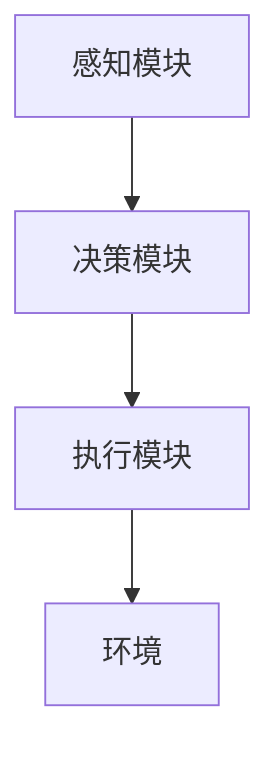

                 


# 强化学习驱动的AI Agent：优化LLM的决策策略

## 关键词：强化学习，AI Agent，大语言模型，决策策略，算法优化

## 摘要：本文详细探讨了如何利用强化学习（Reinforcement Learning，RL）驱动的AI Agent来优化大语言模型（LLM）的决策策略。通过分析强化学习的核心概念、算法原理以及其在LLM中的应用，本文为读者提供了从理论到实践的全面指导，帮助读者理解如何通过强化学习提升LLM的决策能力。文章内容涵盖强化学习基础、算法优化、系统设计与实现、项目实战等多个方面，结合数学公式、算法流程图和系统架构图，为读者提供了一套完整的解决方案。

---

## 第一部分: 强化学习驱动的AI Agent基础

### 第1章: 强化学习与大语言模型概述

#### 1.1 强化学习的基本概念

##### 1.1.1 强化学习的定义与特点
强化学习（Reinforcement Learning，RL）是一种机器学习范式，通过智能体（Agent）与环境的交互，学习最优策略以最大化累积奖励。其特点包括：
- **目标导向**：智能体通过与环境交互，学习如何采取行动以达到目标。
- **经验驱动**：智能体通过试错（trial-and-error）方式，逐步优化策略。
- **延迟奖励**：奖励可能在多个动作之后才给出，要求智能体具备长期规划能力。

##### 1.1.2 大语言模型（LLM）的定义与特点
大语言模型（Large Language Model，LLM）是指经过大规模数据训练的深度学习模型，能够理解并生成人类语言。其特点包括：
- **大规模参数**：通常包含数十亿甚至更多的参数。
- **多任务能力**：可以通过微调完成多种任务，如文本生成、问答、翻译等。
- **上下文理解**：能够通过上下文理解语义，生成连贯的文本。

##### 1.1.3 强化学习与LLM的结合应用
强化学习可以用于优化LLM的决策策略，例如在对话系统中，智能体通过与用户的交互，学习如何生成更符合用户意图的回复。这种结合可以显著提升LLM的性能和用户体验。

#### 1.2 AI Agent的基本概念

##### 1.2.1 AI Agent的定义与分类
AI Agent是指具有感知环境、自主决策并执行任务的智能体。根据智能体的智能水平，可以分为：
- **反应式智能体**：基于当前感知做出反应，不依赖长期记忆。
- **认知式智能体**：具备推理、规划等高级认知能力。

##### 1.2.2 AI Agent的核心功能与特点
AI Agent的核心功能包括：
- **感知环境**：通过传感器或接口获取环境信息。
- **决策与行动**：基于感知信息，选择最优行动。
- **学习与优化**：通过强化学习等方法，不断优化决策策略。

##### 1.2.3 强化学习在AI Agent中的作用
强化学习为AI Agent提供了从经验中学习的机制，使其能够在动态环境中自主优化决策策略。这种机制使得AI Agent能够适应复杂多变的任务需求。

#### 1.3 本章小结
本章介绍了强化学习和大语言模型的基本概念，以及AI Agent的核心功能与特点。通过强化学习，AI Agent能够优化LLM的决策策略，提升其在复杂任务中的表现。

---

## 第二部分: 强化学习的核心概念与算法原理

### 第2章: 强化学习的核心概念

#### 2.1 马尔可夫决策过程（MDP）

##### 2.1.1 状态空间的定义与建模
状态空间是智能体可能处的所有状态的集合。在强化学习中，状态通常用随机变量$S$表示。例如，在一个对话系统中，状态可以是用户的当前输入文本。

##### 2.1.2 行动空间的定义与建模
行动空间是智能体可以执行的所有行动的集合。用随机变量$A$表示。例如，在对话系统中，行动可以是生成回复文本的多种选择。

##### 2.1.3 奖励函数的设计与实现
奖励函数$r(s, a)$定义了智能体在状态$s$下执行行动$a$时获得的奖励。例如，在对话系统中，奖励可以是用户对回复的满意度评分。

##### 2.1.4 动作-奖励模型的构建
动作-奖励模型是强化学习的核心，通过定义智能体在不同状态和行动下的奖励，指导智能体的学习过程。

#### 2.2 策略与价值函数

##### 2.2.1 策略的定义与分类
策略$\pi$是智能体在给定状态$s$下选择行动$a$的概率分布。常见的策略包括：
- **随机策略**：基于随机性选择行动。
- **确定性策略**：选择最优行动。

##### 2.2.2 价值函数的定义与计算
价值函数$v(s)$表示智能体从状态$s$开始所能获得的最大累积奖励。其计算公式为：
$$v(s) = \max_a q(s, a)$$

##### 2.2.3 策略与价值函数的关系
策略通过选择行动来优化价值函数，而价值函数为策略的选择提供反馈。两者相互依存，共同驱动强化学习的过程。

#### 2.3 强化学习的核心算法

##### 2.3.1 Q-learning算法
Q-learning是一种经典的强化学习算法，通过更新Q值表来学习最优策略。其更新公式为：
$$Q(s, a) = Q(s, a) + \alpha [r + \gamma \max Q(s', a) - Q(s, a)]$$

##### 2.3.2 深度强化学习算法
深度强化学习（Deep RL）结合了深度学习和强化学习，通过神经网络近似Q值函数。例如，Deep Q-Network（DQN）算法。

##### 2.3.3 蒙特卡洛树搜索（MCTS）
MCTS是一种基于采样的搜索算法，常用于游戏树搜索。其流程如下：
1. 选择未探索的节点进行探索。
2. 对每个节点进行模拟，计算其优势。
3. 根据模拟结果更新节点的优先级。

#### 2.4 本章小结
本章详细介绍了强化学习的核心概念，包括马尔可夫决策过程、策略与价值函数，以及常见的强化学习算法。这些内容为后续章节的应用奠定了理论基础。

---

## 第三部分: 强化学习在LLM中的应用

### 第3章: LLM的决策策略优化

#### 3.1 LLM的决策过程

##### 3.1.1 LLM的输入输出机制
LLM通过输入文本生成输出文本。例如，在对话系统中，输入是用户的提问，输出是模型生成的回复。

##### 3.1.2 LLM的内部决策过程
LLM通过内部参数生成概率分布，选择最优的输出文本。强化学习可以优化这一过程，提升生成结果的质量。

##### 3.1.3 LLM的决策策略特点
- **多样性**：能够生成多种可能的回复。
- **连贯性**：生成的文本具有逻辑连贯性。
- **适应性**：能够根据上下文调整生成内容。

#### 3.2 强化学习优化LLM决策策略的原理

##### 3.2.1 强化学习在LLM中的作用
通过强化学习，LLM能够从与环境的交互中学习最优策略，提升生成结果的质量和相关性。

##### 3.2.2 强化学习优化LLM决策的流程
1. 定义状态、行动和奖励。
2. 选择行动并执行。
3. 收集奖励并更新策略。

##### 3.2.3 强化学习优化LLM决策的优势
- **自适应性**：能够根据环境变化调整策略。
- **高效性**：通过试错快速找到最优解。
- **可解释性**：通过奖励机制可以明确优化目标。

#### 3.3 基于强化学习的LLM决策优化算法

##### 3.3.1 基于Q-learning的LLM决策优化
Q-learning算法可以用于优化LLM的生成策略。通过不断更新Q值表，LLM能够生成更符合用户意图的回复。

##### 3.3.2 基于深度强化学习的LLM决策优化
深度强化学习通过神经网络近似Q值函数，能够处理复杂的决策问题。例如，使用DQN算法优化LLM的生成策略。

##### 3.3.3 基于MCTS的LLM决策优化
MCTS算法可以用于生成阶段的决策优化。通过模拟生成多种可能的回复，选择最优的生成策略。

#### 3.4 本章小结
本章探讨了强化学习在优化LLM决策策略中的应用，介绍了多种强化学习算法及其在LLM中的实现。通过强化学习，LLM的生成质量得到了显著提升。

---

## 第四部分: 强化学习驱动的AI Agent系统设计

### 第4章: AI Agent的系统架构设计

#### 4.1 AI Agent的系统功能设计

##### 4.1.1 系统功能模块
AI Agent的系统功能模块包括：
- **感知模块**：接收环境输入。
- **决策模块**：基于强化学习算法选择行动。
- **执行模块**：输出行动结果。

##### 4.1.2 系统功能流程
1. 感知模块接收输入。
2. 决策模块选择行动。
3. 执行模块输出结果。

##### 4.1.3 系统功能设计的优化
通过优化感知和决策模块，提升AI Agent的整体性能。

#### 4.2 AI Agent的系统架构设计

##### 4.2.1 系统架构图


##### 4.2.2 系统架构设计的实现
通过模块化设计，提升系统的可维护性和扩展性。

#### 4.3 AI Agent的系统接口设计

##### 4.3.1 系统接口描述
系统接口包括：
- **输入接口**：接收环境输入。
- **输出接口**：输出决策结果。
- **控制接口**：管理系统的运行状态。

##### 4.3.2 系统接口设计的优化
通过标准化接口设计，提升系统的兼容性和扩展性。

#### 4.4 AI Agent的系统交互设计

##### 4.4.1 系统交互流程
1. 感知模块接收输入。
2. 决策模块选择行动。
3. 执行模块输出结果。
4. 环境反馈奖励。

##### 4.4.2 系统交互设计的优化
通过优化交互流程，提升系统的响应速度和准确性。

#### 4.5 本章小结
本章详细介绍了AI Agent的系统架构设计，包括功能模块、接口设计和交互流程。通过模块化设计和优化，提升了系统的整体性能。

---

## 第五部分: 项目实战

### 第5章: 优化LLM的决策策略

#### 5.1 项目背景与目标

##### 5.1.1 项目背景
本项目旨在通过强化学习优化LLM的决策策略，提升其在对话系统中的生成质量。

##### 5.1.2 项目目标
1. 实现强化学习驱动的AI Agent。
2. 优化LLM的决策策略。
3. 提升对话系统的用户体验。

#### 5.2 环境配置与安装

##### 5.2.1 环境需求
- 操作系统：Linux/Windows/MacOS
- Python版本：3.6+
- 依赖库：TensorFlow、Keras、OpenAI API

##### 5.2.2 环境安装步骤
1. 安装Python和必要的依赖库。
2. 配置OpenAI API密钥。
3. 下载并安装强化学习库（如TensorFlow）。

#### 5.3 核心实现

##### 5.3.1 强化学习算法实现
```python
import numpy as np
import gym

class Agent:
    def __init__(self, env):
        self.env = env
        self.q_table = np.zeros([env.observation_space.n, env.action_space.n])
        self.learning_rate = 0.1
        self.gamma = 0.9

    def take_action(self, state):
        if np.random.random() < 0.9:
            return np.argmax(self.q_table[state])
        else:
            return self.env.action_space.sample()

    def update_q_table(self, state, action, reward, next_state):
        self.q_table[state][action] = self.q_table[state][action] + self.learning_rate * (reward + self.gamma * np.max(self.q_table[next_state]) - self.q_table[state][action])
```

##### 5.3.2 LLM接口实现
```python
import openai

class LLMInterface:
    def __init__(self, api_key):
        self.client = openai.Client(api_key)

    def generate_response(self, prompt):
        response = self.client.completions.create(
            model="gpt-3.5-turbo",
            prompt=prompt,
            max_tokens=1000,
            temperature=0.7
        )
        return response.choices[0].message.content
```

##### 5.3.3 系统集成与测试
1. 将强化学习算法与LLM接口集成。
2. 在测试环境中验证系统的性能。
3. 根据测试结果优化系统参数。

#### 5.4 项目小结
本章通过一个具体项目，详细讲解了强化学习驱动的AI Agent在优化LLM决策策略中的应用。通过项目实战，读者可以更好地理解理论知识，并掌握实际操作技能。

---

## 第六部分: 总结与展望

### 第6章: 总结与展望

#### 6.1 核心知识点回顾
- 强化学习的基本概念与算法原理。
- LLM的决策策略优化方法。
- AI Agent的系统设计与实现。

#### 6.2 当前技术挑战
- 强化学习算法的计算复杂度较高。
- LLM与强化学习的结合需要更多的研究。
- 系统的可解释性和实时性问题。

#### 6.3 未来技术发展与趋势
- 更高效的强化学习算法。
- 更强大的大语言模型。
- 多模态强化学习的发展。

#### 6.4 实用建议与注意事项
- 在实际应用中，需要结合具体场景选择合适的算法。
- 注重系统的可维护性和扩展性。
- 定期更新模型和算法，以应对环境的变化。

#### 6.5 本章小结
本章总结了全文的核心知识点，并展望了未来的技术发展趋势。通过不断的优化和创新，强化学习驱动的AI Agent将在优化LLM决策策略中发挥更大的作用。

---

## 结语
通过本文的详细讲解，读者可以系统地掌握强化学习驱动的AI Agent优化LLM决策策略的核心技术。从理论到实践，本文为读者提供了一套完整的解决方案。希望本文能够为相关领域的研究和应用提供有价值的参考。

