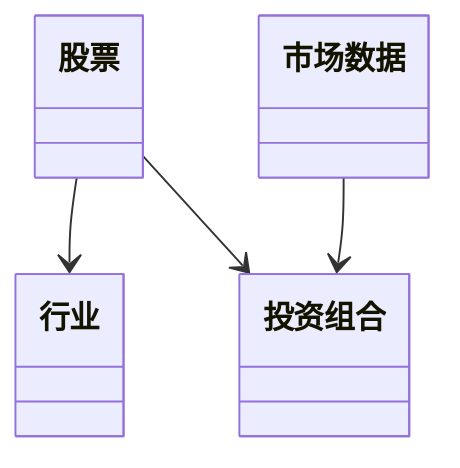
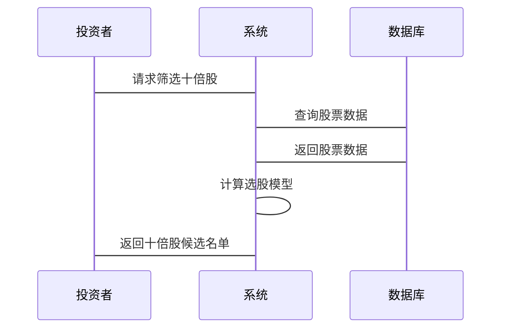

                 


# 彼得·林奇的十倍股选股法则

> 关键词：彼得·林奇，十倍股，选股法则，投资策略，风险管理，股票分析

> 摘要：本文深入探讨了彼得·林奇的十倍股选股法则，从背景介绍、核心概念到选股标准、模型构建、投资组合管理、风险管理等方面进行了详细分析。通过数学公式、mermaid图表和实际案例，全面解析了彼得·林奇的投资哲学与实践方法。

---

## 第一部分: 引言

### 第1章: 彼得·林奇与十倍股概述

#### 1.1 彼得·林奇的背景介绍
彼得·林奇是美国著名的投资专家，以其在共同基金领域的卓越表现闻名。他管理的麦哲伦基金在任职期间创造了年均22%的回报率，成为投资领域的传奇。

#### 1.2 十倍股的定义与重要性
十倍股是指在十年内股价增长十倍的股票。这种股票不仅为投资者带来丰厚回报，还反映了企业的快速增长和市场对其的高度认可。

#### 1.3 彼得·林奇的投资哲学
彼得·林奇强调长期投资、价值发现和风险管理，主张通过基本面分析寻找具有成长潜力的企业。

---

## 第二部分: 十倍股的核心概念

### 第2章: 十倍股的选股标准

#### 2.1 选股的核心指标
彼得·林奇选股的关键指标包括市盈率（P/E）、市净率（P/B）和股息率（Dividend Yield）。

##### 2.1.1 市盈率（P/E）分析
市盈率是股票价格与每股收益的比值，用于衡量股票的估值是否合理。公式为：
$$ \text{P/E} = \frac{\text{股价}}{\text{每股收益}} $$

##### 2.1.2 市净率（P/B）分析
市净率是股票价格与每股净资产的比值，用于衡量股票的资产价值。公式为：
$$ \text{P/B} = \frac{\text{股价}}{\text{每股净资产}} $$

##### 2.1.3 股息率（Dividend Yield）分析
股息率是每股股息与股价的比值，用于衡量股票的分红能力。公式为：
$$ \text{股息率} = \frac{\text{每股股息}}{\text{股价}} $$

#### 2.2 企业基本面分析
彼得·林奇注重企业的财务健康状况，包括营业收入、净利润和ROE（净资产收益率）等指标。

##### 2.2.1 营业收入与利润增长
营业收入是企业收入的主要来源，利润增长反映企业的盈利能力。

##### 2.2.2 净利润与ROE分析
净利润是企业的核心利润指标，ROE（净资产收益率）是衡量企业盈利能力的重要指标，公式为：
$$ \text{ROE} = \frac{\text{净利润}}{\text{净资产}} $$

##### 2.2.3 财务健康状况评估
通过资产负债表、利润表和现金流量表分析企业的财务状况，重点关注流动比率、速动比率等指标。

#### 2.3 行业与竞争优势分析
彼得·林奇注重企业的行业地位和竞争优势，包括市场份额、行业增长率和企业的核心竞争力。

##### 2.3.1 行业地位与市场潜力
行业地位决定了企业的市场影响力，市场潜力决定了行业的成长空间。

##### 2.3.2 核心竞争优势
核心竞争优势包括技术优势、成本优势和品牌优势等。

##### 2.3.3 可持续发展能力
企业的可持续发展能力取决于其创新能力、管理团队和资源整合能力。

---

### 第3章: 彼得·林奇的选股模型

#### 3.1 模型概述
彼得·林奇的选股模型基于基本面分析和市场判断，旨在筛选出具有成长潜力的股票。

##### 3.1.1 模型的核心逻辑
通过筛选低市盈率、低市净率和高成长性的企业，结合行业趋势和市场环境，选出具有十倍股潜力的股票。

##### 3.1.2 模型的输入与输出
输入：企业财务数据、行业数据、市场数据。输出：筛选出的十倍股候选名单。

##### 3.1.3 模型的适用场景
适用于成长型企业，特别是处于快速成长期的行业。

#### 3.2 模型的数学公式
彼得·林奇的选股模型可以通过以下公式进行量化：

##### 3.2.1 市场潜力评估公式
$$ \text{市场潜力} = \text{行业增长率} \times \text{市场份额} $$

##### 3.2.2 企业竞争力评估公式
$$ \text{竞争力} = \frac{\text{净利润增长率}}{\text{行业平均增长率}} $$

#### 3.3 模型的实现步骤
##### 3.3.1 数据收集与清洗
收集企业的财务数据、行业数据和市场数据，进行数据清洗和预处理。

##### 3.3.2 指标计算与分析
计算市盈率、市净率、股息率等指标，分析企业的财务状况和市场竞争力。

##### 3.3.3 模型验证与优化
通过历史数据验证模型的有效性，优化模型参数以提高筛选准确性。

---

### 第4章: 投资组合的构建与管理

#### 4.1 投资组合的构建策略
彼得·林奇主张分散投资，通过筛选出的十倍股构建投资组合。

##### 4.1.1 股票筛选与排序
根据选股模型筛选出十倍股候选名单，按照潜力大小进行排序。

##### 4.1.2 股票权重分配
根据股票的潜力和风险特征，合理分配投资权重。

##### 4.1.3 组合的风险与收益平衡
通过风险收益比分析，优化投资组合的收益与风险平衡。

#### 4.2 投资组合的动态管理
##### 4.2.1 定期复盘与调整
定期评估投资组合的表现，根据市场变化和企业动态进行调整。

##### 4.2.2 市场变化的应对策略
在市场波动中保持冷静，根据市场环境调整投资策略。

##### 4.2.3 个股表现的跟踪与评估
持续跟踪个股表现，评估是否符合预期，及时调整投资组合。

---

### 第5章: 十倍股投资的风险管理

#### 5.1 风险识别与评估
##### 5.1.1 市场风险
市场波动对投资组合的影响。

##### 5.1.2 个股风险
个别股票的波动对投资组合的影响。

##### 5.1.3 时间风险
十倍股需要较长时间才能实现，期间存在市场变化和企业不确定性。

#### 5.2 风险管理策略
##### 5.2.1 设置止损点
在投资组合中设定止损点，控制单个股票的亏损幅度。

##### 5.2.2 分散投资
通过分散投资降低个股风险和市场风险。

##### 5.2.3 长期持有
坚持长期投资，避免短期波动的干扰。

---

## 第三部分: 系统分析与架构设计

### 第6章: 系统分析与架构设计方案

#### 6.1 问题场景介绍
介绍如何通过系统化的选股模型和投资组合管理，实现十倍股的筛选与投资。

#### 6.2 项目介绍
通过技术手段实现彼得·林奇选股模型的自动化筛选和投资组合管理。

#### 6.3 系统功能设计
##### 6.3.1 领域模型


#### 6.4 系统架构设计


#### 6.5 系统接口设计
##### 6.5.1 数据接口
接口名称：获取股票数据
接口描述：从数据源获取股票的财务数据和市场数据。

##### 6.5.2 投资组合接口
接口名称：计算投资组合
接口描述：根据选股模型计算投资组合的权重和总金额。

#### 6.6 系统交互设计


---

## 第四部分: 项目实战

### 第7章: 项目实战

#### 7.1 环境安装
安装Python、Pandas、Matplotlib等工具，用于数据分析和可视化。

#### 7.2 核心实现源代码
```python
import pandas as pd

def calculate_pe_ratio(stock_price, eps):
    return stock_price / eps

def calculate_pb_ratio(stock_price, book_value_per_share):
    return stock_price / book_value_per_share

def calculate_dividend_yield(dividend_per_share, stock_price):
    return dividend_per_share / stock_price

# 示例数据
data = {
    '股票代码': ['A', 'B', 'C'],
    '股票名称': ['公司A', '公司B', '公司C'],
    '股票价格': [100, 80, 120],
    '每股收益': [10, 15, 20],
    '每股净资产': [50, 60, 70],
    '每股股息': [2, 3, 4]
}

df = pd.DataFrame(data)

# 计算市盈率、市净率和股息率
df['市盈率'] = df.apply(lambda x: calculate_pe_ratio(x['股票价格'], x['每股收益']), axis=1)
df['市净率'] = df.apply(lambda x: calculate_pb_ratio(x['股票价格'], x['每股净资产']), axis=1)
df['股息率'] = df.apply(lambda x: calculate_dividend_yield(x['每股股息'], x['股票价格']), axis=1)

print(df)
```

#### 7.3 实际案例分析
以彼得·林奇的经典投资案例为例，分析其选股过程和投资策略。

#### 7.4 项目小结
总结项目实现的关键点和经验教训，强调技术与投资策略的结合。

---

## 第五部分: 总结与展望

### 第8章: 总结与展望

#### 8.1 最佳实践 tips
- 保持长期投资视角
- 注重基本面分析
- 分散投资降低风险

#### 8.2 投资注意事项
- 避免盲目跟风
- 定期复盘与调整
- 关注行业动态和企业变化

#### 8.3 拓展阅读
推荐彼得·林奇的经典著作和相关投资书籍，进一步深入学习。

---

通过以上分析和实践，我们可以更好地理解和应用彼得·林奇的十倍股选股法则，为投资决策提供科学依据。

