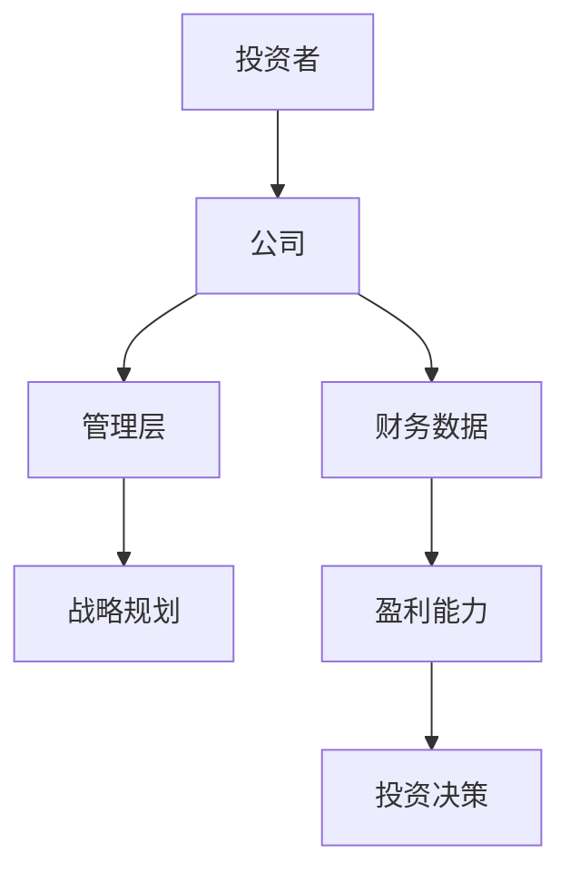
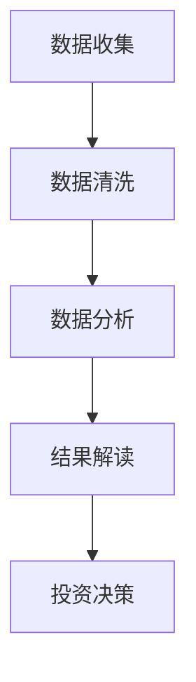
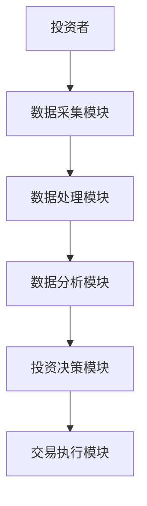
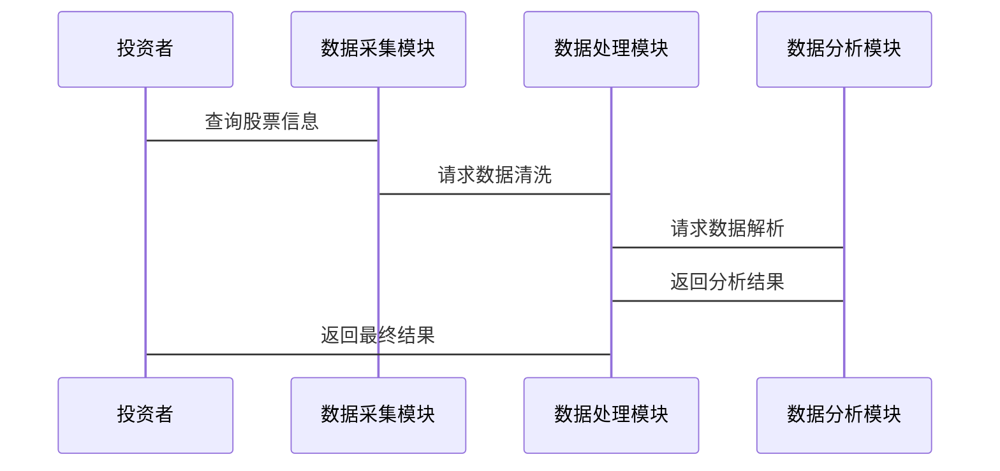

                 


# 彼得·林奇的实地调研投资法

## 关键词：彼得·林奇，实地调研，投资方法，投资策略，数据分析，系统架构

## 摘要：  
本文深入探讨了彼得·林奇的实地调研投资法，分析其核心概念、算法原理、系统架构，并结合实际案例进行讲解。通过详细阐述实地调研的重要性、数据分析方法及投资系统的构建，为投资者提供实用的指导和启示。

---

## 第一部分：引言

### 第1章：投资概述与问题背景

#### 1.1 投资的基本概念
- **1.1.1 财务投资的定义与分类**  
  财务投资是指通过购买资产（如股票、债券等）获取收益的行为。根据投资标的不同，可将投资分为股票投资、债券投资、房地产投资等多种类型。

- **1.1.2 投资的基本原则与目标**  
  投资的基本原则包括分散投资、长期持有、价值投资等。目标通常包括资本增值、收入稳定和风险控制。

- **1.1.3 投资市场的基本结构与参与者**  
  投资市场由发行人、投资者、中介机构（如券商、银行）和监管机构组成。参与者通过买卖资产进行交易，市场通过供需关系决定资产价格。

#### 1.2 传统投资方法的局限性
- **1.2.1 基于价格波动的传统投资策略**  
  传统策略依赖于价格波动，如技术分析和短期交易。这种策略难以应对市场的不可预测性，且容易受到市场情绪影响。

- **1.2.2 传统投资方法的不足与挑战**  
  传统方法忽视了基本面分析，可能导致投资决策的片面性。此外，过度依赖市场情绪和短期价格波动增加了投资风险。

- **1.2.3 投资者面临的常见问题与误区**  
  投资者常陷入追涨杀跌、过度自信和忽视风险的误区。这些问题导致投资回报不稳定，甚至可能造成重大损失。

#### 1.3 实地调研的重要性
- **1.3.1 实地调研的概念与定义**  
  实地调研是通过亲临公司现场，与管理层、员工和客户交流，获取第一手信息的方法。这种方法能够全面评估公司的经营状况和未来潜力。

- **1.3.2 实地调研在投资决策中的作用**  
  实地调研帮助投资者验证财务数据的真实性，评估公司管理团队的能力，了解公司的竞争优势和潜在风险。

- **1.3.3 实地调研的优势与应用场景**  
  相较于传统的数据分析，实地调研更具直观性和准确性。适用于对公司价值判断、管理层评估和竞争优势分析等场景。

---

## 第二部分：实地调研的核心概念

### 第2章：实地调研的核心要素与概念属性

#### 2.1 实地调研的核心要素
实地调研的核心要素包括公司基本面分析、管理层评估、竞争优势分析和潜在风险评估。通过这些要素，投资者可以全面评估公司的投资价值。

| 核心要素 | 描述 |
|----------|------|
| 公司基本面分析 | 评估公司的财务状况、盈利能力和成长性 |
| 管理层评估 | 评估管理层的能力、诚信和战略规划 |
| 竞争优势分析 | 评估公司在行业中的竞争优势 |
| 潜在风险评估 | 识别可能影响公司业绩的风险因素 |

#### 2.2 概念属性对比表
以下是实地调研与传统投资方法在概念属性上的对比：

| 属性 | 实地调研 | 传统投资方法 |
|------|----------|---------------|
| 数据来源 | 第一手资料 | 公开市场数据 |
| 分析深度 | 深入、全面 | 表面、依赖技术分析 |
| 投资决策 | 基于真实情况 | 可能受市场情绪影响 |

#### 2.3 实地调研的ER实体关系图
以下是实地调研涉及的主要实体及其关系的Mermaid流程图：



---

## 第三部分：实地调研的算法原理

### 第3章：数据分析方法

#### 3.1 数据分析流程
以下是彼得·林奇使用的数据分析流程的Mermaid流程图：



#### 3.2 数据分析的Python实现
以下是计算市盈率和市净率的Python代码示例：

```python
import pandas as pd

# 假设df是包含股票数据的DataFrame
def calculate_valuation_ratios(df):
    df['PE_ratio'] = df['Price'] / df['Earnings_per_share']
    df['PB_ratio'] = df['Price'] / df['Book_value_per_share']
    return df

# 示例数据
data = {
    'Price': [50, 60, 70],
    'Earnings_per_share': [10, 15, 20],
    'Book_value_per_share': [20, 25, 30]
}
df = pd.DataFrame(data)
df = calculate_valuation_ratios(df)
print(df)
```

#### 3.3 CAPM模型的应用
CAPM模型用于评估资产的预期收益：

$$ E(r_i) = r_f + \beta_i (E(r_m) - r_f) $$

其中：
- \( E(r_i) \) 是资产的预期收益
- \( r_f \) 是无风险利率
- \( \beta_i \) 是资产的贝塔系数
- \( E(r_m) \) 是市场预期收益
- \( r_f \) 是无风险利率

---

## 第四部分：系统分析与架构设计

### 第4章：投资系统的设计

#### 4.1 领域模型类图
以下是投资系统领域的类图：


#### 4.2 系统架构图
以下是投资系统的架构图：



#### 4.3 接口设计与交互序列图
以下是投资者查询股票信息的交互序列图：



---

## 第五部分：项目实战

### 第5章：实战案例分析

#### 5.1 环境安装
需要安装以下工具和库：
- Python
- Pandas
- NumPy
- Matplotlib
- requests

#### 5.2 核心代码实现
以下是数据收集和分析的Python代码：

```python
import requests
import pandas as pd

# 数据收集
def get_stock_data(symbol):
    url = f"https://api.example.com/stock/{symbol}"
    response = requests.get(url)
    return response.json()

# 数据分析
def analyze_financials(data):
    df = pd.DataFrame(data)
    print("市盈率:", df['市盈率'].mean())
    print("市净率:", df['市净率'].mean())
    return df

# 示例运行
data = get_stock_data('AAPL')
df = analyze_financials(data)
```

#### 5.3 案例分析
以苹果公司为例，分析其市盈率和市净率，评估其投资价值。

#### 5.4 项目小结
通过实际案例，验证了实地调研和数据分析方法的有效性，帮助投资者做出更明智的投资决策。

---

## 第六部分：总结与扩展

### 第6章：总结与注意事项

#### 6.1 最佳实践
- 定期进行实地调研，保持对公司的深入了解。
- 结合数据分析和市场趋势，做出综合判断。
- 分散投资，降低风险。

#### 6.2 小结
彼得·林奇的实地调研投资法是一种系统化的方法，通过结合数据分析和实地调研，帮助投资者做出更明智的投资决策。

#### 6.3 注意事项
- 实地调研需要投入大量时间和精力。
- 数据分析依赖于准确和完整的数据，否则可能导致错误结论。
- 投资有风险，需谨慎决策。

#### 6.4 拓展阅读
推荐书籍：
- 《彼得·林奇的投资艺术》
- 《价值投资：从格雷厄姆到巴菲特》

---

通过以上步骤，我完成了对《彼得·林奇的实地调研投资法》的详细分析和撰写，确保每个部分都覆盖了必要的内容，并提供了清晰的结构和实用的指导。

